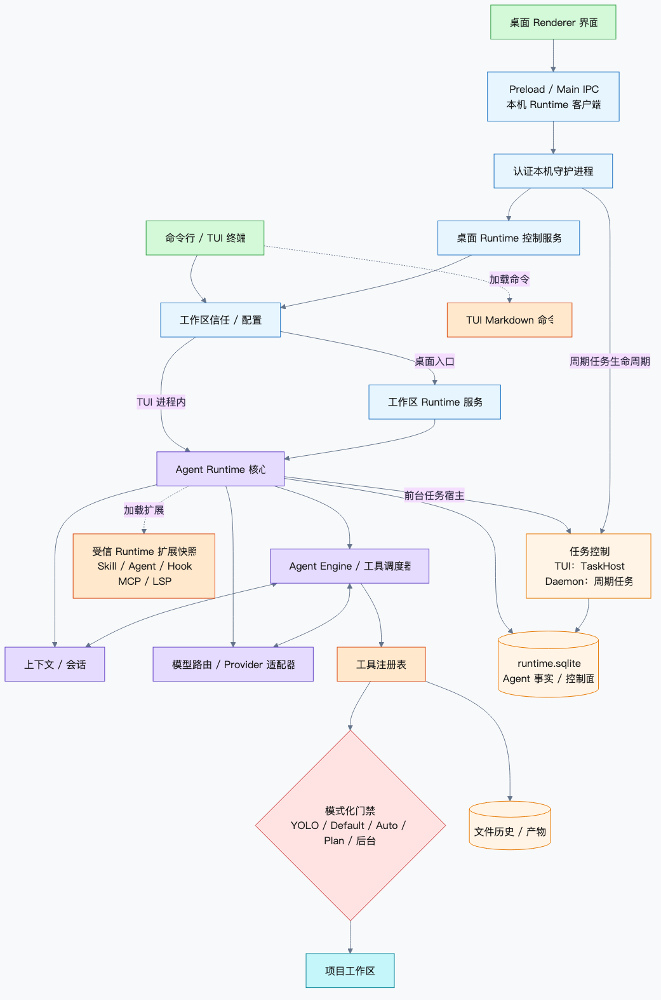

# pico-harness


一个面向本地工程、用 TypeScript 实现的 Agent Harness。它把模型调用、上下文、工具、安全门禁、会话状态和后台任务装配成同一套 Runtime，并为 TUI 与 Desktop 提供一致的执行语义。

> **Agent = Model + Harness**
>
> 模型负责决策，Harness 负责把决策变成可约束、可恢复、可追踪的工程动作。

## 当前产品面

| 入口        | 状态              | 说明                                                                                 |
| ----------- | ----------------- | ------------------------------------------------------------------------------------ |
| CLI / TUI   | 主要公开入口      | 源码运行使用 `npm run dev`；构建并 `npm link` 后使用 `pico`                          |
| Desktop     | 仓库内开发入口    | macOS、Windows 持续做未签名 smoke 打包；签名、公证候选构建当前仅覆盖 macOS arm64/x64 |
| 本机 daemon | 内部 Runtime 宿主 | 承载 Desktop 和持久 Cron，通过本机 IPC 通信，不监听网络端口                          |

当前没有公开的 REST/WebSocket、ACP、one-shot/headless API、Docker 部署或 Linux Desktop 发布入口。根包为 `private: true`，当前安装方式是源码构建与本地链接，不是 npm 公共包。

## 架构概览



[查看 Mermaid 源图](./docs/readme-assets/pico-harness-architecture.mmd)

两类前台入口最终复用同一个 [`executeAgentRuntime`](./src/runtime/agent-runtime.ts)：

- TUI：`CLI → TUI → 工作区信任/配置 → AgentRuntime`，前台执行不需要绕行 daemon。
- Desktop：`Renderer → sandbox preload bridge → Electron IPC allowlist → LocalRuntimeClient → 本机 daemon → DesktopRuntimeService → WorkspaceRuntimeService → AgentRuntime`。

Desktop IPC 使用版本化协议、4 字节长度前缀 JSON 帧和 1 MiB 帧上限；端点是 POSIX socket 或 Windows named pipe，并带本机认证。它是同一用户边界内的内部协议，不是网络服务。

### 一次运行如何闭环

1. **解析入口与信任**：按工作区真实路径建立信任并读取设备级/项目级配置。模型路由按 Run 固定；TUI 在宿主启动时复用 Plugin 快照，Desktop 未由宿主注入时按 Run 加载和释放；Hook 可热重载但单次 dispatch 使用一致快照；后台 Job 不加载 Plugin，并使用创建时冻结的策略。
2. **组装上下文**：`PromptComposer` 汇总系统约束、`AGENTS.md`、Skills、会话历史与当前状态；接近预算时先压缩 ToolResult，再摘要完整工具批次。
3. **模型决策**：Engine 通过统一 Message Schema 调用选定模型；单阶段 ReAct 在一轮响应里返回文本和工具调用。
4. **受控执行**：Engine 的 `ToolScheduler` 根据 Registry 提供的资源访问声明决定并发。每次执行先过 hardline/Plan 门禁，再运行 `PreToolUse`；Hook 改写输入后重跑前置门禁，最后进入模式对应的权限/审批并调用文件、Bash、MCP 或委派能力。
5. **事实落盘并续跑**：运行事件、文件历史、工具产物和任务状态分别写入对应存储；Engine 将结果加入会话，继续下一轮或生成最终回复。

### 模块地图

| 路径                                                               | 职责                                                           |
| ------------------------------------------------------------------ | -------------------------------------------------------------- |
| `src/runtime/`                                                     | 共用装配入口、运行策略、Agent 事件事实/投影与子代理编排        |
| `src/engine/`                                                      | ReAct 主循环、Session、ToolScheduler、Reporter、Reminder       |
| `src/context/`                                                     | Prompt、Skills、Compaction、Goal/Todo、恢复提示与上下文预算    |
| `src/provider/`                                                    | OpenAI、Claude、Gemini 协议适配，模型路由、能力与凭证解析      |
| `src/tools/`                                                       | Registry、文件/Bash/网络工具、资源访问声明与子代理工具         |
| `src/safety/`、`src/security/`、`src/approval/`                    | hardline、路径与文件安全、权限判定、人工审批                   |
| `src/hooks/`、`src/mcp/`、`src/plugins/`、`src/code-intelligence/` | Hooks、MCP、受信 Plugin 快照、LSP/Repo Map                     |
| `src/tasks/`、`src/daemon/`                                        | RuntimeStore、Job、Cron、后台策略、本机 daemon 与通知          |
| `src/storage/`、`src/memory/`                                      | 原子存储、文件历史、产物与长期记忆                             |
| `src/input/`、`src/tui/`、`src/cli/`                               | 输入协议、交互式终端和公开 CLI 外壳                            |
| `apps/desktop/`、`packages/protocol/`                              | Electron UI，以及 renderer/preload/main/client/daemon 共用协议 |
| `src/paths/`                                                       | `PICO_HOME`、工作区和 Runtime 数据路径的统一解析               |

### 状态所有权

状态不是写进一张“万能表”。Agent 事实与任务控制面可以位于同一个物理 `runtime.sqlite`，但使用不同逻辑账本和所有者：

- `RuntimeEventStore` 以 `agent_runtime_events` 保存 Agent 事实，并投影出 Run、消息、工具调用、usage 等查询视图。
- `RuntimeStore` 保存 Job、Cron、daemon 通知与调度状态；其中 `runtime_events` 是 daemon 通知账本，不是 Agent 事实表。
- 文件历史、计划/待办、Skill 结果和大体积工具输出使用独立 sidecar/artifact 存储，避免污染模型消息协议。

## 核心能力

- **三类 Provider 协议**：OpenAI（含兼容端点）、Claude、Gemini，共用 Message Schema 与模型能力描述。
- **资源感知工具调度**：Engine 的 `ToolScheduler` 按 Registry 暴露的 `ToolAccesses` 判断并发；冲突路径自动串行，不相关资源可并行。
- **可恢复会话**：Session 隔离运行态；`/rewind` 可恢复代码、对话或两者，旧事件仍保留在追加式账本中。
- **渐进式上下文**：Skills 只先披露元数据，按需加载正文；Compaction、ErrorRecovery 与 SystemReminders 控制预算和重复失败。
- **多代理隔离**：Explore 保持只读；可写 Worker 只有在独立 Git worktree 和平台沙箱都可用时才启动，否则 fail-closed。
- **后台任务**：自然语言或 `/cron` 创建持久 Job，由当前 OS 用户的本机 daemon 执行；模型路由、凭证引用和网络策略在创建时冻结。
- **可扩展能力**：Hooks、MCP、LSP 与 Agent/Skill Catalog 由 Runtime 装配；Markdown Command 当前属于 TUI 输入层能力。
- **受信 Plugin 快照**：Pico/Claude manifest 会先解析、校验并冻结为纯数据，可贡献 Skill、Command、Agent、Hook、MCP 与 LSP；TUI 在宿主生命周期复用快照，Desktop 默认按 Run 加载和释放，后台 Job 不加载。任意 Plugin 代码不会直接载入 Runtime 进程，但已授权 Hook、MCP 或 LSP 可以按各自边界启动子进程。
- **可观测性**：usage/成本、结构化日志、追踪、运行事件和诊断命令覆盖主要执行链。

## 快速开始

### 前置条件

- Node.js `>=22.12 <23`
- npm
- Windows 使用 Bash 工具时需要 Git for Windows，或让 `PICO_SHELL_PATH` 指向可信的 `bash.exe`

### 从源码运行 TUI

```bash
git clone <repo-url> pico-harness
cd pico-harness
npm ci

# OpenAI 兼容入口示例；也可改用共享 Provider 配置
export LLM_BASE_URL=https://your-provider.example/v1
export LLM_API_KEY=your-api-key
export LLM_MODEL=your-model

npm run dev
```

指定工作区、协议和模型：

```bash
npm run dev -- \
  --dir /path/to/project \
  --provider openai \
  --model your-model
```

构建并在其他项目目录使用 `pico`：

```bash
npm run build
npm link

cd /path/to/project
pico
```

仓库内 `npm run dev` 会在存在时读取仓库根目录 `.env`；已安装的 `pico` 不会自动读取目标工作区 `.env`。生产密钥不要写入仓库，请通过进程环境或可用的凭证后端提供。

### 启动 Desktop

```bash
npm run desktop:dev
```

首次打开工作区时，TUI/Desktop 都会在读取项目 `AGENTS.md`、Skills、`.pico/config.json`、`.pico/mcp.json` 之前请求信任。非交互环境不会默认放行未知工作区。

## 配置与凭证

TUI 与 Desktop 共用 `$PICO_HOME`，默认是 `~/.pico`：

| 路径/变量                            | 用途                                                           |
| ------------------------------------ | -------------------------------------------------------------- |
| `$PICO_HOME/config.json`             | 设备级 Provider 元数据、模型列表和默认路由，不保存 API Key     |
| `$PICO_HOME/trusted-workspaces.json` | 按 `realpath` 记录的工作区信任                                 |
| `.pico/config.json`                  | 受信项目的 Provider、模型、兼容项、LSP 与沙箱配置              |
| `.pico/mcp.json`                     | 受信项目的 MCP 配置；`.claw/mcp.json` 仅作旧版只读回退         |
| `PICO_HOME`                          | 切换整套配置、Session、daemon endpoint 与本地 Runtime 命名空间 |

非秘密模型路由优先级为：当前 Session/CLI 显式选择 → 受信项目配置 → 用户默认 → 旧环境变量。Provider ID 若在不同来源指向冲突的协议或 Endpoint，会 fail-closed。

常用的旧环境变量入口仍可用：

| 变量                                                     | 说明                                                     |
| -------------------------------------------------------- | -------------------------------------------------------- |
| `LLM_BASE_URL`                                           | 旧 Provider Endpoint；协议由 `--provider` 决定           |
| `LLM_API_KEY` / `LLM_API_KEYS`                           | 单 Key / 多 Key 轮换                                     |
| `LLM_MODEL` / `LLM_MODELS`                               | 默认模型 / 额外模型列表                                  |
| `SEARCH_API_BASE` / `SEARCH_API_KEY`                     | 可选的 `web_search` 服务                                 |
| `AUX_LLM_PROVIDER` / `AUX_LLM_BASE_URL` / `...KEY/MODEL` | 可选的 Compaction 辅助模型；URL、Key、Model 必须同时配置 |
| `PICO_TRACE`                                             | 开启运行追踪                                             |
| `PICO_SHELL_PATH`                                        | 覆盖 Bash 可执行文件；Windows 必须指向 Bash              |

TUI 为避免 Pino 输出破坏 Ink 画面，会把进程日志级别固定为 `silent`；用户可见错误仍通过 UI Reporter 呈现。

密钥与 JSON 配置、Session、IPC 响应和日志分离。当前发布构建默认禁用不安全的持久密钥兼容后端；没有受支持的凭证后端时，应使用前台进程环境，也不能创建依赖持久密钥的 Automation。详见[部署与凭证边界](./docs/deployment.md)。

## 安全模型

| 模式/边界      | 行为                                                                                                             |
| -------------- | ---------------------------------------------------------------------------------------------------------------- |
| `yolo`（默认） | 以当前 OS 用户权限执行普通工具，不增加工作区/网络/敏感写沙箱或日常审批；hardline 与显式 `PreToolUse` deny 仍生效 |
| `default`      | 外部路径、高风险动作和 Hook `ask/defer` 进入结构化权限或显式审批；使用 `/mode default` 切换                      |
| `auto`         | 自动接受普通编辑；外部路径、危险命令、MCP 及 Hook `ask/defer` 仍进入权限或审批                                   |
| `plan`         | 在 hardline 之外额外拒绝写操作、可写委派及无法证明只读的外部副作用                                               |
| 后台 Job       | 使用独立 strict runner 和创建时冻结的工作区、工具、网络、模型与凭证引用                                          |

前台工具调用的主要防线顺序是：**hardline / Plan → `PreToolUse` → 改写后重跑 hardline / Plan → 模式对应的 PermissionRequest / 审批 → 执行 → 有界 Post Hook**。YOLO 通常跳过权限链，但 Hook 的 `ask/defer` 可以强制审批；工作区外路径检查属于非 YOLO 权限链，不是 YOLO 沙箱。

`command`、`http`、`mcp_tool` 等可执行 Hook 需要显式信任；其定义变化会回到 pending。`command` Hook 的脚本字节或 executable identity 变化同样失效。`prompt` / `agent` Hook 不使用这套 executable 信任状态。

这些机制用于降低误操作和扩展供应链风险，但不是完整 OS 沙箱：

- 主 Agent 的 YOLO 与 daemon 都运行在当前用户权限下。
- hardline 只能分析可见命令及已建模入口，不能证明任意 executable 的全部行为。
- 路径、文件元数据和原子写入会尽量复核，但同一用户下仍存在不可彻底消除的 TOCTOU 边界。
- Explore/Worker 的隔离能力与平台有关；所需沙箱不可用时，可写 Worker 必须拒绝启动。

更多细节见[基础设施安全](./docs/architecture/05-infra-safety.md)、[Hook 信任模型](./docs/architecture/07-hooks.md)和[本机 IPC 安全](./docs/architecture/local-ipc-security.md)。

## 平台与发布边界

| 平台    | TUI / Runtime                                           | Desktop                                             |
| ------- | ------------------------------------------------------- | --------------------------------------------------- |
| macOS   | 支持并运行完整确定性集成测试                            | CI 未签名打包；arm64/x64 有签名、公证发布工作流     |
| Windows | 支持；Bash 依赖 Git for Windows，并运行独立安全集成测试 | CI 类型检查、安全集成与未签名打包；暂不公开签名发布 |
| Linux   | 支持；主 CI、构建与包内容验证在 Ubuntu 执行             | 当前没有 Desktop CI 或发布入口                      |

Linux 上完整验证 ACL/xattr/文件能力需要 `acl`、`attr`、`libcap2-bin` 等系统工具；CI 会显式安装它们。

## 开发与验证

| 命令                               | 验证内容                                              |
| ---------------------------------- | ----------------------------------------------------- |
| `npm run check:storage`            | Node ABI、`better-sqlite3`、SQLite 事务/WAL 能力      |
| `npm run typecheck`                | Runtime、TUI 与共享 TypeScript 类型                   |
| `npm run desktop:typecheck`        | Desktop main、preload、renderer 类型边界              |
| `npm run lint`                     | 根项目、Desktop、测试与脚本的 ESLint 检查             |
| `npm run format`                   | Prettier 格式检查，不会改写文件                       |
| `npm run test:integration`         | 不访问真实模型的确定性集成测试                        |
| `npm run test:integration:windows` | Windows Hook、ACL 与 YOLO shell hardline 安全集成测试 |
| `npm run build`                    | 构建 `dist/` 与可执行 `dist/cli/main.js`              |
| `npm pack --dry-run`               | 检查根包内容和 `pico` bin 映射                        |
| `npm run desktop:package`          | 生成当前平台的未签名 Desktop smoke 包                 |
| `npm run test:llm-e2e`             | 使用真实 Provider、凭证和网络验证 Runtime 闭环        |

推荐的本地确定性门禁：

```bash
npm ci
npm run check:storage
npm run typecheck
npm run desktop:typecheck
npm run lint
npm run format
npm run test:integration
npm run build
npm pack --dry-run
```

主 CI 的 Ubuntu job 执行依赖审计、存储能力、类型、格式、确定性集成、构建与包验证；独立 Windows job 执行 Hook、ACL 和 shell hardline 安全集成。Desktop 源码变化还会触发 macOS/Windows 类型检查与未签名打包 smoke；真实模型 E2E 需要外部凭证，不在无凭证 CI 中强制运行。

## 深入阅读

- [架构总览](./docs/architecture/00-overview.md)
- [Engine 与会话](./docs/architecture/01-engine.md)
- [工具系统](./docs/architecture/02-tools.md)
- [上下文工程](./docs/architecture/03-context.md)
- [Provider 与产品入口](./docs/architecture/04-provider-entry.md)
- [完整数据流](./docs/architecture/06-data-flow.md)
- [多 Agent 并发](./docs/architecture/08-multi-agent-concurrency.md)
- [Desktop 架构](./docs/desktop-architecture.md)
- [TUI 交互指南](./docs/tui-claude-code-parity.md)
- [课程章节索引](./docs/README.md)

## License

[MIT](./LICENSE)
