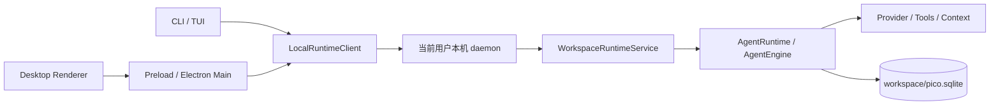

# pico-harness


一个面向本地工程、用 TypeScript 实现的 Agent Harness。它把模型调用、上下文、工具、安全门禁、会话状态和后台任务装配成同一套 Runtime，并为 TUI 与 Desktop 提供一致的执行语义。

> **Agent = Model + Harness**
>
> 模型负责决策，Harness 负责把决策变成可约束、可恢复、可追踪的工程动作。

## 当前产品面

| 入口        | 状态              | 说明                                                                                 |
| ----------- | ----------------- | ------------------------------------------------------------------------------------ |
| CLI / TUI   | 主要公开入口      | 源码运行使用 `npm run dev`；构建并 `npm link` 后使用 `pico`                          |
| Desktop     | 仓库内开发入口    | macOS、Windows 持续做未签名 smoke 打包；签名、公证候选构建当前仅覆盖 macOS arm64/x64 |
| 本机 daemon | 内部 Runtime 宿主 | 承载 TUI、Desktop 与持久 Cron；通过本机 IPC 通信，自身不监听网络端口                 |

当前没有公开的 REST/WebSocket、ACP、one-shot/headless API、Docker 部署或 Linux Desktop 发布入口。根包为 `private: true`，当前安装方式是源码构建与本地链接，不是 npm 公共包。仓库内 benchmark 可使用[内部 Headless One-shot Runner](./docs/internal-headless-one-shot.md)；它同样不是产品入口。

## 架构概览


```mermaid
flowchart LR
  TUI["CLI / TUI"] --> CLIENT["LocalRuntimeClient"]
  DESKTOP["Desktop Renderer"] --> BRIDGE["Preload / Electron Main"] --> CLIENT
  CLIENT --> DAEMON["当前用户本机 daemon"]
  DAEMON --> SERVICE["WorkspaceRuntimeService"] --> RUNTIME["AgentRuntime / AgentEngine"]
  RUNTIME --> PROVIDER["Provider / Tools / Context"]
  RUNTIME --> DB[("workspace/pico.sqlite")]
```

[查看 Mermaid 源图](./docs/readme-assets/pico-harness-architecture.mmd)

两类正式前台入口都通过 `LocalRuntimeClient` 进入本机 daemon，并最终复用同一个
[`AgentRuntime`](./src/runtime/agent-runtime.ts)：

- TUI：`CLI → client-repl → LocalRuntimeClient → daemon → WorkspaceRuntimeService → AgentRuntime`。
- Desktop：`Renderer → sandbox preload bridge → Electron Main → LocalRuntimeClient → daemon → WorkspaceRuntimeService → AgentRuntime`。

本机协议使用版本化的 4 字节长度前缀 JSON 帧，单帧上限 1 MiB；端点是 POSIX socket 或
Windows named pipe。当前承重边界是私有 endpoint、进程/文件权限、workspace root authority
和协议方法白名单；它面向当前 OS 用户，不是网络 API。

### 一次运行如何闭环

1. **解析入口与信任**：daemon 按工作区真实路径建立信任并读取设备级/项目级配置。模型路由按 Run 固定；Hook 可热重载但单次 dispatch 使用一致快照；后台 Job 不加载 Plugin，并使用创建时冻结的策略。
2. **组装上下文**：`PromptComposer` 汇总系统约束、`AGENTS.md`、Skills、会话历史与当前状态；接近预算时先缩短旧 ToolResult 请求投影，仍不足时在完整工具批次边界写 Runtime 摘要 checkpoint。
3. **模型决策**：Engine 通过统一 Message Schema 调用选定模型；单阶段 ReAct 在一轮响应里返回文本和工具调用。
4. **受控执行**：Engine 的 `ToolScheduler` 根据 Registry 提供的资源访问声明决定并发。每次执行先过 hardline/Plan 门禁，再运行 `PreToolUse`；Hook 改写输入后重跑前置门禁，最后进入模式对应的权限/审批并调用文件、Bash、MCP 或委派能力。
5. **事实落盘并续跑**：运行事件、文件历史、工具产物和任务状态分别写入对应存储；Engine 将结果加入会话，继续下一轮或生成最终回复。

### 模块地图

| 路径                                                               | 职责                                                        |
| ------------------------------------------------------------------ | ----------------------------------------------------------- |
| `src/runtime/`                                                     | 共用装配入口、运行策略、Agent 事件事实/投影与子代理编排     |
| `src/engine/`                                                      | ReAct 主循环、Session、ToolScheduler、Reporter、Reminder    |
| `src/context/`                                                     | Prompt、Skills、Compaction、Goal/Todo、恢复提示与上下文预算 |
| `src/provider/`                                                    | OpenAI、Claude 协议适配，模型路由、能力与凭证解析           |
| `src/tools/`                                                       | Registry、文件/Bash/网络工具、资源访问声明与子代理工具      |
| `src/safety/`、`src/security/`、`src/approval/`                    | hardline、路径与文件安全、权限判定、人工审批                |
| `src/hooks/`、`src/mcp/`、`src/plugins/`、`src/code-intelligence/` | Hooks、MCP、受信 Plugin 快照、LSP/Repo Map                  |
| `src/tasks/`、`src/daemon/`                                        | RuntimeStore、Job、Cron、后台策略、本机 daemon 与通知       |
| `src/storage/`、`src/memory/`                                      | 原子存储、文件历史、产物与长期记忆                          |
| `src/input/`、`src/tui/`、`src/cli/`                               | 输入协议、交互式终端和公开 CLI 外壳                         |
| `apps/desktop/`                                                    | Electron UI                                                 |
| `packages/protocol/`                                               | Desktop、client 与 daemon 的共用协议                        |
| `src/paths/`                                                       | `PICO_HOME`、工作区和 Runtime 数据路径的统一解析            |

### 状态所有权

状态不是写进一份“万能文件”。Agent 事实与任务控制面共享 workspace 状态根目录，但使用不同逻辑账本和所有者：

- 每个 workspace 使用一个 `$PICO_HOME/workspaces/<workspace-id>/pico.sqlite`；`node:sqlite`
  以 WAL 和 `synchronous=FULL` 承载事实、控制状态和事务边界。
- `SqliteRuntimeEventStore` 拥有 Session、Run、消息、工具调用与 Transcript 事实及其投影。
- `SqliteTaskRunStore` 保存显式可恢复任务跨 Attempt 的输入、checkpoint、租约与启动凭据；它只引用 RuntimeEvent 边界，不复制 Agent 事件。
- `SqliteRuntimeControlStore` 保存 Job、Cron、daemon run、usage、provider call 与生命周期控制状态。
- `SqliteMemoryRepository` 保存 settings、sources、facts、proposals、审计与幂等记录；长期 Fact 与 Session/EventLog 生命周期分离。
- Plan、Todo、会话目录、文件历史 manifest 和跨存储 operation 等状态也进入同一数据库的独立 scope；Trace、文件内容 blob 和临时 staging 仍按各自生命周期保留为 sidecar。
- ToolResult 在入口处限制为 1 MiB：限内正文以 `storage: "inline"` 写入事实，超限改写为合成错误并提示模型缩小命令输出；旧 Evidence 引用只读兼容，`read_evidence` 已退役。

## 核心能力

- **两类 Provider 协议**：OpenAI（含兼容端点）与 Anthropic Claude，共用 Message Schema 与模型能力描述。
- **资源感知工具调度**：Engine 的 `ToolScheduler` 按 Registry 暴露的 `ToolAccesses` 判断并发；冲突路径自动串行，不相关资源可并行。
- **可恢复会话**：Session 隔离运行态；`/rewind` 可恢复代码、对话或两者，旧事件仍保留在追加式账本中。
- **渐进式上下文**：Skills 只先披露元数据，按需加载正文；Compaction、ErrorRecovery 与 SystemReminders 控制预算和重复失败。
- **多代理隔离**：Explore 保持只读；可写 Worker 只有在独立 Git worktree 和平台沙箱都可用时才启动，否则 fail-closed。
- **后台任务**：自然语言或 `/cron add [--tool-network=...] <cron> <prompt>` 创建持久 Job，由当前 OS 用户的本机 daemon 执行；模型路由、凭证引用和网络策略在创建时冻结。首次使用前通过 `/cron credential import [provider/model] --confirm` 将环境凭证写入系统凭据库；凭证值不进入命令参数且不回显。
- **安全恢复任务**：只有注册了稳定 adapter ID/version、不可变输入和 checkpoint 契约的任务才可进入 `recoverable`；重启后先取得 TaskRun 执行租约，再从已验证边界创建新 Attempt。adapter 必须以 RuntimeEvent 高水位 CAS 原子发布确定性的 `run.started`，再用同一 `launchId` 幂等安装或确认 durable worker；`run.started` 只证明准入，不单独证明执行已启动。既有闭包、进程和流仍为 `host_bound`。
- **可扩展能力**：Hooks、MCP、LSP 与 Agent/Skill Catalog 由 Runtime 装配；Markdown Command 当前属于 TUI 输入层能力。
- **受信 Plugin 快照**：Pico/Claude manifest 会先解析、校验并冻结为纯数据，可贡献 Skill、Command、Agent、Hook、MCP 与 LSP；TUI 在宿主生命周期复用快照，Desktop 默认按 Run 加载和释放，后台 Job 不加载。任意 Plugin 代码不会直接载入 Runtime 进程，但已授权 Hook、MCP 或 LSP 可以按各自边界启动子进程。
- **可观测性**：usage/成本、结构化日志、追踪、运行事件和诊断命令覆盖主要执行链。

## 快速开始

### 前置条件

- Node.js `22.19+`、`24.3+` 或 `26.x`（只支持仍在维护的偶数主版本）
- npm
- Windows 默认使用 PowerShell 7（`pwsh`），不可用时回退 Windows PowerShell 5.1；也可用
  `PICO_SHELL_PATH` 显式指定受支持的 PowerShell 或 Bash

仓库的 `.nvmrc` 和 `.node-version` 默认选择当前 LTS Node 24；Node 22 是最低兼容线，Node 26 作为新版兼容线由 CI 持续验证。

### 从源码运行 TUI

```bash
git clone <repo-url> pico-harness
cd pico-harness
npm ci

# 先在 $PICO_HOME/config.json（默认 ~/.pico/config.json）配置用户 Provider、默认路由和凭证
export LLM_API_KEY=your-api-key

npm run dev
```

最小的 `~/.pico/config.json` 示例（`LLM_API_KEY` 只有被该用户 Provider 显式引用后才会使用）：

```json
{
  "version": 1,
  "defaults": { "modelRouteId": "my-provider/my-model" },
  "providers": {
    "my-provider": {
      "protocol": "openai",
      "baseURL": "https://your-provider.example/v1",
      "apiKeyEnv": "LLM_API_KEY",
      "models": ["my-model"],
      "discoverModels": false
    }
  }
}
```

Runtime、Memory、TaskRun 和控制状态使用 Node 内置 `node:sqlite` 写入 workspace 的
`pico.sqlite`，不依赖额外的原生数据库包。`npm run check:storage` 会在启动和验证前检查
Node 版本是否满足 `node:sqlite` 能力要求。

指定工作区和模型路由：

```bash
npm run dev -- \
  --dir /path/to/project \
  --model my-provider/my-model
```

构建并在其他项目目录使用 `pico`：

```bash
npm run build
npm link

cd /path/to/project
pico
```

仓库内 `npm run dev` 会在存在时读取仓库根目录 `.env`，但裸 `LLM_*` 不再自动生成模型路由；这些变量只作为 `/provider import-env` 的迁移输入，或由用户 Provider 的 `apiKeyEnv` 显式引用。生产密钥不要写入仓库。

### 启动 Desktop

```bash
npm run desktop:dev
```

首次打开工作区时，TUI/Desktop 都会在读取项目 `AGENTS.md`、Skills、`.pico/config.json`、`.pico/mcp.json` 之前请求信任。非交互环境不会默认放行未知工作区。

## 配置与凭证

TUI 与 Desktop 共用 `$PICO_HOME`，默认是 `~/.pico`：

| 路径/变量                            | 用途                                                           |
| ------------------------------------ | -------------------------------------------------------------- |
| `$PICO_HOME/config.json`             | 设备级 Provider、模型列表、默认路由及可选 API Key（权限 0600） |
| `$PICO_HOME/mcp.json`                | 用户级 MCP 定义；与受信项目配置合并                            |
| `$PICO_HOME/trusted-workspaces.json` | 按 `realpath` 记录的工作区信任                                 |
| `.pico/config.json`                  | 受信项目的命令、兼容项、LSP 与沙箱配置                         |
| `.pico/mcp.json`                     | 受信项目的 MCP 配置；同名项覆盖用户级定义                      |
| `PICO_HOME`                          | 切换整套配置、Session、daemon endpoint 与本地 Runtime 命名空间 |

模型路由必须来自用户配置；当前 Session/CLI 只能在用户配置提供的路由中显式选择。裸环境变量和项目配置不再注入 Provider 或默认模型。

以下环境变量只用于显式导入、用户 Provider 的 `apiKeyEnv` 或非模型服务，不会自行创建模型路由：

| 变量                                 | 说明                                                |
| ------------------------------------ | --------------------------------------------------- |
| `LLM_BASE_URL` / `LLM_MODEL(S)`      | `/provider import-env` 的一次性迁移输入             |
| `LLM_API_KEY` / `LLM_API_KEYS`       | 迁移输入，或由用户 Provider 的 `apiKeyEnv` 显式引用 |
| `SEARCH_API_BASE` / `SEARCH_API_KEY` | 可选的 `web_search` 服务                            |
| `PICO_TRACE`                         | 开启运行追踪                                        |
| `PICO_SHELL_PATH`                    | 覆盖宿主 Shell；可指向受支持的 Bash 或 PowerShell   |

TUI 为避免 Pino 输出破坏 Ink 画面，会把进程日志级别固定为 `silent`；用户可见错误仍通过 UI Reporter 呈现。

密钥不会进入 Session、IPC 响应或日志。用户级 `config.json` 可在 0600 文件中保存 `apiKey`；也可通过 `apiKeyEnv` 或可用的系统凭证后端解析。详见[部署与凭证边界](./docs/deployment.md)。

## 安全模型

| 模式/边界      | 行为                                                                                                             |
| -------------- | ---------------------------------------------------------------------------------------------------------------- |
| `yolo`（默认） | 以当前 OS 用户权限执行普通工具，不增加工作区/网络/敏感写沙箱或日常审批；hardline 与显式 `PreToolUse` deny 仍生效 |
| `default`      | 外部路径、高风险动作和 Hook `ask/defer` 进入结构化权限或显式审批；使用 `/mode default` 切换                      |
| `auto`         | 自动接受普通编辑；外部路径、危险命令、MCP 及 Hook `ask/defer` 仍进入权限或审批                                   |
| `plan`         | 在 hardline 之外额外拒绝写操作、可写委派及无法证明只读的外部副作用                                               |
| 后台 Job       | 使用独立 strict runner 和创建时冻结的工作区、工具、网络、模型与凭证引用                                          |

前台工具调用的主要防线顺序是：**hardline / Plan → `PreToolUse` → 改写后重跑 hardline / Plan → 模式对应的 PermissionRequest / 审批 → 执行 → 有界 Post Hook**。YOLO 通常跳过权限链，但 Hook 的 `ask/defer` 可以强制审批；工作区外路径检查属于非 YOLO 权限链，不是 YOLO 沙箱。

`command`、`http`、`mcp_tool` 等可执行 Hook 需要显式信任；其定义变化会回到 pending。`command` Hook 的脚本字节或 executable identity 变化同样失效。`prompt` / `agent` Hook 不使用这套 executable 信任状态。

这些机制用于降低误操作和扩展供应链风险，但不是完整 OS 沙箱：

- 主 Agent 的 YOLO 与 daemon 都运行在当前用户权限下。
- hardline 只能分析可见命令及已建模入口，不能证明任意 executable 的全部行为。
- 路径、文件元数据和原子写入会尽量复核，但同一用户下仍存在不可彻底消除的 TOCTOU 边界。
- Explore/Worker 的隔离能力与平台有关；所需沙箱不可用时，可写 Worker 必须拒绝启动。

更多细节见[基础设施安全](./docs/architecture/05-infra-safety.md)、[Hook 信任模型](./docs/architecture/07-hooks.md)和[本机 IPC 安全](./docs/architecture/local-ipc-security.md)。

## 平台与发布边界

| 平台    | TUI / Runtime                                     | Desktop                                             |
| ------- | ------------------------------------------------- | --------------------------------------------------- |
| macOS   | 支持并运行完整确定性集成测试                      | CI 未签名打包；arm64/x64 有签名、公证发布工作流     |
| Windows | 支持；默认使用 PowerShell，并运行独立安全集成测试 | CI 类型检查、安全集成与未签名打包；暂不公开签名发布 |
| Linux   | 支持；主 CI、构建与包内容验证在 Ubuntu 执行       | 当前没有 Desktop CI 或发布入口                      |

Linux 上完整验证 ACL/xattr/文件能力需要 `acl`、`attr`、`libcap2-bin` 等系统工具；CI 会显式安装它们。

## 开发与验证

| 命令                               | 验证内容                                              |
| ---------------------------------- | ----------------------------------------------------- |
| `npm run check:storage`            | Node 版本与内置 `node:sqlite` 能力                    |
| `npm run typecheck`                | Runtime、TUI 与共享 TypeScript 类型                   |
| `npm run desktop:typecheck`        | Desktop main、preload、renderer 类型边界              |
| `npm run lint`                     | 根项目、Desktop、测试与脚本的 ESLint 检查             |
| `npm run format`                   | Prettier 格式检查，不会改写文件                       |
| `npm run test:integration`         | 不访问真实模型的确定性集成测试                        |
| `npm run test:integration:windows` | Windows Hook、ACL 与 YOLO shell hardline 安全集成测试 |
| `npm run build`                    | 构建 `dist/` 与可执行 `dist/cli/main.js`              |
| `npm pack --dry-run`               | 检查根包内容和 `pico` bin 映射                        |
| `npm run desktop:package`          | 生成当前平台的未签名 Desktop smoke 包                 |
| `npm run test:llm-e2e`             | 使用真实 Provider、凭证和网络验证 Runtime 闭环        |

推荐的本地确定性门禁：

```bash
npm ci
npm run check:storage
npm run typecheck
npm run desktop:typecheck
npm run lint
npm run format
npm run test:integration
npm run build
npm pack --dry-run
```

主 CI 的 Ubuntu job 执行依赖审计、存储能力、类型、格式、确定性集成、构建与包验证；独立 Windows job 执行 Hook、ACL 和 shell hardline 安全集成。Desktop 源码变化还会触发 macOS/Windows 类型检查与未签名打包 smoke；真实模型 E2E 需要外部凭证，不在无凭证 CI 中强制运行。

## 深入阅读

- [架构总览](./docs/architecture/00-overview.md)
- [Engine 与会话](./docs/architecture/01-engine.md)
- [工具系统](./docs/architecture/02-tools.md)
- [上下文工程](./docs/architecture/03-context.md)
- [Provider 与产品入口](./docs/architecture/04-provider-entry.md)
- [完整数据流](./docs/architecture/06-data-flow.md)
- [多 Agent 并发](./docs/architecture/08-multi-agent-concurrency.md)
- [Desktop 架构](./docs/desktop-architecture.md)
- [TUI 交互指南](./docs/tui-claude-code-parity.md)
- [Terminal-Bench 2.1 内部 canary](./benchmarks/terminal_bench_2_1/README.md)
- [课程章节索引](./docs/README.md)

## License

[MIT](./LICENSE)
