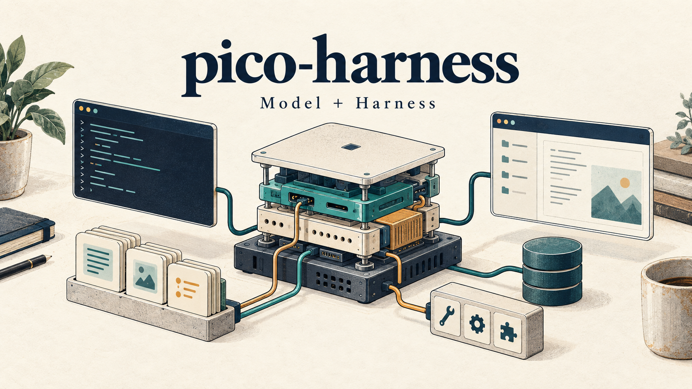
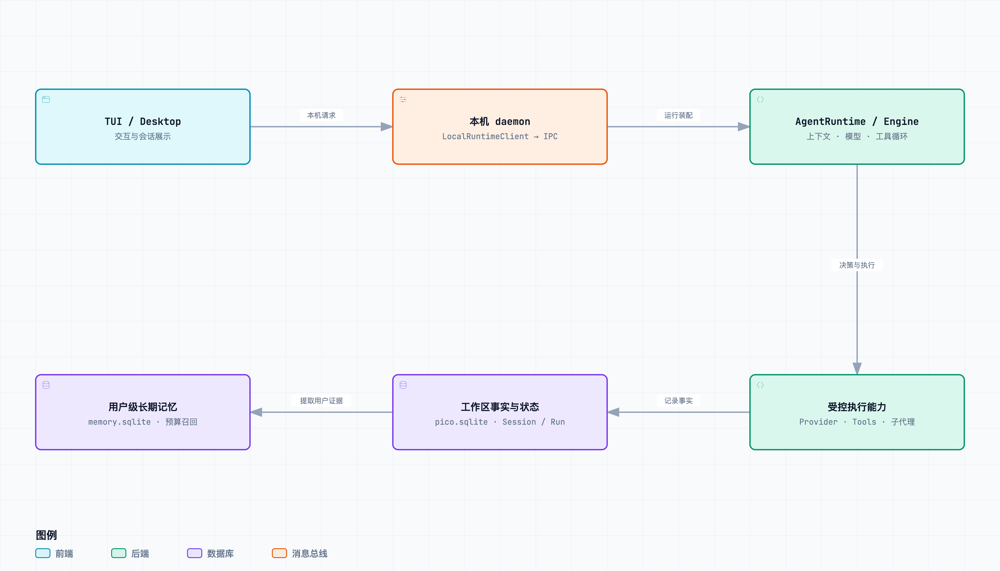

# pico-harness




**一个用 TypeScript 构建、面向本地工程的 Agent Harness。**

Pico 把模型接入、工具执行、上下文管理、权限控制和持久会话组合成一套运行时。你可以从终端或桌面发起任务，让 Agent 阅读代码、修改文件、运行命令、委派子任务，并在后续会话中继续工作。

模型决定下一步做什么，Harness 负责组织上下文、执行动作、记录结果和约束权限。这个仓库同时提供可运行的应用与配套技术文章，适合使用本地 Agent，也适合研究 Agent 如何从一次模型调用走向完整工程系统。

[快速开始](#快速开始) · [核心能力](#核心能力) · [架构概览](#架构概览) · [技术博客](#技术博客) · [文档索引](docs/README.md)

## 核心能力

| 能力       | Pico 如何实现                                                                                             |
| ---------- | --------------------------------------------------------------------------------------------------------- |
| 模型接入   | 支持 OpenAI Chat Completions、OpenAI Responses 和 Anthropic Messages 三类协议，通过用户配置选择模型路由。 |
| 工具执行   | 文件、Shell、搜索及扩展工具进入统一执行链；调度器根据资源访问声明并行执行无冲突调用。                     |
| 上下文压缩 | 根据真实 token 用量与输出余量触发摘要压缩，保留安全历史尾部；大工具结果提供归档预览和按需回读。           |
| 长期记忆   | 从用户证据中提取原子记忆，按 global / workspace 范围召回；用户级设置在项目之间共享。                      |
| 子代理协作 | 只读与研究任务返回摘要，实现任务在独立 Git worktree 中返回补丁；子会话持久保存并可续用。                  |
| 会话恢复   | 保存 Session、Run 与工具事件；`/rewind` 支持恢复代码、对话或两者，并保留原有事件。                        |
| 后台任务   | 本机 daemon 执行持久 Cron / Job，创建时冻结模型路由、凭证引用、工具白名单和网络策略。                     |
| 扩展与观测 | 通过 Skills、Hooks、MCP、LSP 和受信 Plugin 扩展能力，使用 usage、成本、Trace 与运行事件定位问题。         |

TUI 是主要公开入口，Desktop 是仓库内开发入口；两者共用本机 daemon。当前通过源码构建与本地链接安装，根包为 `private: true`，未作为公共 npm 包发布。仓库内的 [Headless Runner](docs/guides/internal-headless-one-shot.md) 用于评测，不是公开服务 API。

## 快速开始

需要 npm，以及 Node.js **22.19+、24.3+ 或 26.x**。仓库的 `.nvmrc` 与 `.node-version` 默认选择 Node 24。以下命令在仓库根目录执行。

### 1. 安装依赖

```bash
npm ci
```

### 2. 配置模型

在 `~/.pico/config.json` 中添加 Provider 和默认模型路由。把下面的地址和模型名替换为实际服务提供的值：

```json
{
  "version": 1,
  "defaults": { "modelRouteId": "my-provider/my-model" },
  "providers": {
    "my-provider": {
      "protocol": "openai",
      "baseURL": "https://your-provider.example/v1",
      "apiKeyEnv": "LLM_API_KEY",
      "models": ["my-model"],
      "discoverModels": false
    }
  }
}
```

协议值可选 `openai`、`responses` 或 `claude`，应与服务端接口一致。上例通过环境变量读取密钥：

```bash
# macOS / Linux
export LLM_API_KEY='your-api-key'
```

```powershell
# Windows PowerShell
$env:LLM_API_KEY = 'your-api-key'
```

环境变量只有被 Provider 的 `apiKeyEnv` 引用后才会用于该路由。仅设置 `LLM_API_KEY` 不会自动创建 Provider。更多配置见[部署与运行](docs/guides/deployment.md)。

### 3. 启动

终端界面：

```bash
npm run dev
```

指定工作区与模型：

```bash
npm run dev -- --dir /path/to/project --model my-provider/my-model
```

桌面界面：

```bash
npm run desktop:dev
```

首次打开工作区时，Pico 会请求信任，再加载项目中的 `AGENTS.md`、Skills 和 `.pico` 配置。

需要在其他目录直接使用 `pico` 时，先构建并链接：

```bash
npm run build
npm link

cd /path/to/project
pico
```

Windows 默认使用 PowerShell 7，不可用时回退 Windows PowerShell 5.1。内网包用户可阅读[内网使用说明](内网使用说明.txt)，通过[启动 TUI](启动TUI.bat)进入。

## 架构概览



[查看交互图](docs/readme-assets/current/runtime.html) · [编辑图源](docs/readme-assets/current/runtime.json)

TUI 和 Desktop 通过 `LocalRuntimeClient` 使用本机 daemon，由 `WorkspaceRuntimeService` 装配 `AgentRuntime`，再进入 `AgentEngine` 的模型与工具循环。daemon 使用 POSIX socket 或 Windows named pipe，不监听网络端口。

一次任务沿着以下过程推进：

1. **装配上下文**：读取已获信任的项目约束、Skills、会话历史与任务状态。
2. **请求模型**：通过所选 Provider 协议生成文本或工具调用。
3. **检查并执行**：工具调用经过安全门禁、Hooks 与权限处理，再按资源冲突关系调度。
4. **记录并继续**：保存事件和执行结果，进入下一轮；上下文达到阈值时生成摘要 checkpoint。

图中是主执行链与用户证据进入记忆的方向。具体调用关系和恢复机制见[架构技术长文](docs/guides/pico-harness-architecture-guide-image.md)。

### 数据保存在何处

默认数据根目录为 `~/.pico`，可通过 `PICO_HOME` 修改。

| 位置                                               | 保存内容                                                   |
| -------------------------------------------------- | ---------------------------------------------------------- |
| `$PICO_HOME/config.json`                           | 用户 Provider、模型列表、默认路由与凭证配置                |
| `$PICO_HOME/workspaces/<workspace-id>/pico.sqlite` | 工作区 Session、Run、任务控制、Plan、Todo 与文件历史元数据 |
| `$PICO_HOME/memory.sqlite`                         | 用户级原子记忆、来源、提取游标和共享设置                   |
| `$PICO_HOME/mcp.json` / `.pico/mcp.json`           | 用户级与受信项目的 MCP 定义                                |

工作区事实与长期记忆拥有各自的 SQLite 事务边界；Trace、文件内容 blob 等产物按各自生命周期保存。工具结果先受 1 MiB 入口上限约束，超限生成错误；限内正文可以持久保存，并在模型请求中用归档预览减少占用，通过 `archive_read` 回读。

## 权限与执行边界

权限模式决定哪些动作需要批准；Session 的 `ExecutionBoundary` 决定托管执行可访问哪些资源。

| 权限模式      | 主要行为                                                                             |
| ------------- | ------------------------------------------------------------------------------------ |
| `ask`（默认） | 放行已声明的只读与有界内部编排；编辑、Shell、公网读取等请求审批。                    |
| `auto`        | 额外放行工作区内结构化编辑和内置公网只读工具；Shell、MCP、越界或敏感访问仍请求审批。 |
| `full-access` | 跳过普通权限链，以当前 OS 用户权限执行；hardline 和直接 deny 仍可拒绝。              |

`plan` 是额外的协作约束，会拒绝写操作、可写委派及无法证明只读的外部副作用。`ask` / `auto` 的初始托管边界为工作区可写、子进程网络关闭；额外目录或进程网络需要通过 `request_sandbox_boundary` 申请。

这些控制不能把 `full-access` 变成 OS 沙箱。托管子进程所需的平台沙箱不可用时，相关执行会被拒绝。完整规则见[安全教程](docs/history/course/07-safety.md)与[本机 IPC 安全](docs/architecture/local-ipc-security.md)。

## 开发与验证

业务实现位于 `packages/` 与 `apps/`；根 `src/` 只保留发行入口。

| 目录                                               | 职责                                    |
| -------------------------------------------------- | --------------------------------------- |
| `packages/core` / `packages/protocol`              | 核心类型、策略契约与本机通信协议        |
| `packages/runtime`                                 | Agent 循环、工具调度与上下文策略        |
| `packages/pico-host`                               | Provider、工具、Session、安全与产品装配 |
| `packages/runtime-host`                            | 本机连接、daemon 与宿主控制面           |
| `packages/storage` / `packages/transcript-replica` | SQLite 持久化、事件读模型与消息副本     |
| `packages/cli` / `apps/desktop`                    | 终端与 Electron 界面                    |
| `tests` / `scripts`                                | 集成测试、真实模型验收与工程工具        |

常用验证命令：

```bash
npm run check:architecture   # 包依赖边界
npm run typecheck           # 核心 TypeScript 检查
npm run desktop:typecheck   # 桌面类型检查
npm run test:integration    # 确定性集成测试
npm run build               # 构建发行入口
```

真实模型验收使用 `npm run test:llm-e2e`，需要可用 Provider、凭证和网络。测试选择见[测试目录](tests/README.md)，其他命令见[脚本目录](scripts/README.md)。

TUI / Runtime 面向 macOS、Windows 和 Linux；Desktop 当前有 macOS / Windows 开发与未签名打包流程，签名、公证候选流程覆盖 macOS arm64/x64。发布范围与验证要求见[Desktop 发布文档](docs/guides/desktop-release.md)。

## 技术博客

先从完整执行链建立认识，再按需要深入上下文、记忆与协作。课程 00–10 保留原路径，正文已按当前实现重写。

| 文章                                                                           | 主要内容                                         |
| ------------------------------------------------------------------------------ | ------------------------------------------------ |
| [从一句话到一次可靠执行](docs/guides/pico-harness-architecture-guide-image.md) | 从前台输入到模型、工具和持久状态的完整架构       |
| [上下文压缩技术图解](docs/pico-context-compaction-technical-guide.md)          | 真实用量触发、安全切点、摘要校验与归档回读       |
| [长期记忆技术图解](docs/pico-memory-technical-guide.md)                        | 用户证据、原子记忆、事务恢复与预算召回           |
| [子智能体技术图解](docs/pico-subagents-technical-guide.md)                     | 配置型子任务、持久会话、权限继承与续用           |
| [课程 00–10](docs/README.md#课程式构建记录)                                    | 从 Agent 循环、Provider 和工具到安全、协作与评测 |

全部文档及适用状态见[文档索引](docs/README.md)，本轮校准范围与测试结果见[博客核对记录](docs/blog-code-consistency-audit.md)。

## License

[MIT](LICENSE)
