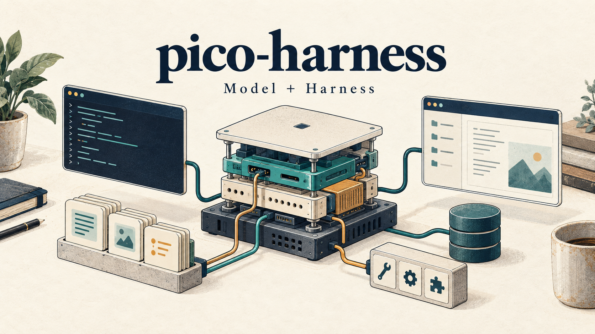

# pico-harness




**一个用 TypeScript 构建、面向本地工程的 Agent Harness。**

从终端或桌面发起任务，让 Agent 阅读代码、修改文件、运行命令和委派子任务。Pico 负责模型接入、上下文管理、权限控制与会话恢复，仓库同时提供可运行应用和技术教程。

[快速开始](#快速开始) · [核心能力](#核心能力) · [技术博客](#技术博客) · [文档索引](docs/README.md)

## 核心能力

- **模型与工具**：支持 OpenAI Chat Completions、Responses 和 Anthropic Messages 协议；统一调度文件、Shell、搜索与扩展工具。
- **上下文与记忆**：上下文压缩、归档回读，以及按用户和工作区召回的长期记忆。
- **协作与恢复**：持久子会话、隔离工作区、后台任务，以及代码和对话回滚。
- **权限与扩展**：工具审批、托管执行边界、Skills、Hooks、MCP、LSP 和运行追踪。

TUI 与 Desktop 共用本机 daemon，当前通过源码运行或本地链接安装，尚未发布公共 npm 包。移动端连接方式与验收范围见[移动端说明](apps/mobile/README.md)。

## 快速开始

需要 npm 和 Node.js **22.19+、24.3+ 或 26.x**；仓库默认使用 Node 24。以下命令在仓库根目录执行。

### 1. 安装依赖

```bash
npm ci
```

### 2. 配置模型

在 `~/.pico/config.json` 中添加 Provider 和默认模型，把地址与模型名替换为实际服务提供的值：

```json
{
  "version": 1,
  "defaults": { "modelRouteId": "my-provider/my-model" },
  "providers": {
    "my-provider": {
      "protocol": "openai",
      "baseURL": "https://your-provider.example/v1",
      "apiKeyEnv": "LLM_API_KEY",
      "models": ["my-model"],
      "discoverModels": false
    }
  }
}
```

协议值可选 `openai`、`responses` 或 `claude`。在启动 Pico 的终端中设置密钥：

```bash
# macOS / Linux
export LLM_API_KEY='your-api-key'
```

```powershell
# Windows PowerShell
$env:LLM_API_KEY = 'your-api-key'
```

环境变量须由 Provider 的 `apiKeyEnv` 引用；仅设置密钥不会自动创建模型路由。

### 3. 启动

```bash
npm run dev           # 终端界面
npm run desktop:dev   # 桌面界面，按需选择
```

首次打开工作区时会请求信任。默认权限模式为 `ask`，编辑、Shell 等动作需要审批；完整边界见[安全说明](docs/guides/process-sandbox.md)。

指定工作区、安装 `pico` 命令及数据位置见[部署与运行](docs/guides/deployment.md)。Windows 内网包可按[内网使用说明](内网使用说明.txt)双击[启动 TUI](启动TUI.bat)。

## 技术博客

- [从一句话到一次可靠执行](docs/guides/pico-harness-architecture-guide-image.md)：完整执行链与系统架构。
- [上下文压缩](docs/pico-context-compaction-technical-guide.md) · [长期记忆](docs/pico-memory-technical-guide.md) · [子智能体](docs/pico-subagents-technical-guide.md)：专题技术图解。
- [课程 00–10](docs/README.md#课程式构建记录)：从 Agent 循环、工具与安全，到协作和评测。

## 开发与文档

业务实现位于 `packages/` 与 `apps/`，根 `src/` 保留发行入口。阅读[系统架构](ARCHITECTURE.md)、[测试指南](tests/README.md)和[脚本目录](scripts/README.md)，或从[文档索引](docs/README.md)查找部署、发布与专题说明。

## License

[MIT](LICENSE)
