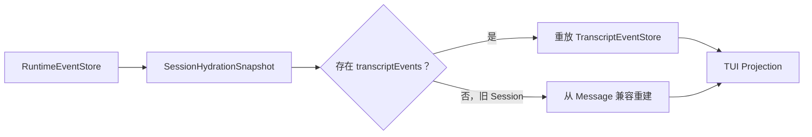

# Pico Harness 架构债务解释与修整方向

> 状态：D1/D2 已实施；D3 窄拆、Session durable facts port、Engine/SessionFork RuntimePort、Desktop parity、workspace/session handler、Provider assembly、Plugin Hook trust、受限 Plugin Capability 激活、scope managed roots 和统一诊断已实施；公开 marketplace 与任意插件代码执行仍按安全边界不开放
> 建立日期：2026-07-18
> 基线：`main@81ff999`
> 原则：先修可复现的正确性缺口，再减少重复表示；不按文件大小机械拆服务。

## 结论

当前最值得处理的不是“代码太多”，而是同一事实存在多种没有共享语义的表示：

1. CLI 已经能从 Session 读到 durable transcript events，但恢复时仍按 Message 重新生成 UI 事件。
2. Markdown 的渲染、行高测量、虚拟裁剪和流式稳定边界分别基于不同表示。

这两项会直接产生用户可见的不一致，属于真实架构债务。

`AgentRuntime` 较大、`Session` 职责较重则属于维护压力。仓库前一轮架构收敛已经确认：它们当前分别承担明确的 Composition Root 和会话聚合根职责。本轮只抽出可独立测试的窄边界，不改变资源与持久化 owner；大规模拆分仍然不应为了缩短文件而进行。

`ToolScheduler` 只负责单个 Agent、单次模型响应内的工具批次，也不是缺陷。跨 Agent 写入已经通过独立 worktree 和沙箱隔离；把 Scheduler 扩成跨 Agent 文件锁会引入第二套并发协议。

## 债务分级

| 编号 | 债务                                                | 级别      | 是否立即处理         |
| ---- | --------------------------------------------------- | --------- | -------------------- |
| D1   | CLI durable transcript 恢复链未闭环                 | P1 正确性 | 是                   |
| D2   | Markdown 渲染、测量、裁剪与流式边界分叉             | P1 正确性 | 是                   |
| D3   | `executeAgentRuntime` 是高变更密度 Composition Root | P2 维护性 | 窄拆已完成           |
| D4   | `Session` 是较重的聚合根                            | 观察项    | 窄拆完成、聚合根保留 |
| D5   | `ToolScheduler` 不提供跨 Agent 文件锁               | 明确边界  | 否                   |

## D1：CLI durable transcript 恢复链未闭环

### 当前现象

[`Session.readHydrationSnapshot()`](../../src/engine/session.ts) 已经返回：

- `messages`
- `transcriptEvents`
- `runtime settings / goal / usage`

现在 TUI 优先以 `transcriptEvents` 初始化同一个 `TranscriptEventStore` 并直接重放；只有旧 Session 没有结构化事件时，才调用 `pushUserMessage`、`onMessage`、`onToolCall` 和 `onToolResult` 走 Message 兼容路径。

因此恢复后可以重建主干对话，却不保证恢复：

- reasoning/thinking 内容；
- Skill 激活与本地 system feedback；
- 子代理活动、生命周期和 trace；
- 原来的 UI entry/stream/tool 稳定 ID；
- UI 事件的精确先后关系。

这正是本轮 D1 修整前 CLI 的缺口；当前实现已让 CLI 与 Desktop 一样优先消费结构化 transcript，Message 路径只保留给旧 Session。

### 根因

历史上项目同时存在两条恢复路径；当前恢复优先级已经收敛为：

```text
RuntimeEvent transcript events ──▶ TranscriptEventStore ──▶ TUI Projection
RuntimeEvent messages ──▶ 旧 Session 兼容重建 ──▶ TUI Projection
```

结构化事件现在是 CLI 的优先恢复源；Message 路径只作为旧数据兼容回退。

### 为什么属于架构债务

- 数据已经持久化或具备持久化入口，但产品壳没有使用同一事实。
- TUI 与 Desktop 对“恢复一段会话”的语义不同。
- 继续给 Message 重建路径增加分支，会形成第二套 Transcript projector。

### 目标状态



新 Session 应持久化低频、语义稳定的 Transcript 事实；不能把逐 token delta 或 stdout/stderr 小块直接写入 durable ledger。旧 Session 没有 transcript events 时，继续使用 Message 重建作为只读兼容回退。

### 完成标准

- 恢复前后可见条目、稳定 ID 和顺序一致。
- reasoning、Skill、system feedback 和子代理终态可以恢复。
- assistant/tool 不因同时存在 Message 与 TranscriptEvent 而重复。
- 旧 Session 没有 transcript events 时仍能恢复。
- SQLite 不按 token delta 无界增长。

## D2：Markdown 四套表示不一致

### 当前现象

同一段 assistant/thinking 内容会经过四种不同处理：

| 环节            | 当前依据                              |
| --------------- | ------------------------------------- |
| React 渲染      | `marked.lexer()` 产生的 Token tree    |
| Transcript 行高 | 原始 Markdown 字符串的 `visualRows()` |
| 虚拟窗口裁剪    | 原始字符串换行、wrap 后切片           |
| 流式稳定边界    | 最后一个换行符之前/之后               |

这会造成：

- 标题、列表、表格、引用和代码块的实际行数与估算不一致；
- 从 Markdown 块中间裁剪后，残片被重新解析为另一种结构；
- 代码围栏或嵌套列表跨 stable/unstable 边界时短暂闪烁或显示标记；
- 虚拟滚动可能提前裁切或留下空白。

### 根因

Markdown 是块级语法，但布局层只看纯文本行，流式层只看换行。渲染器、测量器和裁剪器没有共享同一个 terminal render model。

### 目标状态

建立一个纯函数式的终端 Markdown 模型：

```text
Markdown source
  └─ marked Token tree
       └─ TerminalMarkdownModel
            ├─ Ink renderer
            ├─ measure(width)
            └─ clip(startRow, visibleRows, width)
```

同一个模型必须负责渲染、测高和按视觉行裁剪。当前第一版每次重新解析完整消息，流式层不再按最后一行拆分 Markdown；只有基准证明完整解析影响流式帧率时，才增加“已完成块缓存”。

模型内部使用带样式 span 的视觉行作为唯一 IR；粗体、斜体、删除线、行内代码和 thinking 浅色都在同一行模型上投影。列表、引用和代码块按实际终端前缀宽度逐层扣减内容宽度；当前缀本身无法容纳时省略装饰前缀，把可用宽度留给正文，禁止先生成超宽行再用省略号截断正文。

### 完成标准

- 对相同内容和宽度，测量行数等于 Ink 实际帧行数。
- 裁剪后的输出等于完整渲染结果的视觉行切片，而不是重新解释原始 Markdown 残片。
- 围栏代码、嵌套列表、引用、表格和 CJK 换行有回归覆盖。
- 流式未闭合 Markdown 不崩溃，也不长期回显原始标记。
- thinking 的浅色样式和控制字符过滤保持不变。

### D1/D2 实施记录

- `src/presentation/transcript-durability.ts` 定义语义事件持久化策略和 Session sink；逐 token delta、phase 和原始工具输出不进入 durable ledger。
- `src/tui/tui-reporter.ts` 将最终 stream/tool/subagent 事实串行写入同一 Session 事件账本，并提供 flush/hydration 边界。
- `src/tui/terminal-markdown-model.tsx` 以 `marked` Token tree 同时驱动 Ink render、`measure()` 和 `clip()`；TUI 布局与流式组件共用该模型。
- `/clear` 后的 rewind 不再按 TUI 局部数组索引裁剪，而是在 durable rewind 成功后重新读取 Session snapshot 并替换同一个 reducer 投影；旧分支、稳定 ID 和结构化事件因而一起恢复。
- 新增 Transcript 与 Markdown 集成回归，覆盖旧会话 reasoning fallback、稳定 ID、durable 事件有界增长、复杂 Markdown 行高和视觉裁剪。

## D3：`AgentRuntime` 是高变更密度 Composition Root

### 当前情况

[`executeAgentRuntime()`](../../src/runtime/agent-runtime.ts) 同时知道：

- Session 与路径解析；
- Provider、凭证与 CostTracker；
- Registry、Safety、Approval 与 Hook；
- MCP、Plugin、Skill、LSP 和子代理；
- RuntimeRun、清理和 Host 回调。

这会提高跨域变更的审查成本。不过它已经按“解析配置 → 获取 Session → 装配能力 → 执行 → 清理”五个阶段组织，而且这些依赖确实需要在 Composition Root 汇合。

### 修整边界

只有在完成 D1/D2 后，且能形成以下窄接口时才做内部提取：

- 纯配置解析函数；
- 拥有明确资源生命周期并提供 `dispose()` 的能力装配单元；
- 只负责 `session.serialize + RuntimeRun` 的执行函数。

如果提取后只是把同一批二三十个参数转发到另一个文件，或者引入通用 Runtime Context/DI 容器，则停止拆分。

### D3 实施记录

本轮已提取 `src/runtime/runtime-run-executor.ts`：

- 输入是已经装配完成的 `Session`、`SessionRuntime`、`AgentEngine` 和运行参数；
- 负责一次 `RuntimeRun` 的 reconcile/repair/start、Prompt Hook、rewind、`engine.run` 和结果组装；
- 不创建、不关闭 Provider、MCP、Plugin、SessionRuntime 或 RuntimeEventStore；
- `AgentRuntime` 仍是唯一的 Composition Root 和资源清理 owner。

因此这是窄执行边界，不是把 `AgentRuntime` 变成持久服务，也没有引入参数转发袋。

随后补充了 `src/runtime/runtime-assembly.ts`，只承载 Provider 注入、CostTracker 包装、计费路由和多凭证轮换。它不拥有 Provider、Session 或 MCP 的清理权；`AgentRuntime` 仍是唯一的 Composition Root。

`src/runtime/runtime-cleanup.ts` 进一步收敛了本轮资源释放的顺序、幂等和失败隔离。它只保存由 `AgentRuntime` 注册的 disposer，不接管资源所有权；因此装配与生命周期责任仍清晰分开。

Runtime reconcile 只在 active Session projection 内匹配 tool call/result。未终结 run 的中断结果写在原 run terminal 之前；若原 run 已终结，则以确定 ID 建立独立 recovery run，并按 `run.started → synthetic result → run.terminal` 记录，避免把恢复事实追加到旧 terminal 之后。

同时新增 `src/engine/runtime-port.ts` 与 `src/runtime/engine-runtime-port-adapter.ts`：AgentEngine 和 Session 只依赖 engine-owned 的运行生命周期/ambient tool-call/外部提交契约，RuntimeRun 的具体实现集中在 adapter；`RuntimeEventStore` 与 event codec 已迁移到中立的 `src/storage/`，Runtime 旧路径仅保留兼容导出。主 Agent 与 Hook verifier 都显式注入该 port；没有为 Engine 增加第二 durable writer。

架构门禁现在同样检查 type-only import，Engine 不能再借类型引用反向依赖 Runtime；门禁的测试根目录也由 fixture 显式注入，避免测试只扫描真实仓库而漏掉构造出的违规样例。

Engine Runtime capability 现在由 Session 通过 engine-owned factory 签发，factory 必须收到通过 JavaScript `#private` brand 校验的真实 Session，并由 Session prototype 直接证明 authority 是自己的 durable store；WeakSet 继续阻断对象展开伪造。因此 no-op guard、普通结构对象、展开拷贝或 foreign store 都不能获得 Runtime 写权。Session 串行区现在为父/子任务分配独立 active context：父任务先封口再 drain，已运行子任务仍可注册孙任务；普通 `withSerializedExecution()` 的已 await/catch 失败不再被外层重抛，需要父任务承担完成/失败的 detached 工作必须显式使用 `spawnSerializedExecution()`。

`SessionForkService` 也通过 `src/engine/session-fork-runtime-port.ts` 接收 fork reconcile/repair/bootstrap 能力，由 `src/runtime/session-fork-runtime-port-adapter.ts` 绑定 RuntimeRun。这样 fork operation journal 仍由 Engine coordinator 管理，但不再直接 value-import RuntimeRun；read-model/projection 已落到 engine-owned contract，durable store 由中立 storage owner 提供。

Fork 发布现在在入口校验 source Session 与 service 使用同一 Runtime database，并且先持久化过滤后的 Session state，再写 `session.forked` publication marker；因此任何观察到 marker 的消费者都一定同时能看到消息、checkpoint 和 settings/goal。稳定 state、start、checkpoint、terminal 或 event ID 的已持久化 payload 冲突都会转换为 coordinator 可识别的 target conflict，进入 `needs_attention` 而不是无限重试。`RuntimeEventStore` 的 SQLite connection 按单次操作打开和关闭，`SessionForkService` 本身不持有长生命连接句柄。

## D4：`Session` 保留聚合根，消息账本已窄拆

`Session` 同时协调历史投影、owner lease、持久化队列、usage、rewind、fork 和 FileHistory。表面上职责多，但这些行为共享同一个会话一致性边界：

- 写入必须服从同一 owner lease；
- rewind/fork 必须与消息游标和文件历史一致；
- close/drain 必须阻止迟到写入。

本轮已提取 `src/engine/session-message-ledger.ts`，只负责纯内存的消息顺序与派生状态：tool 调用等待/释放、deferred message、pending tool 集合、ToolResult metadata、model context 和历史边界替换。`Session` 仍独占 RuntimeEventStore、owner lease、persistence queue、rewind、FileHistory 和 close 生命周期；ledger 不写 durable store，也不拥有第二份持久化事实。

同时将 `SessionManager` 的路由、LRU/TTL 驱逐、pin 和 per-key drain 协调提取到 `src/engine/session-manager.ts`，并把跨 Manager 共享的 drain fence 放到 `session-manager-state.ts`。它只负责进程内实例治理；Session 的 durable owner、SQLite 写队列和 close/drain 语义保持不变，`session.ts` 仅保留默认工厂配置与兼容 re-export。

生命周期能力现已进一步收口：`SessionManager.getOrCreatePinned()` 在 async recover 发布 entry 前预留 pin，并在 `entries.set`/LRU 之前原子转入 `pinCount`，消除“拿到 Session 后再 pin”的 TTL/LRU 空窗。AgentRuntime、TUI、Desktop daemon/production host 和命令旁路都显式交接该 lease；`SessionRuntime.dispose()` 是成功交接后的唯一释放点，失败路径依靠幂等 release 收口。pin 中的 Session 不能被删除；同一 durable key 在进程内只能由一个 `SessionManager` 持有，释放后新 owner 会先等待 drain。`RuntimeRun`、reconcile、repair 与 fork bootstrap 必须由 Composition Root 传入确切的 `RuntimeEventStore`，不再从进程环境猜测 `PICO_HOME`。

`SessionRuntime.dispose()` 现在是终态、幂等、all-attempt 的释放边界：任一 owned cleanup 失败不会阻止队列封口、hook 清理、解绑和 pin 释放，重复调用只重放同一个结果。Workspace registry 为每个 canonical workspace 保留 release fence，并聚合所有仍在释放的 owner；旧 owner 未完成释放前不会发布替代实例。`OwnerLease.release()` 对删除失败可重试，包含 `owner.json` 已被部分删除但租约目录仍残留的场景，避免不可验证目录形成永久锁。

因此这是窄输入输出的内部协作者，而不是 Repository 或新的 Session owner。Desktop 另外将 workspace/session method mapping 提取到 `src/daemon/desktop-session-request-handlers.ts`，但状态、Provider lock 和生命周期仍由 `DesktopRuntimeService` 持有。后续若要拆 recover/close/rewind，仍需先证明不会产生跨 owner 事务或重复 writer。

Desktop 控制面新增 `src/daemon/desktop-request-router.ts`。它只保存协议方法到 handler 的 typed 映射、Runtime fallback 和统一未知方法错误；workspace/session/provider/job 等领域逻辑仍由 Desktop service 装配，不复制一份业务状态机。

Plugin Hook 现在通过 `HookTrustAuthority` 绑定 `pluginId`、resource digest 和 host-private materialized root；authority 在 snapshot dispose 后立即失效，command 仍经过原有静态解析、路径约束和执行前复核。`plugin-capability.ts` 只接受显式 manifest declaration，并由同一个 host-owned registry 完成 data-only descriptor 解析与执行激活：Provider capability 只能装饰已经选定的 Provider，Tool capability 只能返回标准 `BaseTool` 并进入既有 Registry 安全链；未知 capability、版本不支持、非法返回值、缺少激活 registry 和工具名冲突均 fail-closed。`plugin-scope.ts` 落实 user/project/local managed roots、global user registry、winner 和 realpath 边界，`plugin-diagnostics.ts` 将 resolver、scope、materialization 和 runtime failure 统一为 CLI/TUI/Desktop 可消费的稳定记录，物理契约记录在 [`plugin-scope-contract.md`](./plugin-scope-contract.md)。

Capability descriptor 还绑定到签发它的确切 Registry，不能被同 ID/version 的另一 Registry 激活。MCP `replaceSources()` 先完整读取、校验和检测跨源冲突，再以 fail-closed 方式关闭旧代；若外部 client 关闭失败，新配置不提交，旧 entry 显示为 failed 且清空工具桥接，不伪装成完全原子回滚。Tool capability 也在全部预检后注册并在失败时回滚。owned tool 不能被 legacy `unregister()` 绕过 owner 删除，宿主策略裁剪使用显式命名的边界。`/plugin inspect --scope` 同时按 ID 和 scope 筛选 runtime capability/diagnostic。当前 Plugin Tool 和 Plugin MCP 只属于 foreground/main Agent 投影；TUI/Desktop 在 Automation 创建时排除或拒绝它们，旧 Job 若引用不可重建工具则以 `tool_unavailable`/`mcp_unavailable` fail-closed。超长 MCP 工具名称因 Provider 64 字符上限丢失可逆 source 信息，所以 Automation 对共享截断前缀执行明确的“may-belong”保守拒绝；这是无 owner metadata 时的安全策略，不声称精确归属。子代理仍只使用 Profile 允许的宿主工具，除非未来为 Profile 和 Plugin capability 定义独立授权契约。

Provider/Tool capability 的具体实例必须返回显式 activation lease，由宿主的 `PluginCapabilityActivationScope` 统一反序释放。Scope 在执行任何 disposer 前同步封口，拒绝 disposed scope 的再次激活、释放过程中的重入注册和重复 dispose；工具名冲突等纯预检也必须发生在首次资源分配之前。

Plugin 资源 owner 的失败语义也已收口：`PluginRuntimeSnapshotRegistry.dispose()` 在尝试释放全部 snapshot 后会以 `AggregateError` 上报清理失败，不再静默吞掉 host-private copy 删除错误。TUI 先完成无长连接的 daemon endpoint 与 RuntimeEventStore 路径预检，再获取 Plugin snapshot、TaskHost、Cron 和共享 MCP；这些宿主资源收敛到同一幂等清理边界，首个 Session bundle、终端初始化或 render 失败都会尝试释放全部已创建资源并汇总错误。

## D5：ToolScheduler 的范围不是债务

`ToolScheduler` 管理一轮模型返回的 `ToolCall[]`，依据 `ToolAccesses` 调度并发。它不管理多个 Agent 之间的写入，这是有意边界：

- Explore 子代理只读；
- Worker 在独立 Git worktree 中写入；
- 沙箱或 worktree 不可用时 fail-closed；
- 主代理负责审查和串行集成。

因此不应新增跨 Agent 全局文件锁、Shared Worker OCC 或第二套 workspace transaction protocol。

## D6：Desktop transcript/reasoning/Markdown parity

Desktop 现在与 CLI 共用同一套 durable transcript 事实，但通过独立的 Web 协议投影：

- `RuntimeConversationItem` 新增 `thinking`，从 Provider 明确返回的 `message.reasoning` 或结构化 Transcript thinking entry 生成；
- structured Transcript 的 Skill、system、thinking 条目保留稳定 ID，旧 Message 仍可作为兼容来源；
- Message fallback 与 structured thinking 按规范化正文和出现次数逐一配对；相同 reasoning 不会全部错配到最后一条回答，结构化 tool 调用也按出现次数抵扣；
- 子代理显示名作为 `RuntimeConversationItem` 的独立字段传递，不再编码进标题后由 Renderer 猜测；
- renderer 使用 `marked` Token tree 渲染标题、列表、引用、表格、代码、链接和未闭合 Markdown；原始 HTML、控制字符和危险链接被过滤；
- thinking 使用独立浅色样式；逐 token reasoning 通过有界 `run.live` 临时通知显示，完成/中断后收口，但不会写入 replay cursor 或 Desktop durable timeline；
- Desktop 用户触发的 Skill 会在同一 Session durable ledger 中追加 `entry.appended`，避免只显示一次性的 UI 卡片。

Desktop 的 MCP 目录查询与执行现在都复用同一个 `PluginRuntimeSnapshotRegistry`，project source 与 plugin MCP sources 不再分叉。实时 `run.live` 只负责当前进程的可见反馈；完成后的 durable transcript 仍是恢复与跨端一致性的唯一事实源。

`run.live` 的 scope/payload Run 身份现在必须一致，terminal event 不得携带 delta/truncated；daemon、Main/Preload buffer 和 Renderer 都保持 stream terminal 单调性，迟到 append 不会重启已完成的 thinking。有界 buffer 在 durable event 入队前优先驱逐 append delta，terminal tombstone 优先于 append，且 live coalesce 不跨越 durable/其他 stream 屏障；驱逐前缀或收到上游 `truncated:true` 后，截断状态会跨 `drain()` 保留到 complete/clear，不会把 suffix 伪装成完整内容。工具轮在 `tool.started` 持久时间线前先完成对应 live stream；message RuntimeEvent 的 `runId + turnId` 会贯通到 durable thinking 和 live item，`session.transcript` 结果边界也会拒绝非字符串身份。hydration 只按显式轮次身份替换 active live，不再用文本相等或前缀猜测轮次。只有无身份的截断旧流保留保守前缀收口，截断提示本身不参与匹配。工具条目按 `providerCallId` 和 durable sequence 选择最近前驱调用，ToolResult 队列在去重前同步消耗，避免跨轮复用 ID 时错配。`LocalRuntimeClient` 在回放失败或 overlap buffer 溢出后保持 recovery fence，成功重放前不交付新 durable event、不推进 cursor；Unix Socket 集成回归覆盖了溢出与重试间隙。

## 修整原则

1. 先用回归测试固定用户可见缺陷，再改抽象。
2. 复用 `RuntimeEventStore`、`TranscriptEventStore` 和 Desktop 已有持久化语义，不新增事实源。
3. durable transcript 只保存语义稳定事件，不保存逐 token UI 帧。
4. Markdown 只保留一个解析结果和一个视觉行模型。
5. 不引入 DI 容器、Repository 框架、通用 Runtime Context 或跨 Agent 文件锁。
6. 每个阶段独立提交；前一阶段验证失败时不扩大范围。

具体实施清单见 [`2026-07-18-architecture-debt-remediation.md`](../plans/2026-07-18-architecture-debt-remediation.md)。
