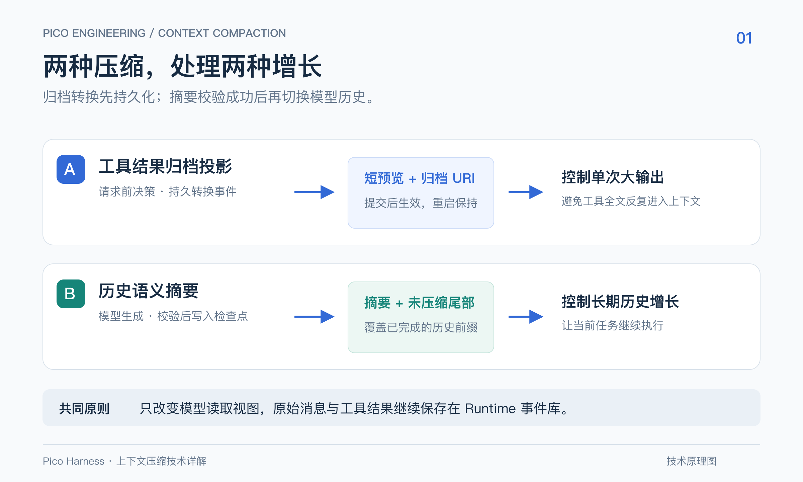

# 压缩与工具结果：先保存事实，再改变模型视图

2026-09-23，与固定 Maka 基线对齐后的当前契约。

## 三个边界

1. **入口准入**：工具物理输出最多 1 MiB。超限内容不保存，以合成错误要求分段重取；不能承诺被拒绝的内容可回读。
2. **工具投影**：准入正文完整保存。下一请求前按旧 turn、当前 step 与替代关系决定归档，追加 `tool.result.projection.recorded`；持久化后才使用预览和 URI。
3. **语义摘要**：依据真实 usage 或 Provider 溢出选择安全前缀，生成并校验摘要，然后提交 `context.checkpoint.recorded`。原始事实不删除。

工具归档保护最近两个用户 turn，普通阈值为 2,048 个估算 Token，被替代的活动结果阈值为 256。归档地址绑定当前 Session，哈希和字节数验证对应正文；实际可见 reader 是新增归档的前提。已提交投影在重启、重试和查询时保持，不重新暴露原文。

## 自动和手动摘要

主动公式是 `I + O + min(2O, 8000) >= 用户声明窗口`。没有可信 usage 或明确声明就不主动摘要。一次 send 的所有模型步骤共享一次尝试；主动失败不能再靠同一 send 的溢出分支重复摘要。

真正溢出且未产生可观察输出、步骤预算仍可用时，可以省略历史工具图片或生成摘要，重试一次。图片和摘要是这次恢复的不同选择；不通过硬重置掩盖错误。

手动入口是 `standalone`，可折叠全部安全完成历史。自动执行区分 `pre_turn` 与 `mid_turn`：前者固定当前任务在尾部，后者允许折叠任务与完成步骤并重新附上任务原文。任何入口都不能拆开工具调用和结果，也不能折叠未闭合工具调用。

## 校验与观测

摘要最多 8,000 输出 Token，包含结构化任务信息；截断和格式修复有界，不做固定字符切片。checkpoint 校验覆盖条数、边界事件、来源摘要及摘要结构。写入失败保留原历史，成功后才重建视图。

追踪界面显示最近成功主请求的真实输入／当时窗口；当前历史的 `chars_v1` 估算和当前 checkpoint 单独显示。手动压缩会更新历史，但不修改已经发生的请求快照。详情见[上下文压缩技术详解](../pico-context-compaction-technical-guide.md)和[功能契约](../features/context-compaction.md)。
