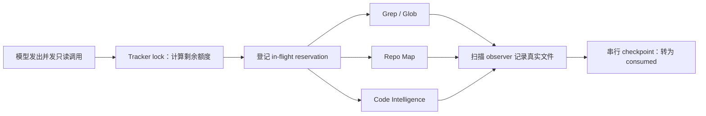

# pico-harness 渐进式代码定位：从信息觅食循环到并发 Discovery Runtime

> 本文记录 pico-harness 如何把 Forage–Focus–Deepen–Verify 的信息觅食循环落成一个可并发、可恢复、受共享预算约束的代码定位系统。重点不是“让模型多搜几次”，而是如何让搜索过程具备状态机、证据链、安全边界和可验证的停止条件。

---

## 一、问题：陌生代码库里，答案的位置本身就是未知数

面对熟悉模块，Agent 可以直接读取目标文件；面对大型陌生仓库，第一步却是回答另一个问题：**真正相关的文件和符号在哪里？**

这类任务有三个相互冲突的目标：

- 召回要足够广，不能因为第一批结果没命中就宣布不存在。
- 阅读要足够窄，不能把几百个候选全部塞进上下文。
- 结论要能核验，不能把路径名相似或同名符号当成真实调用链。

全量阅读无法扩展，单次语义 Top-K 容易漏掉调用关系、缓存键和配置路径，无约束的 `grep + read` 又可能演变成无限搜索。黄佳在《Agent 设计模式之美》的“信息的觅食循环”一讲中给出的方向是：先低成本广扫，再聚焦高信号区域，沿结构深挖，最后反证。

pico-harness 采用了这个方向，但工程实现多加了四条硬约束：

1. 一个 Session 只有一个 Discovery Coordinator。
2. Coordinator 内部可以并发多个只读分支，但共享一份总预算。
3. 每一步调查都必须沉淀为可重放的事件和证据。
4. 找到“看起来像”的文件不算完成，Verify 必须直接读取真实目标。

因此，Discovery 不是一个更复杂的搜索工具，而是一段受 Runtime 管理的任务生命周期。

---

## 二、四阶段循环：模型负责判断，Harness 负责约束

pico 把探索过程划分为四个阶段：

```text
Forage → Focus → Deepen → Verify
   ▲                         │
   └──── 信号不足时进入下一轮 ┘
```

### Forage：低成本铺开搜索面

Forage 使用 Repo Map、Glob、Grep 等工具建立候选集。此时只需要路径、匹配片段、目录和结构信号，不应该全文读取所有候选。

一个关键规则是：`complete=false` 只能解释为“当前扫描还没有覆盖完整空间”，不能解释为“仓库里没有目标”。Repo Map 每批扫描有界，目标完全可能位于下一批文件中。

### Focus：选择值得完整阅读的区域

Focus 不只是按语义相似度排序。候选还需要考虑：

- 是否位于生产路径而非归档或测试目录；
- 是否处在入口、服务、配置或调用链的结构中心；
- 是否与当前任务中的行为线索一致；
- 是否提供了与已有证据不同的新信息。

pico 的候选以 `path + symbol` 去重，分数取最高值，原因与 Evidence 引用取并集。并发完成顺序不会改变最终候选语义。

### Deepen：沿结构关系追踪

Deepen 使用 `read_file` 和 Code Intelligence 工具继续追踪定义、引用、符号与调用层级。它不再扩大搜索面，而是验证入口到目标之间的真实连接。

代码定位最容易在这里出现“同名即同物”的错误：仓库中可能有多个同名函数，其中只有一个位于生产调用链。路径相似和符号相同都只是候选信号，不能代替直接读取 import、调用和返回值。

### Verify：用直接证据收口

Verify 是 pico 对三阶段循环的强制收口。自动 Discovery 在提交计划前，必须至少直接读取被选中的源码，并持有对应 Evidence；否则 `submit_plan` 会被拒绝。

阶段在同一轮内只能前进。只有完成 Verify 后，才允许以 `Verify → Forage` 开始下一轮。连续两个 checkpoint 没有新增候选、证据或假设变化时，系统记录 `no_information_gain`，避免模型用换词搜索伪装成持续进展。

---

## 三、状态外化：JSONL 才是事实源

Discovery 的状态不保存在模型上下文，也没有引入 SQLite。所有产品级事实继续写入 Session 的 `RuntimeEventStore` JSONL：

```text
discovery.started
discovery.checkpointed
discovery.branch.started
discovery.branch.checkpointed
discovery.branch.completed
discovery.branch.cancelled
discovery.completed
discovery.interrupted
discovery.resumed
discovery.cancelled
```

纯函数 reducer 从活动分支事件重建 `DiscoveryProjection`。TUI、Desktop、Headless、resume、rewind 和 fork 读取同一个投影，不再各自维护一份“当前探索进度”。

核心投影可以简化为：

```text
DiscoveryRun {
  discoveryId, objective, depth,
  phase, cycle, status,
  budget,
  branches[], candidates[], evidenceRefs[],
  inspectedFiles[], hypotheses[], openQuestions[],
  limitReason?, report?
}
```

所有控制操作都有 `operationId + fingerprint`。同一操作重放会返回已有结果，相同 ID 携带不同语义则报冲突。外部 start、resume、cancel 还必须提交 `expectedSessionSequence`，通过 high-water CAS 阻止旧 UI 或旧进程覆盖新状态。

事件只保存候选、文件/符号锚点、工具调用引用和 Evidence URI。大段 grep 输出、子代理原始结果继续留在 ToolResult/Evidence 中，避免把 JSONL 变成第二份搜索结果仓库。

---

## 四、并发的核心不是“同时跑”，而是共享预算不失真

pico 提供三档 Discovery 深度：

| 深度     | 最大分支 | 最大循环 | 工具调用 | 检查文件 |
| -------- | -------: | -------: | -------: | -------: |
| quick    |        1 |        1 |       12 |       15 |
| balanced |        2 |        2 |       24 |       30 |
| deep     |        3 |        4 |       48 |       80 |

这些数字是整个 Discovery 的总量，不是每个分支各拿一份。并发条件下必须始终满足：

```text
consumed + reserved + in_flight <= limit
```

如果三个 deep 分支各自看到“还剩 48 次工具调用”，再各跑 48 次，所谓预算就会被并发放大三倍。因此，Coordinator 在分支启动前先原子预留预算，再允许 Worker 执行：

```text
剩余工具 = maxToolCalls - consumedToolCalls - reservedToolCalls
剩余文件 = maxFiles - consumedFiles - reservedFiles

按稳定 ordinal 把剩余额度拆给各分支
→ 原子写入 branch.started
→ Worker 才能开始调用工具
```

正常完成后，实际消耗转入 `consumed`，未使用部分释放。取消分支会释放仍未消耗的 reservation。所有 Projection 写入经过单一串行队列，所以分支可以并发调查，却不能并发篡改状态。

主模型直接发起的多个只读工具调用也有同样的问题。这些调用在执行前通过 tracker lock 串行计算 reservation，并把同批尚未完成的 `in_flight` 计入剩余额度。锁只保护预算决策，不把真实工具执行串行化。



---

## 五、文件预算为什么比工具调用预算更难

工具调用次数容易计数，文件检查量却可能隐藏在工具内部。

例如模型先读取 `src/router.ts`，随后对同一文件调用 `code_references`。显式参数仍是已检查文件，但 Code Intelligence 为了回答引用关系，可能驱动 Repo Map 继续扫描几十个新文件。如果只看 `file_path`，这次调用会被错误计为零文件消耗。

pico 的处理方式是把所有可能触发扫描的工具归入同一集合：

```text
glob, grep, repo_map,
code_definition, code_references, code_symbols,
code_diagnostics, code_call_hierarchy
```

调用前，Runtime 根据 Discovery 剩余文件量重写 `max_files`；执行时，Repo Map 与工作区搜索 observer 记录实际扫描路径。即使没有命中候选，只要文件被扫描过，就会消耗预算。

这建立了一个重要语义：**预算限制的是系统实际接触了多少文件，而不是最终向模型展示了多少结果。**

如果扫描工具已经没有剩余文件额度，调用直接 fail-closed；不会传入一个无限制的 `undefined`，也不会允许 Code Intelligence 在预算之外偷偷补建 Repo Map。

---

## 六、分支隔离必须基于物理路径

并发分支应解决互斥问题，例如：

- 分支 0：生产入口与调用链；
- 分支 1：配置与数据流；
- 分支 2：测试、历史和反例。

只比较用户输入字符串无法证明 roots 互斥。下面这些写法可能指向同一目录：

```text
src
./src
src/../src
alias-to-src   # symlink
```

pico 在启动分支前对工作区和每个 root 执行 `realpath`，再检查规范化后的物理路径是否相同、互为祖先或越出工作区。任何无法解析、重叠或逃逸的 root 都会在 Worker 启动前被拒绝。

这个检查既是预算边界，也是安全边界。如果两个分支物理上扫描同一区域，不仅会重复花费预算，还会让“互斥探索”的实验结论失真。

---

## 七、截断结果不能按“零消耗”处理

子代理返回结构化报告时，原始结果可能因为输出上限而截断。一个危险但常见的实现是：解析失败后抛错，然后取消分支、释放全部 reservation。

这会制造预算套利：Worker 实际已经调用工具、读取文件，只是父 Agent 没拿到完整统计；恢复后同一额度又能被使用一次，跨 resume 的真实消耗就超过了上限。

pico 采用保守结算：

1. 子结果数量不足或结构不完整时，相关分支标记为 failed。
2. `reserveToolCalls` 和 `reserveFiles` 全额转成 consumed。
3. Discovery 记录 interrupted，仍允许用户显式恢复。
4. 恢复只能使用真正剩余的增量预算。

未知文件消耗没有对应路径锚点，因此 reducer 还要保留一段“未归因消耗”：

```text
unattributedFiles = consumedFiles - inspectedFiles.length
nextConsumedFiles = unattributedFiles + nextUniqueInspectedFiles.length
```

否则下一次普通 checkpoint 若直接用 `inspectedFiles.length` 重算，会把保守记录的 30 个文件冲回 0 或 1，再次释放已经花掉的额度。

原则很简单：**统计缺失时可以高估，不能低估；可恢复不等于可重复消费。**

---

## 八、中断、恢复与历史分支

进程退出或 RuntimeRun 异常结束时，活动 Discovery 会进入 interrupted。恢复不是复活旧 Worker，而是从 JSONL checkpoint、候选和 Evidence 继续创建新分支。

历史分支需要同时满足两组看似冲突的要求：

- 保留 completed、partial、failed、cancelled 记录，供 UI、审计和 Evidence 回溯。
- 不让这些终态分支永久占据 `maxBranches` 和 ordinal 槽位。

因此，只有 `queued/running` 分支占活动槽位。终态分支留在 Projection 中，但恢复后可以重新使用 ordinal 0、1、2；`branchId` 仍保持全局唯一，旧分支不能重新 checkpoint 或改写。

Fork 会继承 Discovery 事件和证据，但如果源 Session 当时仍在执行，子 Session 以 interrupted 开始，不会自动继续产生副作用。Rewind 则通过活动分支重放自然得到目标时点的 Projection。

---

## 九、Plan 与 `/explore`：共享能力，不共享权限语义

渐进发现不是第三种协作模式。

显式 `/explore [quick|balanced|deep]` 会启动隔离的只读 Discovery Run，继承用户默认模型，但不改变 Session 的 `collaborationMode` 或 `permissionMode`。完成后只返回报告并停环。

Plan Mode 则使用主模型的只读 Repo Map 和 Code Intelligence 调查。Plan 继续禁止 Bash、写工具、可写 MCP 和模型子代理；提交计划前，Runtime 要求 Verify 证据，并把 `discovery.completed` 与 `plan.proposed` 原子收口。批准后才由全新的 Agent Turn 执行修改。

这两个入口共享同一状态机、预算和 Evidence，但安全边界不同：

| 入口       | 调查方式                            | 是否改协作模式 | 是否可写              |
| ---------- | ----------------------------------- | -------------- | --------------------- |
| `/explore` | 隔离 Explore Worker，可并发只读分支 | 否             | 否                    |
| Plan       | 主模型只读调查                      | 已处于 Plan    | 否                    |
| Agent      | 可在定位后继续执行                  | 否             | 取决于 permissionMode |

工具白名单不是唯一防线。Runtime middleware 会再次校验真实 registry 调用，阻止历史 ToolCall、插件或直接调用绕过 Provider 可见工具面。

---

## 十、怎样证明大型噪声仓库真的能定位

只用十几个文件的 fixture，无法证明“第一批没命中仍会继续”、同名候选不会误导模型，也无法证明多个分支真的并发。

pico 的真实模型 E2E 动态生成一个噪声仓库：

- 480 个 decoy 模块；
- 前三个 decoy 导出与真实目标相同的随机符号；
- 真实目标放在 Repo Map 第一批扫描之后；
- 生产路径包含四层静态调用链；
- TASK 只暴露行为和验收命令，不泄露目标路径或符号；
- canary 每次随机生成，不能被模型记忆。

三条真实模型场景分别验证：

1. **Plan 定位—审批—执行**：规划阶段直接读取完整调用链，审批前工作区 hash 不变；审批后只修改真实目标，decoy hash 不变，并产生 `plan.execution.completed`。
2. **生产 `/explore deep` 并发**：至少两个互斥分支的 Provider 调用时间重叠；总工具/文件消耗不超过 48/80；最终直接读取真实目标，工作区零修改。
3. **持久恢复**：形成 checkpoint 后强制中断并重开 JSONL；resume 从候选或 Evidence 继续，不重复完全相同的宽泛搜索。

断言以 RuntimeEvent、工具参数、Evidence、调用时间关系和文件 hash 为准，不匹配模型最终文字，也不通过自动重试掩盖行为失败。

```bash
RUN_LLM_E2E=1 npm run test:llm-e2e:discovery
```

真实模型测试之外，确定性集成测试还用 barrier fake tool 证明分支执行时间确实重叠，并覆盖 CAS、预算预留、路径别名、截断结果、restart、resume、rewind 和 fork。

---

## 十一、这次实现暴露出的四个工程教训

### 1. 并发会把“上限”变成竞态

单线程下正确的 `remaining = max - consumed`，并发后并不安全。必须把 reserved 和 in-flight 一起纳入不变量，并让预算决策串行化。

### 2. 工具参数不等于真实成本

`code_references(file_path=x)` 看似只检查一个文件，内部可能扫描整个 Repo Map。预算需要观测底层事实，而不是根据顶层参数猜测。

### 3. 逻辑路径不能代表物理隔离

`.`、`src/../src` 和 symlink alias 可以绕过字符串去重。并发 roots、安全目录和预算去重都应建立在规范化物理路径上。

### 4. Fail-closed 也要保持会计守恒

抛错并不自动等于安全。如果抛错同时退回未知消耗，恢复后依然可以超支。失败路径必须与成功路径一样维护预算、状态和幂等语义。

这些问题很难靠“最终答案正确”发现。它们需要针对崩溃窗口、截断结果、并发时间关系和恢复后的二次消费专门设计测试。

---

## 十二、适用边界：现场探索不是索引的替代品

渐进式 Discovery 适合目标位置未知、结构关系重要、工作区实时变化、又不希望维护第二份知识副本的场景。中小型代码库、局部模块排查和隐私敏感项目尤其合适。

它并不否定持久化索引。面对数十万文件、跨仓依赖、高频重复查询时，每次从零现场扫描会带来不可接受的延迟。更合理的混合方式是：

```text
索引提供候选地图
→ Discovery 沿当前工作区真实结构追踪
→ Verify 直接读取源码并交叉核验
```

索引负责规模，现场探索负责新鲜度，直接证据负责正确性。三者角色清晰，比同时返回两批互相竞争的“相关结果”更容易治理。

---

## 十三、小结

信息觅食循环真正落到 Agent Harness 时，核心已经不是提示词里的 Forage、Focus、Deepen，而是下面这组运行时不变量：

- 一个 Session 一个 Coordinator；
- 多分支可以并发，状态只能单写；
- 所有分支共享同一预算；
- 扫描成本按底层事实计算；
- 终态、截断和崩溃都不能破坏会计守恒；
- 最终结论必须由直接读取和 Evidence 验证；
- JSONL 事件能够在 resume、rewind、fork 后重建相同 Projection。

模型决定下一步查什么，Harness 决定它能查多少、能访问哪里、何时必须停止，以及结论需要什么证据。两者合起来，才是一个真正“会找路”、又不会在森林里无限消耗资源的 Agent。

## 代码索引

- Discovery 公共契约与预算预设：`src/discovery/contract.ts`
- JSONL 事件校验：`src/discovery/events.ts`
- Coordinator 与 CAS 控制：`src/discovery/coordinator.ts`
- Projection reducer：`src/discovery/reducer.ts`
- Runtime 调查、安全与预算中间件：`src/runtime/agent-runtime.ts`
- 大型噪声仓库 fixture：`tests/fixtures/discovery-large-repo.ts`
- 真实模型验收：`tests/e2e/discovery-loop.real-llm.test.ts`

## 来源与范围

本文的方法论起点来自黄佳《Agent 设计模式之美》第 9 讲“渐进发现：信息的觅食循环”；工程部分依据 pico-harness 当前实现、集成测试与真实模型验收整理。预算数字、事件协议和恢复语义均描述本文写作时的项目实现，不应直接外推为所有 Agent 产品的默认参数。
