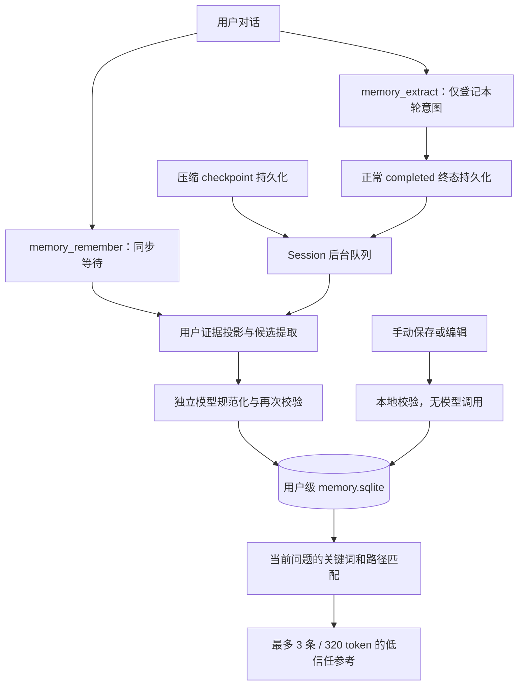

# Pico 原子长期记忆

> 文档状态：当前事实。依据 2026-09-07 的 `5999acb4` 代码核对。生产链路已从
> Fact/Proposal/Worker 切换到原子 Item；本文替代旧“提案式事实记忆”说明。
> Maka 核验范围和实现历程见[任务记录](../plans/2026-09-07-maka-atomic-memory-redesign.md)。

## 1. 记忆分成什么

| 层次         | 职责                                             | 存储与读取                                                              |
| ------------ | ------------------------------------------------ | ----------------------------------------------------------------------- |
| 会话历史     | 保存用户消息、助手回答、工具结果、Run 和压缩边界 | workspace `pico.sqlite` 的 RuntimeEvent；模型历史与 Transcript 是其投影 |
| 上下文压缩   | 控制当前模型请求大小                             | 写入 checkpoint，改变后续读取视图，不改写原始对话事件                   |
| 原子长期记忆 | 跨会话保存稳定偏好、背景、知识等                 | 用户级 `$PICO_HOME/memory.sqlite`；按当前问题召回少量 Item              |

长期记忆不等于聊天全文或压缩摘要。自动提取的内容来自受约束的用户证据；手动保存、编辑、
归档和遗忘属于独立用户意图，不能靠重跑模型可靠恢复整个记忆库。

同一 `PICO_HOME` 共用一个原子记忆库。`global` 条目可以在该用户的受信工作区中使用；
`workspace` 条目只对匹配的工作区 key 可见。开关按工作区保存，不同 `PICO_HOME` 相互隔离。

## 2. 写入和召回流程



### 触发入口

| 入口                                                 | 实际行为                                                                                              |
| ---------------------------------------------------- | ----------------------------------------------------------------------------------------------------- |
| 模型工具 `memory_remember({})`                       | 用户明确要求记住时使用；必须独占一个工具步骤，同步完成提取和提交后返回实际保存结果                    |
| 模型工具 `memory_extract({})`                        | 仅返回 accepted 并记录本 Run 的提取意图；正常 completed 事件落盘后才排入后台，accepted 不表示已经保存 |
| Compaction hook                                      | checkpoint 落盘后按被冻结的覆盖边界触发后台提取，不等待当前 Run 结束，也不要求先调用 `memory_extract` |
| `/memory remember <text>` / 管理接口 `memory.create` | 不调用模型；通过本地安全校验后直接建立当前工作区的 `note` 条目                                        |

两个模型工具都严格无参，不能让主模型直接提交任意正文。失败、取消或恢复生成的 terminal
不会触发 `memory_extract`；但此前同步 remember 或 checkpoint 提取已提交的内容不会随 Run
后来失败而回滚。

Runtime 只在受信工作区且运行配置允许时装配记忆，提取时还检查 Session 存在且未归档。
Plan、Graph operator、side conversation、
后台 Automation 和隔离 headless 路径不启用这套记忆。Responses Provider 不装配提取 runtime
和两个触发工具；符合条件时仍可以召回已有记忆。

### 提取与证据

1. Host 固定 workspace/session/run/turn 身份、事件序号和边界。记忆内部的 Session key 包含
   workspace key，避免不同工作区同名 Session 混用游标。
2. 从稳定用户文本构造证据；有 Provider 请求快照时，还须与该请求实际可见的用户文本匹配。
   工具结果、thinking、隐藏控制消息和附件不作为正式用户证据；助手文本只能辅助解释指代。
3. 辅助模型生成候选，程序验证 JSON、字段枚举、时间范围、来源与引文。引文必须能在对应
   用户证据中找到；需要定位历史指代时可进行一次受限的历史定位。
4. 另一次模型调用负责规范化，只接收候选 ID、用户引文、观察时间和可选指代上下文；不接收
   候选正文、keys、scope 或整段源会话。规范化结果再次校验，scope 由模型选择，workspace key
   由程序绑定，不能由模型指定别人的工作区。
5. 合法结果直接入库，没有人工 Proposal 审批队列。密钥或不合法候选会被拒绝或过滤；手动
   保存、编辑复用本地清洗器，只接受 `allow`，不会建立 PII 待审提案。

每个证据处理段最多 **3 次辅助模型调用**，包含提取、定位后的提取、规范化及重试；每次调用
有 60 秒期限。补齐多个 checkpoint、处理 pending 范围或把过大范围拆成两段时，一次触发可能
处理多个段，因此不能把 3 次当作整个用户请求的总上限。记忆调用独立计入 `memory_review`
用量，默认沿用当前 Provider 和模型配置，不保证使用更便宜的模型。证据载荷有字符上限，
但源会话前缀另行传入，不能把该限制当作完整请求的 token 上限。旧 eco/balanced/quality
的 24 小时 review 预算不是当前生产策略。

引文匹配能证明来源存在，不能单独证明模型对含义的解释正确；规则过滤也不等于覆盖所有敏感
信息。记忆按低信任参考使用，不能把通过校验等同于事实绝对正确。

## 3. Item 和持久化

正式模型是 `MemoryItem`，关联 `keys` 和 `sources`：

- `kind`：`preference / identity / context / knowledge / failure / note`。
- `statementType`：`fact / plan / prediction`；`temporalType` 描述无日期、时间点或区间。
- `scopeType`：`global / workspace`；`origin`：`agent_extracted / user_requested`。
- `lifecycleState`：`active / archived`；内容上限为 2000 个 Unicode code point。
- 版本、内容 hash、观察时间、事件时间和来源身份与正文一起保存。

`failure` 是可保存的内容分类，不代表已经接入“失败 Run 自动蒸馏/失败日记”。

独立 SQLite 库通过事务同时提交 Item、keys、sources、提取游标、operation 和 extraction
receipt。修改用 expected version，提取覆盖推进用 cursor CAS；operation ID 与请求 hash
保证同一操作重放幂等。内容 hash 不是唯一键：不同操作可以保存相同内容，当前没有语义去重、
冲突裁决或自动覆盖旧记忆。手动重复创建相同正文有单独的幂等处理，不能推广成通用去重能力。

### 后台与恢复边界

- 同一 Session 使用进程内串行队列；前台 remember 优先于尚未开始的后台请求，不抢占正在
  执行的后台工作。SQLite CAS 负责跨连接的提交一致性。
- 后台队列本身不持久化，不能保证 daemon 退出后继续运行。后续触发根据持久化的 cursor、
  pending failure 和 checkpoint 补齐未覆盖范围，而非启动时扫描所有 completed Run。
- 处理失败先记录 pending，下一次不同操作触发时重试原覆盖范围；再次失败可记录 discard
  并推进范围。存储不可用、策略变化等情况不能伪报保存成功。
- 关闭记忆期间的压缩边界会留下策略拒绝记录，不能在重新开启后静默补采该压缩范围。

## 4. 召回

每轮组装动态 turn tail 时，用当前用户问题生成路径、词项和 CJK 双字查询。SQLite 对 keys
进行 exact/prefix 匹配，只查询 global 和当前 workspace 的 active Item；不使用 embedding、
向量库或模型检索。

路径匹配权重高于普通词项，CJK 双字得分封顶，同分时优先最近更新的条目。还有一个有限补位
规则：从最近的候选窗口中补充最多一条未匹配的通用 `preference`。不会把所有未匹配知识都
当作常驻上下文，也没有旧版 pinned/correction 强制优先机制。

最终最多注入 **3 条、320 token**，正文与 XML 安全包装一并计入预算；单条放不下就跳过。
内容进行 XML escaping，并放在 `<atomic-memory-reference trust="low">` 中，明确它只是参考，
不能授予权限或改写当前用户、安全策略、AGENTS.md、Provider、凭据和工具授权。

召回开关关闭、不受信或查询失败时不注入；失败会降级记录，不阻断普通对话。

## 5. 用户控制与遗忘

桌面记忆页提供已保存/已归档列表、正文编辑、范围和来源展示、归档/恢复、遗忘，以及三个
按工作区生效的开关：

| 存储字段        | 含义                                                     | 兼容协议字段       |
| --------------- | -------------------------------------------------------- | ------------------ |
| `enabled`       | 总开关                                                   | `enabled`          |
| `autoExtract`   | 控制后台 extract 和 compaction 提取，不阻止显式 remember | `autoPropose`      |
| `recallEnabled` | 是否注入已有记忆                                         | `injectionEnabled` |

开关默认均开启。`/memory off` 同时关闭总开关和召回；`on` 将两者打开，但保留原自动提取
设置。常用命令：

```text
/memory remember <text>   手动保存工作区记忆，不经模型
/memory status            查看工作区记忆状态
/memory off | on          关闭或启用记忆与召回
/memory undo <token>      版本仍匹配时归档刚保存的条目
```

归档停止召回但保留正文，可恢复；undo 也是归档。遗忘则删除新库当前 Item、keys、sources 及
有关回执中的正文，保留不含正文的来源抑制和必要操作记录，阻止旧证据重试或重建把它恢复出来。
这不删除原始会话、旧数据库或外部备份，也不是磁盘介质擦除。用户在新消息中重新提供信息不
等于旧证据重放，不能承诺该内容永远不会再次被记住。

Session 删除不删除已提交 Item；删除后不再为该 Session 新提取。当前管理协议只投影第一条
来源，未实时验证原事件是否仍可打开，不能把显示的来源等同于永久可用的证据链接。

global 条目在同一用户的受信工作区可管理，其他 workspace 的局部条目即使按 ID 访问也会被
拒绝。当前 UI 不提供任意修改 scope 的入口。

协议仍保留 `fact`、`proposal`、`autoPropose` 等过渡名称；真正的类型和范围在 `fact.atomic`
中。旧审核列表返回空，审核操作及 reviewMode/autoCommit 更新明确拒绝。TUI daemon 客户端
的 `/memory status` 仍显示旧 Review/Pending 字段，undo 提示仍写 disabled；实际后端已经是
直接保存/归档语义。这是尚待对齐的界面措辞，不是旧审核机制仍在运行。

## 6. 旧数据迁移和备份

受信工作区首次访问原子记忆时，`ensureAtomicMemoryWorkspace` 只读检查该工作区 `pico.sqlite`
中的旧 memory 表，并把迁移结果与 marker 事务写入用户级新库：

| 旧数据                        | 处理                                                         |
| ----------------------------- | ------------------------------------------------------------ |
| active Fact                   | 导入 active workspace Item                                   |
| disabled / archived Fact      | 导入 archived Item                                           |
| pending Proposal              | 统计并保全在旧库，不自动生效                                 |
| forgotten / suppressed Source | 不导入正文，迁移已有来源事件的抑制信息                       |
| 长正文                        | 标题和正文合并后按 2000 code point 分块，保存迁移 provenance |
| 旧 settings                   | 映射三个开关；旧 eco 使 autoExtract 关闭                     |

迁移会验证旧工作区身份和必要表/设置，缺失或损坏时拒绝迁移；旧库不被重写、删除或当作召回
fallback。marker 使重复访问和并发迁移幂等。手动 Fact 没有 RuntimeEvent 时使用明确的迁移
记录，不伪造会话来源。旧 JSONL 或 workspace split-era 文件不属于这次自动迁移范围。

备份需同时考虑 `$PICO_HOME/memory.sqlite` 和各 workspace `pico.sqlite`；前者是跨工作区
长期记忆，后者保留会话证据与旧记忆保全副本。运行中的库须用一致的 SQLite 备份方式，不能
只复制主文件而遗漏 WAL。新库已有写入后，不能通过直接恢复旧库回退而丢失新增记忆或遗忘抑制。

## 7. 代码与验证入口

| 关注点                                   | 代码                                                                                                                                                                                                                     |
| ---------------------------------------- | ------------------------------------------------------------------------------------------------------------------------------------------------------------------------------------------------------------------------ |
| 生产装配、召回注入与 Profile 门禁        | [agent-runtime.ts](../../src/runtime/agent-runtime.ts)                                                                                                                                                                   |
| Snapshot、终态/checkpoint 接线、模型适配 | [atomic-memory-runtime.ts](../../src/runtime/atomic-memory-runtime.ts)                                                                                                                                                   |
| 提取、引文校验、规范化与恢复             | [extraction-engine.ts](../../src/memory/atomic/extraction-engine.ts)、[extraction-evidence.ts](../../src/memory/atomic/extraction-evidence.ts)、[extraction-proposal.ts](../../src/memory/atomic/extraction-proposal.ts) |
| Item 契约与 SQLite 存储                  | [contracts.ts](../../src/memory/atomic/contracts.ts)、[sqlite-memory-item-store.ts](../../src/storage/sqlite/sqlite-memory-item-store.ts)                                                                                |
| 关键词召回与预算                         | [context-builder.ts](../../src/memory/atomic/context-builder.ts)                                                                                                                                                         |
| 管理、开关与迁移                         | [desktop-atomic-memory-service.ts](../../src/daemon/desktop-atomic-memory-service.ts)、[migration.ts](../../src/memory/atomic/migration.ts)                                                                              |
| 命令入口                                 | [client-commands.ts](../../src/tui/client-commands.ts)、[memory-command.ts](../../src/memory/memory-command.ts)                                                                                                          |

确定性覆盖见 `tests/integration/atomic-memory-*.test.ts`、
`desktop-atomic-memory-service.test.ts` 和 `memory-runtime-quality.test.ts`；真实模型场景见
[atomic-memory-behavior.real-llm.test.ts](../../tests/e2e/atomic-memory-behavior.real-llm.test.ts)
与 [memory-behavior.real-llm.test.ts](../../tests/e2e/memory-behavior.real-llm.test.ts)。历史验证数字
只保存在任务记录中，不作为当前模型准确率保证。

旧 `proposal-engine.ts`、`worker.ts`、`runtime-scheduler.ts`、`memory-review-recovery.ts` 和
`SqliteMemoryRepository` 仍有兼容或隔离测试用途；生产记忆入口不再装配它们。复用旧清洗器和
保留旧 wire 字段不意味着双写或双套记忆流程。
