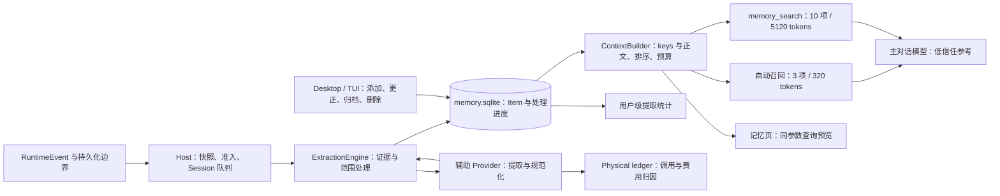
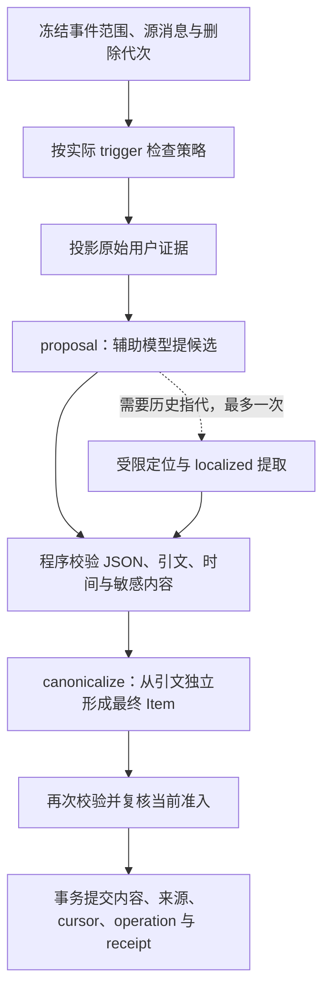
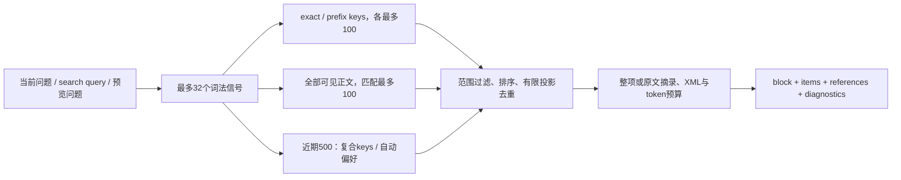
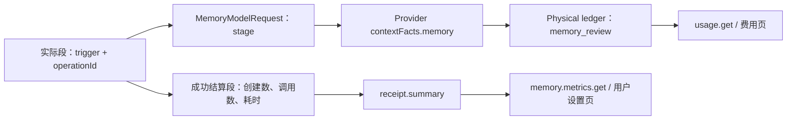

# Pico 原子长期记忆架构

> 当前实现，核对日期：2026-10-08。涵盖正文召回、只读搜索、查询预览、时间更正与提取观测。[改造方案](../plans/2026-10-08-memory-optimization.md) · [验收记录](../plans/2026-10-08-memory-acceptance.md)。

Pico 使用一个用户级 SQLite 记忆库。写入时，辅助模型理解用户证据，程序校验后原子提交；读取时，本地词法检索构造有预算的原文参考。自动召回、主动搜索和查询预览共用 ContextBuilder；用户管理操作同一份 Item。提取统计与实际模型费用分别来自回执和物理调用账本。

## 1. 数据与模块边界

| 层次       | 权威数据                                          | 职责                                                                |
| ---------- | ------------------------------------------------- | ------------------------------------------------------------------- |
| 会话历史   | 各 workspace pico.sqlite 中的 RuntimeEvent        | 原始消息、工具结果、Run 终态和 checkpoint；历史与 Transcript 是投影 |
| 上下文压缩 | checkpoint 及覆盖边界                             | 控制后续模型请求长度，保留原始事件；摘要不直接成为记忆              |
| 长期记忆   | $PICO_HOME/memory.sqlite 中的 Item、keys、sources | 跨会话复用偏好、背景、知识、经验和笔记                              |
| 提取观测   | extraction receipt 的可选 summary                 | 成功结算段的调用数、历史创建数、耗时及实际 trigger                  |
| 模型费用   | physical provider ledger                          | 实际辅助调用、用量、价格状态及 trigger/stage/operationId            |

同一 PICO_HOME 共用记忆库和**用户级开关**，不同 PICO_HOME 相互隔离。内容范围与开关独立：global 在同一用户的受信工作区可见，workspace 仅在匹配的 workspace key 可见。

```mermaid
flowchart LR
  events["RuntimeEvent 与持久化边界"] --> host["Host：快照、准入、Session 队列"]
  host --> engine["ExtractionEngine：证据与范围处理"]
  engine --> model["辅助 Provider：提取与规范化"]
  model --> engine
  engine --> db[("memory.sqlite：Item 与处理进度")]
  manage["Desktop / TUI：添加、更正、归档、删除"] --> db
  db --> builder["ContextBuilder：keys 与正文、排序、预算"]
  builder --> auto["自动召回：3 项 / 320 tokens"]
  builder --> search["memory_search：10 项 / 5120 tokens"]
  builder --> preview["记忆页：同参数查询预览"]
  auto --> main["主对话模型：低信任参考"]
  search --> main
  db --> metrics["用户级提取统计"]
  model --> ledger["Physical ledger：调用与费用归因"]
```

| 模块          | 所有权与职责                                                                                  |
| ------------- | --------------------------------------------------------------------------------------------- |
| core          | Item、时间/范围、Store、提取与观测契约；搜索信号规范化与词法评分                              |
| runtime       | 证据投影、提取状态机/预算/恢复、Session 队列、统一 ContextBuilder                             |
| storage       | SQLite 结构、作用域查询、事务、版本/游标 CAS、幂等、删除代次、回执聚合                        |
| pico-host     | 绑定工作区与会话、捕获快照、接线终态/checkpoint、工具门禁、Provider 适配、管理 RPC 与费用投影 |
| protocol      | Item 管理、查询预览、用户统计及用量字段的公开契约和校验                                       |
| Desktop / TUI | 显式用户操作、预览与统计展示                                                                  |

## 2. 写入入口与提取链路

| 入口                                    | 执行方式与完成含义                                                                                           |
| --------------------------------------- | ------------------------------------------------------------------------------------------------------------ |
| 普通正常完成回合                        | Host 持久化 eligible completed 边界后调度后台提取；不要求调用 memory_extract，仍受自动提取策略及工具授权控制 |
| memory_extract({})                      | 登记本 Run 的提取意图，正常 completed 落盘后处理；accepted 不表示已保存                                      |
| memory_remember({})                     | 用户明确要求记住，前台同步等待实际回执；必须独占一个工具步骤                                                 |
| 自动 compaction checkpoint              | 持久化覆盖和准入边界后调度后台；不等待 Run 结束                                                              |
| 显式保留上一条助手回复                  | Host 唯一定位授权用户事件与紧邻的已完成助手原文，直接保存参考笔记，无辅助模型调用                            |
| memory.create / /memory remember <text> | 本地安全校验后直接创建 workspace note；同文创建有操作级幂等复用                                              |
| memory.update                           | 用户显式更正，本地校验与版本 CAS；不自动覆盖其他历史条目                                                     |

两个写入触发工具严格接受空对象，不能传入主模型任意生成的正文。Host 决定证据与身份。助手参考笔记是单独的确定性保存路径，保留用户授权和助手原文双来源，标识“未经独立核实”；每段正文最多1800 code points、最多32段。它保留资料，不把助手陈述提升为用户事实。Responses 的记住入口会先拒绝不支持的 Provider，也不能借此路径保存助手笔记。

```mermaid
flowchart TD
  boundary["冻结事件范围、源消息与删除代次"] --> gate["按实际 trigger 检查策略"]
  gate --> evidence["投影原始用户证据"]
  evidence --> proposal["proposal：辅助模型提候选"]
  proposal --> admission["程序校验 JSON、引文、时间与敏感内容"]
  proposal -. "需要历史指代，最多一次" .-> localized["受限定位与 localized 提取"]
  localized --> admission
  admission --> canonical["canonicalize：从引文独立形成最终 Item"]
  canonical --> recheck["再次校验并复核当前准入"]
  recheck --> commit["事务提交内容、来源、cursor、operation 与 receipt"]
```

Snapshot 固定 workspace/session/run/turn、事件序号、覆盖范围、源请求消息和删除代次。内部 Session key 包含 workspace key，防止同名会话跨项目混用游标。

常规事实提取只承认原始用户文本。引文须同时受到原始事件和实际请求可见文本支持；有事件索引时按索引核验，否则回退到受约束的文本匹配。工具结果、thinking、隐藏控制消息和附件不作为正式用户证据，助手文本仅帮助解释指代。引文存在不保证语义解释绝对正确。

必要时仅允许一次受限历史定位，最多7个历史轮次；解释语境每条最多2000 code points，序列化后最多12000 JavaScript字符单元。独立规范化接收候选ID、引文、观察时间和必要语境，不接收第一次生成的正文、keys、scope或整段历史。模型选择 global/workspace，Host 绑定实际 workspace key；校验通过后直接提交，没有人工 Proposal 审批队列。

每个处理段最多**3次辅助调用**，proposal、localized、canonicalize及重试共用额度，单次有60秒期限。发送前检查完整输入、实际工具定义、输出预留和安全余量。已知窗口不足时，仅尝试按完整 Run/Turn 边界拆成两段，不递归拆分。一次触发可能恢复多个段，三次不是整个触发的总上限。默认沿用当前 Provider/模型，没有新增模型、周期或审核额度策略。

## 3. 统一召回、主动搜索与预览

AtomicMemoryContextBuilder.build(query, options) 统一处理三个读取入口：

1. 查询经过 NFKC 和小写规范化，生成完整词项、路径和 CJK 双字信号；三类合计最多32个，单信号最多256 code points。空问题、普通确认语和 slash 控制命令不扩展知识召回。
2. exact keys、prefix keys 各取最多100项；正文扫描所有可见 active Item，排序后只加载最多100条匹配记录，**不受最近500条限制**。
3. 近期500条窗口只用于中文复合 keys 补充匹配及自动模式最多一条通用 preference 补位。主动模式不补未匹配偏好；英文主动查询可不读取近期窗口。
4. 正文最终匹配完整词、完整路径；CJK正文至少命中两个不同有效双字信号。substring仅作快速预筛，减少无关行分词。
5. 合并后再次过滤范围和归档状态。key命中优先于纯正文命中；组内按 max(keyScore,contentScore)、updatedAt、稳定itemId排序，路径权重大于普通词项。

```mermaid
flowchart LR
  query["当前问题 / search query / 预览问题"] --> signals["最多32个词法信号"]
  signals --> keys["exact / prefix keys，各最多100"]
  signals --> body["全部可见正文，匹配最多100"]
  signals --> recent["近期500：复合keys / 自动偏好"]
  keys --> rank["范围过滤、排序、有限投影去重"]
  body --> rank
  recent --> rank
  rank --> budget["整项或原文摘录、XML与token预算"]
  budget --> result["block + items + references + diagnostics"]
```

| 入口                   | 最大项数 | 整体预算    | 单项与摘录                                                       |
| ---------------------- | -------- | ----------- | ---------------------------------------------------------------- |
| 自动上下文             | 3        | 320 tokens  | 普通长Item放不下跳过，助手笔记可按查询锚点摘录                   |
| memory_search({query}) | 10       | 5120 tokens | 每项连同其memory元数据最多480 tokens；普通Item和助手笔记均可摘录 |
| memory.context.preview | ≤3       | ≤320 tokens | automatic模式，可进一步缩小预算，不能扩大自动注入容量            |

预算包含低信任说明、来源/时间属性、XML转义与包装。摘录保留原文，以 Unicode code-point 的零起点半开区间 range.start/end/total 标注位置，不调用模型生成摘要。items保留完整记录，references才是实际引用片段；diagnostics只说明候选的 selected/duplicate/budget/item_limit，不覆盖全库未命中项。

来源分为 user-evidence、manual、assistant-note，分别表示保留当前用户来源、无当前来源引用、授权助手参考笔记；助手笔记带 verified=false。来源分类不是事实真伪保证。输出附 statement、temporal、observed-at及事件起止时间，以 trust=low 包装，不能更改权限、Provider、凭据、工具授权或当前指令。

去重只发生于读取投影：同scope/scopeKey、kind、来源类别和原文完全相同，且为无事件边界的 undated fact，才抑制重复。带日期事件、plan、prediction和助手笔记保留；数据库不删重、不合并来源，不做语义去重或自动裁决新旧事实。

## 4. 策略、作用域与执行门禁

| 用户级设置    | 控制范围                                     |
| ------------- | -------------------------------------------- |
| enabled       | 提取与召回总开关                             |
| autoExtract   | 后台 extract/compaction，不阻止显式 remember |
| recallEnabled | 自动注入、主动search及查询预览               |

默认均开启，设置有共享版本CAS；旧工作区设置不继承为用户级策略。条目管理独立于召回开关，关闭读取仍可管理已保存内容。

| 运行路径                                                 | 自动召回 / 主动search                      | 模型提取                                         |
| -------------------------------------------------------- | ------------------------------------------ | ------------------------------------------------ |
| 受信Agent                                                | 可读                                       | 按开关、会话状态和allowedTools准入               |
| Plan / Research                                          | 可读，search在只读工具面                   | 不开放                                           |
| Responses                                                | 可读                                       | 触发工具返回provider_unsupported，不发起辅助提取 |
| 旁路对话                                                 | 不因会话类型单独禁用                       | 仍检查普通策略                                   |
| 后台Automation                                           | 普通召回策略；search须在Job allowedTools中 | remember/extract各需显式工具授权                 |
| configured subagent / graph operator / isolated headless | 不注入，不装配search                       | 不开放                                           |
| 未受信工作区                                             | 不读                                       | 不提取                                           |

memory_search仅接受非空query，上限4096字符；没有workspace、归档状态或预算参数。工具只读、无文件副作用，Host绑定workspace，执行前后复核当前信任及enabled/recallEnabled。命令allowedTools同样限制工具面；允许读取不取决于提取Provider是否受支持。

## 5. 管理、更正、时间与删除

记忆页提供添加、更正、归档/恢复、删除，以及当前问题的真实引用预览；用户设置页管理全局策略和近7天统计。预览用请求序号及上下文标识防止迟到响应覆盖，workspace、记忆数据或设置改变会使旧结果失效。

memory.update以expectedVersion检查CAS。可更正content、kind、statementType、temporalType、eventStartedAt、eventEndedAt；省略时间字段保留，明确清除发送undated/null/null，合并后验证合法边界。编辑和归档分开提交。人工更正设origin=user_requested，重建keys并清旧sources，保留observedAt、更新updatedAt；失败保留输入，没有任意改scope入口。

| 时间字段                    | 语义                                                       |
| --------------------------- | ---------------------------------------------------------- |
| eventStartedAt/eventEndedAt | 事件发生时间或有效区间                                     |
| observedAt                  | 支持原内容的证据观察时间；手动创建为记录时间，更正保留     |
| updatedAt                   | 最近修改时间，用于显示和排序，不代表事件时间或“现在仍有效” |

归档停止召回并保留内容，可恢复；undo也是版本匹配的归档。删除清理Item、keys、sources和相关回执中的正文，保留历史观测计数。原始聊天及备份独立，删除会话也不删除已提交记忆。

删除代次来自已提交delete操作数，重复删除不重复增加；快照捕获时固定代次，事务提交及失败结算时复核。当前为整个用户记忆库代次：删除使所有在途旧代次提取失效，旧pending显式请求空结算，不能重放复活；新的显式请求仍可重新保存原证据。

## 6. 持久化与恢复

SQLite保持**schema v9、9张业务表**，本次无迁移或新增表。Item正文最多2000 code points；kind为preference/identity/context/knowledge/failure/note，statementType为fact/plan/prediction，temporalType为undated/point/interval/open_ended，生命周期为active/archived。failure是内容分类，不表示自动蒸馏所有失败Run。

| 表                                                    | 保存内容                                                |
| ----------------------------------------------------- | ------------------------------------------------------- |
| memory_items / memory_item_keys / memory_item_sources | 正文、检索keys和当前来源                                |
| memory_write_operations                               | 操作、业务请求hash、结果及删除操作                      |
| memory_extraction_cursors                             | Session已处理的事件序号                                 |
| memory_extraction_receipts                            | 结算回执与可选summary                                   |
| memory_extraction_failures                            | pending范围、失败原因、触发类型与删除代次               |
| memory_compaction_policy_denials                      | compaction策略拒绝                                      |
| memory_settings                                       | 用户级共享开关和版本；workspace_key字段存固定用户设置键 |

提取事务同时写内容和进度。管理修改检查item version，提取检查cursor和删除代次，operationId与业务hash保证幂等。summary不参与hash，重放返回首次回执；相同内容允许来自不同操作，contentHash不是唯一约束。

进程内Session队列串行，前台remember优先未开始的后台任务，不抢占正在执行的任务；跨连接一致性依靠SQLite CAS。队列本身不持久化。后续触发先处理pending，再按覆盖顺序补齐**持久化的completed/checkpoint自动边界**，最后处理本次尾段，不在启动时扫描重放所有Run。重试再失败可discard并推进；存储不可用、退出和策略变化不能伪报保存。

completed边界和新checkpoint均冻结准入、设置版本及删除代次；checkpoint还保存覆盖终点。有记忆标签但缺少代次的旧checkpoint按策略拒绝，不能用当前版本重新授权；未标记的checkpoint仍只引导游标。恢复按冻结信息及当前策略复核，后来开启策略不会静默放行已失效范围；每段按实际trigger复查，remember不放行被关闭的旧自动范围。正常退出停止新任务并等待已登记工作与模型资源；强制退出仍可能中断。

新库直接创建当前结构，兼容库校验后打开，不兼容库拒绝，不自动升级、清空或导入旧Fact/Proposal。备份同时考虑用户记忆库和工作区事件库，并使用一致的SQLite备份方式处理WAL。

## 7. 提取统计与费用归因

```mermaid
flowchart LR
  segment["实际段：trigger + operationId"] --> request["MemoryModelRequest：stage"]
  request --> facts["Provider contextFacts.memory"]
  facts --> physical["Physical ledger：memory_review"]
  physical --> usage["usage.get / 费用页"]
  segment --> settled["成功结算段：创建数、调用数、耗时"]
  settled --> receipt["receipt.summary"]
  receipt --> metrics["memory.metrics.get / 用户设置页"]
```

归因跟随实际remember/extract/compaction段及proposal/localized/canonicalize阶段：remember恢复旧compaction段，其调用仍归因compaction。实际Provider调用包括可能收费的失败请求，费用未知仍显示未知，不能当作零费用。

memory.metrics.get默认最近7天，统计范围为整个用户记忆库，按trigger分组。可不传workspacePath；传工作区时管理入口检查信任，结果仍是用户级统计。

| 指标                        | 定义                                                                       |
| --------------------------- | -------------------------------------------------------------------------- |
| settledCount                | 具有完整summary的结算receipt数                                             |
| createdItemCount            | 这些receipt的历史创建数，删除不减少，不是当前库存                          |
| modelCallCount / durationMs | 这些成功结算段记录的调用数与累计耗时                                       |
| evaluatedCount              | summary存在、调用数>0且状态非skipped/discarded的结算数                     |
| emptyCount / emptyRate      | 有效评估中创建数为0的段；emptyRate=emptyCount/evaluatedCount，无分母为null |
| unknownReceiptCount         | 缺summary的receipt数，显示未知，不将缺失观测补零                           |

手动添加、更正及Host直接保存助手笔记走write operations，不产生extraction receipt，不进入该提取统计。待重试失败也不一定有receipt；旧回执或discard缺summary时计unknown。统计不能还原所有失败次数或完整重试成本，实际调用与费用以physical ledger为准。删除保留无正文summary，operation重放不重复统计。

## 8. 源码与验证入口

| 关注点                    | 源码                                                                                                                                                                                                                                                                    |
| ------------------------- | ----------------------------------------------------------------------------------------------------------------------------------------------------------------------------------------------------------------------------------------------------------------------- |
| 装配、自动注入与工具门禁  | [agent-runtime.ts](../../packages/pico-host/src/agent-runtime.ts)、[memory-trigger-tools.ts](../../packages/pico-host/src/memory-trigger-tools.ts)                                                                                                                      |
| 快照、自动边界与参考笔记  | [atomic-memory-runtime.ts](../../packages/pico-host/src/atomic-memory-runtime.ts)、[atomic-memory-reference-note.ts](../../packages/pico-host/src/atomic-memory-reference-note.ts)                                                                                      |
| 提取、证据与窗口预算      | [extraction-engine.ts](../../packages/runtime/src/atomic-memory/extraction-engine.ts)、[extraction-evidence.ts](../../packages/runtime/src/atomic-memory/extraction-evidence.ts)、[extraction-budget.ts](../../packages/runtime/src/atomic-memory/extraction-budget.ts) |
| 统一召回与词法规则        | [context-builder.ts](../../packages/runtime/src/atomic-memory/context-builder.ts)、[atomic-memory-search.ts](../../packages/core/src/atomic-memory-search.ts)                                                                                                           |
| 契约与事务存储            | [atomic-memory-contracts.ts](../../packages/core/src/atomic-memory-contracts.ts)、[sqlite-memory-item-store.ts](../../packages/storage/src/sqlite/sqlite-memory-item-store.ts)                                                                                          |
| 管理、预览与统计RPC       | [desktop-atomic-memory-service.ts](../../packages/pico-host/src/desktop-atomic-memory-service.ts)、[memory.ts](../../packages/protocol/src/runtime/memory.ts)                                                                                                           |
| 更正与用户设置页          | [MemoryPage.tsx](../../apps/desktop/src/renderer/MemoryPage.tsx)、[UserMemorySettingsPage.tsx](../../apps/desktop/src/renderer/pages/UserMemorySettingsPage.tsx)                                                                                                        |
| Physical ledger与费用展示 | [sqlite-runtime-control-store.ts](../../packages/storage/src/sqlite/sqlite-runtime-control-store.ts)、[usage-dashboard.ts](../../packages/pico-host/src/usage-dashboard.ts)                                                                                             |

集成验收覆盖正文缺key、旧笔记、原文范围/预算/去重、动态准入、时间更正、UI并发和历史统计；真实模型覆盖自动提取、显式笔记、跨会话召回、注入抵抗、主动搜索与日期判断。命令、性能和测试结果见[验收记录](../plans/2026-10-08-memory-acceptance.md)，历史通过次数不代表全面的模型准确率。

当前方案仍为本地词法检索，没有embedding、向量服务、Mem0托管依赖、语义去重或自动冲突裁决。正文检索解决key遗漏和旧笔记窗口遗漏，但大幅同义改写仍可能不命中。
