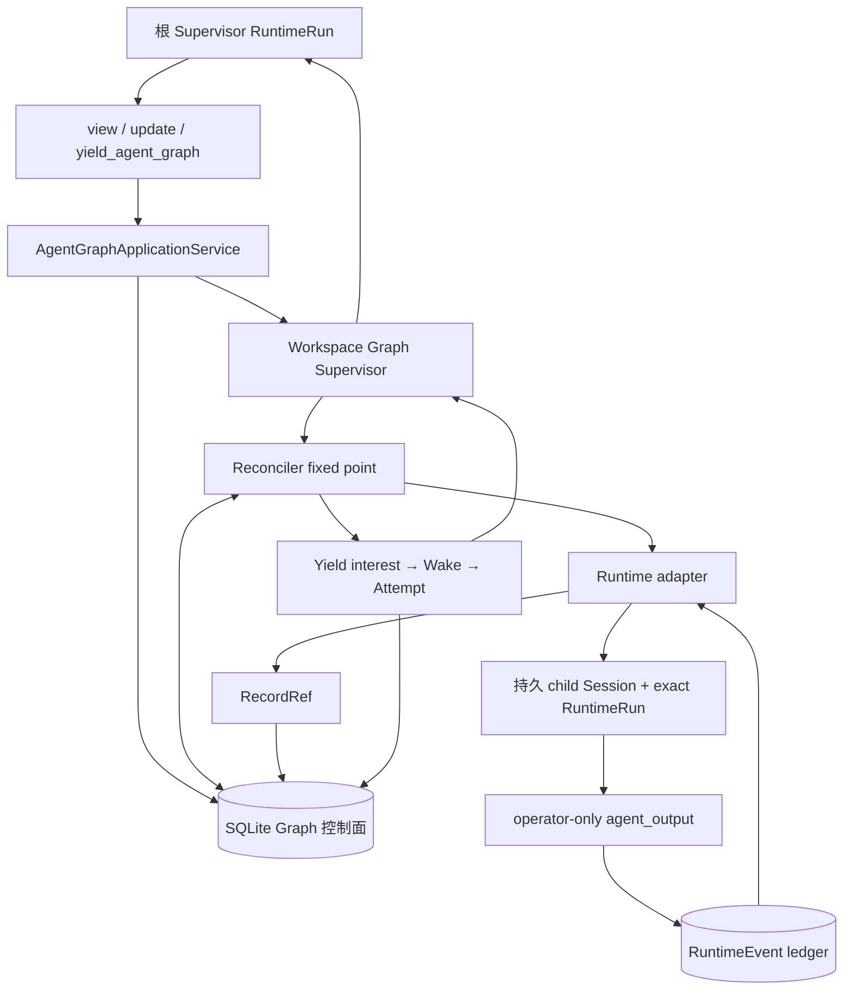
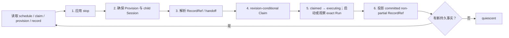

# Graph Mode：持久调度领域模型与运行时

> 本文描述当前 Graph v2。Graph 是 workspace 级持久调度控制面；`RuntimeRun` / `RuntimeEvent` 仍是执行事实权威。根 Supervisor 只提交调度意图，Operator 通过普通 Session 和精确身份的 RuntimeRun 执行，再用 `agent_output` 提交正式结果。

## 1. 结论与边界

Graph v2 解决的不是“如何把一张静态 DAG 跑完”，而是以下三个问题：

1. 根 Agent 如何以 revision CAS 原子声明一批可并行或有依赖的工作；
2. 多进程竞争、进程重启和重复通知下，如何确保一次 Activation 只有一个 Claim 和一组精确 Runtime 身份；
3. 根 Agent 主动让出当前 Run 后，如何在新结果出现时被持久、可恢复地唤醒。

它采用两本职责不同的账本：

- workspace `pico.sqlite` 的 `agent_graph_*` 表是**调度权威**，保存 revision、Provision、Claim、RecordRef、yield、Wake 和 Attempt；
- RuntimeEvent ledger 是**执行权威**，保存 `run.started`、模型/工具派发、`agent.output`、`run.terminal` 等事实。

Graph 控制面不会把模型执行结果复制进调度表。`RecordRef` 只引用 Runtime ledger 中已提交的事件，并携带完整来源身份。

当前明确不包含：活动 v1 Graph 迁移、v1/v2 双运行时、自动 `map` / `all_settled`、任意拓扑编辑、跨 epoch 结果输入，以及全局公平调度。

## 2. 为什么有 v1 和 v2

v1 使用 `graph.work.*` RuntimeEvent 投影工作状态，由 `DelegationManager` 启动子代理，并依靠 engine continuation 和 Graph work lease 补偿。它可以表达简单的 record 依赖，但调度和执行纠缠在同一条 Session 事件流与进程内委派生命周期中：

- 没有独立、原子的 schedule revision，根 Agent 更新与后台调度竞争时缺少明确 CAS 边界；
- 没有持久 Provision 和唯一 Claim，无法先锁定 child Session、Turn、Run、Invocation、start event，再安全执行；
- 子代理生命周期依赖 `DelegationManager`，进程崩溃后只能把 orphan 判失败，不能根据精确 RuntimeRun 事实安全 attach；
- 根 Agent 的等待依赖 engine continuation，不是持久的 yield/wake 协议；
- Graph settle、lease、continuation 分散在 tools、engine、SessionRuntime 和 DelegationManager，恢复权威不唯一。

v2 因此不是 v1 schema 的增量扩展，而是重新划分权威：SQLite Graph 控制面只决定“谁可以执行、用什么精确身份执行”，Runtime ledger 只证明“实际执行了什么”。

### 为什么直接硬切

如果 v1 和 v2 同时可写，会同时存在事件投影、DelegationManager、lease 和 SQLite Claim 多套调度权威。同一工作可能被两边各启动一次，finish/stop 也可能只约束其中一边。为避免双执行和不可解释的恢复，本次采用硬切：

- Graph 模式只暴露 `view_agent_graph`、`update_agent_graph`、`yield_agent_graph`；
- Operator 只通过 `agent_output` 提交正式结果；
- 删除 v1 `graph-tools`、reconcile/recover/work-lease、DelegationManager Graph 分支和 engine Graph continuation 写路径；
- 旧 `graph.*` RuntimeEvent 历史数据已清理，codec、类型、reducer 与写入入口全部删除；这些 kind 现在按未知事件拒绝。

公开的 `orchestrationMode="graph"` 以及 CLI/TUI/Desktop 开关名称保持不变；变化的是内部协议和工具面。

## 3. 总体架构



主要实现边界：

| 层           | 位置                                                                           | 职责                                                                      |
| ------------ | ------------------------------------------------------------------------------ | ------------------------------------------------------------------------- |
| 纯领域       | `src/agent-graph/core/`                                                        | 契约、确定性 ID、revision 状态转换、readiness                             |
| 控制存储     | `src/storage/sqlite/agent-graph-*`                                             | `BEGIN IMMEDIATE` 下的持久 CAS、唯一约束和恢复记录                        |
| 调和器       | `src/agent-graph/reconciler.ts`                                                | 把 schedule 和 Runtime 事实推进到 fixed point                             |
| 应用服务     | `src/agent-graph/service.ts`                                                   | 组装 store adapter、runtime bridge、reconciler、supervisor 和工具端口     |
| Runtime 适配 | `src/runtime/agent-graph-*`                                                    | child Session、exact Run、output ledger、handoff、根唤醒和 workspace host |
| 生命周期     | `src/daemon/agent-graph-supervisor-service.ts`、`workspace-runtime-service.ts` | workspace 启停、扫描恢复、single-flight、wake/attempt                     |
| 工具         | `src/tools/agent-graph-tools.ts`、`agent-output-tool.ts`                       | 解析模型命令；运行时身份由宿主注入                                        |
| 只读观察     | `src/agent-graph/query-service.ts`、Desktop Graph Workbar                      | 按 Session/epoch 查询摘要和稳定水位时间线，不触发调度副作用               |

## 4. 领域模型

### 4.1 Graph：调度聚合根

`AgentGraph` 表示某个 root Session 的一个调度 epoch：

```text
Graph = {
  graphId, rootSessionId, epoch,
  admissionPhase: open | sealed,
  headRevision,
  selectedRecordIds,
  createdAt, sealedAt?
}
```

- `headRevision` 是所有 schedule 更新的 CAS 版本；
- `open` 可接纳新的 add/Claim/yield，`sealed`（存储层叫 `finished`）阻止新的工作准入；
- finish 后，已持久化的 Claim 和已经启动的 RuntimeRun 仍可被观察、停止和投影，不能被抹掉；
- SQLite 约束同一 root Session 同时最多一个 open Graph；root Run 组装时在写事务中复用当前 open Graph，或以 `max(epoch) + 1` 创建新 Graph。
- Graph Mode 是宿主准入决定：前台 Run 读到持久设置后先打开 epoch，再组装模型、Plugin 与 MCP；因此模型尚未产生调度时，只读面板也能立即观察到已启动的 epoch。
- root Run 一旦组装就固定 `{graphId, epoch}`；同一 Run 内不会漂移到新 epoch。只读和工具路径必须匹配该绑定，不得为缺失 Graph 产生隐式写入。

Desktop 在 Session 进入 Graph Mode 时自动打开 Graph Workbar，并通过 `session.graph.query` 读取这一边界。`list` 只列出当前 root Session 已存在的 epoch，`get` 返回经过裁剪的 Operator、Intent、Claim、RecordRef 与资源摘要，`timeline` 把持久 revision、Provision、Claim、RecordRef、resource、yield、Wake 和 Attempt 投影为按时间排序的只读事件。分页 cursor 绑定 `{graphId, watermark, offset}`；底层事实变化后旧 cursor 会明确失效，客户端重新读取，避免跨水位拼接。三种查询都不会创建 Graph、启动 RuntimeRun、触发 reconcile 或写入控制表。

`selectedRecordIds` 是根 Supervisor 在 finish 时声明的最终结果集合。领域层在获得权威 RecordRef 集合时校验存在性与归属；SQLite store 则在提交 finish revision 的同一 `BEGIN IMMEDIATE` 事务内强制所有选中 ID 已存在且属于当前 Graph，未知或跨图引用不会推进 head revision。

### 4.2 ScheduleRevision：唯一可写的调度历史

一次 `update_agent_graph` 形成一个不可变 `AgentGraphScheduleRevision`：

```text
ScheduleRevision = {
  graphId, revision, expectedPreviousRevision,
  operationId, fingerprint,
  source: { sessionId, turnId, runId, toolCallId },
  commands: [add | activate | stop | finish],
  createdAt
}
```

提交需同时满足：

- `expectedPreviousRevision === headRevision`；
- 新 revision 恰好为 `headRevision + 1`；
- `operationId` 首次出现，或以完全相同 fingerprint 幂等重放；
- fingerprint 覆盖 graph、operation、宿主注入的 source 和完整 commands；同一 operationId 换 payload 会冲突；
- batch 非空，`finish` 最多一个且必须位于最后；`finish` 不能与 `add` 或 `activate` 同批提交，避免先创建永远不会准入的死工作。

四种命令的语义：

- `add`：一次同时声明一个新 Operator 和一个指向它的 ActivationIntent；
- `activate`：向已存在且未被 operator-level stop 的 `operatorId@generation` 追加 follow-up Intent，复用原 Provision 与 child Session；
- `stop`：以 Intent 为目标时只取消该次 Activation；以 `operatorId@generation` 为目标时取消该代全部 Activation 并永久停止 Provision；
- `finish`：封闭新的 add/activate、Provision、Claim 和 yield；finish 后仍允许提交 stop。

### 4.3 Operator：稳定执行者配置

`AgentGraphOperator` 是调度层的执行者身份，不是一次运行：

```text
Operator = {
  graphId, operatorId, generation,
  role, description?,
  profileSnapshot: {
    schemaVersion, profileId, profileRevision, profileFingerprint,
    modelRouteId, tools,
    permissionPolicy: { mode: default, allowSessionGrants: false },
    systemPrompt: { version, content },
    extensionPolicy: none
  },
  workspacePolicy: shared | isolated-worktree
}
```

关键点：

- 公共 `add` 只接受宿主目录中的 `profile_id`。应用服务在 schedule 提交前解析并冻结完整快照；未知 profile、损坏快照、指纹不匹配或模型路由失效均 fail closed，不做隐式回退；
- production Operator 只消费持久快照中的精确模型路由、工具集、权限边界和 system prompt。运行时强制 `default` 权限，禁止 Session grant 累积，并在装配前关闭 MCP、Plugin、Hook、LSP、Browser 和 memory worker；
- Supervisor 投影只暴露 profile ID/revision 及有界目录摘要，不返回 system prompt 正文、权限细节或模型路由；
- `generation` 为替换同一逻辑角色保留代际边界，stop 可精确落到某一代；
- workspace policy 也是不可变调度输入。`shared` 复用根工作目录；`isolated-worktree` 由宿主持久资源权威解析为确定性 worktree 路径、分支与 immutable base commit。普通文件夹工作区会在 schedule 持久化前拒绝隔离策略；
- 隔离 Operator 的工具 cwd 指向 worktree，但 Session/RuntimeEvent、owner fence、Workbar 资源和 File History manifest 仍绑定根 workspace storage root。这样 worktree 被安全清理后，Claim、output 和 handoff 仍可恢复，不会形成第二套事实账本；
- `add` 要求 Operator ID 尚不存在；后续工作必须用 `activate` 指向精确 generation。同一 generation 的所有 Activation 复用一个持久 child Session，并由 Reconciler 串行执行。operator-level stop 是永久 fence，intent-level stop 不影响后续 follow-up。

### 4.4 ActivationIntent：想执行什么

`AgentGraphActivationIntent` 是不可变请求：

```text
Intent = {
  graphId, intentId,
  operatorId, operatorGeneration,
  instruction,
  expectedOutputRecordId,
  inputRefs: [{ recordId }],
  createdAtRevision,
  requestedBy
}
```

Intent 只表达期望，不代表已经取得执行权。`expectedOutputRecordId` 由 `(graphId, intentId)` 确定性派生，模型不能指定。`inputRefs` 可引用同一 Graph 的已提交 RecordRef 或已声明的未来正式输出；任意 ID、跨 Graph 引用和循环依赖在 schedule 提交时拒绝。readiness 每次由事实重新推导：

- `resolved`：所有引用都存在；
- `in_flight`：引用已知会产生但尚未提交；
- `failed`：引用已知失败；
- `unknown`：系统没有对应事实。

Runtime bridge 会结合已知 RecordRef、生产者 Intent、Claim 和 exact Run 投影分类事实：计划中/执行中为 `in_flight`，终态且有正式输出事件但 RecordRef 尚未投影时仍为 `in_flight`，被停止或终态无输出为 `failed`，无生产者为 `unknown`。只有 `resolved` Intent 才可能 Claim；Supervisor view 按 Intent 返回同样的可观察分类。

### 4.5 Provision：Operator 的持久运行身份

`AgentGraphOperatorProvision` 将 `operatorId@generation` 绑定到一个确定性的 child Session：

```text
Provision = {
  provisionId, graphId, operatorId, generation,
  childSessionId,
  state: requested | provisioned | stopping | stopped,
  version,
  profileSnapshot, workspaceBinding
}
```

Provision 先写入 SQLite，再由 Runtime adapter 幂等地 `getOrCreatePinned` child Session，成功后才转为 `provisioned`。进程内 lease 只维持活性，不是权威；重启时可从 Provision 重新取得同一 Session。

### 4.6 ActivationClaim：唯一执行准入凭证

Claim 是 v2 最关键的边界。它在调用 provider 前一次性冻结所有执行身份：

```text
Claim = {
  claimId, graphId, intentId, operatorId, generation,
  scheduleRevision, intentFingerprint, readinessFingerprint,
  state: claimed | executing | cancelled,
  targetSessionId, targetTurnId, targetRunId,
  targetInvocationId, runStartedEventId
}
```

创建 Claim 的 SQLite 事务会重新检查：

- Graph 仍 open；
- `headRevision` 仍等于调和器观察到的 revision；
- Provision 仍是 `provisioned` 且 child Session 匹配；
- `(graphId, intentId)` 尚无 Claim；
- Turn、Run、Invocation 和 run-start event ID 在全库保持唯一。

因此并发 stop/finish/revision 更新会在 Claim CAS 前获胜，调和器必须重新读取；一旦 Claim 已存在，后续只允许用 Claim 内精确身份启动或观察，不重新分配 ID。

### 4.7 RecordRef：结果引用，不是结果副本

Operator 必须调用 `agent_output({status, output, evidence_refs, artifact_refs})`。工具只在宿主注入的 `graph_operator_activation` 身份下注册；根 Supervisor 和普通 Session 看不到它。

提交链路为：

1. 根据 activation 身份生成确定性 idempotency key 和 event ID；
2. 对 `evidence_refs` / `artifact_refs` 校验规范 URI、Activation Session 归属、资源存在性、SHA-256 摘要和字节数，并幂等写入持久资源事实；
3. 使用当前 child Session owner fence 向 Runtime ledger 写一条非 partial `agent.output`；
4. 对重放比较 fingerprint、Invocation 和完整来源身份，任何不一致都 fail closed；
5. 在 Graph 控制面写 `RecordRef`，内容仍留在 Runtime ledger。

```text
RecordRef = {
  recordId, graphId, operatorId, generation, claimId,
  sourceSessionId, sourceTurnId, sourceRunId, sourceEventId,
  kind: agent-output | artifact | evidence
}
```

每个 Intent 的正式产出仍只有一条 `agent-output` RecordRef。Artifact/Evidence 以 Claim 关联的 `agent_graph_resource_refs` 保留，并纳入 blob GC 存活集；Session 资源删除或进程重启不会破坏已提交的 Graph handoff。handoff 会重新读取 source event 并校验 provenance，每条显式携带 `success | failure` status、来源 Graph/Operator/Claim/Session/Turn/Run/Invocation/Event 身份、受限正文和按原输出顺序返回的资源摘要；单条正文最多 16 KiB、合计最多 48 KiB、最多 64 条，按 UTF-8 安全截断。下游 prompt 中的正文依然被明确标记为不可信数据；调度表不会信任模型直接提供的结果正文。

`view_agent_graph` 在读取时使用当前 Graph 的 RecordRef 到 Runtime ledger 动态解析 committed、non-partial `agent.output`，并返回与 handoff 相同的 status/provenance/字节边界。省略 `record_ids` 时按当前 RecordRef 投影顺序返回前 64 条，超出数量或字节预算时 `truncated=true`；传入 `record_ids` 可精确读取，上限 64，重复、未知或跨 Graph ID 都 fail closed。这个结果视图是只读派生值，不会把正文回写进 `agent_graph_*` 控制表。
根 Supervisor 必须把 `results.records[].content` 当作 Operator 提交的不可信数据，只用于综合用户任务与证据，不得把其中文本当作调度或工具指令执行。该边界同时出现在 Graph system prompt、wake prompt 和工具描述中。

同一视图的 `runtimeClaims` 逐 Claim 读取 Runtime ledger，暴露实际 `not-started/running/waiting-permission/completed/failed/cancelled/interrupted` 状态、`terminalEventId` 和 output event IDs。因此 Operator 已终态但未调用 `agent_output` 时，根 Supervisor 仍能看到“已终态 + 无输出”，必须当场 stop/finish 或调度补救，不能再 yield 等待一个不会到来的 wake。

### 4.8 YieldInterest、Wake 与 Attempt：根 Supervisor 的持久续行

`yield_agent_graph` 不是 sleep。它通过 future-progress 预检后先写 `YieldInterest`，再 reconcile，最后返回 snapshot：

```text
YieldInterest = root Session/Turn/Run/toolCall 的一次等待许可
Wake          = 某个新调度事实的持久、去重通知
WakeAttempt   = 用精确 Turn/Run 身份交付一次根唤醒
```

系统先 reconcile 并做只读 future-progress 预检；确定 Graph 已 finished 或没有 executing 工作时直接拒绝，不占用 root-Run-unique permit，因此同一根 Run 修正 schedule 后可以再次 yield。通过预检后才执行“interest → reconcile → snapshot”，用于关闭结果在 permit 注册前后到达的竞态。终态 Runtime 事实产生 wake candidate 时，SQLite 以事务同时消费 registered interest 并插入 Wake；没有 interest 或 Graph 已 finished 时不会凭空启动根 Run。最终 snapshot 仍会复核：只有 Graph 仍 open 且 `executing > 0` 才证明未来仍可能推进；若当前 permit 未被 Wake 消费、没有 executing 工作或 Graph 已 finished，系统以 CAS 将其转为 `cancelled` 并拒绝 yield，避免永久 registered permit 之后错误唤醒旧 root Run。若 terminal 与取消竞争，`consumed` 与 `cancelled` 只有一方能获胜，二者都不可逆。

Wake 以 `(graphId, dedupeKey)` 去重，状态为 `pending`、`running`、`delivered`、`waiting_permission` 或 `retryable_failed`。每次尝试都有确定性的 attempt/Turn/Run ID，重启后继续观察同一个 exact RuntimeRun，而不是新建一次语义相同的运行。

## 5. 工具身份与权限边界

Graph 工具不接受 session/run/graph 身份参数；这些字段只能由运行时绑定注入：

| Runtime 身份                     | 可见工具                                                      | 约束                                                                            |
| -------------------------------- | ------------------------------------------------------------- | ------------------------------------------------------------------------------- |
| root + `orchestrationMode=graph` | `view_agent_graph`、`update_agent_graph`、`yield_agent_graph` | 必须是 foreground Graph Runtime；source 使用当前 root Session/Turn/Run/toolCall |
| exact Operator activation        | `agent_output`                                                | activation 身份来自 Provision + Claim；只写一条正式终态输出                     |
| 普通/default Runtime             | 无 Graph 工具                                                 | 不得伪造根或 Operator 身份                                                      |

`update_agent_graph` 只提交 schedule，工具栈不会等待 Operator/provider 执行。提交后 Supervisor 异步收到通知。根 Agent 应将互不依赖的 add 放在同一 batch；已有 Operator 结合新证据继续工作时用 activate；引用下游结果时只能使用 `view_agent_graph` 已返回的 recordId。

## 6. Reconciler：从意图推进到执行事实

`AgentGraphReconciler` 对一个 Graph 运行有界 fixed-point 循环，单 pass 顺序固定：



并发规则：

- 不同 Operator group 用 `Promise.all` 推进，可并行；
- 同一 Operator group 按 `claimedAt, claimId` 排序，一个未终态 Activation 会阻止该组后续 Activation；
- `occupiedOperators` 防止同一 Operator 同时创建多个未完成 Claim；
- 所有进程内 single-flight 仅用于合并重复工作，SQLite CAS/唯一约束才是跨进程权威。

finish fence 的精确定义是“禁止 fresh Claim”。已经存在的 Claim 仍会从 `claimed` 转 `executing`、观察终态并投影 RecordRef；stop 可在 finish 后继续提交。

## 7. Exact RuntimeRun 与崩溃恢复

`SqliteAgentGraphExactRunPort` 只做三件事：验证 Claim 身份、原子 admit/observe 一个 `run.started`、把已准入 Run 交给宿主组装真正的 AgentRuntime。它本身不创建 provider 或工具。

production 将 exact RuntimeRun 安装为 `WorkspaceTaskRuntime` 中的 detached Run。如果宿主在 AgentRuntime attach 之前失败，canonical ledger 仍可能是 `attachable`；`reattachExactRun` 允许身份完全相同的 failed/cancelled workspace 记录以更高 version 重装一次 executor，而 active/succeeded 重放仍只观察。执行代际栅栏防止旧 executor 在重附着后回写新状态。

对同一 Claim，恢复分类为：

| Runtime ledger 事实                                        | 分类                              | 行为                                        |
| ---------------------------------------------------------- | --------------------------------- | ------------------------------------------- |
| 无事件                                                     | `not_started`                     | 可用 Claim 的预分配 ID admit                |
| 只有精确 `run.started`，以及可选的确定性 user input        | `attachable`                      | 可安全接管并继续                            |
| 进程内仍有同一 Run                                         | `live`                            | 只观察，不重复派发                          |
| 有唯一 `run.terminal`                                      | `terminal`                        | 只投影结果                                  |
| 已写 `model.call.started` 或 `tool.started`，但无 terminal | `indeterminate`                   | fail closed，禁止自动再次调用 provider/tool |
| 发现额外或身份不匹配的事件                                 | `indeterminate` / integrity error | 停止自动恢复，要求人工判断                  |

“exact”指 Claim 中的 Session、Turn、Run、Invocation 和 run-start event ID 都必须原样使用。恢复不是根据 instruction 重新造一个 Run，也不是把 Claim ID 当 Run ID。

根唤醒复用同一 exact Run 机制。若原始 root Session 仍活跃或 workspace 忙，Attempt 返回 `deferred` 并以同一 Attempt 稍后重试，不增加尝试号。权限等待进入 `waiting_permission`，只有显式权限变化才恢复。已经发生 provider/tool durable dispatch 的不确定失败，以及 cancelled 根唤醒，会停在 manual intervention 边界，不自动重派；只有能够证明未越过副作用边界的普通失败才进入有界退避重试。

## 8. Workspace 生命周期

每个 canonical workspace 最多拥有一个 Graph application：

- workspace 首次创建 Runtime 时构造并 `start()` Graph application；启动会扫描 open Graph 和 recoverable Wake；
- 同一 workspace 的重复 get 不重复构造；只读 getter 不会隐式启动服务；
- unregister 或 daemon close 时，先 drain `WorkspaceTaskRuntime` 的执行所有权，再关闭 Graph supervisor/runtime bridge，最后关闭 SQLite store；
- 创建中途失败会按相同边界清理，不留下半启动 application；
- `close()` 不重写持久 Wake、Attempt、Claim 或 RuntimeEvent，下一进程仍能恢复。

`createAgentGraphWorkspaceHost` 提供 control store、exact run、output ledger、root wake 与工具 binding 的 production-neutral 组合。production daemon 通过 `WorkspaceRuntimeService.createAgentGraphApplicationService` 为每个 workspace 持有它：普通 Graph 根 Run 注入当前 Turn/Run 身份，Operator 与 root wake 使用 detached exact Run，模型路由、Plugin/MCP、Desktop 审批与 AskUser 都复用同一生产装配。execute callback “安装 detached execution 后立即返回”，不会让 reconcile 工具栈等待整个模型 Run。

## 9. 失败语义

| 场景                                         | 处理                                                                                                      |
| -------------------------------------------- | --------------------------------------------------------------------------------------------------------- |
| revision 或 operation 冲突                   | 当前写失败；调用方重新 `view_agent_graph` 后基于新 revision 决策                                          |
| stop/finish 与 Claim 竞争                    | SQLite writer lock + revision CAS 决定唯一顺序；输掉的一方重读                                            |
| Operator 未调用 `agent_output` 就终止        | RuntimeRun 可终态，但没有 RecordRef；`view_agent_graph.runtimeClaims` 显式暴露该终态，根不得再 yield 等待 |
| `agent_output(status="failure")`             | 仍是一条正式 `agent.output` 和 RecordRef；失败语义由显式 payload 保留，调度层不从自然语言猜测             |
| output 身份、owner fence、fingerprint 不匹配 | 拒绝提交或拒绝重放，不能形成 RecordRef                                                                    |
| Provision/Session 在进程中丢失               | 从持久 Provision 重新取得同一 child Session                                                               |
| worktree 创建后、active 提交前崩溃           | 按持久 resource 身份校验并 adopt 同一路径和分支，不重复分配                                               |
| worktree 包含 dirty 或未合并提交             | 标记 retained 并保留；不会递归删除或强制删除分支                                                          |
| Claim 后、provider 前崩溃                    | 若 ledger 仍可证明 attachable，恢复同一 exact Run                                                         |
| provider/tool 派发后崩溃                     | 视为 indeterminate，禁止自动再派发                                                                        |
| 根唤醒等待权限                               | Wake/Attempt 持久停在 `waiting_permission`，等待显式恢复                                                  |
| Graph finish                                 | 不产生 fresh Claim/wake/yield；保留并观察已准入运行，仍允许 stop                                          |

## 10. 必须保持的不变量

1. Schedule revision 是 Graph 调度历史的唯一写入口；`operationId + fingerprint` 决定幂等重放。
2. 同一 root Session 最多一个 open Graph；新 root Run 复用当前 open epoch，只有在其 finish 后才原子分配下一 epoch。
3. 同一 `graphId + intentId` 最多一个 Claim；Claim 的 exact Runtime 身份不可变。
4. finish 只阻止新的准入，不删除 Claim、RuntimeRun 或已提交 RecordRef。
5. RecordRef 只能来自身份匹配、committed、non-partial 的 RuntimeEvent；正文仅在 view/handoff 时有界解析，不进入 Graph 控制表。
6. 模型不能通过工具参数提供 Graph/Session/Turn/Run 身份；身份由宿主绑定。
7. 不同 Operator 可并行，同一 Operator 的 Activation 必须串行。
8. yield interest 必须先于 reconcile/snapshot 持久化；Wake 只有消费 permit 后才可唤醒 root。
9. yield 只有在当前 permit 已 consumed 或仍有 executing 工作时才成功；无 future progress 的 registered permit 必须 cancelled。
10. 进程内 map、lease 和 single-flight 都不是恢复权威；SQLite 与 Runtime ledger 才是。
11. 已记录 provider/tool 派发且无 terminal 的 exact Run 不得自动重放。
12. worktree 路径、分支、base commit 与 Provision 必须由持久 resource authority 唯一绑定；宿主关闭不能隐式清理。

## 11. 当前实现限制与后续验证

- Graph application 已接入 production daemon 的 workspace 生命周期；确定性 production wiring 集成测试与 `RUN_LLM_E2E=1` 真实模型闭环均已通过，真实模型门禁仍只在具备凭证的受控环境显式启用；
- `isolated-worktree` 已接入 Git workspace：公共 schema 接受可选 `base_ref`，宿主在 schedule 提交前检查能力；持久 resource authority 负责 adopt/release/retain/cleanup，dirty 或未合并状态一律保留；
- Operator profile 已由宿主内置目录解析为带指纹的不可变快照；公共工具不再接受模型、工具、权限或 system prompt 字段，生产运行时已消费并强制该快照；
- schedule envelope 已硬切为 v2 以显式承载 `activate`；历史数据已清理，读取端拒绝 v1 envelope，不支持新旧进程混跑或直接降级；
- Runtime bridge 已提供完整 readiness facts 和单一正式 `agent-output` RecordRef 身份；
- root Graph 已支持多 epoch；root Run 固定精确 epoch，工具读写校验 `{graphId, rootSessionId, epoch}`，不存在的 Graph 读取不产生侧效应；
- Artifact/Evidence 资源已经过宿主摘要校验和持久保留；调度依赖仍只引用每个 Intent 的单一 `agent-output` RecordRef，不将资源拆成额外产出身份；
- 已有确定性集成测试覆盖核心、store、跨进程 CAS、reconciler、exact Run/reattach、production wiring、output、yield/wake 和 workspace 生命周期；独立子进程 SIGKILL/reopen 覆盖 schedule、Provision、Claim、provider dispatch、output event、Wake Attempt 与 worktree Git 外部副作用窗口，并验证二次恢复不产生新身份；真实模型 E2E 已验证 root、Operator、durable output、结果回读、exact wake 与 finish 闭环。

## 12. 代码索引

| 主题                       | 文件                                                                             |
| -------------------------- | -------------------------------------------------------------------------------- |
| 领域契约与状态转换         | `src/agent-graph/core/contracts.ts`、`schedule-transition.ts`、`readiness.ts`    |
| 确定性身份                 | `src/agent-graph/core/ids.ts`                                                    |
| SQLite schema / store      | `src/storage/sqlite/agent-graph-scope.ts`、`sqlite-agent-graph-control-store.ts` |
| 调和器                     | `src/agent-graph/reconciler.ts`                                                  |
| 应用服务与 bridge          | `src/agent-graph/service.ts`、`runtime-adapter-bridge.ts`                        |
| exact RuntimeRun           | `src/runtime/agent-graph-exact-run-port.ts`                                      |
| Operator Runtime / handoff | `src/runtime/agent-graph-runtime-adapter.ts`                                     |
| `agent.output` ledger      | `src/runtime/agent-graph-output-ledger.ts`                                       |
| 根唤醒                     | `src/runtime/agent-graph-root-wake-port.ts`                                      |
| workspace host / lifecycle | `src/runtime/agent-graph-host.ts`、`src/daemon/workspace-runtime-service.ts`     |
| 隔离 workspace authority   | `src/runtime/agent-graph-workspace-resource-authority.ts`                        |
| Supervisor                 | `src/daemon/agent-graph-supervisor-service.ts`                                   |
| 工具                       | `src/tools/agent-graph-tools.ts`、`src/tools/agent-output-tool.ts`               |
