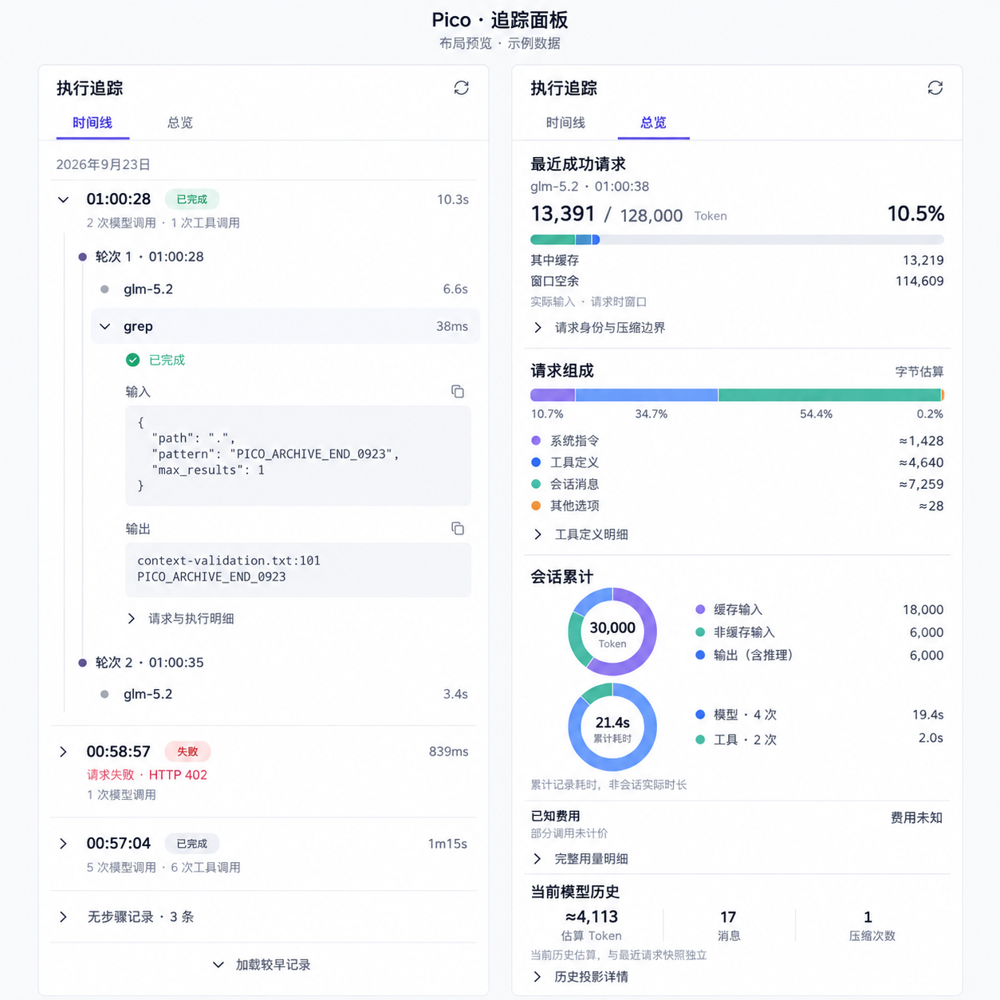
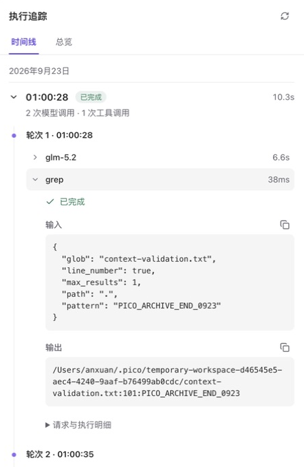
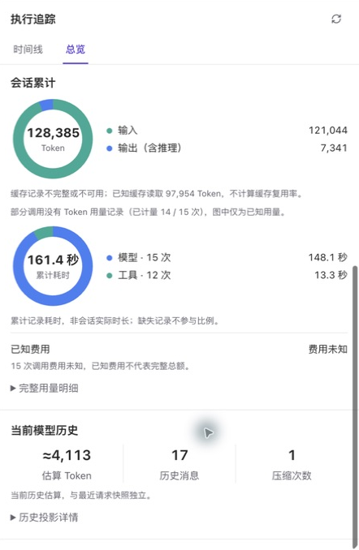

# 追踪面板

追踪面板分为“时间线”和“总览”，默认打开时间线。两个页面共用已有 Runtime 查询和资源变更订阅；切换页签、折叠运行、展开步骤只改变 Renderer 状态。

## 时间线

最新的非空运行和正在执行的运行默认展开，较早运行默认折叠。运行内保留真实的轮次和步骤归属，名称位于左侧，耗时和重试次数位于右侧。失败、取消、中断及权限决定有明确文字，不只靠颜色表示。

点击步骤在原位置展开详情，再次点击收起。详情包含输入、输出、错误、实际用量、缓存和推理子集、首 Token 耗时、底层调用尝试及费用来源；长内容在详情内部滚动。关闭运行会收起它的步骤详情。

刷新保留手动展开状态；新运行到达时展开新运行，已完成的旧自动展开项收起。较早记录仍按页加载。成功且无步骤、无原因、无覆盖缺口的运行归入“无步骤记录”折叠组，原始记录不删除。失败、未闭合与覆盖不足的运行不会因此隐藏。

运行耗时取运行事实；步骤耗时取步骤事实。步骤时长求和只称“步骤累计”，并行步骤下不代表墙钟时长。

## 总览

总览将三个不同时间口径分开呈现：

| 区域         | 数据口径                                                   |
| ------------ | ---------------------------------------------------------- |
| 最近成功请求 | 同一次主请求冻结的身份、实际输入、当时窗口、组成与压缩边界 |
| 会话累计     | 当前会话已记录请求和工具的累计用量、累计耗时及费用         |
| 当前模型历史 | 当前有效历史的字符与媒体估算、消息数及当前压缩状态         |

最近请求的占用为实际输入除以该请求当时的窗口。缓存是输入的子集。组成按 UTF-8 字节比例展示，估算 Token 为 `ceil(bytes / 4)`，不与 Provider 实际用量混算；工具明细显示前五，其余及未命名工具的字节仍保留。

累计 Token 环图只在数据足够时绘制比例。缓存覆盖完整时拆为缓存输入、非缓存输入和输出；覆盖不完整时不计算缓存命中率，也不把已知缓存误当作完整缓存。推理属于输出。耗时环图展示模型与工具的累计记录耗时，不代表会话实际持续时间。未知和零保持不同，缺失提示不会被折叠隐藏。

手动压缩后，当前模型历史可以立即变化，而最近请求快照保持原值，直到下一次主请求成功。页签切换保留各自滚动位置和步骤展开状态；切换会话清除旧选择并回到默认时间线。

## 设计与边界

参考 Maka 的连续细线时间轴、左右对齐和常规字号，保留 Pico 的事实账本与原地详情。两页签与运行折叠是 Pico 的产品选择，并非 Maka 原有交互。

图中数值是设计示例；生产图表由当前查询结果绘制。当前桌面主题为浅色，追踪面板同时支持宿主显式指定的深色样式，不改变系统主题。

## 实际界面与验证

见[测试与桌面验收记录](inspector-panel-validation.md)及[视觉对照](../../design-qa.md)。
