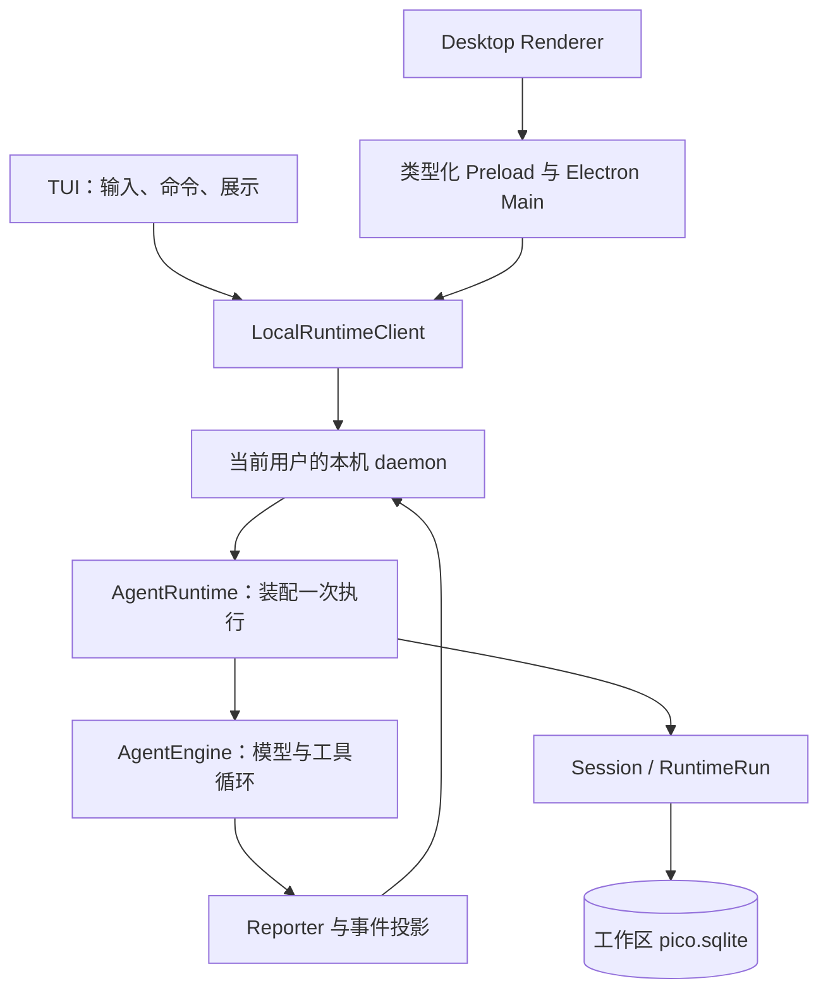
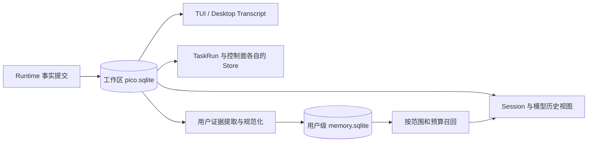
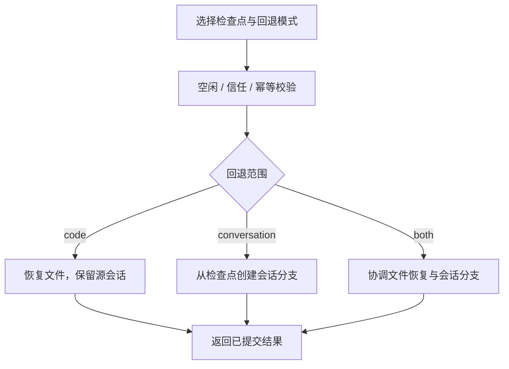

# 从一句话到一次可靠执行：Pico 当前架构

> 本文按 `0092022f` 的生产代码重新编写。文件名与路径保留，方便已有链接继续使用；正文及技术流程图描述当前实现。封面仅表达 Harness 概念，不定义模块、权限或存储协议。


用户说“找到登录失败的原因并修复”，模型可以提出猜测，却不能独自保证读取的是正确工作区、修改经过授权、工具结果已经保存，或者中断后能接着做。Harness 的工作就是把这些条件变成执行机制。

Pico 把问题拆成三部分：**宿主决定环境与能力，执行内核组织模型和工具，持久事实支撑恢复与展示。** TUI 和 Desktop 是进入系统的两扇门，它们共用执行路径。

## 一、两个界面，一条本机执行链



TUI 已经是 daemon 客户端，不再在界面进程里装配 `AgentRuntime`。Desktop Renderer 经受限的类型化桥接调用 Electron Main，再进入同一个 `LocalRuntimeClient`。本机 daemon 管理执行和控制面；它不是公开的远程 Agent 服务。

这里有两种不同的边界。第一种是通信边界：协议定义可调用的方法、参数、结果与事件，Desktop 还有自己的方法白名单。第二种是事实边界：界面可以缓存消息、归并流式片段，但不能把界面缓存变成另一份 Session 真源。

入口代码见 [TUI client-repl](../../packages/cli/src/tui/client-repl.tsx)、[协议包](../../packages/protocol/src/runtime.ts)与[产品装配](../../packages/pico-host/src/agent-runtime.ts)。

## 二、一次请求如何变成一次 Run

用户提交任务后，宿主要先确定工作目录、`PICO_HOME`、会话身份、模型路线与权限。恢复已有会话时，还要读取持久设置及运行边界；子会话不能仅凭输入参数换成另一种能力。

随后，`AgentRuntime.execute` 组合 Provider、工具注册表、审批、Hook、MCP、上下文与运行服务，交给 `RuntimeRun` 和 `AgentEngine` 执行。界面状态、会话历史、一次执行和一次模型请求不能混为一谈：

| 对象            | 它回答的问题                                     |
| --------------- | ------------------------------------------------ |
| Session         | 这段连续对话是谁，保存了哪些消息和设置？         |
| RuntimeRun      | 这次执行何时开始，以完成、失败还是取消结束？     |
| AgentEngine     | 下一步请求模型、执行工具，还是收口？             |
| Provider 请求   | 本次模型调用携带什么上下文，实际用了多少 token？ |
| Transcript 投影 | 用户现在应看到哪些聊天内容和活动状态？           |

一个 Run 可以包含多个 Provider 请求；续聊仍使用原 Session，但产生新的 Run。Provider 超时不等于 Session 消失，卡片显示完成也不能替代持久终态。

## 三、循环很短，外围契约很多

下面是解释职责的概念流程，不是可复制运行的生产代码：

```text
读取当前会话的模型历史视图
→ 组装系统提示、任务与可用工具
→ 判断是否需要上下文压缩
→ 请求模型
→ 保存本步骤响应与真实 usage
→ 如有工具调用：执行、保存结果，继续下一步骤
→ 如已完成、失败或取消：记录运行终态
```

工具调用必须与对应结果保持协议配对。一个工具批次未收齐时，不能随意插入普通消息，或者从中间切掉历史前缀。运行中的用户引导也要通过受控边界进入后续上下文。

因此，可靠性主要来自循环旁边的约束：请求取消要传递到正在执行的工具，工具事实要先保存再用于后续步骤，恢复不能把半次执行伪装成成功。主循环入口是 [agent-engine.ts](../../packages/runtime/src/agent-engine.ts)，运行能力与提交由 [runtime-run.ts](../../packages/runtime/src/runtime-run.ts)管理。

## 四、模型不是直接执行工具的主体

模型输出工具名和参数，宿主决定这个调用能否真正发生。工具定义、工具可见性、调用授权与具体执行是不同层次：发现一个工具，不代表获得了它的全部权限。

Pico 通过注册表和执行链处理能力白名单、参数、安全中间件、Hook、审批与结果。调度器再根据资源访问关系决定哪些调用可以重叠执行。

例如，两次互不冲突的读取可以并行；访问同一资源并存在写入冲突时要等待。已经排队的冲突任务也会影响后来的准入，不能让后来的任务抢跑。执行完成的顺序可以不同，结果仍按模型原始调用顺序交付。对应实现是 [tool-scheduler.ts](../../packages/runtime/src/tool-scheduler.ts)。

权限同样不能只看一个模式名字。宿主先确定 managed 或 bypass 执行边界，再结合工具白名单、工作区信任、不可绕过的限制和具体安全检查。`full-access` 不会使原本未注册的工具自动出现，worktree 也不等于独立操作系统。

工具结果还有独立入口限制：**单次物理输出超过 1 MiB 时，原文不保存，写入带有分段重取建议的合成错误。** 这与“保存原文、模型先读预览”的归档机制不同。证据见 [tool-result-observation.ts](../../packages/runtime/src/tool-result-observation.ts)。

## 五、上下文增长由两种机制处理


第一种是工具结果归档投影。对于满足条件的大结果，原文仍 inline 保存在 Runtime 事件中，模型先看到有限预览和 `pico://archive/...` 地址，随后按需读取。启用它要求当前可见工具确实绑定了本会话归档 reader；地址本身不授予跨会话访问权。

第二种是历史语义摘要。自动触发依据显式配置的窗口和同路线最后接受请求的真实用量：

```text
输入 token + 输出 token + min(2 × 输出 token, 8000) >= 显式上下文窗口
```

没有显式窗口或有效 usage，就不靠本地估算假装满足主动触发条件。Provider 真正报告上下文溢出时，还有受限恢复入口；桌面手动压缩则是另一条不要求达到自动阈值的路径。

历史摘要只覆盖安全的已完成前缀。完整工具交换、当前用户图片和实时引导约束切点；有效摘要与未压缩尾部共同构成后续模型输入。摘要通过检查、检查点持久化成功之后，读取视图才切换。

模板包含 Goal、Progress、Key Decisions、Next Steps、Critical Context 五段，当前硬性校验要求其中除 Key Decisions 外的四段按序有效。结构有效并不证明每个事实都被模型保留。

原始历史不会因为语义压缩而删除；超过入口 1 MiB 上限、从未保存的物理输出则不在这个承诺之内。完整细节及配图见[上下文压缩技术详解](../pico-context-compaction-technical-guide.md)。

## 六、Session 的事实保存在 SQLite



同一个工作区的 Session、RuntimeEvent、显式 TaskRun 与控制面等 Store 共用 `pico.sqlite`，但仍通过独立 scope、类型化 API 和稳定身份表达所有权。共用一个数据库不意味着所有数据都是会话消息。

默认位置是：

```text
$PICO_HOME/                             # 默认 ~/.pico
├── config.json                        # 用户配置
├── memory.sqlite                      # 原子长期记忆
└── workspaces/<workspace-id>/
    └── pico.sqlite                    # 工作区持久状态
```

SQLite 及其事务承接当前事实存储，生产会话不再以 `session.jsonl` 和跨 JSON 文件提交保存事实；所有权租约与 owner fence 仍承担单写者协调。Session 内存与两种界面的 Transcript 都是可重建投影。

长期记忆使用独立用户库。条目的 global/workspace 范围决定内容可见性，记忆开关是所有项目共用的用户策略。提取先基于原始用户证据生成候选，再独立规范化和验证，在记忆库事务中保存内容、来源与进度。

记忆库与工作区事件库不是一个跨库原子事务。checkpoint 或 terminal 已提交、后台处理尚未完成时退出，需要靠持久边界、游标、失败范围与后续触发恢复。具体机制见[长期记忆技术博客](../pico-memory-technical-guide.md)。

## 七、Provider 可替换，但能力不能猜

当前协议身份是 `openai`、`responses` 和 `claude`；工厂通过 `AiSdkProvider` 进行协议适配。Engine 面对统一的 `LLMProvider`，协议编码、工具消息转换和响应解析由适配层完成。

模型路线同时携带端点、模型和能力信息。图片、推理档位、工具、窗口、输出预算与价格不能仅凭“OpenAI 兼容”就认定支持。能力预检、请求适配、重试、凭据轮换和计费各有职责；某一项未知时，不应把它报告为已支持或零成本。

尤其要区分三个数字：本地估算的上下文大小、Provider 实际报告的 usage，以及结合价格得到的费用。它们来源不同，不能互相替代。

源码入口：[Provider 工厂](../../packages/pico-host/src/provider/factory.ts)、[AiSdkProvider](../../packages/pico-host/src/provider/ai-sdk-provider.ts)、[能力预检](../../packages/runtime/src/capability-preflight.ts)。

## 八、子代理拥有独立历史，而非一个临时循环

配置型子任务通过 `agent_list`、`agent_spawn`、`agent_output` 选择能力、执行和回读。它有独立持久 Session/Run；新建时不会自动复制父任务整段聊天，主代理需要提供必要背景。

`agent_spawn` 当前前台等待一次子执行，不意味着工具会自动后台并行。`implementation` 使用独立 Git worktree 并返回补丁，不自动合并父工作区；共享会话的续用另有身份和运行终态检查。

子任务权限依赖宿主准入。父 managed 边界启动相应受限能力；父 bypass 可通过专用执行器传递 bypass/full-access。两种情况都保留 profile 工具白名单。手动进入子会话续聊时，统一入口恢复能力并按 profile 重建 managed 预期边界。

Agent Graph 则负责依赖图与 operator 调度。它同样保存独立执行事实，但不是配置型 `agent_spawn` 的别名。Hook agent 验证器又是内部独立路径，复用 Engine、FullCompactor 与持久子会话，且不再次挂载 Hook 服务。

这三者共享基础执行机制，但准入、控制协议和结果归属不同。详见[子智能体技术博客](../pico-subagents-technical-guide.md)。

## 九、Rewind 不是直接删掉旧聊天

当前 `rewind.apply` 区分 `code`、`conversation` 和 `both`。只恢复代码可以保留源 Session；涉及会话回退时，通过检查点创建目标会话分支，保留源会话事实，而不是将旧日志直接截断后假装没有发生过。

执行前要确认会话空闲、工作区受信，绑定幂等请求和目标身份。涉及文件时，还要使用期望指纹及恢复操作记录，处理文件副作用与会话分支之间的失败窗口。



文件历史服务用于记录受控修改；Rewind 不会替代 Git 的分支协作，也不是对外部系统副作用的通用撤销。实际契约见 [desktop-rewind-service.ts](../../packages/pico-host/src/desktop-rewind-service.ts)及 [rewind 原子性集成测试](../../tests/integration/storage/rewind-atomic-contract.test.ts)。

## 十、从目录找到真正的实现

| 位置                                   | 当前职责                                     |
| -------------------------------------- | -------------------------------------------- |
| `packages/cli/`、`apps/desktop/`       | TUI 与 Desktop 产品外壳                      |
| `packages/core/`、`packages/protocol/` | 领域身份、事件契约、本机协议                 |
| `packages/transcript-replica/`         | 客户端 Transcript 归并                       |
| `packages/runtime-host/`               | 通用本机连接、进程与传输机制                 |
| `packages/pico-host/`                  | 产品装配、Provider、工具、配置与平台适配     |
| `packages/runtime/`                    | Engine、运行能力、调度、压缩、记忆算法与策略 |
| `packages/storage/`                    | SQLite、Store、事务与持久化能力              |
| 根 `src/`                              | 四个发行进程启动入口，不存放业务实现         |

阅读时沿调用链走，比按旧目录名寻找更可靠。先看客户端如何请求，再看宿主怎样装配，最后看 Engine 与 Store 的事实提交边界。

## 十一、怎样验证这些架构判断

在仓库根目录准备构建产物后，可以运行与本文直接相关的确定性检查：

```sh
npm run build:packages
npm run check:architecture
node scripts/run-integration-tests.mjs \
  tool-scheduler-contract runtime-tool-result-contract \
  tool-result-runtime-projection rewind-atomic-contract
```

这些检查覆盖包边界、工具调度、工具结果与回退不变量，不代表真实模型在任意任务中都会作出正确判断。实际运行情况见[本轮博客核对记录](../blog-code-consistency-audit.md)。

当前公开交互是 TUI 与 Desktop；内部 headless runner 服务仓库评测，不应当作对外稳定 API。关于启动与部署使用[部署指南](deployment.md)，模型评测使用[内部 Headless 指南](internal-headless-one-shot.md)。
