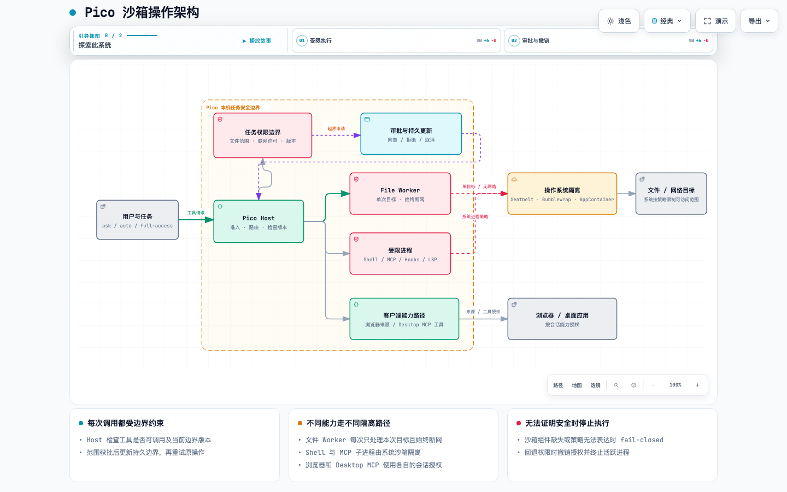

# Pico 沙箱：让 Agent 在有边界的环境里工作

> **先用一句话理解：** Pico 不会把所有操作都交给同一个“万能进程”。它先确认当前任务允许什么，再把文件、命令、MCP 和浏览器等操作送到各自的执行通道；操作系统负责限制受限进程能读写哪些位置、能不能联网。权限范围说不清、系统隔离启动失败或任务边界发生变化时，操作就会停止。

本文描述 **Pico 当前代码已经实现的沙箱行为**。这里的“沙箱”不是一个单独的软件窗口，而是 Pico 的权限判断、隔离进程、系统安全机制和审批记录共同组成的执行边界。

[查看交互式架构图](../assets/pico-sandbox/architecture.html) · [查看图源 JSON](../assets/pico-sandbox/architecture.json)

## 一张图看完整条路



读图时可以顺着中间这条线看：**用户选择权限 → Pico Host 检查当前任务边界 → 按能力分流 → 操作系统执行隔离 → 返回结果**。如果操作需要超出已有范围，Pico 会先请求批准；批准后更新带版本的任务边界，再重新执行。任务降权或结束时，Host 会撤销权限并停止相关进程。

图里的“Host”可以理解为 Pico 的调度员：它接收模型提出的工具调用，检查任务身份和权限，再决定交给哪个执行通道。它不会因为某个工具调用已获批，就把同一份授权自动送给其他工具。

## 权限模式决定什么

Pico 把“如何合作”和“能操作什么”分开管理。Plan / Research 属于协作模式；`ask`、`auto`、`full-access` 是权限模式。Plan 会把进程边界收紧为只读；Research 有自己的只读工具面，不会因为选择 `full-access` 而获得普通 Agent 的文件写入工具。

| 权限模式      | 工具调用怎样准入                                                                                             | 本机进程的系统限制                                                                             |
| ------------- | ------------------------------------------------------------------------------------------------------------ | ---------------------------------------------------------------------------------------------- |
| `ask`         | 普通读取、启动受限子代理和有界内部控制可自动进行；写文件、Shell、MCP、浏览器等按工具类别请求批准             | 受限进程默认只能访问授权工作区和临时目录，网络默认关闭                                         |
| `auto`        | 在 `ask` 的基础上，文件写入和只读 Web 查询可自动准入；Shell、MCP、浏览器操作及其他外部副作用仍按策略请求批准 | 仍是受限进程；网络不会仅因进入 `auto` 自动打开                                                 |
| `full-access` | 工具审批策略允许调用                                                                                         | Host 启动的普通进程不套 OS 沙箱，按当前操作系统用户权限运行；Pico 的 Hardline 等安全检查仍适用 |

`ask` 和 `auto` 控制的是“Host 是否需要先问用户”；系统沙箱控制的是“进程获准启动后，操作系统实际允许它碰什么”。审批通过不等于进程获得整台电脑的权限。联网也必须单独取得任务边界许可。

## 一项文件操作是怎样完成的

在受限模式下，`read_file`、`write_file`、`edit_file`、`glob`、`grep`、`explore_repo` 和 `skill_view` 通过独立的 File Worker 处理。

可以把 File Worker 想成“只拿到本次任务材料的临时办事员”：Host 为这次调用算出规范路径和目标身份，只把本次文件操作、目标和当前边界版本交给 Worker。Worker 是单次启动的隔离进程，没有任务联网许可，也没有其他业务工具的权限。

写入时有一个容易误解的细节：**File Worker 准备修改内容，但不直接把它写回工作区。** 它把结果放进临时暂存文件；Host 再检查边界版本、目标是否还是同一个文件、内容摘要和原子写入前提，最后由受信任的 Host 提交变更。这样 Worker 即使被输入诱导，也不能自行把工作区里任意路径改掉。Windows 还通过 Broker 对目标文件做精确授权和受控提交，不靠开放整个父目录来换取写入能力。

读取时，Worker 返回内容后，Host 会再次确认授权和目标身份。路径符号链接被替换、边界版本变化或 Worker 响应对不上本次操作时，读取或写入会失败关闭。若写入已派发但 Host 无法确定操作结果，系统会报告“结果未知”，不会盲目重试而制造第二次写入。

`full-access` 下，文件工具走现有 Host 执行路径，不经过受限 File Worker；这是用户选择完整访问时的权限语义。Plan 等只读边界仍会拒绝写入。

## Shell、MCP 和代码工具

| 工具路径                 | 执行方式                                      | 主要边界                                                                                    |
| ------------------------ | --------------------------------------------- | ------------------------------------------------------------------------------------------- |
| Shell / 后台命令         | Host 用 `ManagedProcessLauncher` 启动独立进程 | 受限模式下按任务文件边界和网络策略编译 OS 沙箱；后台任务使用自己冻结的策略                  |
| 本地 stdio MCP           | MCP 服务作为子进程启动                        | 继承对应任务的进程沙箱；每次物理请求仍检查当前联网授权                                      |
| 远程 HTTP / SSE MCP      | 通过网络传输访问服务                          | Host 在连接及实际请求处检查任务的联网边界；不能把审批理解为永久开放整个应用的网络           |
| LSP / ripgrep / Repo Map | 通过各自的进程或只读 Worker 执行              | 文件访问限制在只读范围；没有受限 Worker 或 OS 沙箱时不退回 Host 直接读取                    |
| 命令 Hook                | 独立命令进程                                  | 使用 Host 编译的进程策略；Hook 配置的环境变量按显式名称恢复，其余危险运行时注入变量会被剔除 |

Shell 命令可以自己读写文件，所以不能只靠 File Worker 保护文件。Pico 对 Shell 启动独立进程，并让操作系统在进程层面执行文件和网络边界；此外，高危命令还有审批与 Hardline 检查。Shell 与 File Worker 是不同通道，网络批准 Shell 不会给 File Worker 开网。

Pico 内置的 `web_search` / `fetch_url` 也与 Shell 联网不同：它们走 Host 管理的只读 HTTP 路径，重定向会重新做 DNS 固定和 SSRF 检查。不能由此推断 Bash 或 MCP 也有网络权限。

## 浏览器与 Desktop 能力

浏览器、Desktop MCP 和电脑操作不等同于 Shell 子进程。它们可能使用用户登录态或控制真实桌面，因此 Pico 以独立的“客户端能力授权”逐项控制：浏览器按网页来源（origin）授权；Desktop MCP 按服务器和工具授权；电脑操作按能力授权，并继续检查 macOS 屏幕录制、辅助功能和锁屏等系统条件。客户端能力授权和 Shell 的任务网络开关分别保存、分别撤销。

受限任务中的浏览器跨来源跳转，或页面在操作前变成另一个来源，都需要重新检查授权。Desktop MCP 在连服务器和调用工具前重新检查授权；连接按调用创建和关闭，避免任务权限回退后留下可继续使用的旧连接。客户端授权会绑定任务、工作区和权限版本；权限变化后，旧授权不复活。

## 系统怎样实际拦住进程

Pico 会按操作系统选择原生隔离能力：

| 系统    | 使用的机制                          | 直观理解                                                       |
| ------- | ----------------------------------- | -------------------------------------------------------------- |
| macOS   | Seatbelt（通过系统 `sandbox-exec`） | 给进程加载一份“默认拒绝、逐项放行”的规则                       |
| Linux   | Bubblewrap                          | 让进程进入独立的挂载和进程命名空间，只呈现获准的文件系统视图   |
| Windows | AppContainer Broker                 | 给目标进程受限身份和精确文件 ACL；子进程由 Job Object 一并管理 |

这里的“默认拒绝”指受限配置没有写明可以做的事，就不授予相应系统能力。Pico 会清理受限进程的环境变量，重写 home、临时目录和缓存位置；运行时只恢复明确允许传入的工具配置。危险的动态库和运行时注入变量会被移除。

如果系统没有可用的沙箱组件、校验摘要不匹配，或当前权限组合无法被 OS 策略准确表达，受限进程就不会启动。系统不以“去掉沙箱、照常运行”作为备用方案。

## 联网许可的边界

联网是任务执行边界的一部分，保存在 Session 中并带有版本号。模型可以通过 `request_sandbox_boundary` 申请增加精确文件范围或进程联网；用户批准后，Host 检查申请仍基于当前版本，更新持久边界，刷新文件、进程和 MCP 执行路径，再允许重试。

Windows 受限进程联网需要两道系统准备：给任务进程加入外网和专用网络 capability，以及为任务自己的 AppContainer 身份准备回环例外。首次开通时会请求一次管理员确认。Pico 使用任务专属身份和短生命周期辅助进程，不安装常驻特权服务；准备状态缺失或辅助进程失效时，网络进程拒绝启动。任务撤销时先阻止新进程、结束活跃进程，再清理回环例外。File Worker 永远不接收联网凭据。

Windows 每次开机还需要管理员预先准备 `NUL` 设备访问规则，这是受限进程标准流重定向所需的系统准备。以管理员 PowerShell 在 Pico 仓库目录运行以下命令，再启动 Pico：

```powershell
& ".\resources\sandbox\win32-x64\pico-appcontainer-host-prep.exe" prepare-null-device --json
& ".\resources\sandbox\win32-x64\pico-appcontainer-host-prep.exe" verify-null-device --json
```

这个准备步骤只调整 Windows 的 `\Device\Null` 安全描述符，不授予系统盘根目录访问权，也不修改系统盘根目录 ACL。首次为某任务开通回环联网时另有一次 UAC 管理员确认；正常任务撤销会自动移除例外。若任务辅助进程意外崩溃，系统不会再使用该任务身份；管理员可按进程提示运行 `pico-appcontainer-host-prep.exe recover-task-network --profile-name NAME` 清理遗留例外。详细的 Windows 环境和验收步骤见[Windows 构建与验收指南](windows-validation.md)。

## 权限变更、取消和故障时会怎样

任务边界有单调递增的 revision（版本号）。每个工具和受限进程都绑定启动时的边界版本。一次审批完成时，Host 会串行检查版本并持久化新边界；如果等待期间权限已变化，就返回冲突，不拿旧批准覆盖新状态。拒绝或取消则保持原边界。

从 `full-access` 切回受限模式时，Host 建立新的默认受限边界并更新版本，同时撤销客户端授权、阻止旧联网进程继续启动并终止活跃进程。任务结束也会清理运行中的执行资源。所有审批状态和运行结果都不能替代操作系统本身的权限检查。

常见安全失败包括：

- File Worker / Bubblewrap / Seatbelt / Windows Broker 不可用：受限调用失败，不绕过隔离。
- 目标路径或符号链接在执行期间变化：目标身份校验失败，不提交写入。
- 写入已派发但结果不明确：标记结果未知，不自动重复写入。
- Windows 联网准备或任务凭据缺失：联网进程不启动，任务边界不显示已成功开网。
- 浏览器来源或 Desktop 能力授权过期：重新询问用户后才能继续。

## 边界与已知限制

- `full-access` 是明确的高权限模式：普通 Host 子进程按当前操作系统用户权限运行。它仍受 Pico 工具准入与 Hardline 规则约束，但不是 OS 沙箱。
- 沙箱限制的是 Agent 可触发的进程和工具路径，不会把整台主机变成虚拟机；用户自己启动的其他应用不属于当前任务边界。
- 工具审批、Session 授权和 OS 进程权限解决的问题不同。一次工具获批不会自动扩大文件系统权限、给其他工具开网或授权 Desktop 客户端能力。
- 不同平台的原生机制不完全相同。对 OS 无法准确表达的策略，当前实现选择拒绝启动；平台验证状态见[Windows 验收指南](windows-validation.md)及 CI 工作流。
- Bubblewrap 是独立的第三方程序，随 Pico 包含其许可证、对应源码、来源摘要和构建脚本；其许可说明见[第三方声明](../../resources/licenses/THIRD_PARTY_NOTICES.md)。其他沙箱策略与 Windows Broker 是 Pico 基于公开操作系统接口实现的代码。

## 源码入口

| 主题                      | 入口                                                                                                             |
| ------------------------- | ---------------------------------------------------------------------------------------------------------------- |
| 权限边界模型              | [`packages/core/src/permission-profile.ts`](../../packages/core/src/permission-profile.ts)                       |
| 受限进程策略编译          | [`packages/pico-host/src/runtime-process-sandbox.ts`](../../packages/pico-host/src/runtime-process-sandbox.ts)   |
| 原生后端和沙箱启动计划    | [`packages/pico-host/src/process-sandbox/backend.ts`](../../packages/pico-host/src/process-sandbox/backend.ts)   |
| File Worker 与 Host 提交  | [`packages/pico-host/src/file-worker-tool.ts`](../../packages/pico-host/src/file-worker-tool.ts)                 |
| File Worker 单次执行入口  | [`packages/pico-host/src/file-worker-main.ts`](../../packages/pico-host/src/file-worker-main.ts)                 |
| 浏览器 / Desktop 会话授权 | [`packages/pico-host/src/client-capability-grants.ts`](../../packages/pico-host/src/client-capability-grants.ts) |
| Desktop MCP 独立执行器    | [`apps/desktop/src/main/desktop-mcp-executor.ts`](../../apps/desktop/src/main/desktop-mcp-executor.ts)           |
| Windows 本机验证步骤      | [`docs/guides/windows-validation.md`](windows-validation.md)                                                     |

## 官方系统参考

- [Microsoft：实现 AppContainer](https://learn.microsoft.com/en-us/windows/win32/secauthz/implementing-an-appcontainer)
- [Microsoft：Windows 应用回环配置](https://learn.microsoft.com/en-us/windows/security/operating-system-security/network-security/windows-firewall/troubleshooting-uwp-firewall)
- [Pico 的 Bubblewrap 来源、许可证和打包校验](../../resources/licenses/THIRD_PARTY_NOTICES.md)
