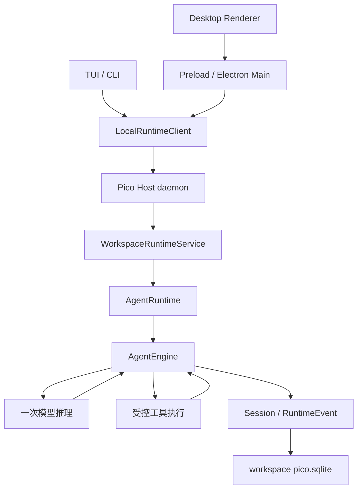

# 第 0 章 · 为什么自己写一个 Agent Harness？

> 当前实现教程：按代码 `0092022f`（2026-09-21）重写。保留原路径以兼容已有链接。

> 本章基于提交 `0092022f` 的当前仓库实现重写；`history/course/` 路径保留系列链接，正文不再描述早期版本。示意图用于解释职责，真实边界以链接的源码和包契约为准。

让模型回答“这个函数有什么问题”，只需要一次请求。让它找到问题、修改代码、运行验证，并在中断后继续工作，需要另外一套系统。这套系统必须决定：模型能看到什么、工具什么时候可以执行、哪些状态必须保存，以及失败后如何解释已经发生的事。

pico-harness 的学习价值就在这里。我们可以沿着一条真实的执行路径，观察模型之外的工程机制怎样配合。自己写 Harness 的理由不是证明其他框架不行，而是把这些决定放在可检查、可修改、可验证的代码里。

## 从一个具体任务出发

假设用户提出：“读取项目配置，修复一个类型错误，再运行相关测试。”模型可能先调用 `read_file`，然后 `edit_file`，最后 `bash`。这三次调用看起来很简单，却隐含了几类不同的问题。

读文件时，要限制资源消耗并保留可定位的行号。改文件时，要避免覆盖读取后已经发生的外部修改。运行测试时，要处理取消、超时和真实子进程的退出。工具结束后，要保证结果对应正确的调用，并且恢复会话时还能解释这段历史。

这些问题不能都塞进 System Prompt。Prompt 能提醒模型先读后改，却不能让文件发布变成原子操作；模型说“已停止”也不能证明 Shell 子进程已经退出。因此我们把策略、执行和持久化分开，让每一层负责自己能兑现的保证。

## 一条任务怎样穿过系统

公开产品有 TUI 和 Desktop。两者共用本机 daemon 和同一套执行装配，界面不会各自维护一份模型执行引擎。



在 [TUI 客户端入口](../../../packages/cli/src/tui/client-repl.tsx) 中可以找到 `LocalRuntimeClient`；在 [AgentRuntime](../../../packages/pico-host/src/agent-runtime.ts) 中可以沿着装配继续进入 [AgentEngine](../../../packages/runtime/src/agent-engine.ts)。这条链路让显示方式与执行方式分离：TUI 处理终端交互，Desktop 处理窗口、面板和系统集成，daemon 负责运行生命周期与持久状态。

本机 daemon 是当前 OS 用户边界内的服务。这个设计不能自动推导为多租户服务或公开远程 API。内部 Headless Runner 用于评测和自动化验证，具体契约见[内部运行指南](../../guides/internal-headless-one-shot.md)。

## 三种状态，不能混在一起

理解 Harness 时，最容易把“模型记住的内容”当成“系统保存的事实”。当前实现明确区分它们。

| 状态           | 用途                                     | 当前落点或所有者                            |
| -------------- | ---------------------------------------- | ------------------------------------------- |
| 会话与执行事实 | 记录消息、运行、工具调用以及状态变化     | 工作区 `pico.sqlite` 中的 RuntimeEvent 等表 |
| 模型请求视图   | 为这一次推理提供预算内、协议有效的上下文 | Runtime 读取投影与压缩逻辑                  |
| 跨会话长期记忆 | 保存筛选后的可复用知识                   | 用户级 `$PICO_HOME/memory.sqlite`           |

[SQLite 工作区存储](../../../packages/storage/src/sqlite/sqlite-workspace-storage.ts) 管理工作区事实；[原子记忆宿主](../../../packages/pico-host/src/atomic-memory-runtime.ts) 解析独立的记忆数据库路径。长期记忆不是另一份聊天日志，模型请求里的摘要也不能替代原始执行事实。

这种区分直接影响排错。例如模型没有在上下文里看到某个旧工具结果，并不意味着工具没有执行；应先查 canonical 事件，再检查读取投影为什么裁剪或摘要了它。反过来，屏幕上出现流式文字也不意味着整个 Run 已成功提交。

## 为什么不再坚持“四个工具就够了”

读、写、改、执行仍是理解工具系统的好入口，但当前工具面还包括搜索、计划、目标、子代理、Graph、记忆和外部连接。真正需要控制的是每次请求暴露多少定义，以及哪些能力在当前宿主和权限下确实可用。

[工具 Surface](../../../packages/runtime/src/tool-surface.ts) 声明分组与宿主支持；[ToolDisclosure](../../../packages/runtime/src/tool-disclosure.ts) 为一次执行维护激活集合，并为每个模型步骤生成稳定快照。某个工具已经注册，不等于它已经向模型披露；已经披露，也不等于执行时可以绕过权限检查。

这使得工具数量与单次请求的复杂度可以分开治理。新增一个连接器不必把它全部 Schema 永久塞进每个请求，也不能因为工具能被搜索到就自动获得访问权。

## 包边界怎样帮助我们做决定

当前代码以 workspace 包划分职责，根 `src/` 主要保留进程入口。

| 区域                                               | 应当承担的决定                               |
| -------------------------------------------------- | -------------------------------------------- |
| `packages/core`                                    | 消息、身份、能力和事件契约                   |
| `packages/storage`                                 | SQLite、事务、持久化与恢复基础设施           |
| `packages/runtime`                                 | 推理循环、预算、上下文、工具调度与策略       |
| `packages/runtime-host`                            | 通用本机进程、连接和传输机制                 |
| `packages/pico-host`                               | Pico 产品装配、配置、凭证、具体工具及 daemon |
| `packages/protocol`、`packages/transcript-replica` | 客户端协议与可重建会话副本                   |
| `packages/cli`、`apps/desktop`                     | 交互与展示                                   |

[根架构文档](../../../ARCHITECTURE.md) 解释完整依赖关系。这个划分的意义不是多几个目录，而是让变化有明确归属。例如新增 Provider 协议应修改宿主适配器，不应让 Engine 到处判断厂商；修改终端布局不应改变 Session 的事实格式。

同样，当前使用 AI SDK 完成模型协议适配，但 Pico 仍保有工具执行、权限、重试与会话持久化。依赖库承担它擅长的部分，Harness 保持自己必须控制的执行语义。

## 可恢复与安全是具体机制

Session 写入需要受运行身份、串行化和持久化边界约束。工具写文件采用发布前检查与原子发布；并行工具按资源访问冲突调度；可写子任务使用独立 worktree。这些机制分别处理不同范围的竞争，不能互相替代。

权限也不是一个布尔值。Workspace Trust 决定是否接纳项目级能力；Hardline 处理不可绕过的高危边界；Plan 和执行边界限制工具能力；普通权限请求才进入相应审批流程。主会话的完全访问权限仍受当前 OS 用户权限约束，工作目录本身不构成 OS 沙箱。

接下来的章节会逐一拆开这些机制。阅读时始终追问三个问题：状态由谁拥有，失败如何被观察，恢复时靠什么事实判断下一步。

## 从仓库验证，而不是相信示意图

在满足根 `package.json` 的 Node 版本要求并安装依赖后，可以从仓库根目录运行：

```bash
npm run check:architecture
npm run dev
```

第一条检查当前包边界；第二条通过已有生命周期构建依赖并启动交互式 TUI。启动后配置或选择可用模型路由，再提交一个只读任务。应观察到连续的 Session、模型响应与工具活动，而不是把任务作为 `pico "任务"` 的位置参数启动。

架构检查不能证明模型答对了，启动成功也不能证明恢复与工具安全全部正确。本系列会为各机制提供更聚焦的测试入口，明确区分本地确定性验证与真实模型验证。

[下一章：让它学会呼吸 →](01-breathing.md)
