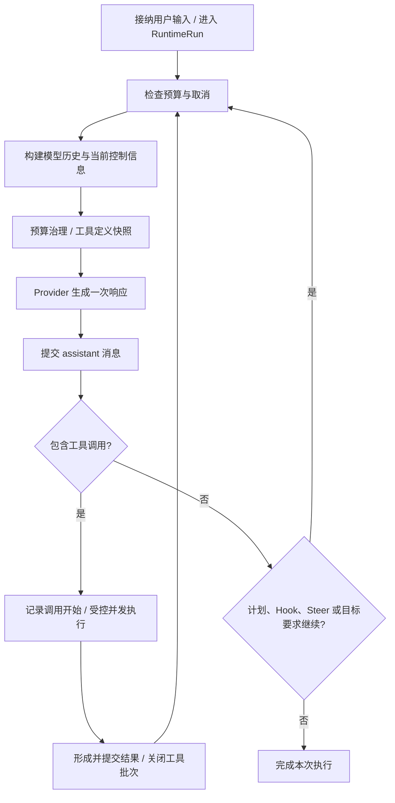

# 第 1 章 · 让它学会呼吸：一次推理怎样变成连续执行

> 当前实现教程：按代码 `0092022f`（2026-09-21）重写。保留原路径以兼容已有链接。

> 本章基于提交 `0092022f` 的当前代码重写。下面的概念伪码只解释控制流，不是可直接替换仓库实现的代码；源码入口是 [AgentEngine](../../../packages/runtime/src/agent-engine.ts)。

一次模型请求只能得到一次回答。编码任务却需要反复观察世界：读文件，形成判断，修改，运行测试，再根据测试结果决定下一步。AgentEngine 把这个过程组织成循环，但真正困难的不是 `while`，而是每一步发生失败时仍能留下连贯、可恢复的事实。

## 先把一次执行分成三个尺度

Session 是连续会话，Run 是一次受控执行，模型步骤是 Run 内的一次推理。一个 Session 可以经历多次 Run；一个 Run 可以包含多次模型请求；一个模型响应又可能请求多个工具。

这三个尺度不能混用。用户继续对话时不应丢掉 Session；工具批次的并发也不表示允许同一持久 Session 同时运行两条互相修改历史的主循环。

[Engine 的 `run()`](../../../packages/runtime/src/agent-engine.ts) 会检查当前运行能力、拒绝同一 Session 的重入。已有宿主 RuntimeRun 持有正确 Session 能力时复用它；直接调用持久 Session 的路径则通过 `session.serialize()` 建立串行执行与 RuntimeEvent 边界。测试中显式选择的纯内存 Session 是另一条轻量路径，不能拿来替代产品持久化保证。

## 单阶段推理循环

当前模型一次请求可以同时返回文字与工具调用。Engine 不需要先调用一个“思考模型”，再调用一个“行动模型”；推理强度是模型路由上的参数，也不是循环阶段开关。



概念伪码如下，省略了追踪、恢复、文件历史和异常收口：

```typescript
// 概念伪码：不是仓库 API 用法。
while (budgetAllowsNextStep() && !cancelled()) {
  const request = buildBudgetedRequest(session, visibleTools);
  const response = await inferOneStep(request);
  await persistAssistant(response);
  if (response.toolCalls.length > 0) {
    await acceptToolCalls(response.toolCalls);
    const results = await executeControlledBatch(response.toolCalls);
    await persistToolResults(results);
    continue;
  }
  if (await needsContinuation()) continue;
  return finish();
}
```

“提交 assistant”出现在工具执行之前不是排版选择。只有调用意图和身份已经成为事实，后续工具结果才有可以关联的因果位置。

## 为什么必须保住工具调用的配对

假设模型同时要求读取 `a.ts` 和 `b.ts`。两次物理读取可能以任意顺序完成，但模型历史必须知道每个结果属于哪个调用。`ToolCall.id` 与结果的 `toolCallId` 共同维持这个关联，定义见 [Core 消息契约](../../../packages/core/src/message.ts)。

Engine 先提交模型响应，再记录接纳的工具调用，随后调度执行，最后提交观察结果。中间被取消或某个工具失败时，也不能随意丢掉整个结果列表：已提交的 assistant 工具批次需要有明确的关闭路径。

当前 `closeToolProtocolBatch` 与 `failToolProtocol` 处理的正是这类情况。它们区分工具开始是否已耐久记录、结果是否已形成，以及提交边界是否失败。等待执行收口也有截止时间；这能防止不响应取消的工具无限拖住 Run，但不等价于宣称外部副作用已经被撤销。

## 上下文是读取视图，不是会话的另一个真源

模型调用前会结合 Session 历史、提示词、当前控制信息和工具定义。上下文预算不足时，读取侧可以裁剪工具结果视图或摘要旧历史；持久事实不应因为某次请求太长就被覆盖。

工具定义也有生命周期：一次 Engine 执行绑定可用工具集合，渐进披露在这个集合内激活能力，每个模型步骤取得快照。执行结束后封闭该次披露状态，下一次执行不盲目继承旧激活集合。这既限制 Schema 成本，也避免并发执行意外共享可变披露状态。

详细机制分别位于 [ToolDisclosure](../../../packages/runtime/src/tool-disclosure.ts) 与[上下文压缩技术图解](../../pico-context-compaction-technical-guide.md)。学习循环时只需要先记住：一次模型请求是从当前事实构造出来的视图，不是把任意内存数组无限追加后直接发送。

## “没有工具调用”为什么不总是完成

最小 Demo 常把 `toolCalls.length === 0` 当唯一退出条件。真实执行还需要处理控制状态。

Plan 模式下，模型只说“计划好了”却没提交计划，不能视为规划成功；代码会请求有限次数的续接。Stop Hook 可以提出继续，宿主也可以给出续接决定。用户在最后一次模型请求期间送入的 Steer 必须在真正停止前消费，不能泄漏到下一次无关任务。处于活动状态的 Goal 还会参与继续或停止的判断。

此外，空响应也不是完成。网关返回成功状态，却没有任何可用文字或工具调用时，应产生可诊断失败。[空模型输出回归测试](../../../tests/integration/engine/empty-model-output-fail-loud.test.ts) 同时覆盖空响应失败和普通非空回答成功，防止系统把“什么都没做”显示为成功。

这些判断意味着 `finish` 是生命周期决策，而不是单纯看最后一条字符串是否存在。

## 预算与取消怎样进入循环

预算限制轮次、Token、成本或时间消耗。耗尽时，Engine 可以尝试一次受限收尾调用，让模型概括已经完成和未完成的工作。当前 Grace Call 会禁止工具执行；能可靠保留 Schema 同时禁用工具的 Provider 使用该能力，否则退到空工具集。即使模型仍返回工具调用，也不能因此重启行动。

取消信号则沿 Engine、Provider 与工具执行传播。Provider 的网络超时和整次 Run 的预算不是一回事：某次请求超时可能进入受限重试，用户取消则应尽快终止当前链路。普通网络重试也不能解决上下文过长；overflow 会交给专门的上下文治理路径。

流式增量通过 Reporter 送到宿主展示。增量帮助用户感知进度，最终的消息与工具事实仍由执行链提交，不能用终端渲染内容反向充当会话事实库。

## 用两个回归检查理解边界

在已安装依赖、使用项目支持的 Node 版本时，从仓库根运行：

```bash
npm run check:storage
npm run build:packages
node --import tsx --import @pico/cli/tui/preload-env --test \
  tests/integration/engine/empty-model-output-fail-loud.test.ts \
  tests/integration/engine/engine-runtime-port.test.ts
```

第一组测试检查空输出不能静默成功；第二组检查 RuntimePort 保持 canonical run 与嵌套工具上下文，以及持久 Session 缺少显式运行端口时拒绝提交。它们使用本地测试替身，不需要真实模型，也不证明模型能够正确完成复杂编码任务。

阅读下一章时，可以把 Provider 看成这个循环的一次外部推理操作：Engine 决定何时调用、怎样继续，Provider 负责把这一次请求正确翻译给目标模型。

[下一章：接上不同的大脑 →](02-provider.md)
