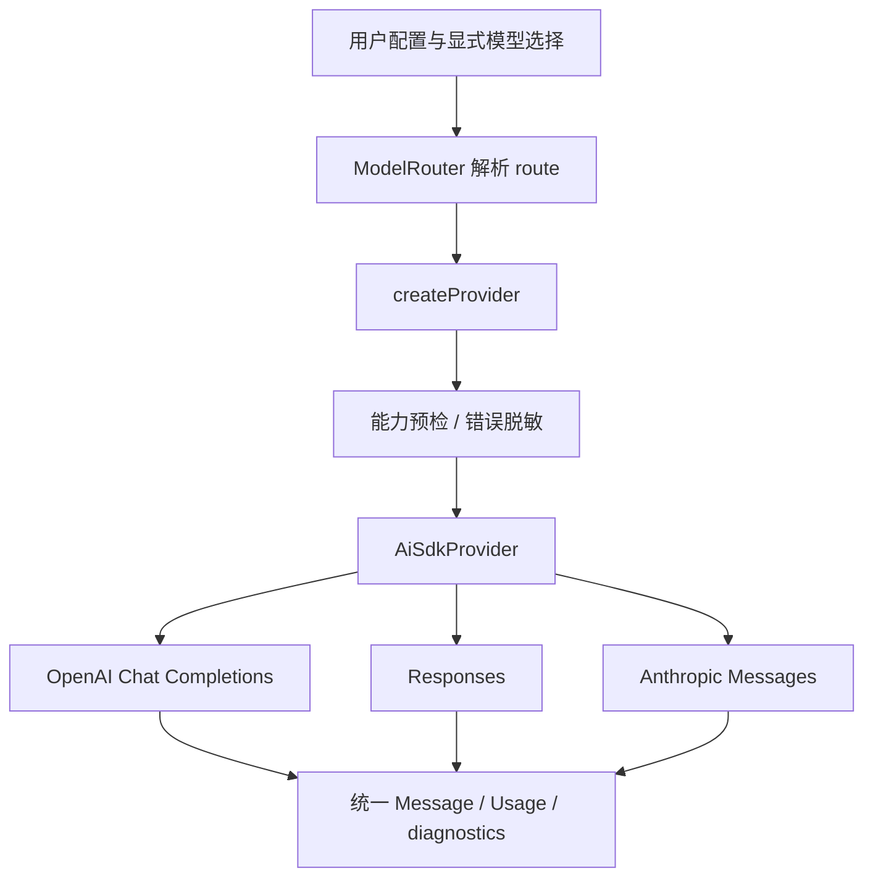

# 第 2 章 · 接上不同的大脑：Provider、路由与协议边界

> 当前实现教程：按代码 `0092022f`（2026-09-21）重写。保留原路径以兼容已有链接。

> 本章基于提交 `0092022f` 的当前实现重写。Provider 真实实现位于 `packages/pico-host/src/provider/`，统一契约位于 Core；示意链路不是额外的 SDK 接口。

引擎不应该知道某个厂商把工具结果放在 `tool_result` block，还是 `role: tool` 消息里。它需要一个稳定操作：给定消息与工具定义，获得一次模型响应。但“稳定接口”不意味着隐藏模型的全部差异。上下文窗口、推理档位、缓存和原生工具能力都会影响请求能否执行，必须显式传到正确的边界。

## 统一的是一次推理，不是整个 Agent

[Core 的 `LLMProvider`](../../../packages/core/src/provider-interface.ts) 要求 `generate`，并允许流式、错误分类和请求能力扩展。下面是删去注释及部分成员的真实接口节选：

```typescript
interface LLMProvider {
  generate(
    messages: Message[],
    availableTools: ToolDefinition[],
    options?: LLMProviderRequestOptions,
  ): Promise<Message>;
  generateStream?: (
    messages: Message[],
    availableTools: ToolDefinition[],
    onDelta: (delta: string) => void,
    options?: LLMProviderRequestOptions,
  ) => Promise<Message>;
}
```

请求选项包括宿主取消信号、单次超时、输出 Token 上限、禁止工具调用、缓存相关信息、推理增量回调和无凭证请求准备回调。它们不是随意添加的便利参数：取消决定请求能否停下来，输出上限影响预算，`toolChoice: "none"` 让收尾调用不能继续执行工具。

可选能力未声明时，调用者必须按不支持处理。例如不能假设所有“OpenAI 兼容”端点都支持保留工具定义同时可靠禁止调用。

## 当前使用一个 AI SDK 适配器接三种协议

[Provider 工厂](../../../packages/pico-host/src/provider/factory.ts) 将 `openai`、`responses`、`claude` 都交给 [AiSdkProvider](../../../packages/pico-host/src/provider/ai-sdk-provider.ts)。对应的是 Chat Completions、Responses 与 Anthropic Messages 三种线协议，不是三家固定模型厂商。



适配器使用 AI SDK 的 `generateText`、`streamText` 和协议客户端，但本地工具定义没有绑定 SDK `execute` 函数。源码中的注释明确说明：**一次模型步骤而已，工具、权限、重试和会话持久化由 Pico 管理。**

这个限制防止出现第二套隐式 Agent 循环。如果 SDK 在内部自动执行工具，Pico 就无法保证自己的权限链、文件历史和 RuntimeEvent 顺序覆盖每次真实副作用。

服务端原生工具另有明确分支。例如已配置且协议匹配的 `web_search` 可以在模型服务端执行；这不表示本地 `bash` 或文件工具也由 Provider 执行。

## 模型名称与模型路由不是同一个东西

“使用某个模型”至少需要确定 Provider 身份、端点、协议、模型标识、凭证与能力配置。仅凭一个模型名无法消除同名模型来自不同网关的歧义。

[ModelRouter](../../../packages/pico-host/src/provider/model-router.ts) 优先解析精确路由；仅在模型名唯一匹配时才接受简写。产品操作最好使用 `providerID/modelID`。没有路由时明确提示配置用户级 `$PICO_HOME/config.json`，或显式使用导入环境配置的入口；不是任意设置一个 `LLM_*` 变量就自动创建路由。

[有效模型装配](../../../packages/pico-host/src/provider/effective-model-runtime.ts) 统一服务 TUI、Desktop 和其他宿主运行。凭证解析与模型配置解析分开，secret 不应该出现在可投影的模型目录、运行事件和日志中。Provider 工厂只消费已经解析的显式配置，不自行猜环境变量或自动选择备用模型。

因此路由解析失败要修复配置；协议不匹配要修复协议选择；不能用“悄悄换一个模型”掩盖问题。一次运行实际使用了哪个模型，是结果可追溯性的组成部分。

## 消息转换不仅是改字段名

[消息编解码](../../../packages/pico-host/src/provider/ai-sdk-messages.ts) 处理文本、工具调用、工具结果与协议相关数据的转换。尤其要维护调用 ID 的对应关系：工具参数进入 Pico 时采用统一结构，发送到目标协议时再变成协议要求的字段。

流式响应也必须最终产生同一个 `Message` 契约。文字增量用于展示，reasoning 增量通过单独回调传出，不能混进最终回答正文。Usage-only 响应片段仍可能携带有效计费信息，不能因为没有文字就全部丢弃。

“接口统一”的验收标准不是 TypeScript 编译通过，而是同一条消息链经过不同协议转换后，工具身份、结果、可展示正文和用量信息都保留正确含义。

## 能力预检与输出预算

工厂在具备路由能力配置时包裹 `CapabilityPreflightProvider`，让不支持的请求在本地被发现。推理强度由模型能力档位协调，不是向所有协议统一写入一个固定参数。

`AiSdkProvider` 还校验单次输出预算必须为正整数，并把请求预算与路由上限结合。协议请求准备和最终输出预算收口在同一条路径执行，避免 reasoning patch 意外抬高输出上限。OpenAI Chat 与 Responses 的请求策略通过 [OpenAIRequestPolicy](../../../packages/pico-host/src/provider/openai-request-policy.ts) 处理。

输入窗口与输出上限共同决定一次请求的可行性。只限制模型输出长度，不会让过大的输入自动变合法；只在 Engine 估算 Token，也不应免除 Provider 侧的实际请求字段约束。

## 重试、轮换、切模型要分别理解

[Runtime 重试](../../../packages/runtime/src/provider-retry.ts) 使用有界尝试和可取消退避。当前默认 `maxAttempts` 为 3，表示最多三次尝试，不是初次调用之外再重试三次；超时重试另有上限。

限流可以通知宿主轮换同一路由的凭证候选。错误绑定实际失败的 Provider、凭证和路由身份，避免较晚返回的 429 把已经换上的新凭证误判为限流。普通重试和凭证轮换都不等价于切换模型。

`ContextOverflowError` 则需要向外交给上下文治理。重复发送相同的超长输入不会让它变短；应该调整读取视图，而不是把所有 HTTP 错误都当网络抖动。

取消与超时也分开：Core 的 `providerRequestSignal` 合并宿主信号和单次硬超时，默认请求超时为 120 秒。这是墙钟请求超时，不是“只要流式还有字就无限延长”。

## 缓存与计费必须保留未知状态

Prompt Cache 的收益取决于端点、模型、稳定前缀和实际命中情况，不能给出一个适用于全部请求的固定节省比例。适配器负责正确表达缓存策略，Usage 和计费层负责解释实际回报。

同样，服务端没上报某个字段不等于该项消耗为零。[计费契约](../../../packages/runtime/src/pricing.ts) 支持估算、套餐包含及未知状态；[目录价格解析](../../../packages/pico-host/src/catalog-pricing.ts) 提供宿主价格来源。比较模型成本时应先确认计费字段与价格来源完整，再比较数字。

## 如何检查协议适配没有越界

以下是仓库中的确定性集成测试入口，使用本地 HTTP fixture 或测试替身，无需真实模型密钥：

```bash
npm run check:storage
npm run build:packages
node --import tsx --import @pico/cli/tui/preload-env --test \
  tests/integration/provider/ai-sdk-provider.test.ts \
  tests/integration/provider/unified-provider-protocols.test.ts \
  tests/integration/provider/provider-retry-current-errors.test.ts
```

[统一 Provider 协议测试](../../../tests/integration/provider/unified-provider-protocols.test.ts) 从配置、RPC 到实际请求记录检查模型级协议路由；[AI SDK 适配测试](../../../tests/integration/provider/ai-sdk-provider.test.ts) 聚焦通信契约。它们证明适配行为，不证明某个真实模型服务当前可用或回答质量足够。

Provider 接好后，引擎可以取得工具调用意图。下一章处理真正跨入文件系统和进程的那一步。

[下一章：教它用工具 →](03-tools.md)
