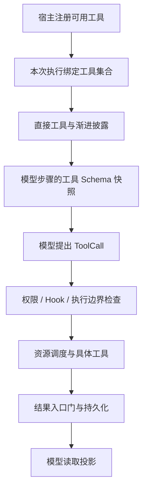

# 第 3 章 · 教它用工具：从模型意图到受控副作用

> 当前实现教程：按代码 `0092022f`（2026-09-21）重写。保留原路径以兼容已有链接。

> 本章基于提交 `0092022f` 的当前实现重写。代码链接指向正式 workspace 包；概念例子用于说明调度与边界，不是工具调用成功的运行记录。

模型返回 `edit_file` 只是一段意图。工具系统必须把它转换成参数校验、权限判断、资源访问、物理操作和可恢复结果。真正的设计目标是：每次执行都能回答“谁请求了什么、在哪个边界允许、实际发生了什么”。

## 工具接口为什么比一个函数多

[BaseTool](../../../packages/pico-host/src/tool-registry-contract.ts) 的基础仍然很直观：给出名称、Schema，并接收 JSON 参数执行。但当前契约还可以描述只读性、资源访问、文件副作用、恢复策略、嵌套执行等属性。

下面是概念化节选，不是完整接口：

```typescript
// 概念伪码：省略恢复、嵌套执行和上下文等成员。
interface Tool {
  name(): string;
  definition(): ToolDefinition;
  execute(args: string): Promise<string>;
  readOnly?: boolean;
  accesses?(args: string): ResourceAccesses;
}
```

Schema 解释模型该如何调用；`accesses` 帮助调度器判断能否并行；副作用与恢复声明支持执行收口；权限分类支持准入。这些属性解决不同问题，不能因为 `readOnly` 为真就推导“没有资源消耗、不会泄漏数据、任何宿主都可用”。

[ToolRegistry](../../../packages/pico-host/src/tool-registry.ts) 负责统一分发；[默认注册工厂](../../../packages/pico-host/src/default-registry.ts) 与产品装配按依赖和运行边界提供真实工具。

## 注册、披露与执行是三道不同的门

当前工具不止 read/write/edit/bash。代码搜索、计划、目标、子代理、Graph、记忆以及外部工具都有自己的适用范围。[Surface 目录](../../../packages/runtime/src/tool-surface.ts) 声明工具组、延迟披露和宿主支持，动态连接器再按宿主能力加入。



`load_tools` 与 `search_tools` 用来发现或激活扩展能力。[ToolDisclosureTurn](../../../packages/runtime/src/tool-disclosure.ts) 在一次执行内维护独立集合，按步骤生成冻结快照，并限制披露的数量与 Schema 体积。工具出现于搜索结果不等于获得执行许可，权限仍在实际调用时检查。

宿主限制也独立存在：后台运行不能假设有用户交互，Headless 使用明确支持集合。新增工具不能因为实现了接口就自动进入所有后台任务。

## 文件读取：有界、可定位、可继续

[ReadFileTool](../../../packages/pico-host/src/read-file-tool.ts) 使用授权工作区边界解析路径，并通过同一文件描述符读取普通文件，避免 FIFO 等特殊文件让读取永久卡住。普通文件的物理读取有大小上限，模型展示还有独立分页约束。

当前普通文件默认读取 500 行，最多 1000 行；单页字符上限 30,000，单行展示上限 2000 字符。这些数字描述不同层次的边界，不能用一个“最多 12 KB”笼统替代。输出保留原始行号和行尾风格信息，出现 PARTIAL 提示后应按下一页继续。

概念调用示例：

```json
{ "path": "packages/core/src/message.ts", "offset": 1, "limit": 80 }
```

如果路径是当前 Session 授权的 `pico://archive/` URI，`offset` 和 `limit` 按字符计数，而不是文件行数。普通文件读取与归档读取共享入口，但分页单位不同；工具描述会明确提示，调用者不能套用同一套行号推断。

## 写入不是直接覆盖，编辑也不能随意猜测

[WriteFileTool](../../../packages/pico-host/src/write-file-tool.ts) 与 [EditFileTool](../../../packages/pico-host/src/edit-file-tool.ts) 通过 [原子工作区文件操作](../../../packages/pico-host/src/atomic-workspace-file.ts) 发布内容。关键过程是取得目标快照、准备同目录临时文件、完整写入并同步、发布前复核，再执行原子替换。

这个机制防止把半写文件暴露给读者，并拒绝可以观察到的目标或路径替换。它不意味着工作区从此不受其他进程修改，也不等价于整个多文件任务的事务。

`edit_file` 对模型的格式误差提供四级匹配：精确匹配、换行归一化、首尾空白处理、逐行去缩进。最后一级还会根据真实文件区域重对齐替换文本的缩进。允许容错的前提是仍能定位操作范围；存在多处匹配时，需要更多上下文，或用户意图明确的 `replace_all`，不能静默挑一处。

匹配失败会给出候选提示，帮助模型重新定位。候选相似度只是下一步读取的线索，不是可以无条件覆盖的证据。发布前版本复核则处理另一种问题：即使旧文本匹配，文件也可能在准备写入期间发生变化。

## Shell 的工作目录不是沙箱

[BashTool](../../../packages/pico-host/src/bash-tool.ts) 在宿主 Shell 上执行命令，传入工作目录、受整理的进程环境和取消信号。主会话完全访问权限的作用范围仍然是当前 OS 用户；仅设置 `cwd` 不能阻止命令访问其他目录。

因此 Shell 执行同时依赖命令安全策略、权限模式和显式执行边界。需要隔离的子任务使用独立 worktree 与相应沙箱机制，不能把主会话的便利权限照搬给 worker。

执行输出也有边界：Shell 捕获缓冲有 10 MiB 上限，结果进入 Runtime 时还有独立的 1 MiB 门。前者控制子进程输出捕获，后者控制持久工具结果；两者不是同一个截断阈值。遇到大量输出，优先在命令内用筛选和分页取得所需片段。

超时或取消时需要处理真实进程收口，而不是仅让等待 Promise 返回。退出码、stderr 与取消状态共同影响结果含义；工具返回了文本不代表命令执行成功。

## 同一批工具怎样安全并行

[ToolAccesses](../../../packages/runtime/src/tool-access.ts) 表达读、写和无法精确描述的全量访问；[ToolScheduler](../../../packages/runtime/src/tool-scheduler.ts) 决定启动顺序。Engine 当前每批最大并发数为 8，结果按原模型调用顺序关联回历史。

| 同批调用                          | 资源关系         | 调度含义     |
| --------------------------------- | ---------------- | ------------ |
| 读取 `a.ts` 与读取 `b.ts`         | 不冲突           | 可以重叠执行 |
| 读取 `a.ts` 与编辑 `a.ts`         | 同路径且存在写入 | 按顺序等待   |
| 写 `a.ts` 与写 `b.ts`             | 路径不重叠       | 可以重叠执行 |
| 无法描述副作用的 Shell 与文件访问 | 保守全量访问     | 按冲突处理   |

并发控制只覆盖当前调度范围，不是跨用户、跨进程的工作区锁。因此它不能代替文件发布前检查，也不能代替可写子代理的 worktree 隔离。判断一项保障是否足够，必须同时说清它保护的是哪段时间和哪些参与者。

## 工具结果有两种不同的“变小”

[结果入口门](../../../packages/runtime/src/tool-result-observation.ts) 在原始输出超过 1 MiB 时拒绝该结果，用含有重新获取指引的合成错误替换；超限原文不保存。限内正文 inline 进入事实库，哈希描述实际保存的内容。

之后，模型读取侧可以把较大的已保存结果变成有界预览，并提供 [归档引用](../../../packages/runtime/src/tool-result-archive.ts)。此时 `pico://archive/` 回读的是账本中已经存在、受当前 Session 权限约束的正文，不是把入口拒绝的数据找回来。当前阈值常量为 `2048 * 4` 字符，按具体读取投影策略使用。

这两个阶段必须分开：入口门决定什么能成为事实；读取投影决定一次模型请求看多少。恢复建议也可以进入 Provider 可见投影，而不改变 canonical 正文的哈希语义。

## 权限链在副作用之前，报告在事实之后

执行前会检查 Hardline、Plan、信任与权限边界，并经过 Hook。Hook 改写参数后必须重新检查，不能让改写成为越过门禁的通道。普通审批也不能覆盖不可绕过的拒绝。

工具物理执行完成后还需要提交结果。用户界面、Hook 后置通知和模型观察应服从 Runtime 的提交边界，不能把“物理函数已经返回”直接当成“整个工具操作已耐久完成”。这也是工具系统需要结构化身份与恢复策略、不能只有 `Map<string, Function>` 的原因。

## 验证工具机制

从仓库根目录运行以下针对性检查；这些是验证入口，不是本文声称已经执行的结果：

```bash
npm run check:storage
npm run build:packages
node --import tsx --import @pico/cli/tui/preload-env --test \
  tests/integration/tools/tool-surface-disclosure.test.ts \
  tests/integration/tools/tool-scheduler-contract.test.ts \
  tests/integration/safety/read-file-safety.test.ts
```

它们分别检查工具披露与宿主边界、批次调度契约以及读取安全。若修改文件发布机制，应再运行 [文件写入安全测试](../../../tests/integration/safety/file-write-safety.test.ts)，而不是用一次成功的 `edit_file` 代替竞争与路径边界验证。

至此，模型提出的动作已经能经过受控执行并形成观察。下一步是把连续会话和长期知识分开，让系统知道上次发生了什么，以及哪些知识值得留给下次。

[下一章：记住上次聊到哪 →](04-memory.md)
