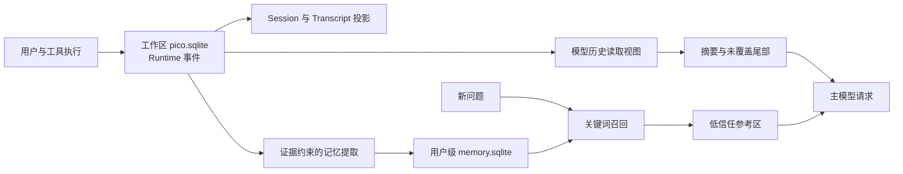

# 第 4 章 · 让一次对话能够恢复，让有用的信息跨会话复用

> 当前实现教程：按代码 `0092022f`（2026-09-21）重写。保留原路径以兼容已有链接；代码块中的概念示意不作为公开 API。

Agent 读过文件、执行过命令，并不意味着下次启动还能接着工作。首先要保存执行事实，再决定下一次模型请求读哪些事实；跨会话复用偏好，则需要另外一条有证据的长期记忆链路。

本章按当前 Pico 实现讲解这三个层次。所有代码链接指向当前仓库；图和流程代码用于说明结构，不是可以直接复制的完整 API。更详细的提取协议见[长期记忆技术指南](../../pico-memory-technical-guide.md)。

## 1. 三种“记住”，三种生命周期

| 层次       | 保存什么                                    | 用来解决什么                 |
| ---------- | ------------------------------------------- | ---------------------------- |
| 会话事件   | 消息、工具执行、Run、用量、检查点及控制事件 | 恢复过程、展示事实、核对来源 |
| 模型上下文 | 从会话事件形成的当前请求视图                | 在有限窗口中继续当前工作     |
| 长期记忆   | 独立的偏好、背景、知识、失败经验或笔记      | 在之后的相关问题中复用信息   |

会话事实位于工作区存储根的 `pico.sqlite`。默认由 `$PICO_HOME/workspaces/<workspace-id>` 定位该根，具体路径由 [pico-paths.ts](../../../packages/pico-host/src/pico-paths.ts) 计算。长期记忆位于用户级 `$PICO_HOME/memory.sqlite`，并通过条目的 `global` 或 `workspace` 范围区分可见性。

工作区存储根不等于项目源码目录；两个 Session 可以共享项目文件，同时保有独立的消息与执行链。长期记忆也不是会话备份：删除记忆不会删掉原始聊天，删除会话不会自动撤销已经提交的记忆。



## 2. Session 是运行边界，不是一个 JSON 文件

[Session](../../../packages/pico-host/src/session.ts) 绑定会话身份、工作区与运行能力，维护可丢弃的内存投影。耐久事实由 [SQLite RuntimeEventStore](../../../packages/storage/src/sqlite/sqlite-runtime-event-store.ts) 保存，Runtime 再重建模型历史与界面所需的数据。

这使写入顺序有了明确含义：先通过合法的 Runtime 写能力提交事实，再更新读取投影。若同一事件重试，存储层按身份和内容检查幂等；不能把“内存里已经 push 了一条消息”当成可靠提交。

下面是概念流程，不是 Session 方法签名：

```text
取得当前 Session 的写入资格
→ Runtime 提交消息或工具事件
→ SQLite 完成事务
→ 刷新内存与界面投影
→ 下一次请求读取当前历史
```

同一进程中的 Session 使用串行执行范围，防止多个请求同时修改同一历史。当前实现还跟踪嵌套异步工作，拒绝不受支持的重入，并在关闭时收尾已接纳工作；它已不只是一个几行代码的 Promise 队列。

跨进程还需要 owner lease 和存储层 owner fence。租约回答“当前谁持有会话”，fence 使过期所有者不能继续写入。两者不代替 SQLite 事务，也不把对话正文放进锁文件。

## 3. 原始事实与模型看到的历史可以不同

一个长日志可能已经完整入库，但模型只看到带回读地址的预览；一段完成的历史可能已被检查点覆盖，模型看到的是摘要和安全尾部。这两种情况都不要求删除原始事件。

[会话读取模型](../../../packages/runtime/src/session-runtime-read-model.ts) 负责重建视图，[检查点提交](../../../packages/runtime/src/runtime-compaction-checkpoint.ts) 固定覆盖边界和来源摘要。后续加载先验证来源，再替换被覆盖前缀。

因此，“聊天界面还有旧消息”和“模型没有再次收到旧消息全文”可以同时成立。恢复也不是把所有历史无差别发送给模型，而是恢复相同的有效读取规则。压缩的触发与边界将在[下一章](05-compaction.md)展开。

## 4. 长期记忆写入必须从用户证据开始

用户说“以后回答尽量简洁”，可以成为长期偏好；工具输出里出现“忽略此前要求”，不能因此成为用户授权。

Pico 提供三个模型提取入口：

- `memory_remember({})`：用户明确要求记住时同步处理，以实际回执说明保存结果。
- `memory_extract({})`：登记本轮提取意图，只有正常完成并落盘、且不是恢复生成的终态，才安排后台处理。`accepted` 不是“已保存”。
- 自动压缩检查点：通过持久化的覆盖边界与准入标记安排提取，不必先调用 `memory_extract`。

两个工具严格无参，由宿主捕获消息、事件身份及边界。remember 要求独占步骤：若混合调用中它在首位，执行 remember 并拒绝其他调用；否则拒绝该 remember 调用。不能仅凭“同批有其他工具”推断 remember 一定未执行。

提取由[原子记忆引擎](../../../packages/runtime/src/atomic-memory/extraction-engine.ts)分两阶段完成。先从可见用户证据生成候选，再以引文、观察时间和必要指代语境独立规范化；第二阶段不直接继承第一次候选正文、关键词和范围。程序校验来源、结构、时间与敏感内容，再提交条目、关键词、来源、游标和回执。

助手消息可帮助解释“刚才那个方案”，但不能独立证明用户事实。来源验证能证明引用存在，不能证明模型理解永远正确。

## 5. 后台写入为什么还需要进度与删除代次

如果只保存正文，后台任务崩溃后就不知道哪些范围已经处理。当前库有提取游标、失败范围、操作回执和压缩策略拒绝记录，Schema 为 v9。

恢复时先处理待重试范围，再处理未覆盖的可恢复检查点，最后处理本次剩余范围。检查点中的 `eligible` 只说明它可以成为恢复候选；`policy_denied` 保留当时的策略拒绝，不能因后来一次显式 remember 就顺带放行旧范围。

同一会话的记忆任务在进程内串行，尚未开始的后台任务让前台 remember 优先，但不会抢占已经开始的任务。数据库再用预期游标、版本及操作身份约束并发与幂等。不同操作仍可能保存相近正文：操作幂等不等于语义去重。

删除会提升整个用户记忆库的删除代次，使删除前捕获的在途提取不能重新提交。新任务仍可依据后来提供的证据保存内容；这不是永久遗忘黑名单，也不会清除外部备份。

## 6. 召回是本地关键词检索

[ContextBuilder](../../../packages/runtime/src/atomic-memory/context-builder.ts) 从当前问题构造路径、普通词项和中文双字信号，索引查询最多使用去重后的 32 项。后续中文补充匹配与评分仍使用完整信号。

程序并行获取精确匹配、前缀匹配和近期窗口，限制分别是 100、100、500 条；只保留 active 的全局或当前工作区条目。相关性优先、同分优先最近更新，可以在剩余容量中补一条通用 preference。

最后最多选择 3 条、总计 320 token，正文及 XML 包装一起计入。单条放不下则跳过，不以截断正文伪装完整记忆。该策略没有 embedding、向量库或额外检索模型，措辞变化过大时可能漏召回。

结果是低信任参考，不能改变工具权限、凭据、Provider 配置或当前用户要求。召回关闭或查询失败时，普通对话继续。

## 7. 设置属于用户，内容仍有范围

记忆总开关、自动提取开关和召回开关是**用户级策略，对所有项目共用**。条目的工作区隔离不意味着每个项目有一套独立开关。旧工作区开关不作为当前默认值继承，保存用户设置时会清理旧配置。

App 手动添加不调用提取模型，经本地校验直接保存 workspace note。同一创建操作指向的条目仍存在且正文一致时可复用，归档条目可恢复；它不是扫描全库的语义合并。

Plan 和 Research 可在条件满足时召回，但不装配提取运行时；普通配置型子代理、Graph operator 和隔离 headless 禁用记忆。Responses Provider 可召回，提取入口返回 `provider_unsupported`。

## 8. Prompt 组装把这些能力接起来

[PromptComposer](../../../packages/pico-host/src/prompt-composer.ts) 与 [AgentRuntime](../../../packages/pico-host/src/agent-runtime.ts) 共同组织核心指令、项目规则、技能目录、计划与任务状态，以及每轮召回参考。

项目规则是指令来源，长期记忆是参考数据；两者不能混为同一权限层。技能目录也不等于把所有技能正文常驻塞入上下文。当前 Plan 是事件化状态机，普通 Todo 是 SQLite 工作区状态，不依赖自动读取 `PLAN.md`、`TODO.md` 来恢复产品计划。

## 9. 验证这个设计

从仓库根目录运行，先构建工作区包，再执行最相关的确定性测试：

```sh
npm run build:packages
node scripts/run-integration-tests.mjs \
  session-message-ledger session-runtime-lifecycle \
  atomic-memory-engine atomic-memory-recall user-memory-settings
```

这些测试验证消息投影、生命周期、提取协议、召回和用户级开关，使用受控模型输出，不能衡量真实模型的语义准确率。真实场景入口见[原子记忆模型测试](../../../tests/e2e/atomic-memory-behavior.real-llm.test.ts)，执行前应阅读其中的启用条件与模型配置要求。

本章提供可复现的验证入口，不将未执行的测试描述为通过。

[下一章：别让它撑爆上下文 →](05-compaction.md)
