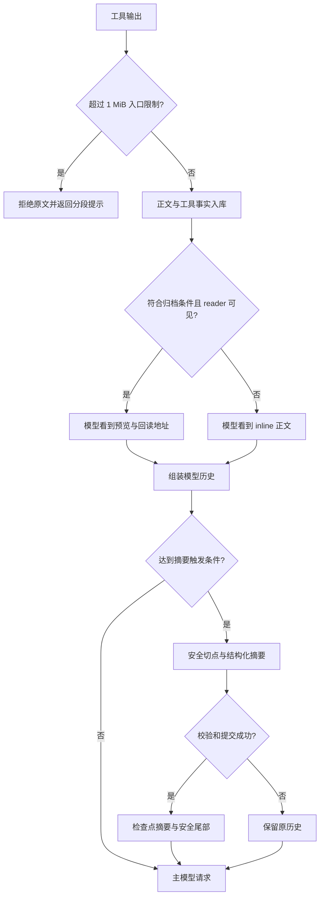

# 第 5 章 · 在有限窗口中保住工作现场

> 当前实现教程：按代码 `0092022f`（2026-09-21）重写。保留原路径以兼容已有链接；代码块中的概念示意不作为公开 API。

上下文管理的难点不是把字符串变短，而是在窗口有限时仍让 Agent 知道目标、已完成的动作和下一步该做什么。粗暴截断工具结果会丢证据，摘要掉半个工具交换会破坏协议；保存一份摘要，也不能证明它足以接替原始历史。

当前 Pico 使用两层机制：**工具结果归档投影**和**历史语义摘要**。本章讲它们的当前实现；完整边界见[上下文压缩技术指南](../../pico-context-compaction-technical-guide.md)。图和计算示例用于解释机制，不是额外的执行 API。

## 1. 先区分入口限制、归档预览和语义压缩

工具执行结果首先经过入口定形。单次结果超过 1 MiB 时，入口拒绝正文并提示分段获取；不能承诺所有超大原文都已经保存成可回读档案。

对于已经允许入库的结果，归档投影可以只向模型展示短预览，正文仍在 Runtime 事件中。模型需要细节时，使用已授权的归档 reader 回读。再往后，如果整个历史接近容量，才由模型总结安全前缀。



这三个步骤限制的是不同对象。1 MiB 是原始结果字节限制，归档门槛是序列化字符长度，模型窗口才以 token 表达。不能把它们写成同一条“80%／90%／100%”阶梯。

## 2. 归档投影：正文在库，模型按需读取

[tool-result-archive.ts](../../../packages/runtime/src/tool-result-archive.ts) 对满足条件的成功 inline 结果生成预览。关键门槛是 `JSON.stringify(body.content).length > 8192`，它是 JavaScript 字符长度，不是 UTF-8 字节数。

结果还必须处于可安全替换的全文投影状态；错误、附有额外恢复提示、已分页回读的归档结果不走同样的替换路径。当前步骤实际可见工具中必须有绑定本会话 reader 的读取能力，否则只给一个 URI 会让模型失去证据。

预览包含工具名、长度、前 500 字符、归档 URI 和读取说明。正文与投影在同一次工具结果提交中保存。归档地址形如：

```text
pico://archive/<session>/<event>/<sha256>/<bytes>
```

它定位现有事件正文，不是新的 Evidence CAS。回读验证会话归属、事件类型、哈希与字节数；知道其他会话 URI 不等于获得读取权限。

`archive_read` 支持 inspect、search、query、read。search 是不区分大小写的字面子串查询，不是正则。read 的 offset 从 0 开始；`read_file` 的归档兼容入口按字符且从 1 开始，普通文件读取则按行。默认 limit 为 4000、最高 6000，完整 JSON 响应还受 7500 字符限制。

工具被隐藏或裁剪时，归档能力会重新计算；没有 reader 的模型视图恢复 inline 正文。旧历史的读取侧归档保护最近两个 turn，先校验检查点再做投影，不改写原始来源摘要。

## 3. 自动压缩依赖显式窗口与真实用量

当前主动触发不再采用本地估算达到固定 85% 的规则。宿主只有取得用户明确声明的上下文容量，才设置 `declaredContextWindowTokens`；默认 Provider profile 不独自开启主动压缩。

判断使用最后一次已接受请求的真实 usage：

```text
baseline = inputTokens + outputTokens
reserve = min(2 × outputTokens, 8000)
触发条件：baseline + reserve >= declaredContextWindowTokens
```

例如窗口 128000，上次输入 119000、输出 3500，判断值为 129500，达到阈值。这个 reserve 是根据上次输出推算的余量，不是本次输出上限，也没有精确预言下一次工具输出的大小。

usage 锚随助手消息保存，绑定 Provider、base URL、route ID 和模型名形成的路线身份。恢复时必须匹配当前路线，不能拿旧模型的历史用量决定新模型何时压缩。

本地 token 估算仍用于切点、手动保留预算与诊断；它不是各厂商计费 tokenizer 的精确复现，更不能声称对所有模型误差小于 1%。

## 4. 手动压缩与溢出恢复是另外两个入口

桌面手动压缩不要求先达到主动阈值。保留目标是输入预算一半与历史估算一半中的较小值，最低为 1；随后仍服从安全切点，所以不是机械删除一半消息。

自动与 Provider 溢出入口使用 `targetRetainedTokens = 1`，含义是在安全约束下尽量折叠已完成前缀，不是最后只留下一个 token。

Provider 明确报告 `ContextOverflowError` 后，同一个未被接受的请求最多恢复一次：有可省略的历史工具图片则先省略图片，否则尝试历史摘要，然后重试。当前用户图片不属于可删除的旧工具图片。网络错误和鉴权错误不能泛化为上下文溢出。

成功接受一个新模型步骤后，会重新获得单步压缩及溢出恢复机会；但主动摘要失败会在本次 run 内锁存，避免不断调用摘要模型。当前“无安全切点、未产生摘要”也可能触发这一锁存。

## 5. 切点首先必须保持工具协议完整

[safe-compaction-boundary.ts](../../../packages/runtime/src/safe-compaction-boundary.ts) 寻找可折叠前缀，而不是按第 N 条消息直接切开。

它不能拆开 assistant 的工具调用及其结果，不能让保留尾部从结果中间开始，也不能把用户问题和对应回复任意分置两侧。尾部存在未完成工具交换时，先保留历史。当前用户图片及相关后续交换、任务之后到达的 steering 也受到保护。

当前任务文本可作为 `preservedAnchor` 原文附在摘要包装中，避免完全依赖摘要模型保留用户目标。Runtime 提交前还检查中断恢复历史的特殊边界是否允许覆盖。

这解释了一个容易误判的现象：历史虽然“看起来很长”，仍可能没有合法前缀可压缩。宁可返回未压缩，也不能制造工具协议断裂的请求。

## 6. 摘要必须通过结构校验

[FullCompactor](../../../packages/runtime/src/full-compactor.ts) 的提示词使用五段模板：Goal、Progress、Key Decisions、Next Steps、Critical Context。正文可以使用中文，路径、命令和错误信息应保留必要的精确文本。

硬校验只要求 **Goal、Progress、Next Steps、Critical Context 四段按顺序出现并含有效内容**；Key Decisions 在模板中，但不是必须段。校验还检查代码围栏、结尾截断迹象与模板占位内容，不能只写几个标题就通过。

首次摘要若有真实 usage，输入超过 10000 token 时，输出至少应有 200 token。滚动摘要和无 usage 情况不使用这个下限，不能靠字符数换算冒充真实用量。

摘要输出预算为 8000 token，Provider 适配器再与路线输出上限取较小值。当前实际生成不使用旧的 1500 字符裁剪。

质量修复有两个独立阶段：长度截断后可重试一次更短摘要；格式或内容缺陷后可请求一次完整替换。两个阶段可以先后发生，因此最多有三个生成阶段；每阶段的普通调用异常重试另算。取消和摘要请求本身的窗口溢出不会被当成普通异常反复发送。

程序验证的是最低结构与来源完整性，无法证明每个语义事实都没有丢失。精确标记、只读要求和关键命令需要真实模型测试另行检查。

## 7. 检查点发布之后，才切换读取视图

[recordRuntimeCompactionCheckpoint](../../../packages/runtime/src/runtime-compaction-checkpoint.ts) 读取当前历史与来源事件，生成预览，验证摘要，然后追加检查点。检查点固定 ID、覆盖事件数、终点事件 ID、来源摘要与上一检查点身份，新格式标记为 `sections_v1`。

成功提交后，模型读取视图使用“检查点摘要＋未覆盖尾部”，原始消息和工具结果继续保留。检查点不是覆盖聊天正文，也不是长期记忆条目。

下一轮压缩以“上一份有效摘要＋新增的可折叠历史”滚动生成，不把旧摘要再作为普通前缀重复发送。加载也会验证新格式与来源；旧格式保留兼容读取边界。

装配 Hook 服务的入口在提交后派发 `PostCompact`，派发失败记录诊断，不回滚已提交检查点。桌面手动入口当前未传入 Hook 服务，不能假设按钮操作必然触发这两个 Hook。

## 8. 用不变量验证，而不是用压缩率证明正确

最有价值的断言是：工具交换未被切开，当前任务仍在，失败不发布检查点，重启能读取原文，无 reader 时不遗留不可读预览。

从仓库根目录执行：

```sh
npm run build:packages
node scripts/run-integration-tests.mjs \
  maka-compaction-trigger maka-compaction-summary \
  compaction-review-fixes compaction-rolling-digest \
  archive-read-tool tool-result-runtime-projection
```

真实模型验证需要已有模型配置，并实际消耗额度：

```sh
RUN_COMPACTION_E2E=1 node --import tsx --import @pico/cli/tui/preload-env \
  --test --test-concurrency=1 \
  tests/e2e/compaction-auto-trigger.real-llm.test.ts \
  tests/e2e/compaction-quality.real-llm.test.ts
```

本章没有把命令列出等同于验证通过。确定性测试证明分支与持久化不变量；真实模型测试证明指定样本的保留行为，都不等于任意长任务不会遗忘。

入口限制见 [tool-result-observation.ts](../../../packages/runtime/src/tool-result-observation.ts)，摘要契约见 [history-compact-summary-validation.ts](../../../packages/runtime/src/history-compact-summary-validation.ts)，主动触发和溢出恢复见 [agent-engine.ts](../../../packages/runtime/src/agent-engine.ts)。

[下一章：给它装上方向盘 →](06-steering.md)
