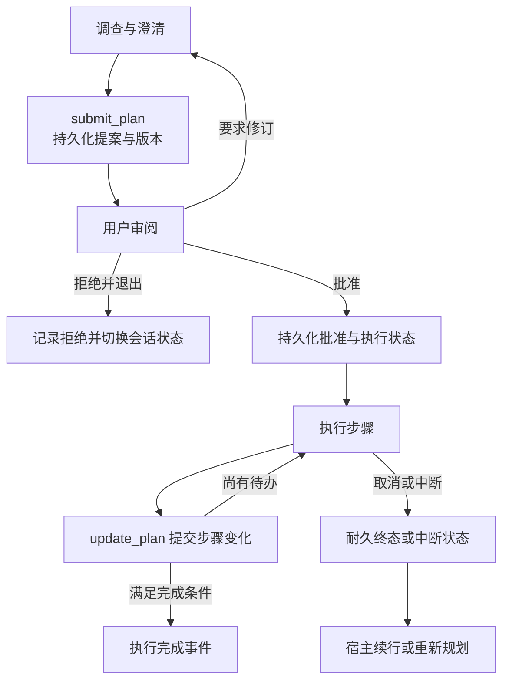

# 第 6 章 · 让计划、纠偏和停止拥有明确边界

> 当前实现教程：按代码 `0092022f`（2026-09-21）重写。保留原路径以兼容已有链接；代码块中的概念示意不作为公开 API。

Agent 有了历史和压缩，仍可能偏离目标，或在同一个错误上反复消耗工具调用。增加一句“遇到问题请反思”并不足够：计划需要耐久状态，用户纠偏需要明确的接收点，重复失败还需要程序在下一次执行前作出决定。

当前 Pico 把这些工作拆成事件化 Plan、实时 steering、Recovery 提示和工具 guardrail。本章基于当前代码说明它们如何协作，图中的状态流是教学概括；真实状态和工具协议以所链接代码为准。

## 1. 计划不是两个 Markdown 文件

计划最重要的属性不是“写出来”，而是能回答：当前版本是什么、谁审阅过、执行是否已开始、哪些步骤完成、一次重复点击是否会启动第二个执行。

Pico 当前的 Plan 是 Session RuntimeEvent 状态机，由 [PlanCoordinator](../../../packages/runtime/src/plan-coordinator.ts) 写入、[PlanReducer](../../../packages/runtime/src/plan-reducer.ts) 重建。没有运行时自动嗅探 `PLAN.md`／`TODO.md` 并将文件当成计划权威的机制。用户当然可以把文档作为任务输入，但编辑一个同名文件不会自动推进产品 Plan 状态。

Plan Mode 用于调查、澄清并提交计划。模型通过 `submit_plan` 提出结构化方案，宿主用明确的审阅与执行入口推进它。批准后的执行工具面暴露 `update_plan`、`cancel_plan`，不继续暴露用于提交新提案的同一套入口。



这张图省略了内部 claim 与恢复分支，不能把每条箭头理解为一个公开工具。尤其“用户批准”是宿主控制动作，模型生成一句“已批准”不能替代它。

## 2. 状态外部化的重点是冲突和恢复

Plan 操作带有操作身份、预期 Session 水位及计划版本。相同操作重试时，可核对语义指纹并复用已提交状态；同一个操作 ID 携带不同内容则拒绝。

这种约束处理的是实际竞态：用户在两个窗口同时操作、批准后进程退出、执行结果已提交但响应丢失。它不只防止模型忘记计划，还防止宿主把一次操作执行两遍。

步骤更新也不是界面直接改一条状态。Coordinator 先依据当前投影检查转移，写入 `plan.step.updated`；若这次更新使执行满足完成条件，则在同一提交中记录 `plan.execution.completed`。因此，之后 Provider 报错不应覆盖已经确立的完成事实。

普通 Todo 是另一个概念。[TodoStore](../../../packages/storage/src/todo-store.ts) 把清单放在工作区 `pico.sqlite` 的 `workspace_kv`，通过 [WorkspaceTodoStore](../../../packages/pico-host/src/workspace-todo-store.ts) 绑定存储根。它是工作区清单，不拥有 Plan 的批准、执行与恢复语义；不能用“Todo 已勾选”代替“计划执行已完成”。

## 3. Plan Mode 的限制必须在运行时成立

只在提示词里写“现在不要修改文件”无法构成执行边界。当前 Plan 的工具投影与 Registry 准入共同限制允许动作，宿主还控制 Hook 等可能产生副作用的路径。

协作模式与权限模式是不同轴：从 Plan 转到 Agent 不意味着自动扩大沙箱或工具权限。Plan 的批准、拒绝和恢复操作都要保持这种区分。对这些边界的集成验证见 [plan-mode-runtime.test.ts](../../../tests/integration/runtime/plan-mode-runtime.test.ts) 和 [plan-mode-host-admission.test.ts](../../../tests/integration/runtime/plan-mode-host-admission.test.ts)。

这也解释了为什么计划正文不能成为新权限来源。“方案需要运行某命令”只是计划内容，真正运行时仍要经过当前工具与权限准入。

## 4. 用户在运行中补充要求，何时被模型看到

用户说“先别提交，先看测试结果”，不应该等下一次无关任务才被处理。实时 steering 由宿主加入 [SteerQueue](../../../packages/runtime/src/steer-queue.ts)，[AgentEngine](../../../packages/runtime/src/agent-engine.ts) 在明确边界消费。

当前有三个重要时机：

1. **调用 Provider 前**：peek 队首文本，临时以带 `picoKind: steer` 标记的消息加入本次请求；这次 peek 不移除队列，也不立即当作正式 Session 消息落盘。
2. **工具结果提交后**：drain 队列，按顺序把 steering 提交进 Session，让后续模型步骤看到耐久输入。
3. **模型准备结束时**：再次 drain；若生成期间又到达 steering，就提交并继续当前 run，避免遗留到下一次任务。

这不是对正在执行的外部命令进行任意时刻的语义抢占。已经启动的工具有自己的取消和执行边界，steering 在下一处接收点调整后续动作。需要立即终止时，应走停止或取消入口，不能把一句自然语言纠偏误当成已经中断进程。

steering 与内部提醒都有明确类型标记，但来源不同：前者是用户运行中输入，后者是引擎控制信息。它们不应被长期记忆提取混同为新的用户事实。

## 5. Recovery：原始错误加下一步观察建议

[RecoveryManager](../../../packages/runtime/src/recovery.ts) 根据工具名和错误文本追加恢复指导，原始错误仍然保留。它没有调用另一个模型来诊断，也不能证明建议必然解决问题。

| 错误线索                     | 当前指导方向                     |
| ---------------------------- | -------------------------------- |
| edit_file 的 old_text 不匹配 | 重新读取当前文件，核对缩进与换行 |
| edit_file 匹配不唯一         | 增加上下文，使匹配唯一           |
| 文件不存在                   | 先定位路径，再重试               |
| 路径是目录                   | 列目录并定位具体文件             |
| bash 命令不存在              | 确认命令或寻找替代方式           |
| 命令超时                     | 判断是否常驻任务，考虑后台或拆分 |
| 语法、权限、非零退出         | 阅读具体错误，修正后再行动       |

宿主可提供 shell 方言。PowerShell 下的定位与命令检查提示使用 `Get-ChildItem`、`Get-Command`，不无条件输出 POSIX 命令。未知错误没有命中规则时原样返回。

生产执行链先清理宿主登记的敏感值，再构造 Recovery 提示和模型可见结果。建议只是故障处理信息，不会绕过权限、自动安装依赖或自行重新执行工具。

## 6. 提醒与硬阻断是两件不同的事

代码中仍有旧的 `ReminderInjector`：按工具名和参数字符串的 MD5 计数，第三次相同失败时生成提示，任意成功会清空该类自己的失败计数。它适合说明最初的提醒机制，但**当前主引擎使用的是 `ToolGuardrailController`**。

生产 controller 同时观察相同参数失败、同工具失败和只读调用重复返回相同结果，并在 `beforeCall` 检查是否已经阻断。默认阈值为：

| 观察维度                   | 提醒阈值 | 记录阻断阈值 |
| -------------------------- | -------: | -----------: |
| 相同工具与参数的失败计数   |        3 |            5 |
| 同一工具的失败计数         |        3 |            8 |
| 同参数只读调用返回相同输出 |        2 |            5 |

阈值在 `afterCall` 累积，阻断由之后的 `beforeCall` 执行，所以不是第五次调用尚未执行时就因它自己的结果被拦截。

这里还有两个容易被简化错的细节。其一，参数按原始字符串做指纹，没有先规范化 JSON；语义相同但序列化不同的参数不一定命中同一精确计数。其二，精确失败达到提醒阈值后分支提前返回，同工具失败计数并不是每次失败都无条件增加。

成功结果只清理对应精确键和工具键的失败／阻断状态，不像旧 ReminderInjector 那样清空所有工具的历史。只读重复结果还有单独的输出哈希计数。因此，这些计数是局部启发式控制，不能描述为已经证明的“全局无进展检测”。

## 7. 程序阻断后仍要保留事实

主引擎在工具 dispatch 前执行 guardrail 检查。被拒绝时不调用真实工具，构造 rejected 结果；允许时继续经过 Registry 的最终参数、权限与资源准入，在物理执行前记录工具开始事实。

执行结果随后经过脱敏、Recovery、guardrail 更新和 Runtime 结果构造，提醒作为带 `system_reminder` 类型及隐藏 Transcript 标记的控制消息提交。

```text
概念流程，非可执行源码：
beforeCall 检查
→ 若阻断，生成 rejected 结果；否则经过 Registry 并执行工具
→ 清理敏感信息
→ 失败时追加恢复建议
→ afterCall 更新计数及提醒
→ 提交工具结果与控制消息
→ 模型决定下一步
```

提醒虽然使用模型消息协议中的 `user` role，但它有内部来源标记，并非真人刚说了一句话。不能把这层设计解释成“伪装用户来获得无限高优先级”，更不能从工具结果里的同样文字推导出系统权限。

Guardrail 的作用也有边界：拦住重复工具调用，不等于保证模型整个任务停止；模型可能换策略继续。总轮数、预算、取消、权限等控制仍是独立机制，不能让任意一个提醒承担全部安全职责。

## 8. 验证：计划事实、工具执行和提醒分别检查

从仓库根目录运行：

```sh
npm run build:packages
node scripts/run-integration-tests.mjs \
  plan-mode-state-machine plan-mode-runtime plan-mode-host-admission \
  runtime/reminder.test.ts runtime/recovery.test.ts tool-recovery-classification
```

计划测试覆盖版本、幂等审阅、恢复与完成终态；提醒测试覆盖阈值后的下一次执行阻断；Recovery 测试覆盖方言与未知错误保留。要检查宿主 steering 事件及运行一致性，可单独运行：

```sh
node scripts/run-integration-tests.mjs workspace-runtime-consistency
```

这些命令是验证入口，本章不据此声称已经运行或全部通过。受控 Provider 测试能证明状态机分支，不能保证真实模型在每次提醒后都选择最佳策略。

设计上的验收标准应落在可观察事实：计划版本没有被过期操作覆盖，批准没有重复启动执行，纠偏输入在当前 run 的正确位置提交，被 guardrail 拒绝的工具没有实际 dispatch。模型是否“反思得足够好”，则需要另行观察真实任务。

[下一章：建一道安全防线 →](07-safety.md)
