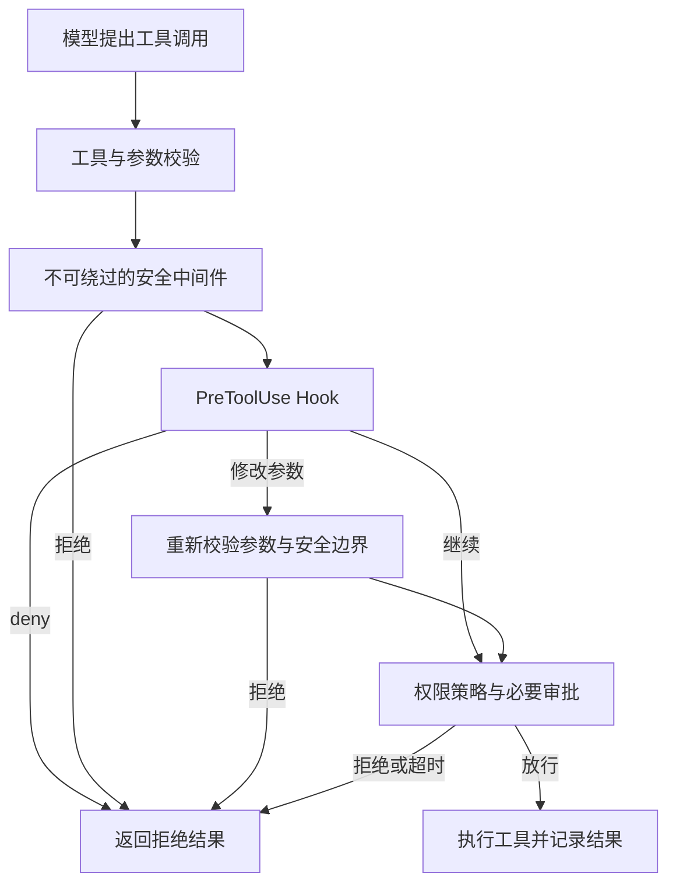

# 第 7 章 · 把安全落实到工具执行边界

> 当前实现教程：按代码 `0092022f`（2026-09-21）重写。保留原路径以兼容已有链接；概念伪代码不作为公开 API。

模型提出一个操作，与宿主实际执行它，是两件事。用户说“整理项目”，模型可能调用 `read_file`，也可能生成一条 Shell 命令。仅在系统提示词里写“谨慎操作”，无法保证文件访问范围、审批语义和进程权限始终一致。

Pico 把这些约束放在运行时：工具注册表负责执行顺序，安全策略负责不可绕过的拒绝，权限模式决定何时询问，持久的 `ExecutionBoundary` 决定执行范围，工具和进程沙箱落实具体限制。本文讨论当前实现；下面的流程图是机制概览，标注为伪代码的片段用于教学，不是可直接复制的 API。

## 从一次工具调用理解安全链

假设模型调用 `edit_file`。首先要确认工具存在、参数有效；然后运行安全中间件。只有这一步通过，`PreToolUse` Hook 才能读取调用、拒绝调用或提出参数修改。修改后的参数要再次通过安全检查，之后才能进入权限审批。



实际顺序见 [ToolRegistry](../../../packages/pico-host/src/tool-registry.ts)。注册表区分 `useSafety`、权限中间件与普通请求中间件，不是一条可以任意重排的简单函数数组。审批阶段如果又改写参数，也要重新检查安全性；反复改写不能稳定下来时直接拒绝。

这种设计解决的是“检查过的内容与最后执行的内容一致”。例如 Hook 把普通路径改成敏感路径，不能借先前的批准绕过后续检查。Hook 的 `allow` 也不能复活已被安全门拒绝的调用。

## 权限模式和执行边界分别回答什么

权限模式回答“这个动作是否需要询问”。当前三种模式由 [工具权限分类](../../../packages/core/src/tool-permission-policy.ts) 和 [Runtime 权限装配](../../../packages/pico-host/src/agent-runtime.ts) 共同落实。

| 权限模式      | 普通工具调用的处理                                                             |
| ------------- | ------------------------------------------------------------------------------ |
| `ask`         | 已声明的只读工具和有界内部编排可以自动执行；写入、Shell、MCP 等按策略请求审批  |
| `auto`        | 额外自动允许工作区内结构化写入和内置公网只读工具；Shell、MCP、未知能力仍需审批 |
| `full-access` | 普通权限链跳过人工审批；hardline、安全门和 Hook 的直接 deny 仍然有效           |

`plan` 是协作模式，不是第四种权限模式。Plan 的只读约束不会因为传入 `full-access` 就消失。另一方面，“没有命中危险命令规则”也不代表 Shell 会在 `ask` 或 `auto` 中静默运行：是否询问由能力分类决定。

执行边界回答“执行最多可以到哪里”。[ExecutionBoundary 与权限 profile](../../../packages/core/src/permission-profile.ts) 定义三种宿主边界：managed、bypass、external。managed 保存文件读写规则和网络能力；bypass 表示跳过普通托管限制；external 表示边界由外部宿主拥有。边界带 revision，作为 Session Runtime State 持久保存。

普通 Agent 的 `ask` / `auto` 初始采用 managed workspace-write 和 restricted process network；Plan 收紧为 managed read-only；完全访问采用 bypass。`ask` 与 `auto` 之间切换不应丢掉已保存的 managed 扩展，从 bypass 回到托管模式则重新建立默认边界。具体状态迁移由 Runtime 处理，不能只修改界面标签。

这两层相互配合：一次批准不等于修改 Session 永久边界，一个“自动批准”标签也不等于操作系统隔离。

## 扩权是带状态校验的独立操作

前台主 Agent 可以通过 `request_sandbox_boundary` 请求有界的文件或进程网络扩展。宿主先规范化路径、检查显式 deny，再让用户审阅。用户批准后，运行时按 revision 检查并持久更新边界，然后刷新相关执行设施。

下面是概念伪代码，省略了具体错误和持久化协议：

```ts
const proposal = validateAndNormalizeBoundaryRequest(input);
const expectedRevision = currentBoundary.revision;
await requestHumanApproval(proposal);
await persistBoundaryIfRevisionMatches(expectedRevision, proposal);
refreshWorkspaceAndNetworkGates();
```

不能把这个流程替换成“批准后把路径放进一个内存数组”。等待批准期间边界可能已经改变；进程重启后也需要恢复相同事实。子代理、Graph operator、Plan、后台任务和隔离 Headless 不暴露这个自由扩权入口。

网络还需要区分数据面。managed 网络开关约束子进程、远程 MCP 和 HTTP/MCP Hook；内置 `web_search` / `fetch_url` 使用宿主公网只读通道，执行 URL、DNS 与 SSRF 检查。允许搜索资料不意味着同时允许 Shell 任意联网。

## Hardline：有建模范围的拒绝底线

[approval-policy.ts](../../../packages/runtime/src/approval-policy.ts) 调用 [Bash hardline 分析器](../../../packages/runtime/src/bash-hardline.ts)。当前实现不是早期的若干正则黑名单，而是对 Shell 词、引用、展开、命令转发和静态目录上下文进行分析，拒绝已建模的系统根破坏、设备操作、危险远端操作和无法证明目标安全的动态破坏路径。

例如，命令先切换目录再使用相对删除目标，不能只检查末尾字符串。分析器需要传播目录上下文；目录来自无法静态确定的展开时，破坏目标也就无法被证明安全。Windows PowerShell 使用独立策略，不把 Bash 的语法分析强套到另一种语言。

hardline 拒绝不能经人工审批绕过，也不会因为 `full-access` 而消失。但它不是任意可执行文件的完整行为证明：程序加载自己的配置、调用未建模的解释器或执行内部副作用，都超出简单命令文本分析的覆盖面。因此，完全访问的主 Agent 仍以当前 OS 用户权限执行，不能宣称“有了 hardline 就绝不会破坏系统”。需要物理隔离时必须使用相应沙箱或外部隔离环境。

## 审批是一段可取消、可终结的生命周期

[ApprovalManager](../../../packages/pico-host/src/approval-manager.ts) 维护宿主内存中的待审请求。它把工具信息和预览交给 UI，等待同意、拒绝、取消或超时；默认超时为 30 分钟。审批通过当前桌面/TUI 宿主链路呈现，不能把已退役的飞书通知流程当作当前入口。

审批 UI 的用途是让人看清将要执行的动作。预览不是执行事实，用户点击批准也不是工具完成。运行时要在批准后继续安全与权限流程，再记录工具结果；超时、取消以及没有交互界面的环境都必须产生明确终态，而不能留下永久等待的 Promise。

会话授权由 [session-permissions.ts](../../../packages/pico-host/src/session-permissions.ts) 表达。它缩小重复询问的成本，但不作为绕过 hardline 或执行边界的捷径。还要把“给当前调用一次许可”和“扩展整个会话的执行范围”区分开。

## 子任务仍需自己的能力检查

配置型子任务除执行边界外，还有工具白名单和 [child-agent-policy.ts](../../../packages/pico-host/src/child-agent-policy.ts) 的检查。Local Read 仅有读取与检索；Implementation 在独立 worktree 中执行，继续受专用工具和沙箱策略限制。

父任务采用 bypass 时，专用子任务执行器会让子任务采用 bypass/full-access，但不会因此把所有主任务工具交给子任务。手动进入子会话续聊时，宿主按持久 admission 恢复 profile，并按该入口的预期边界重新对齐。权限模式、工具表和执行边界是三个需要同时核对的事实。

## 如何验证这道防线

测试应证明具体拒绝和状态迁移，不执行真实系统破坏。以下命令在仓库根目录运行；已安装依赖但尚未生成工作区包时先构建：

```bash
npm run build:packages
node --import tsx --import @pico/cli/tui/preload-env --test --test-concurrency=1 \
  tests/integration/safety/permission-mode-matrix.test.ts \
  tests/integration/runtime/agent-runtime-sandbox-boundary.test.ts \
  tests/integration/desktop/approval-timeout-lifecycle.test.ts
```

这组确定性验证覆盖权限模式、持久边界和审批生命周期。它不证明所有平台的进程沙箱都已运行，也不替代真实 UI 验收。要验证某条平台路径，应再运行对应平台的针对性集成测试；不应把命令语义判定测试写成真正的删除或推送操作。

安全系统的交付物不是一句“Agent 很谨慎”，而是可核对的调用顺序、可恢复的边界和可验证的拒绝结果。下一章把这些规则带进子任务执行。

[下一章：把任务交给持久子智能体 →](08-subagent.md)
