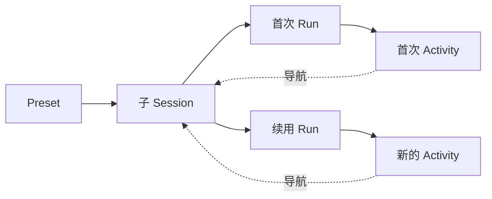
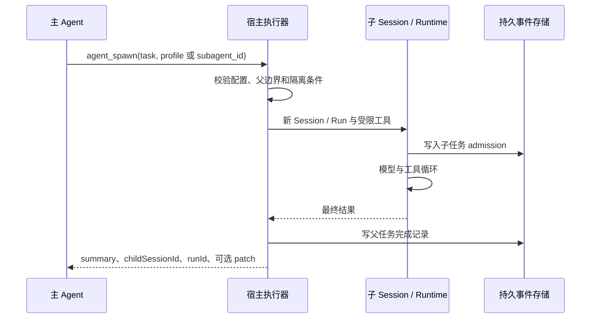

# 第 8 章 · 把任务交给持久子智能体

> 当前实现教程：按代码 `0092022f`（2026-09-21）重写。保留原路径以兼容已有链接；概念伪代码不作为公开 API。

“请检查审批卡片为什么重复显示。”主 Agent 可以自己读代码，也可以把范围明确的调查交给另一个 Agent。委派的价值不只在于分工：子任务会积累自己的阅读过程，主任务先接收结论，需要时再查看证据；后续复查还能继续原来的子会话。

当前 Pico 的配置型入口是 `agent_list`、`agent_spawn` 和 `agent_output`。它复用 AgentRuntime、Session 与 RuntimeRun，不是另写一个临时模型循环。本文先沿这条前台执行链解释，再区分 Agent Graph 和 Hook verifier；不把不同入口的工具、并发和权限语义混为一谈。

## 先区分四种身份

| 对象       | 保存什么                                | 复用时如何变化           |
| ---------- | --------------------------------------- | ------------------------ |
| Preset     | 名称、用途、profile、模型连接和思考配置 | 同一配置可用于多个任务   |
| Session    | 某项子任务的持久消息和状态              | 同一问题续查保留 Session |
| RuntimeRun | 一次实际执行及其终态                    | 每次续查产生新 Run       |
| Activity   | 父任务中的执行卡片与轨迹身份            | 新运行需要独立 Activity  |



这个区分直接影响产品正确性。如果用 Session ID 永远作为卡片 ID，续查就会更新旧卡片而不是出现新卡片。当前执行器对新任务使用子 Session 身份，对续用生成新的 `subagent-activity-<UUID>`；导航仍指向同一子 Session。实现见 [configured-subagent-executor.ts](../../../packages/pico-host/src/configured-subagent-executor.ts)。

## Preset 选择模型，profile 决定能力

用户通过设置管理设备级的 `subagents.presets`。Preset 最多 64 项；主 Agent 可以列表和选择，当前没有专门创建或修改永久 Preset 的模型工具。列表默认给出可用配置，`view: "catalog"` 则显示停用、连接缺失、Provider 退役或模型不可用等原因。

[配置目录](../../../packages/pico-host/src/configured-subagent-catalog.ts) 在实际启动时重新解析配置，不相信先前列表结果。因为模型选择配置之后，用户可能已经停用该配置或更换连接。配置协议见 [subagents.ts](../../../packages/protocol/src/runtime/subagents.ts)。

真正的工具边界由 [内置能力定义](../../../packages/core/src/subagent-capabilities.ts) 提供：

| profile          | 工具                                                           | 工作区与结果                   |
| ---------------- | -------------------------------------------------------------- | ------------------------------ |
| `local_read`     | `read_file`、`glob`、`grep`                                    | 共享工作区，返回摘要           |
| `web_research`   | `web_search`                                                   | 共享工作区上下文，返回研究结论 |
| `implementation` | `read_file`、`glob`、`grep`、`write_file`、`edit_file`、`bash` | 独立 Git worktree，返回补丁    |

把配置命名为“代码审查员”不会让它自动获得不同工具。用途 description 帮助模型选择角色，系统提示词与工具白名单由宿主提供。配置型子任务没有再次启动子任务的工具，因此这里没有默认两层递归委派，也没有 Shared Worker 的 `writeScopes`/OCC 公共契约。

## 一次真实的前台委派

以下是 `agent_spawn` 的有效参数示例，可由主 Agent 调用；它不是终端命令：

```json
{
  "profile": "local_read",
  "task": "检查审批卡片重复显示的原因。只读 conversation 相关实现与测试，返回文件位置、证据和验证建议。"
}
```

已有 Preset 时使用 `subagent_id`；同时提供 profile 时以 Preset 为准。task 必须非空且不超过 60,000 字符，显式 isolation/write_back 必须符合能力定义。[工具协议](../../../packages/runtime/src/configured-subagent-tools.ts) 会校验这些组合。

执行器创建新 Session，通过 `sessionSelection.mode = "new"` 调用 AgentRuntime。配置存在时采用配置模型，否则使用父任务模型路由；未指定思考档位表示模型默认，不是复制父任务档位。配置型执行器将 `maxTurns` 设为 20。



`agent_spawn` 前台等待一个子任务完成，然后把结果交回主任务。它不承诺自动后台执行或批量并行；不能看到“子智能体”几个字就推导出速度会提升几倍。

子任务不复制父任务完整历史，必要背景应写进 task。但运行时仍会按规则装配自身上下文，因此“独立历史”不表示一个完全没有其他上下文来源的空白环境。最终摘要之外，执行轨迹和工具结果仍有持久记录，主任务可以精确回读。

## 写入隔离与权限继承

Implementation 需要可用的 Git worktree 宿主。任务完成后，执行器收集相对基线的补丁，返回补丁路径、worktree 路径和分支；这条流程不会自动把改动合并进父工作区。worktree 隔离的是 Git 工作目录，不等于另一个操作系统。

managed 父任务启动时，Local Read 的子边界为 read-only + restricted network，Web Research 为 read-only 文件权限 + enabled network，Implementation 为 workspace-write + restricted network，权限模式为 `ask`。父任务边界必须满足相应准入条件。父边界为 bypass 时，专用执行器会使用 bypass 子边界和 `full-access`。

这不等于解除 profile：工具白名单和子任务专用安全检查仍存在。具体逻辑位于 [执行器](../../../packages/pico-host/src/configured-subagent-executor.ts) 与 [子任务安全策略](../../../packages/pico-host/src/child-agent-policy.ts)。用户手动续聊和父任务专用续用的边界来源也不同，不能简单概括为“子任务永远 ask”或“永远继承父任务”。

## 续用必须证明身份，而不是相信一个 ID

用户说“继续验证刚才的修改”时，主 Agent 可以这样调用：

```json
{
  "child_session_id": "替换为上次返回的子会话ID",
  "task": "沿用先前调查，确认本次修复是否消除了重复卡片。"
}
```

专用续用保留 Session 历史，创建新 Run，并返回 `resumedFromRunId`。它不是重新选择同一 Preset 再创建一个空白任务。

[续用解析器](../../../packages/runtime/src/configured-subagent-continuation.ts) 会核对当前父 Session 的宿主记录、工作目录与 manifest、最新 Run 与持久终态、子侧 admission，以及保存的模型和 Preset 配置。失败或取消的旧 Run 可以继续，但仍在运行或没有可信终态时不能续用。独立 worktree 子任务暂不支持这条续用方式。

父子关联通过 `picoConfiguredChild` 宿主消息保存，并标为 `picoHiddenFromTranscript`。它不作为普通聊天气泡展示，但仍是持久事实。任意用户消息里写一个 childSessionId 不会建立同样授权。读取结果时，`agent_output` 也检查父子关系，并支持精确 child Session/Run 查询，而不是接受任意文件路径。

## 点击卡片后手动发送，也要恢复角色

如果约束只在 `agent_spawn` 时装配一次，用户进入子会话手动发消息后，就可能按普通主任务获得工具。当前 [AgentRuntime](../../../packages/pico-host/src/agent-runtime.ts) 在取得 Session 后读取它自己的 admission，恢复能力后才装配提示词、工具和安全检查。恢复逻辑见 [configured-subagent-session.ts](../../../packages/runtime/src/configured-subagent-session.ts)。

普通手动续聊按 profile 重建 managed 预期边界；既有 bypass 在无活动 Run、revision 校验通过时会被收紧并持久更新。父任务专用续用则可以按当前父边界传入 bypass。边界需要调整但已有活动运行时拒绝，不能中途改变本轮的执行条件。

两种入口都固定协作模式为 agent、编排为 default、Swarm 授权为 none，并恢复工具白名单；但业务记账不同。手动续聊不走父任务执行器，不负责生成父侧新活动或更新父记录。它产生新 Run 后，父任务再次专用续用可能因为记录不匹配而拒绝。当前没有自动认领该手动 Run 的调度器。

## Graph 与 Hook verifier 是另外的路径

Agent Graph 面向持久任务图，管理 operator、依赖和状态，使用保存的 profile snapshot。它的控制协议与配置型 `agent_spawn` 不同，不能把某条路径里的 `agent_output` 用途直接套到另一条路径。相关装配见 [product-agent-graph-host.ts](../../../packages/pico-host/src/product-agent-graph-host.ts)。

Hook 的 `agent` 验证器则是内部核验路径：每次创建持久的 `hook-verifier-<UUID>` Session，以独立 AgentEngine 运行，使用固定只读 Registry、自身的 archive reader、上下文预算和 FullCompactor。它不挂载 Hook 服务，避免子工具或压缩递归触发 Hook；模型调用统一计入 `purpose: "hook"`。见 [runtime-hook-assembly.ts](../../../packages/pico-host/src/runtime-hook-assembly.ts)。它的工具范围包含受只读分类约束的 bash 等工具，不能当成 `local_read` 的别名。

## 验证真正的委派契约

在仓库根目录准备工作区包后，执行相关集成测试：

```bash
npm run build:packages
node --import tsx --import @pico/cli/tui/preload-env --test --test-concurrency=1 \
  tests/integration/runtime/configured-subagent-execution.test.ts \
  tests/integration/runtime/configured-subagent-continuation.test.ts \
  tests/integration/runtime/configured-subagent-output.test.ts \
  tests/integration/runtime/hook-verifier-compaction.test.ts
```

这些测试使用可控 Provider 验证持久执行、权限恢复、补丁、回读和 verifier 压缩，不证明真实模型一定正确完成调查。实际模型的上下文续用另见 [真实模型 E2E](../../../tests/e2e/configured-subagent-continuation.real-llm.test.ts)，需要可用的真实模型配置。桌面卡片和导航还需要桌面测试或实际交互验证。

委派应围绕明确交付来设计：任务需要什么上下文、允许哪些操作、结果如何回查、何时复用原 Session。单文件小修改通常自己完成更直接；边界清楚且有独立调查或交付价值时，子任务才值得新增一次模型运行和一段生命周期。

[下一章：看清每次运行的成本与证据 →](09-observability.md)
