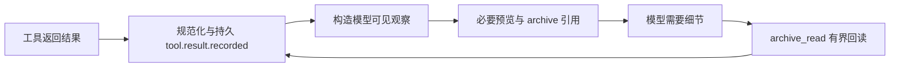

# 第 9 章 · 看清每次运行的成本与证据

> 当前实现教程：按代码 `0092022f`（2026-09-21）重写。保留原路径以兼容已有链接；概念伪代码不作为公开 API。

Agent 返回了答案，仍有很多问题没有回答：它用了哪个模型，消耗了多少 Token，时间花在请求还是工具上，某次失败是否真的重试成功？仅打印最终文本，无法区分这些情况。

Pico 把观测拆成互相补充的几种事实：Provider 调用与用量账本、Runtime 事件、Trace 和结构化日志。工具原始结果与模型当前看到的上下文也分开保存。这样可以追查一次运行，而不必让模型背着全部历史原文继续推理。

## 先选择正确的事实源

| 问题                         | 优先查看的记录                        |
| ---------------------------- | ------------------------------------- |
| 哪个模型调用成功、失败或取消 | Provider call 记录与 Runtime 模型事件 |
| Token 和估算成本是多少       | CanonicalUsage、价格来源与 costStatus |
| 哪个步骤耗时                 | Trace 中的 Run、Turn 和子 Span        |
| 工具究竟返回了什么           | `tool.result.recorded` 的持久结果     |
| 宿主连接或装配为何异常       | 结构化诊断日志                        |

这些记录不能相互替代。活动卡片是展示，日志是诊断，Trace 是时间结构；它们都不应私自制造第二份工具执行事实。当前持久 Runtime 以事件和投影管理 Session/Run，工具结果契约见 [tool-result-builder.ts](../../../packages/runtime/src/tool-result-builder.ts)。

## CostTracker：在 Provider 边界记录调用

若在每个 `generate()` 调用点手工统计，很容易漏掉压缩、验证器或失败分支。当前 [CostTracker](../../../packages/runtime/src/cost-tracker.ts) 实现 LLMProvider 接口，包装真实 Provider，统一转发普通和流式请求，记录调用身份、耗时、结算状态与用量。

下面是解释责任边界的概念伪代码，省略了真实实现中的运行归属校验、流式路径和账本字段：

```ts
async function trackedGenerate(request) {
  const callId = newCallId();
  await recordStarted(callId, currentRun, request.purpose);
  const start = now();
  try {
    const response = await provider.generate(request);
    await recordSucceeded(callId, now() - start, response.usage);
    return response;
  } catch (error) {
    await recordFailedOrCancelled(callId, now() - start, error);
    throw error;
  }
}
```

真实 Tracker 为每次逻辑调用分配 callId，向匹配的 RuntimeRun 写 started/settled 事件，并写 Provider ledger。上下文可在每次请求前求值，让 Session、goal、job 和 purpose 归属跟随真实运行，而不是沿用构造 Tracker 时的旧值。独立后台调用也有禁止写入继承前台 Run 的选项。

Hook verifier 是值得检查的例子：它使用独立 Session，模型请求的 purpose 为 `hook`；即使触发内部摘要请求，也通过同一 purpose 包装器转发。不能仅看“调用的是同一个 Provider 对象”就把费用算入父会话的普通答复。

## Token 口径要先统一，再谈价格

Provider 的 usage 字段并非天然可相加。有的输入统计包含缓存 Token，输出统计又可能包含 reasoning Token。Pico 先归一化为五个桶：input、output、cache read、cache write、reasoning，再按 [pricing.ts](../../../packages/runtime/src/pricing.ts) 的规则估算。

概念上，当前估算公式是：

```text
USD = [input × inputPrice
     + (output + reasoning) × outputPrice
     + cacheRead × cacheReadPrice
     + cacheWrite × cacheWritePrice] / 1,000,000
```

价格选择也有顺序：订阅包含用量、显式 route pricing、宿主目录价格解析，再到适用的内置快照。`pricing: null` 可以明确禁止隐式价格表。宿主目录适配见 [catalog-pricing.ts](../../../packages/pico-host/src/catalog-pricing.ts)。同名模型经过不同端点，不能仅凭模型名就假定相同计费条件。

| costStatus  | 应如何解释                                    |
| ----------- | --------------------------------------------- |
| `estimated` | 根据已知价格与报告用量计算的估算              |
| `included`  | 当前路由声明订阅内包含，不是逐 Token 计费估算 |
| `unknown`   | 缺少必要价格，不能得出可靠金额                |

缺少 usage 同样不是零消耗。Tracker 记录 missing usage；unknown 的数值占位也不能拿来宣称“免费”。当前 USD 到 CNY 使用代码中的固定折算系数，而非实时汇率，所以 UI 显示到分也不意味着与供应商最终账单精确一致。本文不重复粘贴会过期的模型价格表；查账应同时记录 route、价格来源、用量完整性和估算状态。

## 请求诊断帮助解释缓存，不等于替代账单

Tracker 可以观察准备发送给 Provider 的请求，生成请求指纹并与先前请求比较。这样能定位某一轮提示词、工具定义或请求形状发生变化，帮助解释缓存行为。诊断序列化失败会记录警告，不应为了观测本身阻断模型请求。

这些诊断只提供变化证据。请求形状相似，不证明供应商一定命中缓存；Provider 返回的 cache usage 与账单口径仍是必要依据。看到耗时下降也不能直接推出“压缩让模型质量提升”。观测数据可以提出假设，因果结论需要控制其他条件的评测。

## Trace：把时间组织成运行树

[运行时 Tracer](../../../packages/runtime/src/trace.ts) 保存 Span 树；[宿主导出器](../../../packages/pico-host/src/trace.ts) 负责写入工作区状态目录中的 traces。AgentEngine 使用明确父节点创建子 Span，避免并行工具因共享一个隐式栈而串错父子关系。

下面是结构示意，不是真实性能测量：

```text
Agent.Run
├── Turn-1
│   ├── LLM.Action
│   └── Tool.Execute
├── Turn-2
│   ├── Context.Compaction
│   ├── LLM.Action
│   └── Tool.Execute
└── LLM.GraceCall（需要收尾时）
```

Span 记录开始、结束、耗时与属性，JSON 导出路径采用 `trace_<sessionId>_<timestamp>.json`。文件落盘由宿主控制，不是把 `traces/` 随意写进项目源码目录。具体路径以运行返回值和宿主路径解析为准。

Tracer 支持 full 与 metadata-only 属性策略。后者在字符串进入内存属性时就递归替换为 `[REDACTED]`，而不是等文件写出后才清洗；内部 Headless 使用这一策略，并保留落盘后的额外净化。普通交互 Trace 不应被误认为天然只有无敏感元数据，分享前要理解实际启用的策略。

## 工具结果：保存原始事实，只给模型必要部分

一个终端命令可能返回很长的日志。把全部原文不断放进模型输入会增加成本；直接截掉又无法复查。当前路径是将规范工具结果内联保存为 RuntimeEvent，再为模型构造有界观察。



当前归档引用形如：

```text
pico://archive/<sessionId>/<eventId>/<sha256>/<sizeBytes>
```

[归档 reader](../../../packages/runtime/src/tool-result-archive.ts) 绑定当前 Session，核对事件身份、哈希和大小。它回读的是已保存的工具结果，不是把 URI 解释成任意本机文件路径，也不通过新写 Evidence CAS 来保存这条主路径。

[archive_read](../../../packages/pico-host/src/archive-read-tool.ts) 提供 inspect、read、query、search；read 可以按字符或行分页，offset 从零开始，search 是有界的字面子串检索。以下是工具参数示例，ref 必须替换为工具真实返回值：

```json
{
  "ref": "替换为当前会话实际返回的pico://archive引用",
  "operation": "read",
  "unit": "line",
  "offset": 0,
  "limit": 40
}
```

因此，不能继续教模型使用 `read_evidence` 或把当前 archive 描述为旧的 `pico://evidence/` CAS。文件读取、会话归档和跨子任务结果读取各有自己的授权路径。

## 日志服务于诊断，不能冒充执行证据

[logger.ts](../../../packages/pico-host/src/logger.ts) 使用 pino，支持 LOG_LEVEL，并对明确的凭据字段进行脱敏。开发态可以通过 pino-pretty 输出便于人读的内容；测试和 Electron 环境使用 plain pino。不同入口还会设置输出策略，例如机器 Headless 在加载 Runtime 前固定日志静默，以保证单行 JSON 终态协议。

日志字段应帮助定位组件、调用身份和失败原因，不应默认记录完整提示词或凭据。精确字段脱敏也不等于扫描任意字符串中的所有秘密。持久事件、Trace、日志、用户界面有不同读者和保存目的，新增观测点时先明确必要信息与敏感边界。

## 怎样证明观测没有说谎

在仓库根目录运行下列针对性检查：

```bash
npm run build:packages
node --import tsx --import @pico/cli/tui/preload-env --test --test-concurrency=1 \
  tests/integration/provider/catalog-usage-billing.test.ts \
  tests/integration/runtime/runtime-tool-result-contract.test.ts \
  tests/integration/tools/archive-read-tool.test.ts \
  tests/integration/tui/tui-client-tracer.test.ts
```

这些确定性测试分别检查计费口径、工具持久结果、归档回读和 TUI trace 消费。它们不验证供应商实际账单，也不证明任何性能提升百分比。要研究成本或成功率变化，应固定任务和模型路线，保存实际数据，再进入下一章的评测链。

[下一章：用可复查的评测判断改动 →](10-evaluation.md)
