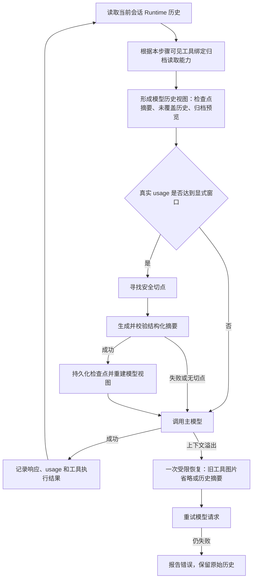
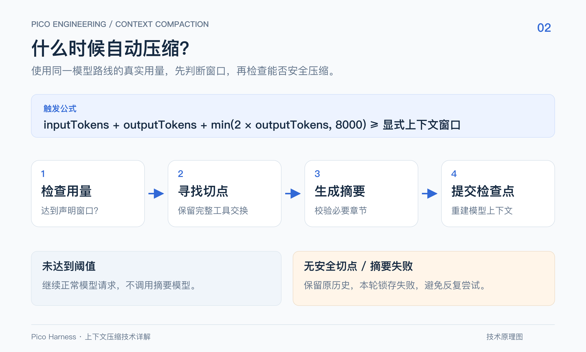
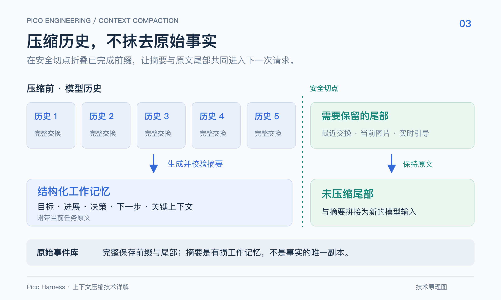

# Pico 上下文压缩技术详解

> 代码基线：`0092022f`，2026-09-21。本文描述已实现的行为，而非规划方案。核心策略参考本地 Maka `584652137`，持久化和权限边界适配 Pico Runtime。

## 1. 解决的问题与设计边界

Agent 连续执行任务时，对话、工具参数、工具输出和图片会不断累积。每次模型请求都携带这些内容，会增加输入开销，最终可能超过模型上下文窗口。

Pico 用两种机制控制上下文大小：

1. **工具结果归档投影**：原文保留在事件库，模型先看到预览，需要细节时再回读。这是确定性的内容投影，不需要模型生成摘要。
2. **历史语义摘要**：调用模型，把已完成的历史前缀整理为结构化工作记忆，后续请求使用摘要和未压缩尾部。

两者改变的是模型读取视图，不是删除原始事实。界面的会话记录、Runtime 原始事件和模型实际接收的上下文，是三个相关但不同的视图。

这也不是跨会话长期记忆。压缩检查点用于当前会话继续执行；长期记忆提取可以关联检查点边界，但有独立的策略和生命周期。

## 2. 总体调用链


图 1：两条路径共同构成模型读取视图。原始事件继续保存，检查点只替换其覆盖的历史前缀。[查看矢量原图](assets/context-compaction/architecture-blog.svg)。



图中的循环代表同一次任务的多个模型步骤，不意味着每一步都调用摘要模型。正常情况下，绝大多数步骤只做触发判断。

## 3. 三种摘要入口

### 3.1 自动压缩：显式窗口加真实 usage



图 2：自动压缩的主路径与保留原历史的分支。Provider 溢出恢复是单独入口，见 3.2 节。[查看矢量原图](assets/context-compaction/trigger-blog.svg)。

宿主根据模型路线构建 `ContextBudget`。只有用户配置明确声明上下文容量时，才设置 `declaredContextWindowTokens`。Provider 默认 profile 仍可用于其他预算计算，但不能独自开启主动压缩。

在下一次模型请求前，使用最后一次已接受请求的真实用量：

```text
baseline = inputTokens + outputTokens
reserve  = min(2 × outputTokens, 8000)
trigger  = baseline + reserve >= declaredContextWindowTokens
```

例如：显式窗口为 128000，上次输入为 119000，输出为 3500，则判断值为 `119000 + 3500 + 7000 = 129500`，进入自动压缩。

这里的 reserve 是根据上一条回复大小计算的余量，不是当前回复的强制输出上限。它也没有精确预测新工具输出会增加多少 token。因此，主动判断不能替代 Provider 的真实溢出检测。

触发还需满足以下条件：

- 存在 `FullCompactor`。
- 有有效的真实 usage；未知用量不按零处理。
- 恢复的 usage 锚属于当前模型路线。
- 当前步骤尚未尝试压缩，且本轮未锁存压缩失败。

真实用量锚随助手消息写入 `providerData.picoContextUsageAnchor`。路线标识由 Provider 类型、base URL、route ID 和模型名计算，重启时可以恢复匹配的锚，换路线不能误用旧模型的容量信息。

**本地 token 估算仍然存在**：它用于选择切点、手动保留预算和诊断；只是不再被当作主动触发所需的真实 usage。

### 3.2 溢出恢复：Provider 报错后的单次尝试

只有明确的 `ContextOverflowError` 才进入这条路径。网络断连、鉴权失败等错误不会因为“看起来请求失败”就触发压缩。

恢复顺序是：

1. 如果存在可省略的历史工具图片，先从模型投影移除这些图片，再重试。
2. 否则，尝试对安全历史前缀生成摘要，成功后重试。
3. 同一个未被接受的请求最多恢复一次；重试仍超限就抛出错误。

图片省略和摘要是这次恢复中的两种选择，不是在同一次失败上无限逐级重试。当前用户图片不属于可删除的旧工具图片。

成功接受新的模型步骤后，恢复机会重新开放。因此，一个长任务可以在不同步骤分别恢复溢出；“一次”不是整个会话终身只能压缩一次。

### 3.3 桌面手动压缩：保留约半段历史

桌面端点击“压缩”并确认，会通过独立的 Runtime 操作写检查点，不要求先达到自动触发阈值。

当前手动入口的保留目标为：

```text
max(1, min(floor(inputBudgetTokens × 0.5), floor(historyTokens × 0.5)))
```

`historyTokens` 是模型历史的本地估算，预算来自当前 Provider profile。这个保留目标随后还要服从安全切点规则，并不等于严格删除一半消息，也不保证总 token 精确减半。

自动和溢出入口使用 `targetRetainedTokens = 1`，表示在安全约束下尽量覆盖更大的已完成前缀；它不表示最终只保留一个 token。

短会话可能没有安全切点，此时桌面返回冲突提示，不写检查点。当前提示把“无安全边界”和“摘要无效”合并为同一条消息，单看提示无法区分两种原因。

## 4. 如何选择安全切点



图 3：摘要与尾部共同形成下一次输入。事件库用于重建视图，不意味着把已压缩的原始前缀再次全部发送给模型；工具结果仍可能经过归档投影。[查看矢量原图](assets/context-compaction/history-blog.svg)。

原始历史可以抽象为：

```text
[当前要折叠的完整历史前缀] | [必须保留的历史尾部]
```

切点遵守以下规则：

- 不允许切开 assistant 的工具调用及其结果。
- 历史尾部存在未完成工具交换时，不进行这次摘要。
- 保留尾部不能从工具结果中间开始。
- 不能只折叠用户问题，却把它对应的回答留在另一侧。
- 当前用户消息包含图片时，该消息及后续交换保留在尾部。
- 当前任务之后到达的实时 steering 保留原文。
- Runtime 还会检查中断恢复形成的特殊边界是否允许覆盖。

自动执行路径会把当前任务作为 `preservedAnchor` 传给摘要器，包装摘要时附带任务原文；其他入口在未显式传入时尝试从历史推断最新普通用户消息。模型总结之外仍有一份任务文本，不完全依赖摘要模型记住原始要求。

由于尾部必须存在，只有一次用户请求和一次工具交换的历史可能还没有可折叠前缀。这不是要求破坏工具协议来凑出压缩结果。

## 5. 摘要生成、校验与滚动更新

### 5.1 输出结构

摘要使用固定章节，正文可以是中文：

| 章节             | 应承载的信息                           |
| ---------------- | -------------------------------------- |
| Goal             | 用户目标和验收要求                     |
| Progress         | 已完成工作、进行中事项                 |
| Key Decisions    | 关键决策与必要原因                     |
| Next Steps       | 尚未完成的行动                         |
| Critical Context | 约束、路径、命令、错误、标记和重要证据 |

请求使用当前主 Provider，摘要输出预算为 8000 token；实际 Provider 适配器还会与路线输出上限取较小值。OpenAI、Responses 和 Anthropic 的生成及流式请求均接入该预算。

旧的 1500 字符裁剪不再用于实际摘要生成，摘要输入也不再逐条粗暴截短。

### 5.2 合格摘要才能成为检查点

提示词给出上述五段模板；硬性校验要求 Goal、Progress、Next Steps、Critical Context 四段按序出现，Key Decisions 未列入必需段。校验还检查有效内容、代码围栏和结尾截断迹象，不能将“模板五段”理解为五段全部强制。

首次摘要如果有真实 usage，且摘要请求输入超过 10000 token，还要求输出至少达到 200 token。滚动摘要不使用这个最低长度规则；usage 缺失时，也不能声称完成了基于真实 token 数的最低长度检查。

修复过程有界：

- `finishReason = length`：允许一次更短摘要重试。
- 格式或内容缺陷：允许一次完整替换修复。
- 再次不合格：返回失败，不写检查点。

截断重试后如果仍有格式缺陷，还可以进入一次完整替换修复，因此同一轮生成最多包含三个生成阶段，而不是两个互斥分支。

需要区分“质量修复次数”和“API 异常重试次数”：`FullCompactor` 每次生成阶段默认最多尝试三次调用，所以整个过程不保证最多只有两次网络请求。取消与上下文溢出不会被当作普通调用异常无差别重试。

如果摘要请求本身超限，只能尝试退回同路线最后实际接受的历史前缀边界一次；没有已证明的边界，或采用辅助路线时，不盲目猜测更小切点。

### 5.3 滚动摘要

下一次压缩不是把全部原始会话重新总结，而是：

```text
上一次有效摘要 + 本次新增、准备折叠的历史 → 新摘要
```

生成输入会避免把旧摘要同时当作普通历史重复追加。新的检查点关联上一检查点，继续保留来源可校验性。

滚动摘要能降低重复输入成本，但仍是有损语义转换；结构校验通过不代表模型保留了每个事实。

## 6. 检查点与原始事实如何共存

`recordRuntimeCompactionCheckpoint` 先从当前 Runtime 读取模型历史及来源事件，生成摘要预览，再记录检查点。

检查点包含：

- `checkpointId`：本次检查点标识。
- `coveredEventCount` 与 `throughEventId`：覆盖范围。
- `sourceDigest`：覆盖来源的内容摘要，用于完整性校验。
- `previousCheckpointId`：滚动更新关联。
- 包装后的摘要消息，以及 `picoSummaryFormat = sections_v1` 等标记。

只有持久化成功后，后续模型视图才使用该检查点替换覆盖前缀。原始消息和工具结果仍然保留，UI 无须跟随模型视图删除旧聊天内容。

加载时也会校验来源和新格式摘要。损坏的检查点不能仅因为“存在一段摘要文字”就被当作可靠上下文；旧格式检查点仍保留兼容读取能力。

装配了 Hook 服务的入口会在检查点提交后派发 `PostCompact`；桌面手动压缩当前未传入 Hook 服务，不派发这些压缩 Hook。派发失败记录诊断，不把已经提交的检查点伪装成未提交，也不回滚原始事件。

## 7. 工具输出归档与检索协议

### 7.1 哪些结果会变成预览

`archiveRuntimeToolResult` 只处理符合条件的结果：

- 工具执行成功，正文采用 inline 存储。
- `JSON.stringify(body.content).length > 8192`。
- 当前投影为全文，且投影文本与正文一致。
- 不是 `archive_read` 的输出，也不是已经分页回读的归档结果。
- 当前模型实际可见的工具中，有绑定该会话 reader 的归档读取能力。

因此，8192 是**序列化后的 JavaScript 字符长度阈值**，不是 token 数，也不是 UTF-8 字节数。错误、带额外恢复提示或已经做过其他内容投影的结果不会被这一层再次粗暴覆盖。

预览包含工具名、原始长度、正文前 500 字符、归档 URI 和读取说明。原文与预览在同一次工具结果提交中保存，不建立另一个可能与事件库不同步的存储系统。

### 7.2 读取能力

归档地址结构为：

```text
pico://archive/<session>/<event>/<sha256>/<bytes>
```

读取时检查会话归属、事件类型、正文哈希和字节数。知道地址不等于获得跨会话访问权限。

| 接口                     | 行为                       | 分页约定         |
| ------------------------ | -------------------------- | ---------------- |
| `archive_read inspect`   | 查看结构和有限预览         | 响应有界         |
| `archive_read search`    | 不区分大小写的字面子串搜索 | 不是正则搜索     |
| `archive_read query`     | 按结构化条目 ID 获取内容   | 可分页           |
| `archive_read read`      | 按字符或行读取             | offset 从 0 开始 |
| `read_file` 归档兼容入口 | 按字符读取归档 URI         | offset 从 1 开始 |

`archive_read` 的 limit 默认 4000、最多 6000；完整 JSON 响应最多 7500 字符。字符位置按 JavaScript 字符串索引解释，不是 UTF-8 字节偏移。普通文件的 `read_file` 仍按行分页，不应与归档兼容入口混用单位。

### 7.3 工具裁剪、重启和 fork

归档能力默认关闭，每一步依据最终可见工具集合重新绑定。工具被隐藏或裁剪时，新结果保留全文；已有归档投影在模型读取时恢复 inline 正文，避免模型只得到一个无法读取的地址。

旧 inline 历史可在读取时生成归档视图，保护最近两个 turn。此处理发生在检查点校验后，不修改原始事件或已记录的来源摘要。

重启后仍可依据事件读取原文。fork 会重绑定已复制工具结果的 URI，并替换摘要中能对应到这些已复制事实的引用；不会把未知引用任意转换成子会话权限。

## 8. 失败语义与已知边界

| 情况                     | 当前行为                                |
| ------------------------ | --------------------------------------- |
| 没有显式窗口或有效 usage | 不主动压缩                              |
| 找不到安全切点           | 保留历史；手动入口报告冲突              |
| 摘要校验失败             | 有限修复，仍失败则不写检查点            |
| 主动压缩未成功           | 本次 run 锁存失败，避免反复调用摘要模型 |
| Provider 超限            | 在规则允许时恢复一次，再失败则报告错误  |
| 取消执行                 | 传播取消，不继续生成或提交未完成摘要    |
| 无可见归档 reader        | 使用完整 inline 工具结果                |
| 单次结果超过 1 MiB       | 在入口拒绝，要求分段获取                |

一个值得注意的实现细节是：当前主动路径也会把“无安全切点、未产生摘要”计入本轮失败锁存。因此，即使本轮后面出现了更好的切点，也不能假设主动摘要必然再次尝试。成功模型步骤会重置单步尝试和溢出恢复机会，但不会清除本轮摘要失败锁存。

当前策略不再通过硬重置主会话来掩盖容量问题。它允许请求明确失败，保留可恢复事实，而不是只留下任务文本再声称继续成功。

## 9. 主会话与子代理的统一范围

| 执行入口             | 当前压缩实现                                             |
| -------------------- | -------------------------------------------------------- |
| 主会话               | `AgentEngine` + `FullCompactor` + Runtime 检查点         |
| Graph／配置型子代理  | 独立会话，复用统一执行引擎                               |
| Hook 验证子代理      | 独立持久化 Session，直接复用统一引擎与摘要器             |
| 旧 `runSub` 兼容接口 | 仍有旧字符预算、截断和证据重置逻辑；仓库内生产调用已迁出 |

Hook 验证器保留专用限制：只读工具、取消信号、Hook 计费归属，以及最大模型执行轮数。最后一次禁用工具的收尾请求计入轮数限制。摘要调用是额外的上下文维护调用，不应把 maxTurns 理解为包括摘要和网络重试在内的所有 API 调用总数。

Hook 子会话不挂载 Hook 服务，避免工具执行或摘要再次递归触发 Hook。它复用父路线的预算配置，但 usage 与历史属于自己的子会话，不能用父会话输入量来判断子会话是否超限。

## 10. 如何验证

### 10.1 确定性集成测试

```sh
npm run build:packages
node scripts/run-integration-tests.mjs \
  maka-compaction-trigger maka-compaction-summary \
  compaction-review-fixes compaction-rolling-digest compaction-output-budget \
  archive-read-tool tool-result-runtime-projection \
  hook-verifier-compaction
```

主要覆盖真实 usage 锚定条件、工具安全边界、当前图片保护、摘要校验和滚动更新、输出预算映射、归档隔离与回读，以及 Hook 子会话隔离和轮数限制。

测试 Provider 返回受控数据，适合验证分支和持久化不变量，不能证明真实模型的事实保留率。

### 10.2 真实模型验证

```sh
RUN_COMPACTION_E2E=1 node --import tsx --import @pico/cli/tui/preload-env \
  --test --test-concurrency=1 \
  tests/e2e/compaction-auto-trigger.real-llm.test.ts \
  tests/e2e/compaction-quality.real-llm.test.ts \
  tests/e2e/tool-result-archive.real-llm.test.ts \
  tests/e2e/hook-verifier-compaction.real-llm.test.ts
```

需要有效的用户默认模型配置，测试会实际调用并消耗模型额度。若联网依赖代理，测试进程需要使用已有代理配置；不要把密钥写进测试命令或日志。

自动触发测试会受控调整测试窗口来覆盖压缩分支，不代表观察到了日常工作负载中的自然触发概率。Hook 测试在两个已接受步骤后根据真实 usage 调整测试窗口，验证出现安全前缀后能摘要并返回准确 JSON。

### 10.3 桌面端人工验收

1. 启动当前版本桌面与 Runtime，创建独立验收会话。
2. 让模型记住一个精确随机标记和只读约束。
3. 输入合成背景，并继续一轮对话形成安全切点。
4. 点击“压缩”并确认，检查成功提示和历史重新加载。
5. 不在新问题中重写答案，要求模型返回旧标记与约束。

本次 Computer Use 验收观察到了压缩成功提示，随后模型准确返回 `PICO_CU_0921_K7M4` 及只读约束。该流程验证主会话手动入口，不能替代 Hook 自动入口测试。

测试还发现旧版常驻 Runtime 与新版桌面协议不兼容。切换到当前源码 Runtime 后恢复。因此，端到端验证首先要确认实际连接的后台版本，不能只看桌面窗口是否启动成功。

这些结果证明指定样本和边界已通过，不代表任意长任务都不会遗忘，也没有给出生产环境压缩触发概率。

## 11. 源码导航

以下链接相对于本文所在目录，便于在仓库中直接阅读。

| 模块               | 入口及职责                                                                                                                                                           |
| ------------------ | -------------------------------------------------------------------------------------------------------------------------------------------------------------------- |
| 自动触发与溢出     | [agent-engine.ts](../packages/runtime/src/agent-engine.ts)：`prepareModelContext`、`generateWithOverflowRetry`                                                       |
| 预算配置           | [agent-runtime.ts](../packages/pico-host/src/agent-runtime.ts)：`buildContextRuntime` 与路线标识装配                                                                 |
| 摘要生成           | [full-compactor.ts](../packages/runtime/src/full-compactor.ts)：`preview`、`createPreviewPlan`、`generatePreview`                                                    |
| 摘要校验           | [history-compact-summary-validation.ts](../packages/runtime/src/history-compact-summary-validation.ts)                                                               |
| 安全切点           | [safe-compaction-boundary.ts](../packages/runtime/src/safe-compaction-boundary.ts)：`findSafeCompactionCut`                                                          |
| 检查点提交         | [runtime-compaction-checkpoint.ts](../packages/runtime/src/runtime-compaction-checkpoint.ts)                                                                         |
| 历史重建           | [session-runtime-read-model.ts](../packages/runtime/src/session-runtime-read-model.ts) 与 [runtime-run.ts](../packages/runtime/src/runtime-run.ts)                   |
| 归档投影与地址校验 | [tool-result-archive.ts](../packages/runtime/src/tool-result-archive.ts)                                                                                             |
| 归档操作           | [tool-result-archive-resource.ts](../packages/runtime/src/tool-result-archive-resource.ts) 与 [archive-read-tool.ts](../packages/pico-host/src/archive-read-tool.ts) |
| 桌面手动入口       | [desktop-runtime-service.ts](../packages/pico-host/src/desktop-runtime-service.ts)                                                                                   |
| Hook 子会话装配    | [runtime-hook-assembly.ts](../packages/pico-host/src/runtime-hook-assembly.ts)                                                                                       |
| Provider 输出预算  | [ai-sdk-provider.ts](../packages/pico-host/src/provider/ai-sdk-provider.ts)                                                                                          |

相关简版说明：[上下文压缩功能说明](features/context-compaction.md)。移植来源与许可见 [第三方声明](../resources/licenses/THIRD_PARTY_NOTICES.md)。

## 附录：交互架构图

需要缩放、追踪连线或切换主题时，可查看原版交互图：[整体架构](assets/context-compaction/architecture.html)、[自动压缩流程](assets/context-compaction/trigger.html)、[历史结构](assets/context-compaction/history.html)。
