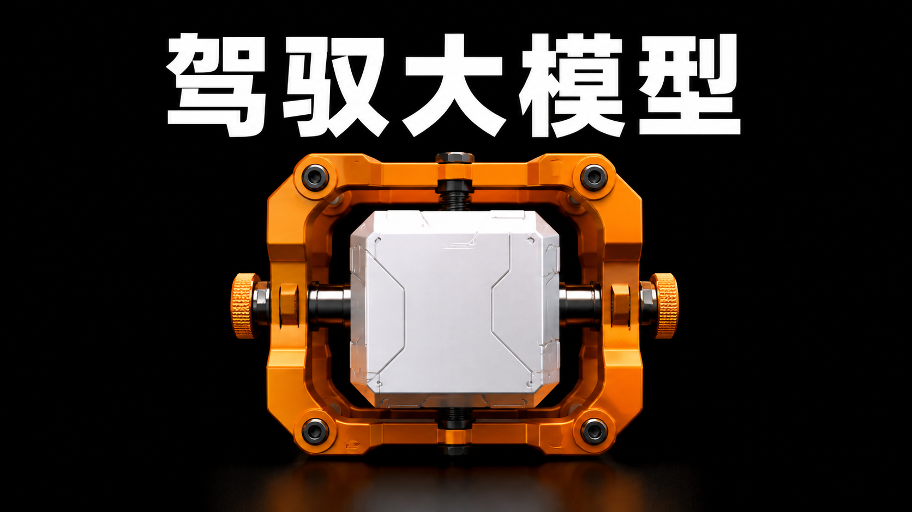
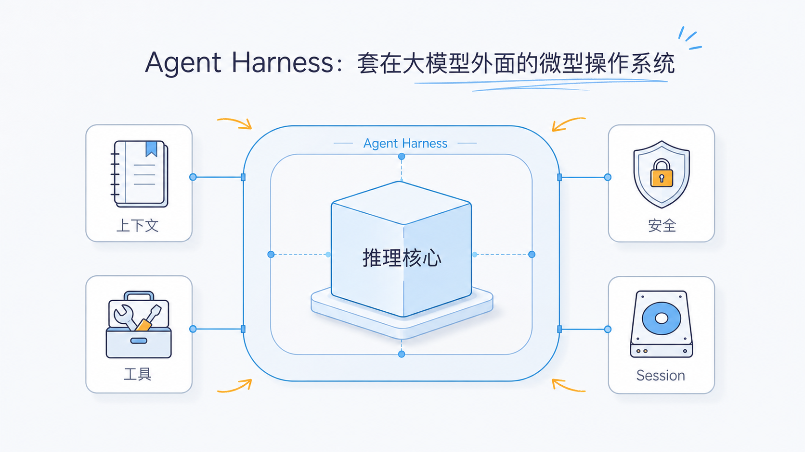
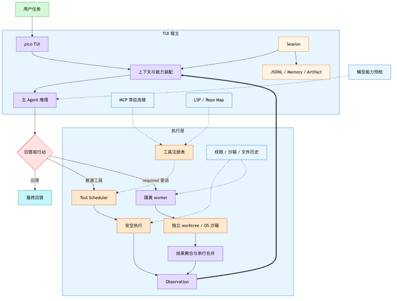
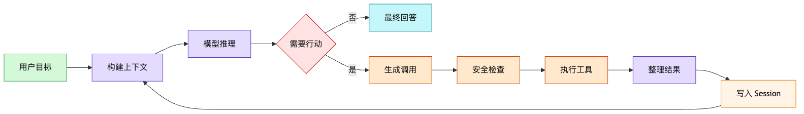
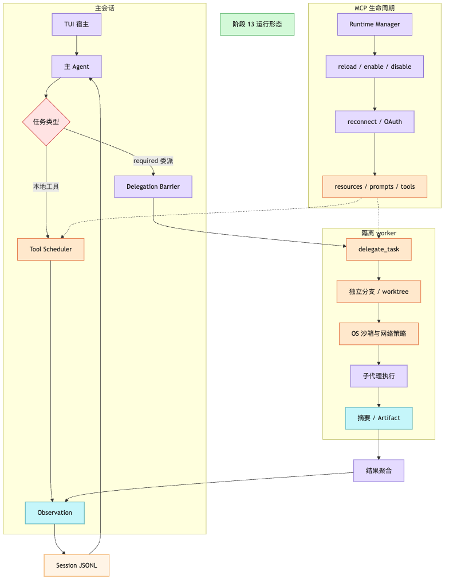
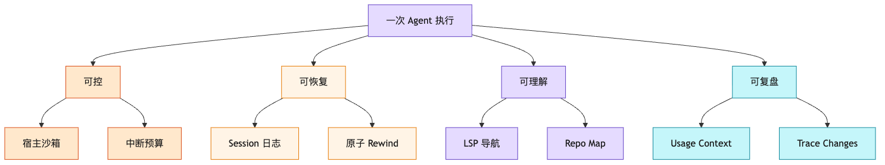

# 从一句话到一次可靠执行：pico-harness 架构通俗解读

> 本文以 `a5d598f` 的当前源码为基线。阶段性配图保留其教学视角，当前产品与持久化边界以正文
> 和 [`architecture/00-overview.md`](./architecture/00-overview.md) 为准。

如果把大模型直接接到一个聊天框里，它只能“说”。如果再给它几个文件工具，它开始能够“做”。但真正把它变成一个可以长期操作代码库的编码 Agent，还需要解决一串更麻烦的问题：上下文会不会爆掉、工具会不会互相冲突、危险命令谁来拦截、程序中断后怎么恢复、改坏的文件怎么撤销，多个子任务怎么隔离执行，以及用户如何看清它到底做了什么。

`pico-harness` 解决的就是这些问题。

它不是一个业务应用，也不是另一个大模型。它更像套在大模型外面的一层“小型操作系统”：大模型负责思考，Harness 负责准备上下文、调度工具、保存状态、设置边界，并把一次不稳定的模型调用组织成一次可控、可恢复的工程执行。

## 一、先用一句话理解整个系统

整个项目可以压缩成下面这条链路：

> 用户从 TUI 或 Desktop 提交任务，Harness 组装上下文交给模型；模型如果要操作代码，就通过受控工具执行；执行结果重新进入上下文，直到模型给出最终答案。

因此，真正的主循环只有四件事：

1. 准备模型需要看到的内容。
2. 让模型决定下一步。
3. 安全地执行模型请求的工具。
4. 把执行结果送回模型继续判断。

Provider、Session、MCP、worker 子代理、代码智能、审批、压缩和 Rewind 看起来模块很多，但它们都只是在支撑这四件事。当前项目的重心已经从“单 Agent 可靠执行”推进到“主 Agent 负责判断与整合，隔离 worker 负责并行探索或写入，前台宿主负责把外部连接和状态托住”。

## 二、两个产品外壳怎样共用一套 Runtime

当前有两个产品外壳：主要公开入口是运行 `pico` 后进入的 TUI；Pico Desktop 是仓库内的
Electron 开发入口。两者不各自实现一套 Agent：TUI 在当前进程直接装配 `AgentRuntime`，
Desktop Renderer 则经过受限 Preload、Electron Main 和认证本机 daemon，最终调用同一个
Runtime。

TUI 也不是简单的“命令行输入框”。它同时承担了几类宿主职责：

- 接收普通 Prompt、斜杠命令、`@文件`、Skill 和图片附件。
- 展示流式文本、工具调用、审批状态、文件变化和完整工具输出。
- 管理运行中的 Queue、Steer、Interrupt 和 AskUser。
- 管理 Session 的新建、恢复、切换和 Fork。
- 管理 worker 子代理的活动卡片、详情视图、完成策略和结果回灌。
- 管理 MCP 连接的 reload、enable、disable、reconnect、OAuth 状态、resources 和 prompts。
- 提供 `/rewind`，让用户回到某一条顶层消息之前。
- 提供 `/usage` 和 `/context`，查看真实模型用量、上下文预算与能力来源。

Desktop 用图形化的 Session、Composer、Transcript、Changes、Automations 和设置界面承载
对应能力，但 Renderer 只消费类型化协议和可重建投影。模型选择、会话、权限、文件历史、
RuntimeEvent 和后台 Job 的事实仍由共享 Runtime 与 daemon 所有，Desktop 不建立第二套业务
状态。

历史上的 REST、WebSocket、ACP、飞书和 Docker 外壳都不属于当前产品边界。仓库内
Headless One-shot Runner 只服务 benchmark，同样不是公开 API。

## 三、一条用户消息是怎样跑起来的

假设用户输入：

> 帮我找到登录失败的原因，并修复它。

这条消息进入系统后，大致会经历下面几个阶段。

### 第一步：产品外壳先把输入变成 Runtime 请求

TUI 输入内核会先区分本地斜杠命令与需要交给 Agent 的 Prompt。像 `/model`、`/help`、
`/rewind` 这类命令由 TUI 调用对应宿主能力；普通任务会展开文件、Skill 或图片引用，再交给
Agent。Desktop 则通过图形入口和类型化协议表达同一类 Session、模型、权限与运行控制动作，
Renderer 不解析出另一套业务逻辑。

如果上一轮还在运行，新输入也不是简单地硬塞进去。前台入口可以把它作为 Steer 注入当前
执行边界、排队等待、打断当前任务，或者替换接下来的工作。

### 第二步：宿主为这一轮装配 Agent

宿主会复用当前 Session 和 Runtime State，但为本次 Prompt 重新装配一套 `AgentEngine`。

这句话很重要：**Engine 可以每轮重建，Session 必须持续存在。**

Engine 更像一次执行所需的机器和线路；Session 才是连续会话，保存对话、模型设置、Goal、
Usage、文件历史和恢复信息。前台 Runtime 还会在各自的宿主边界内管理 Goal、Todo、
SteerQueue、Code Intelligence、MCP Connection Manager 和 worker 活动状态。这样既避免旧
Engine 残留一次性状态，又能保证连续对话不会失忆。

### 第三步：构建模型上下文

模型并不是只看到用户刚输入的一句话。`PromptComposer` 会把多种信息组装起来：

- `AGENTS.md` 中的身份、约束和项目规则。
- 最近一段 Working Memory。
- 当前 Goal、Todo 和 Plan。
- 已激活的 Skill。
- 长期记忆提醒。
- 当前已经渐进披露给模型的工具定义。

随后，上下文治理模块会检查这批内容是否超过模型预算。当前 ToolResult 只做确定性投影；只有旧历史前缀在投影后仍超预算时，才让辅助模型生成结构化 checkpoint 摘要。特别大的工具输出只在 Runtime 留下 canonical 事实，原文写入 Evidence CAS，上下文持有确定性预览、哈希、大小和 `pico://evidence/...` 回读引用。

### 第四步：模型决定“回答”还是“行动”

模型返回的消息有两种主要形态：

- 只有文本：说明它认为任务已经完成，可以把答案交给用户。
- 包含 Tool Calls：说明它还需要读取文件、搜索代码、运行测试或修改内容。

这就是 ReAct 的核心：Reasoning 产生 Action，Action 产生 Observation，Observation 再触发下一轮 Reasoning。

### 第五步：工具不是直接执行的

模型请求 `read_file`、`edit_file` 或 `bash` 后，调用会先进入 Tool Registry。Registry 不只是按名字找到工具，它还提供了统一的执行边界。

工具真正执行前，会经过：

- Workspace Trust：读取项目级配置、Skill、Hook、MCP 或 LSP 之前，先确认真实工作区受信。
- Hardline Guard：不可逆的极端危险命令直接阻断。
- YOLO / Plan / Worker Boundary：主 YOLO 按当前 OS 用户权限放权；Plan 只允许保守只读；worker 无论主会话模式如何，都进入独立 worktree 和 OS 沙箱。
- Hooks：允许项目通过 PreToolUse 和 PostToolUse 扩展规则；输入被 Hook 改写后重新经过 Hardline / Plan 检查。
- Permission / Approval：非 YOLO 模式按路径与风险决定允许、询问还是拒绝；需要用户确认时暂停执行，等待当前前台宿主审批。
- File History：写入前保存原内容，或者为无法精确预测的 Bash 写入建立变化 Journal。

如果同一轮有多个工具调用，`ToolScheduler` 会根据“读什么、写什么”判断是否冲突。两个读取可以并行，写不同文件也可能并行；同一文件上存在写冲突时则等待。结果最终仍按照模型原始调用顺序返回，避免破坏 Tool Call 与 Tool Result 的配对关系。

代码理解也已经进入同一套工具体系。前台 Runtime 会优先连接项目配置或 PATH 中发现的
Language Server；LSP 不可用时快速降级为渐进式 Repo Map。定义、引用、符号、诊断、调用
层级和仓库地图六类工具默认不全部塞进模型上下文，而是通过 `search_tools` 按需披露。

更大的变化是 `delegate_task` 已经从“后台任务”演进成主 Agent 的核心编排工具。用户明确要求并行、子代理或分工时，主 Agent 首轮优先委派；默认 `required` 委派会形成硬等待边界，所有 worker 收口前主 Provider 不继续下一轮。worker 的结果会被聚合成总结，超长最终报告写入 `subagent-report` Evidence，再由主 Agent 做统一判断、必要验证和最终回答。

### 第六步：结果重新成为模型的观察

工具输出不会原样无脑回灌。系统会先判断是否执行失败、是否过长、是否应该外存，并在失败时补充针对性的恢复建议。

例如，`edit_file` 因为旧文本不匹配而失败时，模型得到的不只是一个错误字符串，还会收到“先重新读取文件，再基于最新内容编辑”的恢复方向。连续重复失败时，Reminder 和 Guardrail 会提醒模型停止原地打转。

处理后的 Observation 写入 Session，然后 ReAct 进入下一轮，直到模型不再请求工具。

## 四、模型层为什么可以被替换

`AgentEngine` 不直接依赖某一家模型 API。它只依赖统一的 `LLMProvider` 接口：输入消息和工具定义，输出一条模型消息。

当前适配了两类协议：

- OpenAI Compatible。
- Anthropic Claude 原生协议。

前台入口使用 `providerID/modelID` 选择稳定的模型路由。路由层不仅负责端点、模型发现和
凭证映射，还记录 Context Window、最大输出、Vision、Reasoning、Tool Call、Cache、Price
和 Fallback 等能力元数据。没有显式证据的能力保持 `unknown`，不会因为“协议兼容”就擅自
推断模型一定支持。

思考强度也已经变成模型级能力，而不是全局固定开关。`/thinking` 会读取当前 route 的真实档位；切换模型时，如果原档位不兼容，会自动回落到目标模型默认档位。OpenAI 和 Anthropic 请求体各自应用对应协议补丁，避免把某一家模型的参数强塞给所有 Provider。

真正发出请求前，`CapabilityPreflightProvider` 会检查图片、工具调用、Reasoning 和上下文预算。如果路由明确不支持某项能力，或者估算输入加预留输出已经超过窗口，请求会在本地失败，不浪费一次远端调用。Provider 外面还包着 Streaming、Retry、Rate Limit、Credential Pool、Fallback 和 CostTracker。

模型返回的 Usage 会按字段记录“完整上报、部分上报或未知”，价格不完整时成本也保持未知。
TUI 可以通过 `/usage` 查看当前 Session 的真实覆盖情况，通过 `/context` 查看当前路由的
窗口、预留输出、剩余预算和能力来源；Desktop 消费同一份 Runtime 状态。

所以从 Engine 的视角看，模型只是一个可替换的推理设备。换模型不会改变 Session、工具系统、文件历史或 ReAct 主循环。

## 五、Session 为什么是整个系统的“硬盘”

很多 Agent Demo 把历史只放在一个内存数组里，进程一停，任务就消失。`pico-harness` 把 Session 当成需要恢复的正式状态。

消息会作为 RuntimeEvent v2 追加写入 `$PICO_HOME/workspaces/<workspace-id>/sessions/<sha256(sessionId)>/session.jsonl`。这种事件日志不要求频繁重写完整会话，程序异常退出后也可以重放恢复。日志末行即使只写了一半，加载时也会容忍并保留前面的有效记录；旧 Session schema 不迁移。

同时，Session 还维护几个关键不变量：

- 同一个 Session 的多次运行串行执行，避免同时修改 History。
- Assistant Tool Call 后面必须跟对应的 Tool Result。
- Tool Result 未到齐时，后续普通消息暂存，避免产生模型 API 无法接受的顺序。
- 模型读投影保留完整有效历史，并在预算水位处安全整理旧前缀。

对话内容以 Session JSONL 为事实源；进程内 Session、TUI Transcript 和 Desktop ViewModel
都只是可以从日志重建的投影。显式可恢复任务另写入 `task-runs/`，Cron 与 daemon 控制面写入
`control/`，三类账本通过 `.storage/` 协调事务，但不会互相复制事实。

大结果进入 workspace Evidence CAS，RuntimeEvent 保留有界投影、哈希和引用；决策链路进入
`traces/`，摘要以同一 Runtime ledger 中的 checkpoint 事件持久化。结构化长期记忆由
`memory/state.json` 独立保存 settings、facts、proposals 和审计记录，原始用户证据仍来自
RuntimeEvent，不会形成第二份 Transcript。这些边界共同构成了 Agent 的“硬盘”。

## 六、Rewind 为什么不等于 Git Reset

编码 Agent 的撤销不只是恢复文件。

假设模型在第三轮修改了三个文件，TUI 已经展示了工具卡片，Session 也保存了相应 Tool Call。如果只恢复代码，不恢复对话，模型下一轮仍会相信修改已经存在；如果只截断对话，不恢复文件，工作区又会留下模型“不知道”的改动。

因此 TUI 的 `/rewind` 与 Desktop 的 Changes/Rewind 都面向一条顶层用户消息，核心要同步
恢复 Code 与 Conversation：

- Code：恢复这轮之前的文件状态。
- Conversation：截断这轮之后的消息。

恢复完成后，两种外壳都从 RuntimeEvent 重新投影 Transcript。TUI 还会把原提示词放回输入框，
并恢复当时的交互模式；Desktop 则使旧 Transcript cursor 失效并重新加载当前 Session。

精确的 Write/Edit 会在写前备份文件；Bash、格式化器和脚本这类副作用范围不完全可预测的操作，则通过文件变化 Journal 对比工作区。它的目标不是代替 Git，而是提供一次 Agent 交互级别的原子撤销。

## 七、项目真正侧重什么

看完整套架构后，可以发现它的重点并不是“工具越多越好”，而是下面八件事。

### 1. 上下文必须可治理

上下文被视为有限内存，需要预算、压缩、摘要、外存和长期检索，而不是无限追加聊天记录。

### 2. 执行必须可中断

AbortSignal 从前台宿主一直传到 Engine、Provider、Scheduler 和具体工具。Bash 不只是
Promise 返回取消，还会尝试终止真实进程树。

### 3. 修改必须可恢复

Session 可以恢复，文件可以 Rewind，Transcript 可以重新投影，模型设置、Goal、Usage 和授权目录也会持久化。

### 4. 主会话和 worker 必须区别对待

主会话 YOLO 的目标是少打扰，按当前 OS 用户权限执行普通操作；但 worker 是不可信并行
执行单元，必须进入独立 worktree、独立分支、OS 沙箱和网络策略。这样既让主交互足够顺滑，
又把并行写入的风险关在更小的空间里。

### 5. 危险能力必须有宿主边界

安全不能只靠 System Prompt 中的一句“不要执行危险命令”。Hardline、Plan 守卫、Hook deny、工作区信任门、Fetch URL 防护、工具执行与宿主投影大小上限、worker 沙箱和写前历史都位于模型之外，不能靠模型自觉维持。

### 6. 代码理解必须可以降级

代码导航优先使用 LSP 获得精确结果，但不能因为用户没有安装 Language Server 就拖垮整个
前台入口。Repo Map 提供确定性降级，并以渐进索引控制大型仓库的成本。

### 7. 外部工具连接必须生命周期化

MCP 不再只是一个无状态工具列表，而是有明确信任和释放边界的前台 Runtime 能力。TUI
可以在宿主生命周期复用 Connection Manager；Desktop 的每轮装配仍消费同一份配置、状态与
安全语义。reload、enable、disable、reconnect、resources、prompts、OAuth needs-auth 和
脱敏诊断都由宿主边界管理。

### 8. 整个过程必须可观察

用户能看到流式文本、工具状态、审批、文件 Patch、完整输出、worker 活动卡片和详情视图；开发者还能通过 CostTracker、结构化日志和 Trace Span 复盘一次执行。

可以把这些重点概括为四个词：**可控、可恢复、可理解、可复盘。**

## 八、当前产品边界在哪里

理解边界和理解能力同样重要。

当前项目不是多租户 Agent 服务，不提供公开 REST、WebSocket、ACP 或远程 Runtime API，也
不提供 Docker 部署和 Linux Desktop 发布入口。仓库内 one-shot/headless runner 只服务
benchmark，不构成公开兼容性承诺。

Cron 已经是当前能力：用户可以从 TUI `/cron` 或 Desktop Automations 创建持久 Job，由本机
daemon 在当前 OS 用户边界内调度。它是本地控制面，不是远程托管服务。Plugin 也已经能以
受信、纯数据的 Runtime snapshot 提供 Skill、Command、Agent、Hook、MCP 和 LSP，但项目没有
开放公共 marketplace，也不会把任意 Plugin 代码直接加载进 Runtime 进程。

当前仍保持几条保守边界：worker Bash 在 macOS 使用 `sandbox-exec`，缺少等价后端时可写
worker 会 fail-closed；每个前台 Session 只选择一个匹配的 Language Server，不宣称已经具备
混合语言 server pool。

这些取舍让项目集中解决一件事：在本地工程里，让 TUI 与 Desktop 驱动的编码 Agent 执行得
足够可靠。

## 九、最后再看一次整体结构

从目录上看，项目可以分成七组：

| 区域                                                        | 主要职责                                                  |
| ----------------------------------------------------------- | --------------------------------------------------------- |
| `src/cli/`、`src/tui/`、`src/input/`                        | TUI 产品入口、交互、命令与附件                            |
| `apps/desktop/`、`src/daemon/`、`packages/protocol/`        | Desktop、认证本机 IPC、Runtime 控制面和共享协议           |
| `src/runtime/`、`src/engine/`、`src/tasks/`、`src/storage/` | Runtime 装配、ReAct、Session、可恢复任务、Cron 与事实账本 |
| `src/provider/`                                             | 模型协议、能力预检、路由、计费和凭证                      |
| `src/code-intelligence/`、`src/tools/`、`src/mcp/`          | 代码导航、工具注册、调度、子代理和外部扩展                |
| `src/context/`、`src/memory/`                               | Prompt、压缩、Evidence、Skill 和结构化长期记忆            |
| `src/approval/`、`src/safety/`、`src/observability/`        | 审批、宿主沙箱、文件历史、成本和追踪                      |

但从运行角度看，仍然只有一条主线：

> TUI 或 Desktop 接住用户意图，Session 提供连续状态，Engine 驱动主 Agent 和工具循环，
> worker 在隔离 worktree 中执行并行任务，MCP 和代码智能作为宿主能力按需接入，daemon 承载
> Desktop 与持久 Cron，分层账本确保一切可以恢复和复盘。

这正是 `pico-harness` 的核心价值：它不是让模型变得更聪明，而是让模型的聪明能够在真实工程里被可靠地使用。
