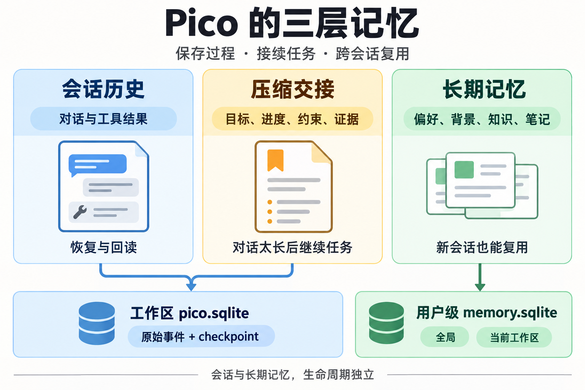
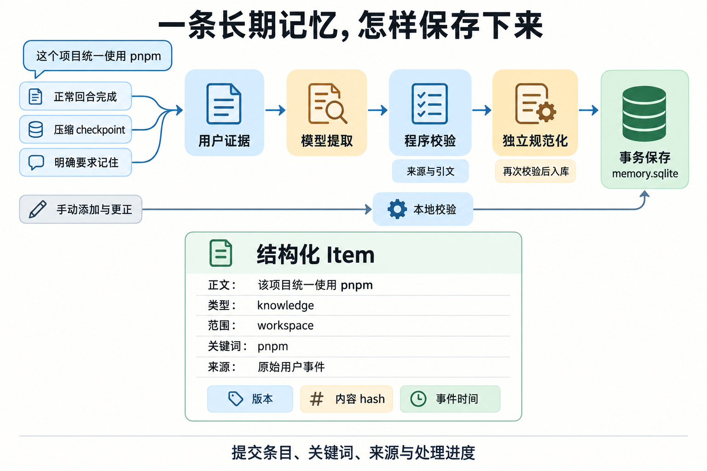
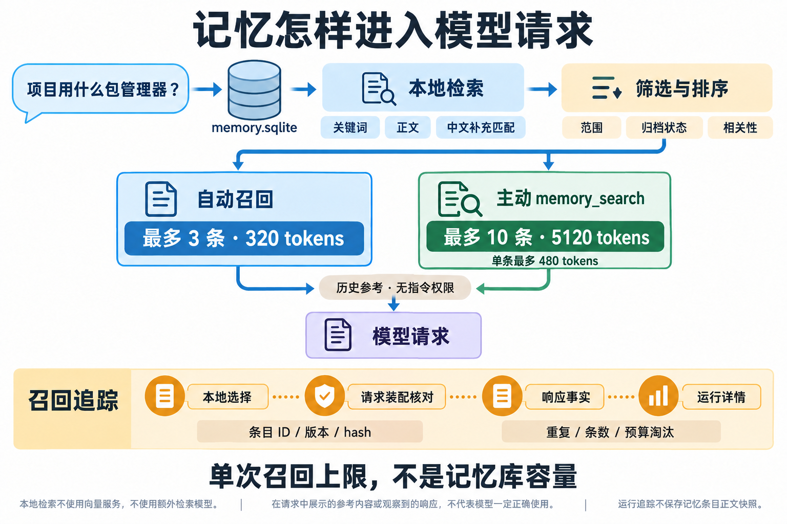

# Pico 记忆的设计与执行过程

Pico 将记忆拆成会话历史、压缩交接和长期记忆。长期记忆使用用户级 SQLite 数据库：模型从用户证据中提取，程序校验后保存；回答新问题时，本地检索挑选相关条目，按预算放进模型请求。这样既能延续任务，也能在新会话复用偏好和项目背景。

下面以“这个项目统一使用 pnpm”为例，解释当前实现。图中的条目是说明性示例。

**1. 三层记忆分别保存什么**

会话历史记录“发生过什么”：用户说了什么、助手做了什么、工具返回了什么、任务如何结束。它保存在工作区的 pico.sqlite，是恢复会话、回看执行过程和核验来源的依据。原始记录存在，不意味着每条都会进入下一次模型请求；请求还要经过上下文预算和历史投影。

压缩交接记录“这个任务怎样继续”：当前目标、已完成与未完成部分、决策、约束、下一步、必要文件和证据。它通过 checkpoint 改变后续模型读取的历史视图，原始事件仍可回读。它服务于当前任务的接续，不直接成为跨会话长期记忆。

长期记忆记录“以后还值得复用什么”：稳定偏好、身份信息、项目背景、知识、用户陈述的经验和参考笔记。它独立保存在当前用户 PICO_HOME 下的 memory.sqlite。会话与记忆的生命周期独立；删除会话不会自动删除已经提交的记忆，但被删除的原始来源无法继续回读。

压缩本身也可以触发长期记忆提取，但提取仍依据原始用户证据。压缩摘要不会被整段复制进记忆库作为已经证实的事实。

| 层次     | 典型内容                         | 使用范围               | 保存位置                  |
| -------- | -------------------------------- | ---------------------- | ------------------------- |
| 会话历史 | 用户消息、工具结果、执行事件     | 对应会话               | 工作区 pico.sqlite        |
| 压缩交接 | 当前任务的目标、决策、约束和证据 | 对应任务的后续执行     | 同一事件库中的 checkpoint |
| 长期记忆 | 用户偏好、项目背景、知识、笔记   | 跨会话，受条目范围限制 | 用户级 memory.sqlite      |

**2. 长期记忆按用户保存，条目再区分范围**

全局记忆可以在符合信任和运行策略的工作区之间复用，例如“用户更喜欢中文解释”。工作区记忆只在对应项目使用，例如“该项目统一使用 pnpm”。同一个项目新开会话，仍可以召回该项目的工作区记忆；切换到另一个项目，就不能把这条项目约定直接带过去。

数据库集中保存，并不代表所有条目在所有项目都可见。Host 绑定当前工作区身份，检索时只允许全局条目及当前工作区条目，归档条目不参与正常召回。

**3. 一条记忆由正文、元数据、关键词和来源组成**

长期记忆的基本单位是独立 Item。正文应该能单独使用，例如“该项目统一使用 pnpm”。系统没有只保存一段越来越长的总摘要。

| 字段组      | 保存的内容                                   | 用途                               |
| ----------- | -------------------------------------------- | ---------------------------------- |
| 正文和类型  | 正文；偏好、身份、背景、知识、失败经验、笔记 | 表达值得复用的信息                 |
| 陈述和时间  | fact、plan、prediction；时间点、区间或无日期 | 区分事实、计划与预测，保留时间条件 |
| 范围和状态  | global 或 workspace；active 或 archived      | 控制在哪里召回、是否继续召回       |
| 关键词      | 规范化的词项、实体、概念、路径等             | 支持本地词法检索                   |
| 来源        | Session、Run、Turn、事件身份                 | 回看支持当前内容的原始证据         |
| 版本和 hash | Item ID、version、contentHash                | 并发更正、识别内容变化、历史诊断   |

正文最多 2000 个 Unicode code point。这个存储上限与单次模型输入预算是两件事：一条可以保存完整正文的记忆，进入模型时可能只提供摘录，也可能因为自动召回预算不足而被跳过。

事件发生时间、证据观察时间和条目修改时间也不同。“今天编辑了这条记忆”不能证明其中描述的事实今天仍然有效。

**4. 写入时，模型理解语义，程序控制证据和提交**

当前写入入口有几类：普通回合正常完成后的后台提取；自动压缩 checkpoint 后的后台提取；用户明确要求记住时的 memory_remember；模型登记后台提取意图的 memory_extract；用户手动添加或更正；明确要求保存助手回复的参考笔记。

自动入口仍受记忆开关、自动提取开关、工作区信任、运行模式和工具授权约束。正常完成也不意味着一定保存新条目；可能没有值得长期保存的内容，或者候选没有通过校验。取消、失败和 recovered 终态不作为正常 completed 自动入口。

memory_remember 同步等待处理，以实际保存回执确认结果。memory_extract 的 accepted 只表示登记成功；之后还要等回合正常完成和后台处理，不能把它解释成“已保存”。

常规事实提取按以下顺序执行：

1. Host 冻结原始事件、实际可见的用户文本、执行边界和删除代次。
2. 辅助模型根据用户证据生成候选正文、类型、范围、关键词及来源引文。
3. 程序验证结构、来源、引文、时间边界和敏感内容。引文必须同时受到真实用户事件和可见用户文本支持。
4. 第二次辅助模型调用从用户引文独立规范化。它不直接沿用第一次候选的正文和关键词。
5. 程序再次校验，然后事务提交条目、关键词、来源、处理进度和回执。

有合法候选的正常路径通常有两次辅助模型调用。没有有效候选时可以不新增记忆。工具输出、助手猜测、隐藏控制消息不能直接充当用户事实的证据；助手文本可以帮助解释指代。

程序能够确认“这段引文来自哪个用户事件”，但不能保证模型对语义的理解永远正确。例如一段带否定或假设的话，仍需要模型准确理解它的含义。

手动添加和更正不走上述两次模型调用。用户要求保留助手回复时，Host 可以直接保存参考笔记，保留授权和回复来源，并明确标记“未经独立核实”。保存笔记并没有把助手的结论提升成已经验证的事实。

**5. 持久化不仅保存正文，也保存处理进度**

memory_items 保存 Item 主数据，memory_item_keys 保存检索词，memory_item_sources 保存当前内容的来源。其余业务表保存写入操作、提取 cursor、回执、失败范围、压缩策略拒绝和用户级设置。

内容与 cursor 一起提交，可以避免“已经写入内容，但进度没有推进，后续再次处理同一范围”。操作 ID 和请求 hash 支持幂等；更正通过 expectedVersion 检查并发版本。用户显式更正时会重建关键词、清除旧正文对应的来源，避免把旧引文继续当作新正文的证明。

这些机制解决重复执行和并发一致性，不等于语义去重。两次不同操作仍可能保存意思相近的条目。

**6. 召回采用本地检索，按问题选择参考**

新问题进入时，Builder 从当前问题生成词项、路径和中文双字信号，并组合关键词精确匹配、关键词前缀匹配、正文匹配和中文补充匹配。

正文匹配扫描所有可见的有效条目，再加载有界的匹配记录，不限于最近 500 条。最近 500 条窗口用于中文复合关键词补充和自动模式下最多一条通用偏好补位。它不是整个记忆库的容量上限。

合并候选后，再做范围和归档过滤、排序、有限的相同原文去重及预算筛选。关键词命中优先于纯正文命中，随后比较相关性和近期修改时间。这里没有额外检索模型、embedding 或向量服务。

| 入口          | 条数上限 | 总 token 上限 | 超出预算的处理                                |
| ------------- | -------- | ------------- | --------------------------------------------- |
| 自动召回      | 3        | 320           | 普通长条目放不下就跳过；助手笔记可以摘录      |
| memory_search | 10       | 5120          | 每条最多 480 tokens，返回与问题相关的原文片段 |
| 查询预览      | 不超过 3 | 不超过 320    | 复用自动 Builder，不记录真实运行召回事件      |

以上预算包含信任说明、引用标记、元数据和正文，不是纯正文容量。条数与 token 两种限制必须同时满足，因此结果可能少于 3 条或 10 条。

自动召回提供少量背景；自动参考不足时，模型可以调用 memory_search 主动查找。主动工具也有界，不会把全库塞给模型。这里的“可以调用”是模型可选的工具动作，不代表服务端在每次零命中后都会自动扩大预算。

例如用户问“项目用什么包管理器”，保存的 pnpm 条目在匹配和预算都满足时进入参考块。若问题只是“继续”，自动模式可能只补入通用偏好；相关知识也可能没有被选中。保存成功与本轮召回成功需要分别观察。

召回返回的是原文或原文摘录，片段标记它在原条目中的位置，不再用模型重新总结。所有参考都标记为低信任历史数据：可以帮助回答问题，但不能改变当前指令、权限、Provider、凭据或工具授权。

**7. 召回追踪回答为什么选中以及是否进入请求**

Builder 的诊断包括检索阶段返回数量、候选数量、选中 Item 的身份和版本、内容及引用 hash、匹配方式、摘录区间、预算和淘汰原因。淘汰区分 duplicate、item_limit 和 budget。

单次追踪最多 8 KiB，不额外保存查询词、关键词或记忆正文快照。选中身份最多 10 条；未选中诊断样本最多 24 条；每条最多 3 个来源指针，并保留总数。裁剪只影响诊断，不改变实际召回选择。

追踪先写入工作区 RuntimeEvent，再与真实逻辑调用关联。最终协议请求准备完成后，程序核对其中引用块或引用行的 hash，确认原始引用是否仍存在。主动搜索通过真实工具调用身份及引用匹配关联，不能靠时间邻近猜测。

| 观测           | 能确认的事实             | 仍不能确认                   |
| -------------- | ------------------------ | ---------------------------- |
| 本地选择已记录 | Builder 选中了哪些条目   | 它们已经出现在最终请求里     |
| 请求装配核对   | 最终请求包含哪些原始引用 | 请求已成功发出并收到响应     |
| 响应已观测     | 对应物理尝试已有响应事实 | 模型正确理解和使用了记忆     |
| 装配记录缺失   | 证据没有覆盖该步骤       | 不能据此判断引用存在或不存在 |

零命中只能说明这次流程没有匹配结果，不能直接解释成“这件事从未保存”。其他工作区、归档状态、同义改写和预算都需要区分；追踪也只解释实际进入候选流程的条目。

更正后可以识别“当前版本已变化”，但由于追踪没有正文快照，不能完整回放更正前正文。删除后保留历史诊断身份，当前条目不再可跳转；来源事件被删除也会失去回读入口。追踪写入失败不会额外触发模型重试或阻断正常召回，而会标记覆盖缺失。

**8. 压缩交接帮助当前任务延续**

现在的新摘要统一使用 sections_v2，要求 Goal、Progress、Key Decisions、Constraints、Next Steps、Critical Context 和 Evidence 七部分。它们分别保存目标、进度、决策原因、边界与禁止动作、下一步、恢复所需的细节和原始事件引用。

例如某种修复路线已经失败，交接应保留失败原因和再次尝试的条件；必要文件路径、命令和错误放入 Critical Context；成功检查必须能引用实际事件。

Host 校验事件存在、属于同一会话及合法覆盖范围，并从真实事件建立只读来源元数据。模型不能自行编造事件身份或机械执行事实。原始工具正文仍通过既有历史回读路径取得，不需要把它完整塞进摘要。

Goal、Todo、SessionTask 等最新状态继续由 Host 每步从各自 authority 读取。mid_turn 压缩折叠用户消息后，Host 可以在合法 checkpoint 的请求副本上追加任务锚和动态状态，避免靠旧摘要猜当前目标。

这保证格式、当前状态注入和来源完整性，语义是否正确仍需要模型续接验证。一个引用真实存在，并不自动证明摘要对它的解读正确。

**9. 执行证据验收帮助判断任务是否真的完成**

Goal 验收是只读判断，不属于长期记忆写入。生产路径冻结当前 Run 的证据包，包含有界的工具结果、最终回复、最近普通消息及覆盖信息。工具事实、来源身份和正文 hash 帮助验收器区分“声称完成”和“实际观察到完成”。

例如 Bash 打印“测试通过”却 exit 1，可信进程事实仍是退出码 1。工具调用正常返回输出，不等于命令通过。前序 Run 或压缩摘要可以提供背景，但本版不把它们当成当前 Run 的完成证明；跨 Run 的任务可以通过当前 Run 的最终检查取得新证据。

met=true 必须引用冻结证据包中的合法证据。执行类结论需要真实执行或产物证据。检查后又修改相关内容且没有新检查，应按证据不足处理。合法引用仍需要覆盖用户的目标条件，不能机械地把“有引用”转换成“目标完成”。

长期记忆、压缩交接和执行证据验收分别服务于背景复用、任务接续和完成判断。

**10. 用户管理和当前边界**

用户可以添加、更正、归档、恢复、删除及预览记忆。归档停止召回、保留正文；删除清理当前条目、关键词、来源和相关回执中的正文。删除代次在提交时复核，防止删除之前在途的提取任务把内容重新写回。重新提供信息或重新明确要求保存，仍可以形成新的写入。

用户级设置有总开关、自动提取开关和召回开关。关闭 autoExtract 不阻止符合条件的显式 memory_remember。Plan 和 Research 可使用读取；当前 Responses 路径可召回，但不支持辅助提取；未受信工作区和部分隔离子代理路径不装配记忆能力。

目前没有向量检索、通用语义去重、自动冲突裁决或完整失败学习管道。failure 只是内容类型，不代表系统会自动从所有失败 Run 中提炼工程经验。

“项目现在用 pnpm”与“项目后来改用 npm”可能同时存在。日期能帮助理解变化，但系统没有自动裁定哪个是最终约定；用户更正或归档能消除这类歧义。

模型提取需要辅助调用，读取是本地检索。提取回执记录结果，真实调用账本记录请求和费用；登记、保存、召回、请求装配和目标达成分别有自己的事实依据。

源码入口：

- [当前记忆架构](architecture/14-workspace-memory.md)
- [记忆技术指南](pico-memory-technical-guide.md)
- [召回 Builder](../packages/runtime/src/atomic-memory/context-builder.ts)
- [提取引擎](../packages/runtime/src/atomic-memory/extraction-engine.ts)
- [召回请求追踪](../packages/runtime/src/memory-recall-request.ts)

配图通过内置 image_gen 生成。完整提示词保存在 [prompts.json](assets/pico-memory-20261009/prompts.json)；三张图分别解释三层职责、证据写入、召回预算与追踪。
