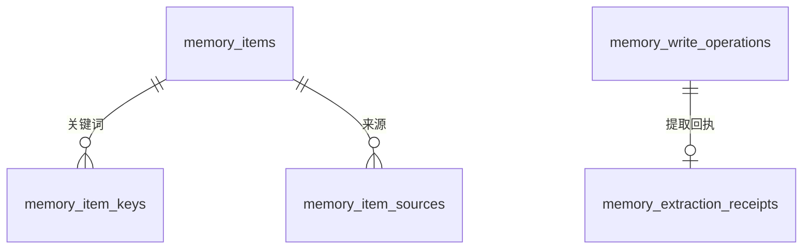
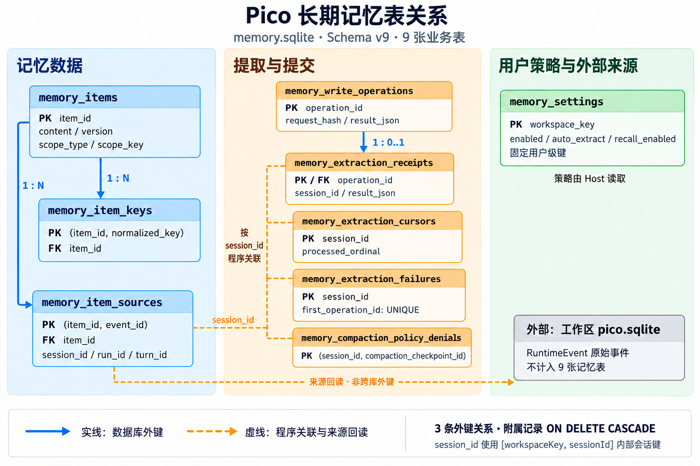

# Pico 长期记忆的数据表设计

Agent 要跨会话记住“这个项目统一使用 pnpm”，需要保存这条约定，也需要处理它的来源、适用范围、并发更正和后台提取进度。一次提取可能重复执行，用户可能在提取尚未结束时删除记忆，原始会话也可能被清理。这些情况共同决定了记忆库的数据结构。

Pico 将长期记忆存放在用户级 `memory.sqlite` 中。当前 Schema 为 v9，共 9 张业务表：3 张保存记忆数据，5 张保存处理过程，1 张保存用户策略。原始会话、工具执行事件、压缩 checkpoint、召回追踪和 Goal 验收仍存放在工作区 `pico.sqlite` 中。[建表定义](../packages/storage/src/sqlite/atomic-memory-schema.ts#L30)

下面以 pnpm 约定为例说明表之间的关系。文中的 Item ID、操作 ID 和事件序号均为示意值。

**一条记忆由正文、关键词和来源组成**

长期记忆的基本单位是 Item。一条 Item 表达一项可以独立使用的信息，例如“该项目统一使用 pnpm”。正文和元数据放在 `memory_items`，检索词放在 `memory_item_keys`，支持当前内容的原始事件身份放在 `memory_item_sources`。


三张表形成一对多关系。一个 Item 可以有多个关键词，也可以由多个来源事件支持：



图中表示数据库实际声明的外键关系。提取 cursor、失败范围和策略拒绝按会话身份关联，由程序协调，不属于这些外键关系。

| 分类     | 表                                 | 主要职责                   |
| -------- | ---------------------------------- | -------------------------- |
| 记忆数据 | `memory_items`                     | 保存当前记忆正文和元数据   |
| 记忆数据 | `memory_item_keys`                 | 保存规范化检索词           |
| 记忆数据 | `memory_item_sources`              | 保存支持当前内容的来源指针 |
| 处理过程 | `memory_write_operations`          | 记录写入操作，控制重复执行 |
| 处理过程 | `memory_extraction_receipts`       | 保存提取结果及结算统计     |
| 处理过程 | `memory_extraction_cursors`        | 保存会话已处理的事件水位   |
| 处理过程 | `memory_extraction_failures`       | 保留暂待重试的失败范围     |
| 处理过程 | `memory_compaction_policy_denials` | 记录特定压缩边界的策略拒绝 |
| 用户策略 | `memory_settings`                  | 保存共享开关及设置版本     |

下面的关系图覆盖全部 9 张业务表。实线表示 SQLite 已声明的外键，虚线表示 Host 按内部会话键协调的逻辑关联或来源回读。虚线不表示执行先后顺序，也不具备外键的级联删除语义。



其中，Item 到关键词及来源都是一对多；写入操作到提取回执是一对零或一，手动操作可以没有提取回执。原始 RuntimeEvent 在工作区数据库中，由 Host 回读；用户设置独立保存，不通过外键挂在 Item 或 Session 上。

**主表表达内容、范围和时间**

`memory_items` 一行对应一条当前记忆，使用 `item_id` 作为稳定主键。更正保留这个身份，发生实际修改时增加 `version`。

| 字段                                 | 设计含义                                                |
| ------------------------------------ | ------------------------------------------------------- |
| `item_id`                            | 稳定的记忆身份                                          |
| `version`                            | 当前版本，用于并发更正检查                              |
| `content`                            | 正文，由程序限制为最多 2000 个 Unicode code point       |
| `kind`                               | preference、identity、context、knowledge、failure、note |
| `statement_type`                     | fact、plan、prediction                                  |
| `temporal_type`                      | undated、point、interval、open_ended                    |
| `scope_type`、`scope_key`            | global 或 workspace，以及对应工作区身份                 |
| `event_started_at`、`event_ended_at` | 事件发生时间或有效区间                                  |
| `observed_at`                        | 支持证据的观察时间                                      |
| `lifecycle_state`                    | active 或 archived                                      |
| `origin`                             | agent_extracted 或 user_requested                       |
| `content_hash`                       | 当前正文 hash                                           |
| `created_at`、`updated_at`           | 创建和最近修改时间                                      |

假设普通回合提取出 pnpm 约定，其部分字段可以是：

```text
item_id          = m001
version          = 1
content          = 该项目统一使用 pnpm
kind             = knowledge
statement_type   = fact
temporal_type    = undated
scope_type       = workspace
scope_key        = 当前项目的 workspace key
lifecycle_state  = active
origin           = agent_extracted
```

库属于当前用户，适用范围属于每条 Item。全局条目可以在符合策略的工作区之间复用，工作区条目只在对应项目中使用。数据库用 CHECK 约束固定这一关系：global 必须搭配空 `scope_key`，workspace 必须搭配非空 `scope_key`。

陈述类型让“已经使用 pnpm”“计划迁移到 pnpm”“预计迁移后构建更快”分别表达为事实、计划和预测。时间字段则区分无日期、时间点、区间和开放结束时间。数据库会拒绝无日期条目带事件时间，以及结束时间不晚于开始时间的非法区间。

事件时间、观察时间和修改时间各有含义。今天编辑了一条旧约定，只能说明条目今天改过，不能由此判断约定今天发生或仍然有效。

`version` 服务于并发控制，当前没有完整的 Item 正文版本历史表。`content_hash` 也没有唯一约束；不同操作可以创建同文或相近条目。它用于内容身份检查，不自动完成语义去重。

**关键词和来源分别服务于检索与核验**

`memory_item_keys` 的字段为 `item_id`、`key_text`、`normalized_key`、`key_type` 和 `key_origin`。同一条记忆可以保存多行：

| item_id | key_text | normalized_key | key_type |
| ------- | -------- | -------------- | -------- |
| m001    | pnpm     | pnpm           | exact    |
| m001    | 包管理器 | 包管理器       | concept  |

关键词类型包括 exact、entity、concept、alias 和 code；来源包括程序生成、模型生成和用户输入。主键为 `(item_id, normalized_key)`，防止同一 Item 重复保存同一个规范化词。

将检索词拆成行后，数据库可以按词建立索引并取得对应 Item。关键词缺失时，读取器仍可以通过正文匹配补充召回。

`memory_item_sources` 的字段为 `item_id`、`session_id`、`run_id`、`turn_id` 和 `event_id`，主键为 `(item_id, event_id)`。来源表保存事件身份，原始对话正文仍留在工作区事件库。

记忆侧的 `session_id` 使用内部会话键，编码了 `[workspaceKey, sessionId]`，避免不同项目的同名会话混用来源和提取进度。用户手动添加可以没有来源；保存助手参考笔记时，则可以保留用户授权与助手回复的双来源。

关键词表和来源表都通过外键引用 `memory_items`，并启用 ON DELETE CASCADE。删除 Item 时，两类附属行随之删除。原始会话属于另一个数据库，来源有效性与跳转权限由 Host 检查，没有跨库外键。

来源描述的是当前内容。用户更正正文时，系统重建关键词并清除旧内容对应的来源，避免把旧引文继续当成新正文的依据。删除原始会话不会自动删除已提交记忆，但来源原文会失去回读入口。

**写入操作账本与提取回执表达不同结果**

后台提取和同步 remember 都可能遇到“数据库提交成功，调用方未收到结果”的情况。再次执行时，需要识别这是同一次操作，而不是重新创建记忆。

`memory_write_operations` 用 `operation_id` 作为主键，保存：

```text
operation_id
operation_type
request_hash
result_json
committed_at
```

操作类型包括 create、update、archive、restore、batch 和 delete。操作 ID 相同且请求 hash 相同时，调用可以复用已有结果；操作 ID 相同但请求内容不同，则拒绝，避免同一个身份代表两次不同动作。操作结果主要记录条目 ID、版本和生命周期等信息。

`memory_extraction_receipts` 保存提取的业务结果，字段是 `operation_id`、`session_id`、`request_hash`、`result_json` 和 `committed_at`。其 `operation_id` 同时作为主键和指向写入账本的外键，因此一次操作最多有一张提取回执；普通手动写入不需要提取回执。

回执的 JSON 可以表达以下状态：

| 状态           | 含义                                 |
| -------------- | ------------------------------------ |
| remembered     | 明确要求保存的条目已提交             |
| not_applicable | 没有保存适用的请求内容               |
| extracted      | 自动提取范围已结算，可能没有新增条目 |
| skipped        | 因策略或删除等原因跳过               |
| discarded      | 失败范围已丢弃并结算                 |

回执还可以包含实际保存的 requestedItems，以及创建数量、模型调用次数和耗时等 summary。requestedItems 可能带正文，所以删除 Item 时也必须清理这些副本。

写入账本解决重复执行，提取回执解释业务结果。提取回执中的调用统计只覆盖相应结算记录，实际模型请求及费用仍由物理调用账本记录。

**cursor 和失败范围让提取按边界恢复**

`memory_extraction_cursors` 每个会话保存一行，字段是 `session_id`、`processed_ordinal` 和 `updated_at`。其中 `processed_ordinal` 表示已经处理或结算到的事件序号。

假设 cursor 为 20，本次处理 21～35。提交成功后，cursor 推进到 35。即使没有提取出新条目，这段范围也可以正常结算并推进；否则系统会反复检查同一段没有长期信息的对话。

提交还要检查数据库中的当前水位是否等于任务捕获的预期水位。任务认为起点是 20，但另一个任务已推进到 35 时，旧任务必须拒绝提交。这个检查称为 compare-and-swap，即比较预期值后再更新。

`memory_extraction_failures` 为每个会话保留当前暂待重试的失败范围，使用 `session_id` 作为主键：

| 字段                              | 恢复时的作用                              |
| --------------------------------- | ----------------------------------------- |
| `from_ordinal`、`through_ordinal` | 固定失败的覆盖范围                        |
| `coverage_hash`                   | 检查恢复时是否仍为相同内容范围            |
| `first_operation_id`              | 识别首次失败操作，具有唯一约束            |
| `first_trigger`                   | 保留 remember、extract 或 compaction 语义 |
| `compaction_checkpoint_id`        | 为 compaction 提供恢复入口                |
| `first_failure_class`             | 保存首次失败类别                          |
| `failed_at`                       | 记录失败时间                              |
| `deletion_revision`               | 保存捕获时的删除代次                      |

这是待处理状态，不是所有失败事件的历史日志。首次失败保留范围供后续触发处理；同一首次操作重放复用已有状态。后续重试成功会清除该行，匹配范围的后续失败可以结算为 discarded、清除失败行并推进 cursor。

恢复必须保留原始触发方式。例如自动压缩产生的失败范围，不能借后续明确 remember 的机会悄悄改变其策略要求。

**压缩拒绝与用户设置保存授权边界**

`memory_compaction_policy_denials` 保存 `session_id`、`compaction_checkpoint_id` 和 `denied_at`，主键是 `(session_id, compaction_checkpoint_id)`。它记录某个压缩边界曾经被记忆策略拒绝，供后续恢复检查。

例如自动提取关闭时发生压缩，该边界已经没有提取准入。后来开启开关，不会使这个旧范围自动获得新的授权。

`memory_settings` 保存 `workspace_key`、`version`、`enabled`、`auto_extract` 和 `recall_enabled`。当前程序实际使用固定键 `__pico_user_memory_settings__`，三个开关在同一用户的项目之间共享；条目的 global/workspace 范围独立控制。

总开关控制记忆提取和召回；auto_extract 控制自动提取，不阻止符合条件的显式 remember；recall_enabled 控制自动注入、主动搜索和查询预览。设置修改检查版本，避免并发覆盖。

**一次提取在同一事务中提交内容和进度**

九张表的协调集中在提交阶段。辅助模型调用在提交事务之外完成；结果通过校验后，存储层才开启短事务。

仍以事件 21～35 为例：程序得到一条合法 pnpm 记忆，预期 cursor 为 20，并持有捕获时的删除代次。提交顺序可以概括为：

```text
BEGIN IMMEDIATE
  检查 operation_id 是否已执行
  检查删除代次是否仍一致
  检查 cursor 是否仍为预期水位 20
  校验待重试范围（若存在）

  创建 memory_items
  写入 memory_item_keys
  写入 memory_item_sources
  将 cursor 推进到 35
  清除对应待重试失败
  写入 memory_write_operations
  写入 memory_extraction_receipts
COMMIT
```

任一步失败，事务回滚。这样内容、来源、进度和结果对外同时可见，不会出现条目保存成功却没有来源，或进度已经推进却没有保存条目的状态。[提取提交实现](../packages/storage/src/sqlite/sqlite-memory-item-store.ts#L327)

更正采用同样的版本检查思想：实际修改使用 `WHERE item_id = ? AND version = ?` 条件，同时更新正文、元数据、关键词和来源。版本不匹配就拒绝；内容没有变化时可以返回 noop。

幂等、cursor 检查和版本检查分别保护不同维度：操作是否重复、会话范围是否过期、条目更正是否覆盖了新版本。它们不自动判断两条不同记忆的含义是否相同或矛盾。

**删除要清理副本并使在途任务失效**

删除 Item 时，存储层检查操作身份和条目版本，在事务内清理提取回执中对应的 requestedItems，删除主表行，通过外键级联删除关键词和来源，再追加 delete 操作账本。历史观测计数可以保留，相关正文副本则需要清理。

删除代次由 `memory_write_operations` 中 delete 操作的累计数量取得。后台快照保存旧代次，提交前重新比较；用户在它执行期间删除了记忆，旧任务就不能继续按原快照提交。这个代次覆盖整个用户记忆库，不只影响被删除的那条 Item。[删除与代次检查](../packages/storage/src/sqlite/sqlite-memory-item-store.ts#L1265)

逻辑删除提交后，程序还尝试通过 SQLite checkpoint 收拢 WAL 中的旧数据；读取连接繁忙时，物理清理可能不能立即完成，但不能将已经提交的逻辑删除误报为回滚。

这套机制避免删除之前的在途任务重新写回。之后用户重新提供信息或明确要求保存，仍可以形成新记忆。原始会话、既有执行记录和外部备份有独立生命周期。

**索引支持当前查询路径**

当前建表定义提供以下显式索引：

| 索引字段                                                           | 主要查询用途                         |
| ------------------------------------------------------------------ | ------------------------------------ |
| `normalized_key, item_id`                                          | 按关键词找到记忆                     |
| `event_id, item_id`                                                | 回查某事件关联的记忆                 |
| `session_id, turn_id, item_id`                                     | 按来源会话和 Turn 查条目             |
| `scope_type, scope_key, lifecycle_state, updated_at DESC, item_id` | 按范围、状态和更新时间列出条目       |
| `operation_type`                                                   | 查询指定类型的操作，包括删除代次计数 |

复合主键保证附属记录唯一，范围与时间的 CHECK 约束拒绝非法字段组合。记忆库使用 WAL、FULL 同步和外键约束，支持事务持久化及附属数据清理。

正文召回目前扫描可见 active Item 并进行本地词法评分，没有 FTS 表或向量表。当前也没有完整正文版本历史、通用语义去重或自动冲突裁决。

这套数据结构把语义判断、来源核验、可靠提交和恢复进度分别落实到明确的接口与表上：模型决定候选表达，程序验证证据与字段，数据库保证内容和处理状态一致。

相关实现：

- [长期记忆建表与约束](../packages/storage/src/sqlite/atomic-memory-schema.ts)
- [事务 幂等 更正与删除](../packages/storage/src/sqlite/sqlite-memory-item-store.ts)
- [记忆条目与提取回执契约](../packages/core/src/atomic-memory-contracts.ts)
- [用户证据校验与规范化](../packages/runtime/src/atomic-memory/extraction-engine.ts)
- [记忆整体图文讲解](pico-memory-explained-image.md)
