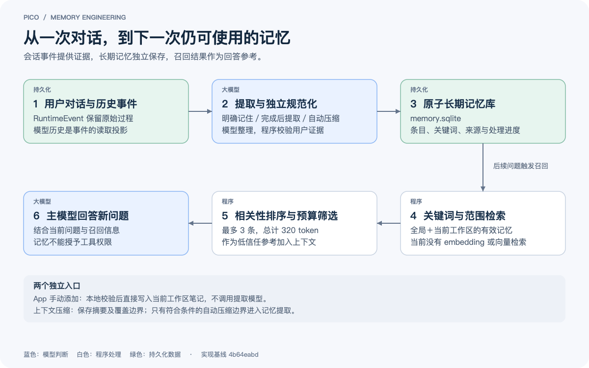
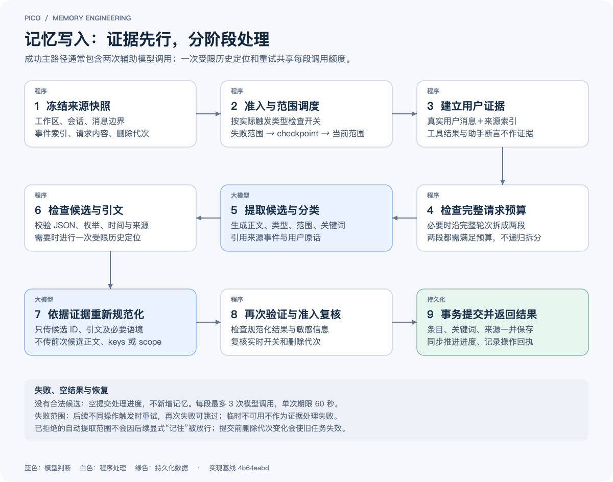
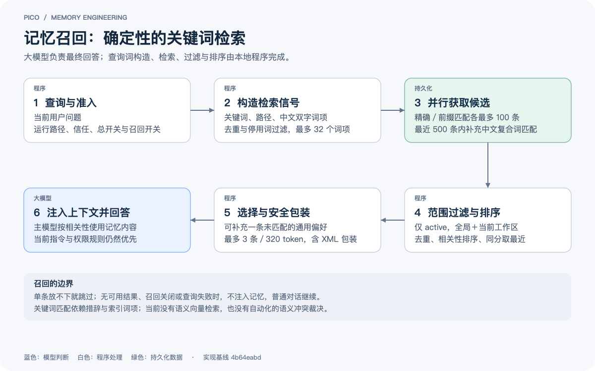

# Pico 的长期记忆：从用户证据到可恢复的写入与按需召回

> 本文于 2026-09-08 核对至代码基线 **97cc2a55**。配图保留最初绘制时的基线 **4b64eabd**；图示主流程在本次核对版本中仍成立。面向希望理解 Agent 记忆工程实现的开发者。配图中，蓝色表示模型处理阶段，白色表示程序处理，绿色表示持久化数据。

用户告诉 Agent：“这个项目统一使用 pnpm。”如果每次新建会话都需要重复这句话，Agent 就很难形成连续的工作体验。长期记忆要做的，是把这类信息整理成可以复用的背景，在之后的问题需要它时重新提供给模型。

Pico 将这个过程拆成两条链路：**写入时，由模型理解信息，由程序验证证据并可靠保存；读取时，由本地程序匹配相关条目，再交给主模型作为回答参考。** 两条链路共用一个原子记忆库，手动管理也操作同一份数据。

这里的“原子”有两个含义：内容是一条可以独立使用的记忆；提交时，相关条目、来源和处理进度通过事务保持一致。它不表示一条记忆的含义已经被证明绝对正确。

_图 1：用户对话提供证据，记忆库保存独立条目，后续问题通过检索使用这些条目。[查看矢量图](images/pico-memory/overview.svg)_

## 1. 先区分会话历史、上下文压缩与长期记忆

这三者经常出现在同一条执行链路上，但它们解决的问题不同。

| 层次       | 保存或表示的内容                                       | 在 Pico 中的职责                             |
| ---------- | ------------------------------------------------------ | -------------------------------------------- |
| 会话历史   | 用户消息、助手消息、工具结果、Run 和 checkpoint 等事件 | 保留执行过程，为恢复、展示和证据核验提供依据 |
| 上下文压缩 | 一段模型历史的摘要及其覆盖边界                         | 控制当前请求的长度，改变后续模型读取视图     |
| 长期记忆   | 偏好、身份、背景、知识、经验和笔记                     | 跨会话复用值得保留的信息                     |

会话事件保存在工作区的 **pico.sqlite**，长期记忆保存在用户级 **$PICO_HOME/memory.sqlite**。压缩通过 checkpoint 改变模型历史的投影，不直接改写原始聊天事件，也不把摘要直接当成长期记忆。

因此，“项目统一使用 pnpm”可以同时存在于聊天历史和某条长期记忆中，但二者的生命周期独立。删除长期记忆不会删除那句聊天原话；删除会话也不会自动删除已经提交的记忆条目。

## 2. 什么会触发记忆写入

Pico 当前提供三种模型提取入口，以及一条不经过模型的手动保存路径。

| 入口                           | 触发与执行时机                                         | 返回结果的含义                                       |
| ------------------------------ | ------------------------------------------------------ | ---------------------------------------------------- |
| **memory_remember({})**        | 用户明确要求记住，主对话模型调用工具，同步等待处理完成 | 以实际保存回执为准，不能把发起请求当成保存成功       |
| **memory_extract({})**         | 主模型登记本轮后台提取意图；本轮正常完成并落盘后执行   | accepted 只表示请求已登记                            |
| **自动压缩 checkpoint**        | checkpoint 保存覆盖边界和记忆准入结果，再触发后台处理  | 不必等待当前 Run 结束，也不要求先调用 memory_extract |
| **App 添加记忆／手动保存命令** | 本地校验后直接写入当前工作区的 note                    | 不调用提取和规范化模型                               |

两个模型工具都严格无参。memory_remember 必须在独立工具步骤中单独调用；与其他工具混合调用会被运行时拒绝。主模型负责决定是否触发，而不是通过工具参数任意提交一段“记忆正文”。系统会从宿主捕获的消息与事件中重新取得证据。

这也解释了“意图识别”发生在哪里：当前没有额外的独立意图分类模型。主对话模型根据用户请求和工具说明决定调用哪个入口；辅助模型随后负责提取内容并分类；程序检查结果是否合法。

后台提取不是每轮必定执行。通过 memory_extract 登记的请求只有遇到正常 completed 终态才继续，失败、取消和恢复生成的终态不会通过这个入口提取。不过，此前同步保存或自动压缩提取已经提交的记忆，不会因为本轮后来失败而撤销。

## 3. 从原始消息提取一条有来源的记忆

_图 2：提取按处理范围执行；模型负责理解，程序负责来源约束、预算、校验和提交。[查看矢量图](images/pico-memory/extraction.svg)_

### 冻结输入，而不是让后台任务重新猜测“当时的对话”

前台请求进入后台处理前，Runtime 会固定工作区、会话、Run、Turn、事件边界、源消息和删除代次。当前模型请求中的消息还带有临时的事件身份，捕获快照时将其转换为事件到消息位置的索引。

这个索引回答的是：“事件 A 对应提取请求前缀里的第几条消息？”它减少了用户正文在证据载荷中的重复传递，也避免只依靠相似文本猜测消息来源。

索引并不扩大证据权限。引文仍须同时受到原始事件和实际可见用户文本的支持；无索引时才回退到受约束的文本匹配。工具结果、隐藏控制消息、模型思考和附件不作为正式用户证据。助手文本可以帮助解释“刚才那个方案”等指代，但不能独立证明某个用户事实。

### 先提候选，再独立规范化

第一阶段，辅助模型根据用户证据生成结构化候选。下面是一个示意候选，其中事件 ID 为占位值：

    {
      "content": "该项目统一使用 pnpm。",
      "kind": "knowledge",
      "statementType": "fact",
      "temporalType": "undated",
      "eventStartedAt": null,
      "eventEndedAt": null,
      "scope": "workspace",
      "keys": [{ "key": "pnpm", "type": "exact" }],
      "evidence": [{
        "sourceRef": "event:example-user-event",
        "quote": "这个项目统一使用 pnpm。"
      }]
    }

程序随后检查 JSON 结构、枚举、时间范围、来源引用和逐字引文，并处理敏感内容。不能接受的候选不会直接入库。明确请求的内容若无法成立，需要反映到本次结果中；后台发现的附带候选则可以被过滤。

如果候选依赖缺失的历史指代，模型可以请求一次窄范围定位。定位由程序执行，最多覆盖 7 个历史轮次。用于解释指代的语境每条最多取 2000 个 Unicode code point，序列化后再截取最多 12000 个 JavaScript 字符单元；用户证据另行适配载荷预算，完整请求仍受模型窗口检查。辅助模型随后结合补充信息提取。这个路径不会无限向历史追溯。

第二阶段，系统进行一次独立规范化。传入的是候选 ID、用户引文、观察时间，以及必要的指代语境；不会直接传入第一次生成的候选正文、关键词、范围或整段源会话。

这样做，是为了让第二阶段重新依据用户证据形成最终内容，减少第一次提取中的猜测被直接沿用。规范化后的正文、类型、关键词和范围仍然需要程序再次校验。workspace key 由宿主绑定，模型不能指定另一个工作区作为写入目标。

通常，有合法候选的成功主路径包含两次辅助模型调用。没有有效证据或合法候选时，可以不新增记忆而只推进已经检查过的范围。程序验证能够证明来源存在、结构符合约束，但不能保证模型对语义的理解永远正确。

### 分类属于模型判断，字段边界属于程序约束

| 字段                    | 当前取值                                                | 作用                                       |
| ----------------------- | ------------------------------------------------------- | ------------------------------------------ |
| 内容类型 kind           | preference、identity、context、knowledge、failure、note | 区分偏好、身份、背景、知识、失败经验和笔记 |
| 陈述类型 statementType  | fact、plan、prediction                                  | 区分已陈述事实、计划和预测                 |
| 时间类型 temporalType   | undated、point、interval、open_ended                    | 表达无日期、时间点、区间和开放结束时间     |
| 适用范围 scopeType      | global、workspace                                       | 控制跨工作区使用或限定当前工作区           |
| 生命周期 lifecycleState | active、archived                                        | 控制是否参与召回                           |

“失败经验”只是内容分类，当前没有因此自动启动“所有失败 Run 的经验蒸馏”。条目正文上限为 2000 个 Unicode code point。时间信息必须保留不确定性，不能为了补齐字段编造精确日期。

## 4. 提取请求也需要预算控制

证据载荷很短，不代表完整模型请求很短。源会话前缀、工具定义、提取提示词和输出预留都会占用容量。

Pico 在每次辅助请求前估算：**输入消息 token＋实际发送的工具定义 token＋输出预留＋安全余量，是否超过已知模型窗口。** 提取、历史定位后的提取和规范化都经过检查；规范化阶段不携带源会话前缀和工具定义。

如果当前范围过大，系统尝试在完整 Run／Turn 边界拆成两段。两段都满足预算才继续，且不递归拆分；明确记住的当前请求保留在后段，前段按附带提取处理。仍然放不下的范围进入失败结算，不靠反复发送相同超长请求解决。

每个处理段最多允许 **3 次辅助模型调用**，提取、补充提取、规范化与重试共同消耗这份额度，单次调用有 **60 秒期限**。一次触发可能恢复多个 checkpoint 或处理多个段，所以三次不是整个触发的全局上限。

模型窗口未知时，本地不凭空认定请求超限，最终仍以 Provider 结果为准。预算检查是发送前估算，并非厂商计费 token 的精确复现；Provider 报告窗口溢出后，不原样重复该请求。记忆调用以 memory_review 单独记录用量，默认沿用当前 Provider 和模型配置。

## 5. 一个数据库，保存内容，也保存处理进度

当前原子记忆库使用 SQLite，Schema 为 v9，共 9 张业务表。它们不是九种“记忆”，而是内容数据及其配套执行记录。

| 表                               | 保存的内容                                       |
| -------------------------------- | ------------------------------------------------ |
| memory_items                     | 正文、类型、范围、生命周期、版本和时间等主数据   |
| memory_item_keys                 | 用于检索的关键词、类型和来源                     |
| memory_item_sources              | 支持当前记忆的会话、Run、Turn 和事件身份         |
| memory_write_operations          | 写入操作身份、请求 hash 和结果，用于幂等控制     |
| memory_extraction_cursors        | 每个会话已经处理到的事件序号                     |
| memory_extraction_receipts       | 提取操作的结果回执                               |
| memory_extraction_failures       | 当前待重试范围、首次失败原因、触发类型与删除代次 |
| memory_compaction_policy_denials | 自动压缩范围的策略拒绝记录                       |
| memory_settings                  | 按工作区保存的记忆开关                           |

提取提交时，系统在一个事务中写入记忆、关键词、来源、进度和回执，避免出现“内容写入成功，进度却没有推进”的中间状态。

同一个会话在进程内串行处理，前台 remember 优先于尚未开始的后台任务，但不会抢占已经执行的任务。跨连接并发仍需要数据库约束：修改检查 expected version，提取提交检查预期 cursor。操作 ID 和请求 hash 用于识别重复操作，重复执行可以读取已有回执。

幂等不等于语义去重。当前系统没有通用的语义重复合并、矛盾裁决或新记忆自动覆盖旧记忆；不同操作仍可能保存内容相近的条目。手动添加相同正文有单独的复用行为，不能推广为整个系统都具备自动去重。

新库直接创建当前结构，不逐级执行历史迁移脚本。已有兼容版本库校验后打开；不兼容结构明确拒绝打开，不自动升级或清空。生产记忆路径不再导入旧 Fact／Proposal 数据。

## 6. 恢复边界：允许重试，也必须记得当时的拒绝

自动压缩 checkpoint 同时保存覆盖终点及记忆准入结果：**eligible** 表示允许后续恢复处理，**policy_denied** 表示当时策略拒绝这个范围。

这两个字段与 checkpoint 一起持久化，解决了一个具体窗口：摘要和覆盖边界已经落盘，但后台回调尚未执行时进程退出。下次触发不必依赖那次回调是否成功，仍可知道这个范围应恢复还是应跳过。

eligible 只说明范围可以成为恢复候选，不代表已经保存，也不代表以后永远允许写入。每个范围按自己的实际触发类型检查当前策略，模型调用及提交前也会复核。关闭自动提取后再明确要求“记住新内容”，不会顺带放行旧的自动提取范围。

恢复顺序是：先处理待重试失败范围，再处理尚未覆盖的可恢复 checkpoint，最后处理本次剩余范围。被拒绝或已失效的范围可以通过空提交结算。没有记忆标记的手动压缩、旧 checkpoint 和 fork 引导摘要，不会独立成为自动提取任务；首次游标建立时可按条件使用其引导边界。

| 情况                           | 系统处理                                                       |
| ------------------------------ | -------------------------------------------------------------- |
| 本段模型处理失败且额度耗尽     | 记录失败范围，等待后续不同操作触发重试                         |
| 原失败范围重试后仍失败         | 可以记录 discard 并推进进度，避免长期阻塞后续内容              |
| 临时存储／配置不可用或正在退出 | 返回不可用，不将其归为用户证据处理失败                         |
| 记忆准入判定临时异常           | 普通 checkpoint 仍可提交，留下 eligible 候选；后续重新检查策略 |
| 模型完成前用户删除了记忆       | 删除代次不匹配，旧任务不能提交                                 |

后台队列本身没有持久化，因此崩溃恢复不是启动时扫描并重放所有 completed Run，而是在后续触发时根据进度、失败范围和 checkpoint 补齐可恢复内容。正常退出会停止新的 remember／extract 准入，并等待已登记任务及模型资源收尾；强制终止仍可能打断任务。

## 7. 获取记忆：关键词匹配，按预算进入上下文

_图 3：当前召回完全由本地程序完成。没有 embedding、向量库或用于检索的额外模型调用。[查看矢量图](images/pico-memory/recall.svg)_

每轮组装模型上下文时，Runtime 使用当前用户问题构造路径、词项和中文双字查询。用于索引查询的信号去重后最多取 32 个词项；后续中文补充匹配与相关性评分仍使用构造出的完整信号。

程序并行查询关键词精确匹配、前缀匹配，并读取一个有界的近期条目窗口。精确和前缀查询各最多取 100 条；近期窗口最多 500 条，用于补充中文复合关键词匹配和通用偏好。中文补充匹配要求至少命中两个不同的有效双字词项，减少零散汉字产生的误匹配。

随后过滤出 active 状态的全局条目和当前工作区条目，按 item ID 去重，计算相关性并排序。路径信号权重高于普通词项，同分优先最近更新的条目。此外，剩余容量允许补充最多一条未命中的通用 preference；其他未匹配知识不会因此被普遍注入。

最终最多选取 **3 条、合计 320 token**，正文和 XML 包装一起计算。某条放不下就跳过，继续考虑后面的候选。结果放入带有低信任标记的参考区，随本轮上下文交给主模型。

低信任意味着没有指令权限：记忆可以提供事实背景，但不能授予工具访问权，不能修改 Provider 或凭据配置，也不能覆盖当前用户指令与安全规则。召回关闭、无可用候选或查询异常时不注入记忆，普通对话继续。

这种实现的优点是无需额外 embedding 服务，运行成本与排序依据较容易理解。它的限制也很明确：措辞变化较大、关键词没有覆盖时，语义相关的记忆可能无法命中。当前能力不能描述成语义向量检索；是否增加混合检索，应通过真实召回样本评估，而不是因为记忆功能存在就默认需要向量化。

## 8. 用户管理与执行边界

App 记忆页提供添加、编辑、已保存／已归档列表、归档、恢复、删除，以及按工作区生效的总开关、自动提取开关和召回开关。前端不再请求审核列表，也不维护审核建议、审核预算或批准／拒绝动作。后端仍保留旧审核协议的兼容响应：列表为空，审核操作返回不支持。

手动添加直接经过本地校验，保存为当前工作区 note。系统按工作区和规范化正文生成创建操作身份；如果该操作记录指向的条目仍存在且正文一致，就复用它，已归档时恢复。它不扫描全库查找所有同文条目，也不合并模型提取的相似内容。手动保存也不会绕过后续相关性筛选，因此添加成功不等于每一轮都会注入。

归档停止召回但保留正文。删除清理当前条目、关键词、来源和相关回执中的正文，但不删除原始聊天，也不保存旧来源黑名单。之后重新提供信息或明确要求记住旧聊天内容，可以再次保存。

为防止删除前已经在途的提取把内容写回来，快照带有删除代次，事务提交及失败结算时重新检查。当前代次是整个用户记忆库级别：一次删除会使该库中所有旧代次的提取任务失效，新任务正常处理。它不是永久遗忘机制，也不等于删除外部备份。

能力还受到运行路径限制。当前 Plan 可以召回但不装配提取工具；Graph operator、普通子代理和隔离 headless 不注入或提取记忆；Responses Provider 可以在符合条件时召回，但提取工具返回 provider_unsupported。旁路对话和后台 Automation 不因会话类型单独禁用记忆，仍要满足信任、开关及任务工具授权。

这些边界必须体现在技术说明和产品结果中：请求被接受、内容已经保存、保存后能够被召回，是三个不同状态。Pico 用工具回执、数据库事务和召回筛选分别表达它们。

## 9. 从哪里继续阅读实现

| 关注点                       | 当前代码                                                                                                                                                   |
| ---------------------------- | ---------------------------------------------------------------------------------------------------------------------------------------------------------- |
| 生产装配、运行路径与召回注入 | [agent-runtime.ts](../src/runtime/agent-runtime.ts)                                                                                                        |
| 快照、工具触发与后台生命周期 | [atomic-memory-runtime.ts](../src/runtime/atomic-memory-runtime.ts)、[atomic-memory-lifecycle.ts](../src/runtime/atomic-memory-lifecycle.ts)               |
| 提取、范围调度、规范化与恢复 | [extraction-engine.ts](../src/memory/atomic/extraction-engine.ts)                                                                                          |
| 用户证据与模型输出协议       | [extraction-evidence.ts](../src/memory/atomic/extraction-evidence.ts)、[extraction-proposal.ts](../src/memory/atomic/extraction-proposal.ts)               |
| 完整辅助请求预算             | [extraction-budget.ts](../src/memory/atomic/extraction-budget.ts)                                                                                          |
| checkpoint 与记忆边界持久化  | [runtime-compaction-checkpoint.ts](../src/context/runtime-compaction-checkpoint.ts)                                                                        |
| SQLite 数据结构与事务        | [atomic-memory-schema.ts](../src/storage/sqlite/atomic-memory-schema.ts)、[sqlite-memory-item-store.ts](../src/storage/sqlite/sqlite-memory-item-store.ts) |
| 关键词召回与上下文预算       | [context-builder.ts](../src/memory/atomic/context-builder.ts)                                                                                              |
| App 记忆管理                 | [desktop-atomic-memory-service.ts](../src/daemon/desktop-atomic-memory-service.ts)                                                                         |

相关集成测试覆盖证据来源、请求预算、checkpoint 恢复、删除代次、跨会话召回和手动管理；真实模型场景见 [atomic-memory-behavior.real-llm.test.ts](../tests/e2e/atomic-memory-behavior.real-llm.test.ts)。测试用于验证具体行为，不代表语义理解准确率已经获得全面保证。
