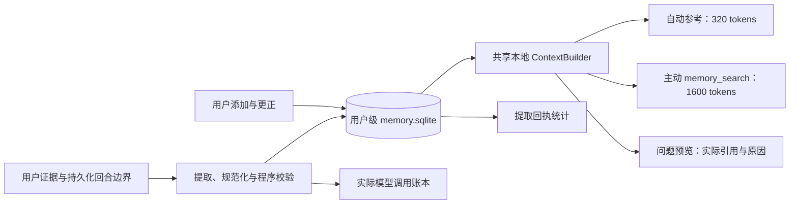
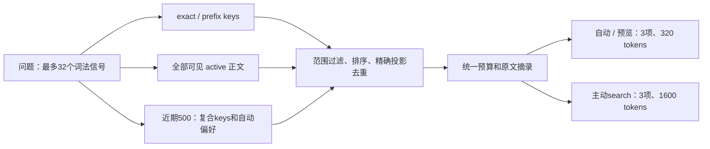

# Pico 的长期记忆：用户证据、本地检索与可更正的记忆

> 本文于 2026-10-08 按改造后的实现核对，面向理解记忆工作过程的开发者。模块职责、公开接口及统计口径见[当前架构](architecture/14-workspace-memory.md)，测试与性能结果见[验收记录](plans/2026-10-08-memory-acceptance.md)。

用户告诉 Agent：“这个项目统一使用 pnpm。”如果每次新建会话都需要重复这句话，Agent 就很难形成连续的工作体验。长期记忆要做的，是把这类信息整理成可以复用的背景，在之后的问题需要它时重新提供给模型。

Pico 将这个过程拆成写入、读取、用户管理和观测四条链路：**模型从用户证据提取，程序校验后保存；本地检索按当前问题提供有预算的原文；用户显式更正内容和日期；回执与实际模型账本分别解释提取结果和费用。** 它们使用同一个原子记忆库，自动注入、主动搜索和查询预览共用一个读取器。

这里的“原子”有两个含义：内容是一条可以独立使用的记忆；提交时，相关条目、来源和处理进度通过事务保持一致。它不表示一条记忆的含义已经被证明绝对正确。

```mermaid
flowchart LR
  events["用户证据与持久化回合边界"] --> extraction["提取、规范化与程序校验"]
  extraction --> db[("用户级 memory.sqlite")]
  management["用户添加与更正"] --> db
  db --> builder["共享本地 ContextBuilder"]
  builder --> automatic["自动参考：320 tokens"]
  builder --> search["主动 memory_search：1600 tokens"]
  builder --> preview["问题预览：实际引用与原因"]
  db --> metrics["提取回执统计"]
  extraction --> ledger["实际模型调用账本"]
```

## 1. 先区分会话历史、上下文压缩与长期记忆

这三者经常出现在同一条执行链路上，但它们解决的问题不同。

| 层次       | 保存或表示的内容                                       | 在 Pico 中的职责                             |
| ---------- | ------------------------------------------------------ | -------------------------------------------- |
| 会话历史   | 用户消息、助手消息、工具结果、Run 和 checkpoint 等事件 | 保留执行过程，为恢复、展示和证据核验提供依据 |
| 上下文压缩 | 一段模型历史的摘要及其覆盖边界                         | 控制当前请求的长度，改变后续模型读取视图     |
| 长期记忆   | 偏好、身份、背景、知识、经验和笔记                     | 跨会话复用值得保留的信息                     |

会话事件保存在工作区的 **pico.sqlite**，长期记忆保存在用户级 **$PICO_HOME/memory.sqlite**。压缩通过 checkpoint 改变模型历史的投影，不直接改写原始聊天事件，也不把摘要直接当成长期记忆。

因此，“项目统一使用 pnpm”可以同时存在于聊天历史和某条长期记忆中，但二者的生命周期独立。删除长期记忆不会删除那句聊天原话；删除会话也不会自动删除已经提交的记忆条目。

## 2. 什么会触发记忆写入

Pico 的普通回合完成、显式记住和自动压缩均可触发提取；手动添加和授权助手笔记还有不经过模型的保存路径。

| 入口                           | 触发与执行时机                                               | 返回结果的含义                                              |
| ------------------------------ | ------------------------------------------------------------ | ----------------------------------------------------------- |
| **普通正常 completed 回合**    | 宿主持久化准入边界后自动安排后台提取                         | 不需要模型先调用 memory_extract；仍受自动开关与工具授权控制 |
| **memory_remember({})**        | 用户明确要求记住，主对话模型调用工具，同步等待处理完成       | 以实际保存回执为准，不能把发起请求当成保存成功              |
| **memory_extract({})**         | 主模型登记本轮后台提取意图；本轮正常完成并落盘后执行         | accepted 只表示请求已登记                                   |
| **自动压缩 checkpoint**        | checkpoint 保存覆盖边界和记忆准入结果，再触发后台处理        | 不必等待当前 Run 结束，也不要求先调用 memory_extract        |
| **App 添加记忆／手动保存命令** | 本地校验后直接写入当前工作区的 note                          | 不调用提取和规范化模型                                      |
| **明确保留上一条助手回复**     | 宿主唯一定位授权用户事件及紧邻的已完成回复，直接保存原文笔记 | 保留双来源与“未经独立核实”标签，不调用辅助模型              |

两个模型工具都严格无参。memory_remember 要求独占工具步骤。混合调用时，若它位于首位，运行时执行它并拒绝同批其他工具；若它不在首位，则拒绝该 remember 调用。主模型负责决定是否触发，而不是通过工具参数任意提交一段“记忆正文”。系统会从宿主捕获的消息与事件中重新取得证据。

显式工具意图由主对话模型根据用户请求判断，普通完成回合由宿主自动调度；没有额外的独立意图分类模型。辅助模型随后提取并分类，程序检查证据和结果。明确保存助手回复时，Host 先尝试确定性参考笔记分支，只在不属于该意图时进入常规事实提取。

后台提取仍不是每轮必定执行。普通完成边界或 memory_extract 意图必须满足信任、设置、运行路径和授权，失败、取消及 recovered 终态不成为正常自动提取入口。此前同步保存或 checkpoint 提取已提交的记忆，不随本轮后来失败撤销。助手笔记保存仍受 remember 的 Provider 门禁限制，Responses 不能通过该入口保存笔记。

## 3. 从原始消息提取一条有来源的记忆

```mermaid
flowchart LR
  snapshot["Host 冻结证据、范围与删除代次"] --> proposal["辅助模型：提取候选"]
  proposal --> check["程序：逐字引文与字段校验"]
  check --> canonical["辅助模型：从引文独立规范化"]
  canonical --> transaction["再次校验，事务提交内容与进度"]
```

### 冻结输入，而不是让后台任务重新猜测“当时的对话”

前台请求进入后台处理前，Runtime 会固定工作区、会话、Run、Turn、事件边界、源消息和删除代次。当前模型请求中的消息还带有临时的事件身份，捕获快照时将其转换为事件到消息位置的索引。

这个索引回答的是：“事件 A 对应提取请求前缀里的第几条消息？”它减少了用户正文在证据载荷中的重复传递，也避免只依靠相似文本猜测消息来源。

索引并不扩大证据权限。引文仍须同时受到原始事件和实际可见用户文本的支持；无索引时才回退到受约束的文本匹配。工具结果、隐藏控制消息、模型思考和附件不作为正式用户证据。助手文本可以帮助解释“刚才那个方案”等指代，但不能独立证明某个用户事实。

### 先提候选，再独立规范化

第一阶段，辅助模型根据用户证据生成结构化候选。下面是一个示意候选，其中事件 ID 为占位值：

    {
      "content": "该项目统一使用 pnpm。",
      "kind": "knowledge",
      "statementType": "fact",
      "temporalType": "undated",
      "eventStartedAt": null,
      "eventEndedAt": null,
      "scope": "workspace",
      "keys": [{ "key": "pnpm", "type": "exact" }],
      "evidence": [{
        "sourceRef": "event:example-user-event",
        "quote": "这个项目统一使用 pnpm。"
      }]
    }

程序随后检查 JSON 结构、枚举、时间范围、来源引用和逐字引文，并处理敏感内容。敏感扫描覆盖原始文本及持久化字符转换后的形式；remember调用前扫描授权可见的原始证据，不因空白折叠或预算裁剪漏掉敏感内容。来源和引文匹配规则独立。不能接受的候选不会直接入库。明确请求的内容若无法成立，需要反映到本次结果中；后台发现的附带候选则可以被过滤。

如果候选依赖缺失的历史指代，模型可以请求一次窄范围定位。定位由程序执行，最多覆盖 7 个历史轮次。用于解释指代的语境每条最多取 2000 个 Unicode code point，序列化后再截取最多 12000 个 JavaScript 字符单元；用户证据另行适配载荷预算，完整请求仍受模型窗口检查。辅助模型随后结合补充信息提取。这个路径不会无限向历史追溯。

第二阶段，系统进行一次独立规范化。传入的是候选 ID、用户引文、观察时间，以及必要的指代语境；不会直接传入第一次生成的候选正文、关键词、范围或整段源会话。

这样做，是为了让第二阶段重新依据用户证据形成最终内容，减少第一次提取中的猜测被直接沿用。规范化后的正文、类型、关键词和范围仍然需要程序再次校验。workspace key 由宿主绑定，模型不能指定另一个工作区作为写入目标。

通常，有合法候选的成功主路径包含两次辅助模型调用。没有有效证据或合法候选时，可以不新增记忆而只推进已经检查过的范围。程序验证能够证明来源存在、结构符合约束，但不能保证模型对语义的理解永远正确。

### 分类属于模型判断，字段边界属于程序约束

| 字段                    | 当前取值                                                | 作用                                       |
| ----------------------- | ------------------------------------------------------- | ------------------------------------------ |
| 内容类型 kind           | preference、identity、context、knowledge、failure、note | 区分偏好、身份、背景、知识、失败经验和笔记 |
| 陈述类型 statementType  | fact、plan、prediction                                  | 区分已陈述事实、计划和预测                 |
| 时间类型 temporalType   | undated、point、interval、open_ended                    | 表达无日期、时间点、区间和开放结束时间     |
| 适用范围 scopeType      | global、workspace                                       | 控制跨工作区使用或限定当前工作区           |
| 生命周期 lifecycleState | active、archived                                        | 控制是否参与召回                           |

“失败经验”只是内容分类，当前没有因此自动启动“所有失败 Run 的经验蒸馏”。条目正文上限为 2000 个 Unicode code point。时间信息必须保留不确定性，不能为了补齐字段编造精确日期。

## 4. 提取请求也需要预算控制

证据载荷很短，不代表完整模型请求很短。源会话前缀、工具定义、提取提示词和输出预留都会占用容量。

Pico 在每次辅助请求前估算：**输入消息 token＋实际发送的工具定义 token＋输出预留＋安全余量，是否超过已知模型窗口。** 提取、历史定位后的提取和规范化都经过检查；规范化阶段不携带源会话前缀和工具定义。

如果当前范围过大，系统尝试在完整 Run／Turn 边界拆成两段。两段都满足预算才继续，且不递归拆分；明确记住的当前请求保留在后段，前段按附带提取处理。仍然放不下的范围进入失败结算，不靠反复发送相同超长请求解决。

每个处理段最多允许 **3 次辅助模型调用**，提取、补充提取、规范化与重试共同消耗这份额度，单次调用有 **60 秒期限**。一次触发可能恢复多个 checkpoint 或处理多个段，所以三次不是整个触发的全局上限。

模型窗口未知时，本地不凭空认定请求超限，最终仍以 Provider 结果为准。预算检查是发送前估算，并非厂商计费 token 的精确复现；Provider 报告窗口溢出后，不原样重复该请求。记忆调用以 memory_review 单独记录用量，默认沿用当前 Provider 和模型配置。

## 5. 一个数据库，保存内容，也保存处理进度

当前原子记忆库使用 SQLite，Schema 为 v9，共 9 张业务表。它们不是九种“记忆”，而是内容数据及其配套执行记录。

| 表                               | 保存的内容                                       |
| -------------------------------- | ------------------------------------------------ |
| memory_items                     | 正文、类型、范围、生命周期、版本和时间等主数据   |
| memory_item_keys                 | 用于检索的关键词、类型和来源                     |
| memory_item_sources              | 支持当前记忆的会话、Run、Turn 和事件身份         |
| memory_write_operations          | 写入操作身份、请求 hash 和结果，用于幂等控制     |
| memory_extraction_cursors        | 每个会话已经处理到的事件序号                     |
| memory_extraction_receipts       | 提取操作的结果回执                               |
| memory_extraction_failures       | 当前待重试范围、首次失败原因、触发类型与删除代次 |
| memory_compaction_policy_denials | 自动压缩范围的策略拒绝记录                       |
| memory_settings                  | 用户级记忆开关，所有项目共用                     |

提取提交时，系统在一个事务中写入记忆、关键词、来源、进度和回执，避免出现“内容写入成功，进度却没有推进”的中间状态。

同一个会话在进程内串行处理，前台 remember 优先于尚未开始的后台任务，但不会抢占已经执行的任务。跨连接并发仍需要数据库约束：修改检查 expected version，提取提交检查预期 cursor。操作 ID 和请求 hash 用于识别重复操作，重复执行可以读取已有回执。

幂等不等于语义去重。不同操作仍可保存相同或相近的正文，系统没有通用语义合并、矛盾裁决或新内容自动覆盖旧内容。手动添加有单独的操作复用；读取投影只抑制同范围、类型和来源类别的完全相同无日期 fact，不修改数据库，也不合并有日期的事件或助手笔记。

新库直接创建当前结构，不逐级执行历史迁移脚本。已有兼容版本库校验后打开；不兼容结构明确拒绝打开，不自动升级或清空。生产记忆路径不再导入旧 Fact／Proposal 数据。

## 6. 恢复边界：允许重试，也必须记得当时的拒绝

自动压缩 checkpoint 同时保存覆盖终点、记忆准入结果、删除代次及设置版本：**eligible** 表示在冻结代次仍有效时允许后续恢复处理，**policy_denied** 表示拒绝自动处理这个范围。

这些信息与 checkpoint 一起持久化，解决了一个具体窗口：摘要和覆盖边界已经落盘，但后台回调尚未执行时进程退出。下次触发不必依赖那次回调是否成功，仍可知道这个范围应恢复还是应跳过。删除或设置版本改变使旧自动范围失效，不会以派发时的当前版本重新授权。

eligible 只说明范围可以成为恢复候选，不代表已经保存，也不代表以后永远允许写入。每个范围按自己的实际触发类型检查当前策略，模型调用及提交前也会复核。关闭自动提取后再明确要求“记住新内容”，不会顺带放行旧的自动提取范围。

恢复顺序是：先处理待重试失败范围，再按覆盖顺序补齐已持久化的 completed/checkpoint 自动边界，最后处理本次剩余范围。新边界冻结准入、设置版本和删除代次；有标签但缺少代次的旧checkpoint按策略拒绝，未标记的checkpoint仍只引导游标。恢复依据冻结信息并复核当前策略，后来打开开关不会静默补采已失效内容。没有有效记忆准入的普通终态构成拒绝边界；未标记的手动压缩和fork引导摘要不独立触发提取。

| 情况                           | 系统处理                                                               |
| ------------------------------ | ---------------------------------------------------------------------- |
| 本段模型处理失败且额度耗尽     | 记录失败范围，等待后续不同操作触发重试                                 |
| 原失败范围重试后仍失败         | 可以记录 discard 并推进进度，避免长期阻塞后续内容                      |
| 临时存储／配置不可用或正在退出 | 返回不可用，不将其归为用户证据处理失败                                 |
| 记忆准入判定临时异常           | 普通checkpoint仍可提交；无法冻结代次时拒绝该自动范围，不影响新显式请求 |
| 模型完成前用户删除了记忆       | 删除代次不匹配，旧任务不能提交                                         |

后台队列本身没有持久化。后续触发根据进度、失败范围和持久化的自动边界补齐，不在启动时扫描并重放所有 completed Run。正常退出停止新的 remember／extract 准入并等待任务及模型资源收尾，强制终止仍可能打断任务。

## 7. 获取记忆：keys 与正文检索，共用两档预算

```mermaid
flowchart LR
  query["问题：最多32个词法信号"] --> keys["exact / prefix keys"]
  query --> body["全部可见 active 正文"]
  query --> recent["近期500：复合keys和自动偏好"]
  keys --> rank["范围过滤、排序、精确投影去重"]
  body --> rank
  recent --> rank
  rank --> builder["统一预算和原文摘录"]
  builder --> auto["自动 / 预览：3项、320 tokens"]
  builder --> search["主动search：3项、1600 tokens"]
```

问题经过 NFKC 和小写规范化，生成完整词、路径和 CJK 双字信号，三类信号**合计最多32个**。keys exact/prefix各取最多100项；正文检索扫描全部授权的active条目，排序后最多返回100条，不受近期500条限制。500条窗口只用于补充中文复合keys和自动模式的一条通用preference，主动模式不补未匹配偏好。

正文匹配核验完整词和路径，`port` 不会因出现在 `report` 中而命中；中文正文至少命中两个不同有效双字信号。substring只是减少分词的预筛。候选仅限global与当前workspace的active项，key命中优先于纯正文命中，组内按相关性、最近修改时间和稳定ID排序。最近修改时间不代表事实仍然有效。

| 读取入口               | 预算                                             | 超长内容                               |
| ---------------------- | ------------------------------------------------ | -------------------------------------- |
| 自动注入               | 最多3项、320 tokens                              | 普通长项跳过，授权助手笔记可摘录       |
| memory_search({query}) | 最多3项、1600 tokens，单项含元数据最多480 tokens | 普通项和助手笔记均可按原文查询锚点摘录 |
| 查询预览               | automatic模式，最多3项、320 tokens，可缩小       | 和同参数自动注入使用相同builder        |

预算包含来源、时间、XML转义和低信任包装。摘录不生成新摘要，references给出原文及code-point半开范围；items仍保留完整记录，diagnostics解释selected、duplicate、budget或item_limit。助手笔记标识未核实，source区分用户证据、无当前来源引用的人工记录和助手原文笔记。

memory_search是只读工具，仅接受最长4096字符的query，不接受workspace或预算参数。Host绑定当前工作区，执行前后复查信任和enabled/recallEnabled，不调用辅助模型，也不写入记忆。

低信任意味着没有指令权限：记忆可以提供事实背景，但不能授予工具访问权，不能修改 Provider 或凭据配置，也不能覆盖当前用户指令与安全规则。召回关闭、无可用候选或查询异常时不注入记忆，普通对话继续。

这次正文检索解决了生成keys漏词及旧笔记被近期窗口遗漏的问题。它仍是本地词法方案，没有FTS、embedding、向量库或额外模型检索；大幅同义改写仍可能漏召回，后续是否增加语义检索应由真实样本决定。

## 8. 用户管理与执行边界

App记忆页提供添加、内容和日期更正、已保存／已归档列表、归档、恢复、删除及问题预览。预览显示实际引用片段、完整block、预算和选择原因，防止迟到请求以及工作区、记忆或设置变化留下旧结果。用户设置页提供对所有项目生效的策略及近7天统计；global/workspace范围仍约束内容可见性。

更正使用expectedVersion CAS。时间省略时保留，明确清除提交undated/null/null，非法边界不保存；失败保留输入。人工更正清除旧sources、重建keys并标识user_requested，保留observedAt，更新updatedAt。eventStartedAt/eventEndedAt描述事件时间，observedAt描述支持证据的观察或手动记录时间，updatedAt只表示最近修改，不能用作事实有效期。UI不允许任意更改scope，也不自动归并冲突内容。

手动添加直接经过本地校验，保存为当前工作区 note。系统按工作区和规范化正文生成创建操作身份；如果该操作记录指向的条目仍存在且正文一致，就复用它，已归档时恢复。它不扫描全库查找所有同文条目，也不合并模型提取的相似内容。手动保存也不会绕过后续相关性筛选，因此添加成功不等于每一轮都会注入。

归档停止召回但保留正文。删除清理当前条目、关键词、来源和相关回执中的正文，但不删除原始聊天，也不保存旧来源黑名单。之后重新提供信息或明确要求记住旧聊天内容，可以再次保存。

为防止删除前已经在途的提取把内容写回来，快照带有删除代次，事务提交及失败结算时重新检查。当前代次是整个用户记忆库级别：一次删除会使该库中所有旧代次的提取任务失效，新任务正常处理。它不是永久遗忘机制，也不等于删除外部备份。

Plan、Research和Responses在条件满足时可自动召回并使用只读search。Plan/Research不开放提取，Responses触发工具返回provider_unsupported。Graph operator、configured subagent和isolated headless不注入、不装配search或提取。旁路对话和Automation不因会话类型单独禁用，但后台search/remember/extract均须各自在Job allowedTools中；普通命令也遵守allowedTools。

这些边界必须体现在技术说明和产品结果中：请求被接受、内容已经保存、保存后能够被召回，是三个不同状态。Pico 用工具回执、数据库事务和召回筛选分别表达它们。

## 9. 观测：提取回执与实际模型账本

每个实际处理段的trigger、operationId和调用stage沿着MemoryModelRequest→Provider contextFacts.memory→physical ledger→usage activity传递。记忆调用继续归为memory_review；remember恢复旧compaction范围时，该段仍归因compaction。费用页显示触发方式与阶段，未知价格保留未知，失败的实际调用也可能产生费用。

成功结算段在receipt.summary保存trigger、历史创建数、模型调用数和耗时。summary不参与业务幂等hash，operation重放不重复计数，删除清理正文但保留历史创建数。

memory.metrics.get默认取最近7天，按用户级范围分组。空提取率的分母仅包含有summary、实际调用模型、且状态非skipped/discarded的结算段；分母为零返回null。缺summary的回执计unknownReceiptCount，不补零。历史创建数不是当前库存。

手动创建、更正和确定性助手笔记走write operations，不进入辅助提取receipt统计。待重试失败可能尚无receipt，完整失败调用与费用不能由该统计还原，仍以physical ledger为准。

## 10. 从哪里继续阅读实现

| 关注点                       | 当前代码                                                                                                                                                                       |
| ---------------------------- | ------------------------------------------------------------------------------------------------------------------------------------------------------------------------------ |
| 生产装配、运行路径与召回注入 | [agent-runtime.ts](../packages/pico-host/src/agent-runtime.ts)                                                                                                                 |
| 快照、工具触发与后台生命周期 | [atomic-memory-runtime.ts](../packages/pico-host/src/atomic-memory-runtime.ts)、[atomic-memory-lifecycle.ts](../packages/runtime/src/atomic-memory-lifecycle.ts)               |
| 提取、范围调度、规范化与恢复 | [extraction-engine.ts](../packages/runtime/src/atomic-memory/extraction-engine.ts)                                                                                             |
| 用户证据与模型输出协议       | [extraction-evidence.ts](../packages/runtime/src/atomic-memory/extraction-evidence.ts)、[extraction-proposal.ts](../packages/runtime/src/atomic-memory/extraction-proposal.ts) |
| 完整辅助请求预算             | [extraction-budget.ts](../packages/runtime/src/atomic-memory/extraction-budget.ts)                                                                                             |
| checkpoint 与记忆边界持久化  | [runtime-compaction-checkpoint.ts](../packages/runtime/src/runtime-compaction-checkpoint.ts)                                                                                   |
| SQLite 数据结构与事务        | [atomic-memory-schema.ts](../packages/storage/src/sqlite/atomic-memory-schema.ts)、[sqlite-memory-item-store.ts](../packages/storage/src/sqlite/sqlite-memory-item-store.ts)   |
| 本地keys/正文检索与两档预算  | [context-builder.ts](../packages/runtime/src/atomic-memory/context-builder.ts)、[atomic-memory-search.ts](../packages/core/src/atomic-memory-search.ts)                        |
| App 记忆管理                 | [desktop-atomic-memory-service.ts](../packages/pico-host/src/desktop-atomic-memory-service.ts)                                                                                 |
| 只读检索工具与费用归因       | [memory-trigger-tools.ts](../packages/pico-host/src/memory-trigger-tools.ts)、[usage-dashboard.ts](../packages/pico-host/src/usage-dashboard.ts)                               |

当前模块接口与门禁总览见[架构文档](architecture/14-workspace-memory.md)。集成和真实模型覆盖、可复现命令及性能结果见[验收记录](plans/2026-10-08-memory-acceptance.md)。测试验证具体行为，不代表全面语义准确率。
