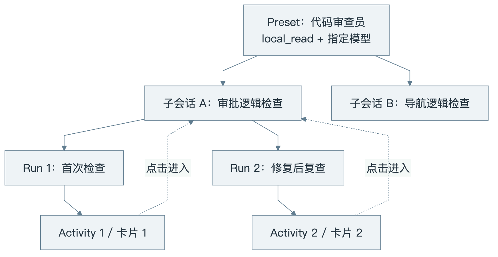
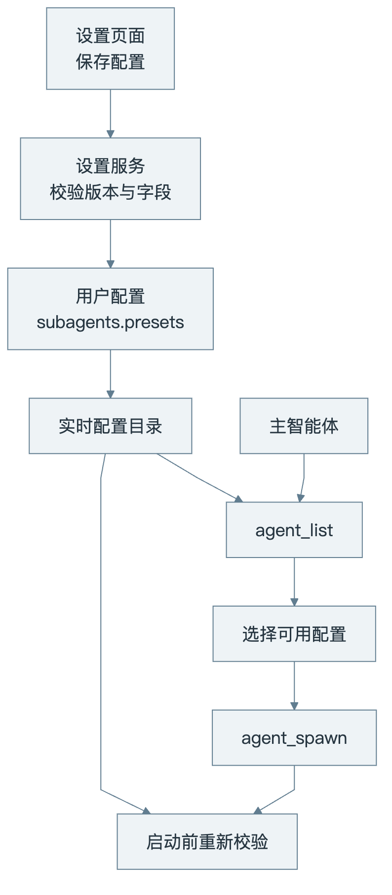
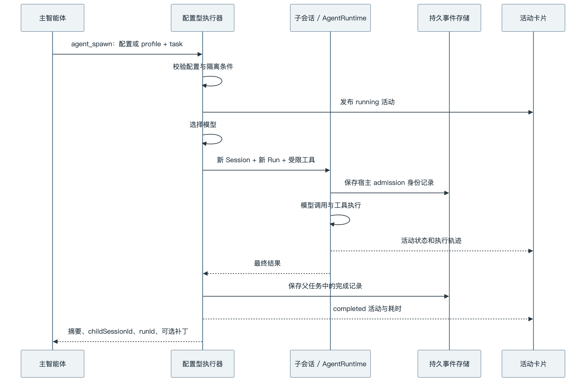
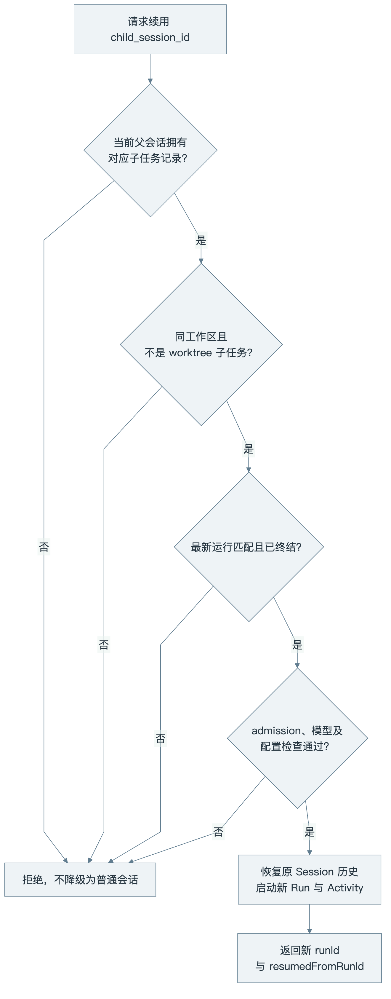
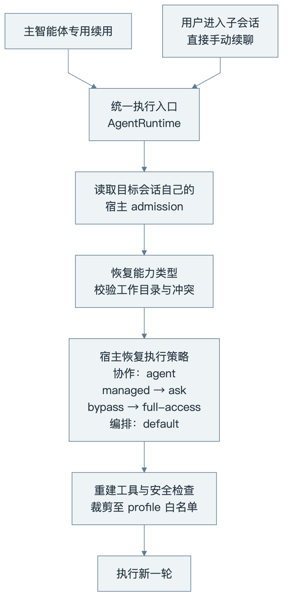

# PiCO 子智能体：从配置到持久会话、续用和权限边界

> 当前实现说明。面向开发者与需要理解产品边界的读者。本文以配置型 `agent_spawn` 为主线，并说明它与 Agent Graph 的边界；未实现的能力不计入当前行为。


_封面由生图模型生成，表达职责分工与受限执行的概念，不表示三个任务必然并行。下文的 Mermaid 图描述实际技术关系。[封面提示词与生成记录](images/pico-subagents/cover-prompt.md)。_

假设用户说：“检查这次审批卡片修复，重点看看重复显示和点击跳转。”主智能体可以自己读代码，也可以把范围明确的检查交给一个子智能体。后者拥有自己的对话历史和工具范围，完成后将结果交回主智能体。用户还能点击卡片，查看它实际做了什么。

PiCO 在这条链路上解决四个问题：**如何选择合适的执行配置、如何保留独立历史、如何继续同一项工作，以及如何保证换一个入口也不会扩大权限。** 它复用现有的 `AgentRuntime`、Session 和 RuntimeRun，不另造一套模型循环。

## 1. 先区分配置、会话、运行与卡片

“创建一个子智能体”有两种含义：保存一份以后可选择的配置，或者启动一个具体子任务。前者不会立即调用模型，后者才会产生执行记录。

| 对象                 | 作用                                         | 身份与生命周期                         |
| -------------------- | -------------------------------------------- | -------------------------------------- |
| Preset：配置         | 保存名称、用途、能力类型、模型连接和思考档位 | 稳定 ID；可以供多个任务使用            |
| Session：子会话      | 承载某个具体任务的消息、状态和历史           | `childSessionId`；执行结束后仍保留     |
| RuntimeRun：一次运行 | 表示一次实际执行及其终态                     | `runId`；续用时生成新的 ID             |
| Activity：界面活动   | 更新某次子任务执行的卡片与轨迹               | `activityId`；同一次活动稳定，续用另建 |



[查看或编辑 Mermaid 源图](images/pico-subagents/identity.mmd)

_图 1：配置可以复用，子会话可以续聊，每次运行必须有独立的展示身份。_

一个真实修复说明了这一区分的价值：原先执行器直接用子会话 ID 作为 `activityId`。第一次执行正常，但续用时会话 ID 不变，新活动会撞上旧活动；跨运行的持久投影还会遇到 entry 身份不匹配。用户在新一轮看到的就可能只剩普通 `agent_spawn` 工具记录。

现在新建子任务保留原有活动身份，续用使用新的 `subagent-activity-<UUID>`。导航仍使用 `childSessionId`，不再让“进入哪段会话”决定“更新哪张卡片”。

## 2. 配置怎么创建，主智能体能做什么

用户通过“设置 → 子 Agent”创建、编辑、启停或删除配置。主要字段如下：

| 字段                      | 含义                                                 |
| ------------------------- | ---------------------------------------------------- |
| `id`                      | 稳定标识，主智能体和历史任务引用它                   |
| `name`、`description`     | 显示名称，以及帮助模型选择配置的用途说明             |
| `profile`                 | 宿主内置的能力类型                                   |
| `connectionSlug`、`model` | 已配置的 Provider 连接与模型                         |
| `thinkingLevel`           | 可选思考档位；省略表示模型默认，不表示继承父任务档位 |
| `enabled`                 | 是否允许被选择和启动                                 |

配置是设备级的，存放于用户配置 `config.json` 的 `subagents.presets`。当前最多 64 项。桌面端经 `subagents.get` / `subagents.update` 访问，保存复用配置锁和版本校验；过期页面不能悄悄覆盖更新后的配置。模型凭据由宿主管理，设置快照只向界面提供连接和模型信息。



[查看或编辑 Mermaid 源图](images/pico-subagents/configuration.mmd)

_图 2：列出配置与实际启动之间可能发生编辑或停用，因此执行器不能只相信之前的列表结果。_

`agent_list` 默认返回可运行配置，也可以用 `view: "catalog"` 查看不可用原因。配置被停用、连接消失或禁用、Provider 退役、模型不在连接模型列表中，都可能导致不可用。配置列表每页最多 8 项，并保留内置 profile 的选择信息。

当前主智能体有 `agent_list`、`agent_spawn`、`agent_output`，**没有专门新增或修改 Preset 的模型工具**。因此它可以自行启动具体子任务，但永久配置主要由用户通过设置管理。也可以直接指定内置 `profile`，无需先保存 Preset。

这里的 `description` 是用途说明；实际系统提示词和工具白名单由宿主的能力定义提供。界面没有任意编辑系统提示词或逐个勾选工具的通用能力编辑器。

## 3. 三种能力类型及其实际工具范围

| Profile          | 默认名称       | 工具                                                           | 工作区与交付方式             |
| ---------------- | -------------- | -------------------------------------------------------------- | ---------------------------- |
| `local_read`     | Local Read     | `read_file`、`glob`、`grep`                                    | 共享目录，返回摘要           |
| `web_research`   | Web Research   | `web_search`                                                   | 同工作区上下文，返回研究结论 |
| `implementation` | Implementation | `read_file`、`glob`、`grep`、`write_file`、`edit_file`、`bash` | 独立 Git worktree，返回补丁  |

Local Read 是本地只读能力的默认名字，不是子智能体的统一名称。用户可以将某份配置命名为“代码审查员”，其实际边界仍由 `profile` 决定。

共享目录也不意味着工具相同：网络研究型没有文件读取工具；本地只读型没有网络、Shell 和写入工具。配置型子智能体没有再次启动子智能体的工具，因此这条执行链不会生成孙智能体。

实现型需要可用的 worktree 执行宿主。执行器等待独立任务完成后收集相对基线的 Git 补丁，返回补丁路径、worktree 路径、分支与摘要。它不会在这条流程里自动把补丁合并回父工作区。**worktree 提供 Git 工作目录隔离，具体文件、进程与网络限制仍取决于工具和沙箱策略；它不等于独立操作系统。**

能力定义集中在 [`subagent-profiles.ts`](../src/agents/subagent-profiles.ts)，避免配置文件自行声明任意工具权限。

## 4. 从工具调用到一次持久执行

主智能体应下达有边界的任务，例如：

```json
{
  "profile": "local_read",
  "task": "检查审批卡片的重复显示逻辑。只阅读 conversation 相关实现与测试，返回问题、文件位置和验证建议，不修改文件。"
}
```

若已有配置，把 `profile` 换成 `subagent_id` 即可。两者同时提供时，以配置为准。任务文本必须非空，长度不超过 60,000 字符；显式指定的 `isolation` 和 `write_back` 必须符合该能力定义。



[查看或编辑 Mermaid 源图](images/pico-subagents/execution.mmd)

_图 3：图中给出新建任务的主要成功路径。失败、取消也有对应终态；可点击卡片不是执行事实的唯一存储。_

执行器复用 `AgentRuntime.execute`，新任务通过 `sessionSelection: { mode: "new", sessionId }` 启动。配置存在时使用配置模型，否则使用父任务模型路由。子任务默认权限为 `ask`，不直接继承父任务的完全访问模式；配置型执行器将 `maxTurns` 设为 20。共享工作区能力的子边界上限是 managed `read-only` + restricted network；隔离 worktree 实现型的上限是 managed `workspace-write` + restricted network。父 Session 的当前持久边界必须能容纳该上限；父任务即使为 `full-access`，子任务也不会变成 bypass。

新子任务有独立的消息历史，不会直接复制父任务整段对话。必要背景需要主智能体放进 `task`。运行时仍会按自身规则组装上下文，所以“独立历史”不应被理解为整个执行环境没有任何其他上下文来源。

当前 `agent_spawn` 是**前台等待单个子任务完成**的工具，工具返回后主智能体再继续组织答案。不要把“支持子智能体”直接理解为“这个工具会自动后台并行”。

## 5. 父子关系为什么要由宿主保存

调用结果返回一个会话 ID，只能帮助定位，不能单独证明调用者有权读取或续用这个会话。PiCO 在父子两侧写入带 `picoHiddenFromTranscript` 的宿主消息记录，使用 `picoConfiguredChild` 保存关联信息。

其中包括父会话、父运行、父工具调用、子会话、子运行、工作目录、能力类型以及配置/模型快照等字段。隐藏表示它不作为普通聊天气泡展示，不表示它没有被持久保存。

恢复身份时，宿主检查这确实是目标子会话自己的 admission，并核对运行和轮次身份。普通聊天文本里写一个 `childSessionId`，或者把旧历史复制到另一会话，都不能直接建立同样的关系。

会话消息和运行事实位于工作区对应的 `pico.sqlite`，默认路径是 `~/.pico/workspaces/<workspaceId>/pico.sqlite`，可通过 `PICO_HOME` 更换用户存储根。它由 Session 与 RuntimeEvent 存储体系管理。共享工作区的父子会话可以在同一个工作区数据库中保持独立身份；独立 worktree 的子会话有自己的工作区存储。执行完成会结束本次运行，不会因此删除持久历史。

## 6. 如何查看结果与执行过程

主智能体通常先消费 `agent_spawn` 返回的摘要。需要查证细节时，可调用 `agent_output`，读取本父会话已启动子任务的最新结果或指定运行。

```json
{
  "locator": "child_session_run",
  "child_session_id": "替换为实际子会话ID",
  "run_id": "替换为实际运行ID",
  "view": "result"
}
```

查询参数使用 snake_case，启动结果使用 `childSessionId` / `runId` 等字段，调用方需要正确对应。事件诊断有数量与字节上限，工具不接受任意文件路径，也不允许通过一个随意填写的 ID 读取无关父任务的子会话。

指定旧 `run_id` 时必须同时匹配子会话和运行，不能被后续运行的结果覆盖。这使“第一次检查”和“修复后复查”都可追溯。

界面通过 Activity 展示子智能体名称、状态、摘要、只读标记和耗时。卡片包含有效 `childSessionId` 时才有导航入口；点击进入子会话后可以看消息和工具记录，并返回父任务。原始 `agent_spawn` 行只有在同轮中存在明确匹配的活动卡片时才合并隐藏，以免误隐藏无关联记录。

## 7. 续用：保留 Session，创建新 Run

当用户说“继续检查刚才的修复”，主智能体应复用原子会话，而不是只选择同一份配置再新建任务：

```json
{
  "child_session_id": "替换为先前返回的子会话ID",
  "task": "沿用之前的检查结论，继续验证这次修改是否消除了重复卡片。"
}
```

这条调用保留会话历史、原能力与受校验的模型配置，通过 `sessionSelection.mode = "resume"` 创建新运行，并返回 `resumedFromRunId`。新活动卡片与旧卡片独立。



[查看或编辑 Mermaid 源图](images/pico-subagents/continuation.mmd)

_图 4：主智能体续用依赖真实持久记录，而不只是模型提供的会话 ID。_

具体边界是：

- 当前父会话必须有匹配的宿主记录；工作目录与子会话 manifest 必须匹配。
- 最新 `run.started` 必须对应父任务记录，并已有 `completed`、`failed` 或 `cancelled` 的持久终态。失败或取消并不代表永远不能续用。
- 如果保存了 Preset，会重新解析其可用性，并比较能力类型、模型路由与思考配置；不能借续用切换成更强的角色。
- 同一子会话的续用有进程内防重入锁，准入时还会再次核对新旧运行次序；不能把它描述成一把覆盖所有入口的分布式锁。
- 独立 worktree 子任务暂不支持这一续用方式。

适合复用的是同一问题的补充调查、复查和修复验证。无关问题、不同能力或不同模型要求通常应新建任务。当前没有自动检索全体旧子会话、选择最佳复用对象的独立调度器；选择主要由主智能体结合上下文和工具说明完成。

## 8. 权限收口：手动续聊也必须恢复能力

只在 `agent_spawn` 时给子任务传入白名单还不够。用户可以点击卡片进入子会话，然后直接在输入框继续发送。若这次普通发送按主会话装配工具，原来的“只读子智能体”身份就只剩一个标签。

`7d825c48` 将能力恢复放到统一执行入口：取得持久 Session 后，调用 `readConfiguredSubagentDefinition` 读取真实 admission；在 Prompt、工具与安全中间件装配之前恢复 `configuredSubagentChild`。



[查看或编辑 Mermaid 源图](images/pico-subagents/permissions.mmd)

_图 5：两条入口共享执行能力边界；各入口的模型选择与父任务记账行为仍有区别。_

统一入口的约束包括：

1. 不能通过请求传入不同能力覆盖子会话的持久身份；身份已确认但能力快照缺失或未知时拒绝执行。
2. 有效权限强制为 `ask`，编排模式为 `default`，Swarm 授权为 `none`；普通续聊传入完全访问或 Swarm 不会扩权。
3. 新建子 Session 会在 Provider 与工具装配前持久它的 `ExecutionBoundary` 上限；续用时在设置恢复前后都复核。缺失、bypass、external 或比能力定义更宽的持久边界都 fail closed，Session network grant 与普通扩权流程不能抬高这个上限。
4. 配置型子任务不加载普通插件快照、不加入额外工作目录，也不获得再次启动子智能体或 `request_sandbox_boundary` 工具。
5. 工具注册表按能力白名单裁剪；后续请求级 allowlist 只能进一步限制可用工具，不能把已移除工具加回来。
6. 手动续用独立 worktree 子任务会明确拒绝；不能利用普通会话入口绕过专用续用的类型限制。

工具边界不是只写在系统提示词里。`buildSubagentSafetyMiddleware` 还检查敏感凭据路径和危险操作，并结合具体工具、工作区及沙箱策略处理调用。系统提示词提供行为要求，宿主检查负责执行约束。

这里的收口有一个明确范围：**统一的是能力与执行权限，不是两种续聊方式的所有业务语义。**

| 行为                               | 主智能体 `agent_spawn` 续用 | 用户手动续聊                                         |
| ---------------------------------- | --------------------------- | ---------------------------------------------------- |
| 恢复原能力与安全边界               | 是                          | 是                                                   |
| 保留原子会话历史                   | 是                          | 是                                                   |
| 验证当前父任务对该子任务的授权     | 是                          | 不走父任务工具调用                                   |
| 再检查 Preset 可用性和原模型配置   | 专用续用解析器检查          | 当前能力恢复函数不做同等检查，模型沿普通会话选择链路 |
| 写回父任务完成记录、生成父侧新活动 | 配置型执行器负责            | 普通续聊不走该执行器                                 |

因此，手动续聊后子会话有了新的 Run，原父任务记录可能仍指向上一次由它发起的 Run。此时主智能体再次使用专用续用会因记录不匹配被拒绝。当前没有自动认领手动运行并同步父记录的实现，也不能保证简单读一次 `agent_output` 就会更新这个关系。

## 9. 配置型子会话与 Agent Graph

当前有两条明确的 Agent 路径，讨论能力时需要说清工具名。

| 入口                         | 定位             | 当前需要区分的能力                                       |
| ---------------------------- | ---------------- | -------------------------------------------------------- |
| `agent_list` / `agent_spawn` | 配置型持久子任务 | Preset 选择、子会话导航、同工作区续用                    |
| `agent_output`               | 配置型结果回读   | 按精确 child Session/Run 身份读取结果                    |
| Agent Graph                  | 持久任务图编排   | 调度 operator，保存 profile snapshot，管理依赖与执行状态 |

Graph operator 的工具由保存的 profile snapshot 加控制用途的 `agent_output` 组成；配置型 `agent_spawn` 则由 Preset/内置 capability 冻结能力。桌面端带 `subagentId` 时走 `agent_spawn`，选择 Markdown/YAML Agent Profile 时走 Graph `new_agent` / `agent_id`。两者都保留独立持久 Session/Run，但调度协议不同。

同名 `agent_output` 也要结合宿主理解：本文讨论的是根会话中的子任务结果读取工具；Graph operator 使用的是其编排协议中的另一种用途。看到名字相同，不代表控制面相同。

## 10. 如何验证这些边界

这类功能应检查真实调用链，而不仅检查卡片文案。当前相关集成测试覆盖创建、续用、补丁、父子授权和桌面子会话关系，可按以下方式运行：

```bash
node --import tsx --test \
  tests/integration/runtime/configured-subagent-continuation.test.ts \
  tests/integration/runtime/configured-subagent-execution.test.ts \
  tests/integration/runtime/configured-subagent-output.test.ts \
  tests/integration/desktop/desktop-configured-child-sessions.test.ts
```

截至本文基线，这组 8 项测试通过。手动续聊回归使用真实 `AgentRuntime` 和确定性 Provider：先通过主任务创建子会话，再模拟普通 UI/CLI 续聊，不传 `configuredSubagentChild`，同时请求完全访问权限（`full-access`）与 Swarm。测试确认模型只获得三个只读工具，原角色提示与历史仍在；即使 Provider 强行返回 `write_file` 调用，也不会生成目标文件。

专用续用还有真实模型 E2E：[`configured-subagent-continuation.real-llm.test.ts`](../tests/e2e/configured-subagent-continuation.real-llm.test.ts)。它通过前后两轮回忆虚构标签验证上下文续用，而不是只检查 ID 相等。该测试需要真实模型配置，不属于纯本地确定性检查。

桌面人工验收则沿用户入口执行：主任务启动 Local Read → 续用后出现独立卡片 → 点击查看同一子会话的多轮历史 → 直接发送新消息。`7d825c48` 下已通过 Computer Use 验证手动续聊保留历史，只使用一次 `glob` 完成只读检查；越权调用是否真正被阻止由上述集成测试补充证明。

## 11. 源码阅读地图与后续扩展边界

| 关注点                 | 主要文件                                                                                                                                                                                                                                                                         |
| ---------------------- | -------------------------------------------------------------------------------------------------------------------------------------------------------------------------------------------------------------------------------------------------------------------------------- |
| Preset 协议与数量限制  | [`packages/protocol/src/runtime/subagents.ts`](../packages/protocol/src/runtime/subagents.ts)                                                                                                                                                                                    |
| 设置界面与原子保存     | [`SubagentSettingsPage.tsx`](../apps/desktop/src/renderer/pages/SubagentSettingsPage.tsx)、[`desktop-subagent-settings-service.ts`](../src/daemon/desktop-subagent-settings-service.ts)                                                                                          |
| 内置能力与可用性目录   | [`subagent-profiles.ts`](../src/agents/subagent-profiles.ts)、[`configured-subagent-catalog.ts`](../src/agents/configured-subagent-catalog.ts)                                                                                                                                   |
| 工具参数与结果协议     | [`configured-subagent-tools.ts`](../src/tools/configured-subagent-tools.ts)、[`configured-subagent-output.ts`](../src/tools/configured-subagent-output.ts)                                                                                                                       |
| 持久子任务执行与补丁   | [`configured-subagent-executor.ts`](../src/runtime/configured-subagent-executor.ts)                                                                                                                                                                                              |
| 专用续用校验与回读     | [`configured-subagent-continuation.ts`](../src/runtime/configured-subagent-continuation.ts)、[`configured-subagent-output-store.ts`](../src/runtime/configured-subagent-output-store.ts)                                                                                         |
| 统一能力恢复与执行约束 | [`configured-subagent-session.ts`](../src/runtime/configured-subagent-session.ts)、[`agent-runtime.ts`](../src/runtime/agent-runtime.ts)、[`child-agent-policy.ts`](../src/tools/child-agent-policy.ts)                                                                          |
| 卡片、事件投影与导航   | [`ConversationTranscript.tsx`](../apps/desktop/src/renderer/conversation/ConversationTranscript.tsx)、[`transcript-event-store.ts`](../src/presentation/transcript-event-store.ts)、[`subagent-navigation.ts`](../apps/desktop/src/renderer/conversation/subagent-navigation.ts) |
| Agent Graph            | [`agent-graph-host.ts`](../src/runtime/agent-graph-host.ts)、[`agent-graph-tools.ts`](../src/tools/agent-graph-tools.ts)                                                                                                                                                         |

继续扩展时，应分别解决三个问题：自定义工具组合如何验证，独立 worktree 续用如何保持补丁基线与生命周期，以及手动运行如何被父任务重新接管。它们分别涉及能力模型、隔离执行和父子记账，不能仅靠增加一个按钮完成。

目前已经成立的工程契约是：**配置用于选择能力，Session 保存任务历史，Run 记录每次执行，Activity 表达每次运行；子会话的工具与权限边界由统一宿主入口恢复。** 在这个基础上增加交互，才能让用户看到的身份与实际执行行为保持一致。
