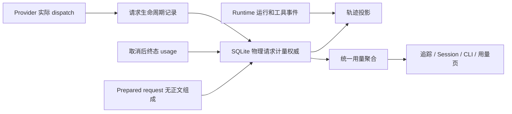

# Pico 执行轨迹剩余缺口收口方案

状态：方案草案，尚未实施。基线：`dcf0def8`。日期：2026-09-22。

本轮目标是补齐请求生命周期计量、取消后补账、全局用量统一、上下文组成和真实桌面回归五项缺口。验收以可复现行为和明确数据口径为准，不使用“对齐百分比”。这份方案不表示下列能力已经实现或测试已经通过。

## 1. 当前基线和范围

已完成：真实 fetch attempt 采集、协议兼容降级/外层重试标识、首输出耗时、部分 usage 判定、SQLite 轨迹投影、独立用量查询、历史分页/收起、模型标识复制、真实 App 自动刷新。

已知约束：

- `CostTracker` 目前将最多 16 个 attempt 保存在内存，在 `model.call.settled` 时批量写入；不能据此保证崩溃时的逐请求证据。
- `RuntimeRun` 已终结后禁止普通事件追加；晚到计量不能重新打开 Run。
- `usage_provider_calls` 当前按 callId 插入且不支持同一记录修订，其中 `attempt_id` 是 Job attempt，不能复用为物理请求 ID。
- 轨迹已经优先计量 embedded attempts；Session 状态、Provider ledger、usage dashboard 和历史 baseline 尚有不同读取路径。
- 现有上下文面板显示预算、窗口和预留量；需要区分当前上下文估算与最近一次实际准备请求的历史组成。
- 实机已发现并修复 preload 事件白名单和剪贴板兼容缺陷，说明 SSR/单层 mock 不能代替完整 Electron 链路验收。

不扩张范围：不增加 Maka 本身没有的筛选/子代理跳转，不迁移整套 Harness，不重建聊天历史，不修改 Provider 重试策略或用户权限。旧数据不能补造当时未记录的物理请求、TTFT 和 usage。

## 2. 总体方案与数据权威

保留现有 SQLite 存储体系和 Runtime 事件账本；在计量存储中新增可修订的物理请求记录。它保存请求身份、状态和计量，不复制消息正文，不另建一套聊天轨迹数据库。

推荐数据流：

新增记录最少包含：`physicalAttemptId`、`logicalCallId`、现有 `providerCallId`、workspace/session/run/turn、`jobAttemptId`（若有）、实际 provider/model/route、请求序号、开始/结束时间、状态、修订号、用量来源和完整性、计价依据、HTTP/终态诊断、TTFT。认证信息、完整 URL query、请求/响应正文不得写入此记录。

权威记录、可查询投影和水位优先在同一个 SQLite 事务内提交，避免引入额外双写恢复机制；若确有分离需要，则必须按持久序号补投影，并增加“权威已提交、投影前崩溃”的验收。新增调用明确保存 accountingVersion/source，投影暂时落后只能显示滞后，不能临时回退旧逻辑数据。

统一读取优先级按每个 providerCallId 判定：新物理记录 > 旧 settled 中的 embedded attempts > 旧 logical ledger/event > 无详细记录时的历史 baseline。新旧记录不能相加；历史 baseline 作为独立未知归属的历史总量保留，不伪装成请求明细。部分迁移或部分覆盖不允许被自动解释为完整物理记录。

## 3. 分阶段实施

### P0：独立持久化与取消补账

1. 冻结公共契约、Schema、身份归属及状态机，由一个所有者修改。
2. 在每次真实 HTTP dispatch 前，等待计量 admission/start 写入成功；失败时不发送网络请求，返回明确的本地记录失败原因。
3. start 表示“请求准备开始”，不证明服务器已收到。已收到响应头、HTTP 错误、语义完成等分别更新真实观测；不能承诺跨 SQLite 和外部服务的原子 exactly-once。
4. usage 更新以快照替换/补齐，不把每次修订相加；同 ID/修订的冲突内容报错。每个物理请求独立结算；以 physicalAttemptId + revision 做幂等更新，重复回调不累计，过期修订不覆盖新证据。允许主调用已经结束后更新计量，但不改变 Run 的终态或恢复模型执行。
5. 主调用取消立即退出用户交互。保留一个有界的补账观察窗口，拟定默认 5 秒；只消费 SDK/传输已经产生或仍可提供的终态计量，不重新发出请求，不为了计量继续无限读取正文。窗口到期显示部分/未知用量并释放监听器。
6. 若取消在底层关闭连接后使终态永远不可得，则不补造 usage；应用重启后也不承诺恢复已消失的回调。
7. 恢复必须验证旧 owner 已失效，普通 reader 启动不触发恢复，也不能接管活跃 writer。恢复进程对旧 owner 未结算记录标记 interrupted/unknown，并保留已有观测。不得自动重新调用 Provider；不能仅凭 start 把它计为已确认发出的请求。
8. 已获模型响应后的结算写入失败不得转成模型重试。保留 durable start、暴露计量降级、做有界本地重试；无法落盘时准确报告缺口。
9. 晚到写入必须绑定最初 admission 的 session/run/attempt。遵守 owner fence、删除和保留策略，不能写到当前新会话，也不能复活已删除会话。

建议生命周期：`prepared → observed → completed / failed / cancelled / interrupted`；usage 完整性和请求终态分开保存。取消后可以补齐 usage，但请求状态仍为 cancelled；更丰富的 usage 不代表模型成功。

### P1：统一全局用量与历史兼容

1. 复用一个聚合服务输出所有用量入口，分别定义 logical calls、物理请求观测数、重试数，禁止不同页面共用含义不一致的“调用次数”。
2. 统一 Token 子集关系：缓存读/写属于输入，推理属于输出，不再重复相加；工具耗时与模型耗时分别累计，不能称为整个运行墙钟耗时。
3. 已知费用与完整费用分开表达。缺失不是零，失败/取消只累计真实上报的 usage；未知价格仍为未知。记录计价来源和版本，历史费用不因当前价格变更静默重算。
4. 同一过滤范围和计量版本下，轨迹、会话、CLI、用量页总量必须一致；上下文窗口使用量是另一个概念，不改成累计消耗。
5. 迁移旧 embedded attempts 使用稳定 ID，保留来源和覆盖信息；旧 logical 数据没有 physical ID 时只保留 legacy 级别。重复启动/迁移不增加总量。
6. 保留旧逻辑调用记录以兼容恢复和审计，但它不再与新物理计量一起作为可加总权威。
7. 子代理和后台请求显式携带来源。全局统计按物理 ID 去重；父任务汇总是否包含子任务必须明示，不能父子双算。

### P2：上下文组成细分

1. 复用 `provider-request-diagnostics.ts` 已有 system_prompt/tool_schema/message/provider_options 分段、UTF-8 bytes/hash/role，补工具名 label；不重造抓取和 Prompt 构建器。当前 context API 用 history 估算但未传 tools，Controller 也未映射已有 sections 展示槽，需一并补通。
2. 当前上下文：显示系统指令、工具定义、会话消息及附件/其他占用，沿用当前估算器，明确“估算”。
3. 最近实际请求：取同一个已成功 main 请求的诊断和用量，绑定 physicalAttemptId、模型和时间；失败重试、标题生成和压缩请求不能顶替它。记录序列化语义分段的 UTF-8 字节组成，这不是完整 HTTP wire 字节。只保存分类和大小，不保存敏感正文。较大工具 Schema 排序并限量，尾部保留数量和字节；旧数据缺工具名显示“未命名工具”。
4. 字节不是 Token；不以无标注的 `bytes / 4` 冒充精确 Token。分类总量必须对同一序列化语义分段总量闭合，不能分类的内容进入“其他”；base64 附件不能套普通文本比例。
5. 当前上下文和历史请求组成分开展示。切换模型、压缩、工具集变动后不能把旧组成当成当前快照。
6. 组成不可用时显示原因和数据来源，不影响轨迹、用量或对话使用。

### P3：真实桌面回归与发布验收

1. 参考现有 `tests/fixtures/artifact-preview-electron.mjs` 的 Electron fixture 模式和 `tests/integration/helpers/test-runtime-daemon.ts`，新建/完善最小真实 Electron 测试入口，不假设已有 Playwright 测试依赖；穿过 renderer → preload → main → daemon → SQLite；只替换外部 Provider 为可控本地 HTTP/SSE 服务。
2. 使用隔离 picoHome/workspace 和合成数据，不复制用户凭证，不修改用户已有任务。
3. 固化正常完成、HTTP 失败/重试、断流、取消/晚到用量、分页、切换任务、关闭重开、daemon 重连、复制和损坏数据降级。
4. 发布前再进行一次 Computer Use 实机检查和一条真实模型成功调用。先记录 App、preload、daemon 的构建版本，避免把旧进程混入验收。
5. 文档更新仅涵盖发生变化的计量权威、兼容口径和轨迹操作；不顺带重写全部博客。

## 4. 验收矩阵

下列用例未执行，实施时逐项记录证据。正常主路径外，只覆盖与本轮风险直接相关的失败路径。

| 编号 | 场景                                                              | 明确通过条件                                                                                                                       |
| ---- | ----------------------------------------------------------------- | ---------------------------------------------------------------------------------------------------------------------------------- |
| A01  | dispatch 前写入失败                                               | 本地 HTTP fixture 收到 0 次请求；错误可见，不误记成功                                                                              |
| A02  | 分别在 start 提交后 send 前、网络调用中强制结束子进程并重开数据库 | 已开始记录仍存在；未结算部分标 interrupted/unknown；不自动重发                                                                     |
| A03  | 第一次请求已结算、后续重试中崩溃                                  | 第一项明细保留，后项覆盖不足；重开不丢已落盘数据、不多算                                                                           |
| A04  | 兼容降级 + 外层重试                                               | 每次 fixture 收到的 HTTP 对应一个唯一物理 ID；logical 关联正确；定价和 Token 不双算                                                |
| A05  | 取消后晚到终态 usage                                              | 受控 fixture 中取消交互 500ms 内响应、不等待 5 秒窗口；同一 attempt 修订一次计量，重复和乱序回调不重复累计，Run 仍 cancelled       |
| A06  | 取消后无终态 / Claude 初始 usage / Responses 中间快照             | 不把中间输出数视为最终完整 usage；窗口到期清理资源，费用保持未知                                                                   |
| A07  | 已完成响应但计量结算写失败                                        | Provider 不收到第二次请求；start 可恢复且显示计量降级                                                                              |
| A08  | 会话切换、删除、owner 更替期间晚到回调                            | 不跨会话写入，不复活删除记录，旧 owner 不越权                                                                                      |
| A09  | 新/旧/混合历史及重复迁移                                          | 按来源优先级只选一份计量；迁移重复两次及重启后总量不变；未知数据不补零                                                             |
| A10  | 统一口径                                                          | 同一数据集覆盖成功、失败、取消、缓存、未知价格、后台及子代理；各用量入口与基准 SQL 在同范围同版本完全一致                          |
| A11  | 上下文组成                                                        | 文本、中文、工具 Schema、附件和未知类型均守住字节总量闭合；估算和实际上报不混淆；不含正文/凭证                                     |
| A12  | 模型/工具集切换与压缩                                             | 当前快照更新，历史组成保留所属请求；旧异步响应不覆盖新会话/新版本                                                                  |
| A13  | Electron 自动刷新                                                 | 不点刷新，提交和结束事件进入时间线；正常环境资源事件到达后 1 秒内开始刷新，受控 fixture 2 秒内展示；失败显示独立错误               |
| A14  | 历史分页和停用再激活                                              | 至少 3 页，分页间插入新运行；无重复遗漏，收起返回最新窗口，重开保留约定状态，后台不轮询                                            |
| A15  | 真 IPC 与 daemon 重连                                             | 真实 preload 白名单和主进程协议通过；重连后重新订阅并恢复数据，无重复监听和无限重试                                                |
| A16  | 独立失败与复制                                                    | 轨迹读取失败时用量仍可见；用量失败不清空轨迹；点击复制并粘贴得到完全相同的模型标识                                                 |
| A17  | 查询规模与边界                                                    | 1 万次请求 fixture 下仍保持现有单页 48 KiB 和证据读取预算；不把全部正文加载到 JS；游标稳定；基准机器首屏/summary p95 目标各 ≤500ms |
| A18  | 真实模型与 Computer Use                                           | 一次真实调用成功，数据库物理记录与 App 展示对应；记录 TTFT/usage/覆盖信息、版本、截图和操作结果，不用 fixture 成功替代实机结论     |

性能阈值属于实施验收目标，需记录硬件、数据规模、冷热缓存及样本数（建议 30 次）。不为通过指标删除大记录或隐藏覆盖不足。外部 Provider 故障须标明阻塞，不能宣称真实模型验收通过。

## 5. 并行与集成顺序

- 主代理：冻结契约和公共 Schema、迁移、锁文件、跨模块接口、最终集成。
- 子任务 A：Provider 生命周期与取消观察；契约冻结后独立 worktree。
- 子任务 B：存储和统一聚合；依赖公共 Schema，和 A 对接固定端口。
- 子任务 C：上下文组成与 App 展示；避免和 A 共写 provider 文件，prepared-request 采集入口由 A 单一所有者提供。
- 桌面回归可先建测试基础，依赖功能落地后再完成对应场景；不能假装所有工作无依赖同时完成。
- 每个阶段通过相关集成测试后合入集成分支。P0 完成后切 P1 计量读路径；P2 可并行，P3 在最终状态上验收。

## 6. 迁移、回退和停止条件

- Schema 采用增量扩展，迁移前做可验证备份；不删除旧列/旧记录，不改写用户历史。
- 迁移需有版本和幂等键；中断后可继续。同一版本记录冲突应报错，不能静默覆盖归属。
- 回退采用兼容新 Schema 的前一读路径或修复版本；停用新投影不能再次把新旧记录相加。只有验证过兼容性才允许回滚旧二进制，不能承诺任意版本降级。
- 已生成的新物理记录保留，回退后可显示覆盖不足；不通过删库或清空历史“修复”计量差异。
- 每个阶段在最终提交状态运行相关集成测试、受影响类型检查和架构检查；公开接口/持久化切换完成后构建桌面包并完成一次聚焦独立审查。
- 最终提交推送前核对远端、工作区和迁移证据；有数据归属、重复计费、取消迟滞或恢复重发问题即停止发布。
- 收口条件：A01–A18 有可审查结果，所有承诺场景通过，所有差异明确分类为已解决或不可恢复的历史事实；临时测试进程/工作区清理完毕。

## 7. 主要实现落点

- 上下文证据：`packages/runtime/src/provider-request-diagnostics.ts`，复用现有分段，补通 context API 和 Controller。
- Provider：`packages/pico-host/src/provider/physical-attempt-tracker.ts`、`ai-sdk-provider.ts`、`openai-request-policy.ts`。
- Runtime：`packages/runtime/src/cost-tracker.ts`、`runtime-run.ts`、`session-runtime-projection.ts`、`usage-baseline.ts`。
- Storage：`packages/storage/src/runtime-control-types.ts`、`sqlite/control-scope.ts`、`sqlite/sqlite-runtime-control-store.ts` 及 retention 路径。
- 查询：`packages/pico-host/src/session-execution-query.ts`、`usage-dashboard.ts`、`desktop-runtime-service.ts`。
- 协议与桌面：`packages/protocol/src/execution-trace.ts`、`runtime/workbar.ts`、`apps/desktop/src/preload/bridge.ts`、`renderer/workbar-panels/`。
- 复用验证：`physical-attempt-ledger.test.ts`、`session-execution-enrichment.test.ts`、`desktop-preload-bridge.test.ts`、`trace-app-alignment.test.ts`；新增真实进程/桌面测试放入相应 integration/e2e 目录。

## 8. 不承诺的完整性

Maka 本地 `packages/core/src/model-call-attempt.ts` 同样明确承认 dispatch 到 settle 之间的崩溃遗漏。Pico 采用 durable start 是针对剩余缺口的加强，不应表述为 Maka 已经保证远端 exactly-once。

最终保证是“已提交事实可恢复、同一事实不重复计量、可识别缺口明确披露”。客户端无法证明远端在断网/取消/崩溃后的全部消耗；只有 Provider 实际送达的证据才可补账。历史无法恢复的明细长期保留 legacy/unknown 标记，这不属于可以通过代码补造的待办。
