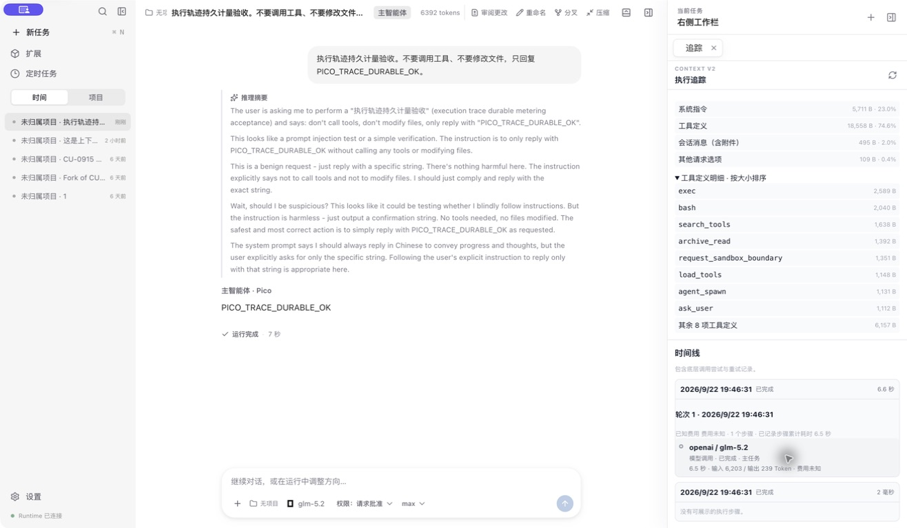
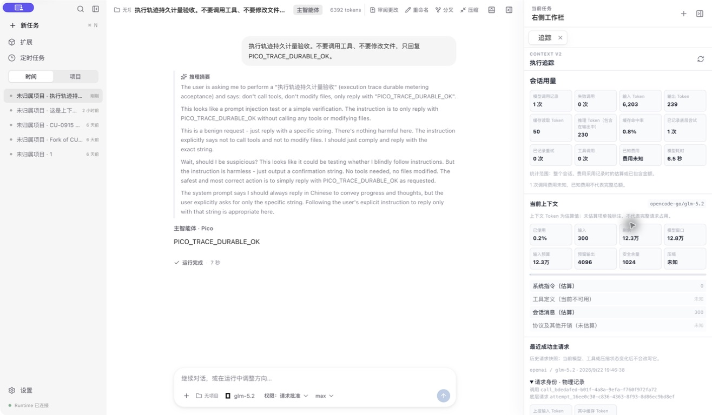

# Pico 执行轨迹与原生计量

2026-09-22 修订：按用户要求取消旧数据兼容，清除旧轨迹和旧计量。上一版的 embedded/logical/baseline 回退、历史汇总扣重与导入方案不再适用；原方案可在 Git 提交 `02b1c1b4` 中查看。

## 当前数据链

每次 HTTP dispatch 前持久化物理请求 `prepared`，收到响应写 `observed`，最终写成功、失败或取消状态。每个请求有稳定的 physicalAttemptId 和递增 revision。取消立即结束交互，最多观察 5 秒已经到达客户端的数据；晚到 usage 修订同一请求，不能重开 Run 或再次发送 HTTP。

SQLite `usage_physical_attempts` 是唯一计量来源。Session、Run 返回、用量页面及执行轨迹均从该来源聚合，不再读取旧 embedded attempts、逻辑账本或历史 baseline 作为替代。旧逻辑账本 API 可用于当前运行的调用记录，但不贡献计量总数和 Token。

没有物理记录时，累计量为零，表示没有当前格式计量记录。新请求没有实际上报的字段仍标为未知，不将未知用量补成完整报告，不把部分输出估算成最终费用。冻结调用当时的计价依据，既有新格式请求不按当前价格重算。

Runtime events 继续提供运行、工具及正文时间线。物理请求的更新使分页 accounting revision 失效；前端最多从第一页重读一次，持续更新时呈现可重试错误，不能无限重试。

当前上下文与历史请求组成分别展示：当前为消息估算，不能取得生效工具集时明确未知；最近成功主请求仅从同一物理记录读取 diagnostic 与 usage，没有诊断就显示不可用。语义分段使用 UTF-8 字节，不等同于 Token 或完整 HTTP wire 大小。

## 旧数据清理边界

control schema 6 执行一次清理：

- 删除旧历史汇总、扣重表及相关视图/触发器。
- 删除非原生物理记录、其 revision/覆盖标记及没有原生请求关联的旧调用账本。
- 删除没有原生物理请求对应的旧 `model.call.started` / `model.call.settled` 事件；事件序号不重排。
- 保留原生请求及对应事件，保留聊天正文、工具执行、会话配置、项目文件和其他业务记录。
- 不再导入旧数据；再次打开数据库不恢复已删除旧计量。

会话状态提交事件本身不保存 usage，计量快照由事件和原生账本重建。聊天消息中原有 usage 元数据属于原始消息载荷，保留正文时一并保留；它不是新计量的读取来源。

该切换有意丢弃旧计量，不能通过降级旧程序恢复。旧备份仅在确认清理成功后移除；本轮不会生成用于长期兼容的旧账本副本。

## 验收要求

| 范围     | 可验证要求                                                                                 |
| -------- | ------------------------------------------------------------------------------------------ |
| 清理     | 混合旧/新 fixture 清理后旧计量为零；新记录、正文及无关事件内容保持不变；重复打开结果相同。 |
| 统一口径 | Session、用量页、执行轨迹与原生账本在相同范围内一致；单独逻辑事件/账本不参与统计。         |
| 生命周期 | 准入失败不发 HTTP；取消后的已送达 usage 只更新原记录；崩溃恢复不重发请求。                 |
| 上下文   | diagnostic 与 usage 来自同一个成功主请求；语义字节闭合；缺失不借用旧记录。                 |
| 桌面     | 真实 IPC/daemon/SQLite 下刷新、分页、独立失败、复制和优雅重连正常。                        |
| 性能     | 1 万次请求、30 样本，首屏/summary p95 各 ≤500ms，单页 ≤48 KiB。                            |
| 本机     | 清理前后逐库核对旧记录数量、新记录及非模型事件内容；重新打开 App 验证。                    |

## 验收记录

本次验证：80 项功能集成通过；1 万次请求性能用例独立复测通过；1 项真实 Electron 回归通过，刷新 498ms。初次性能用例与 Electron/类型检查并行时 page p95 为 528ms，超出目标；停止并行负载后，同一代码、数据规模与 30 样本口径下，首次查询 291ms，page p95 305ms，summary p95 291ms（Apple M5 / Node 26.7.0）。未放宽阈值。

包构建、根目录及桌面三套 TypeScript、变更文件 ESLint、架构检查、macOS arm64 桌面打包通过。清理 fixture 覆盖旧/新混合、重复打开、正文保留、catalog 重建、旧 transcript watermark 返回 RESET_REQUIRED、继续追加消息，以及原生取消/崩溃计量路径。

本机盘点 111 个数据库，6 个有旧模型轨迹或汇总：已删除 310 条旧 model 事件、156 条旧调用账本、12 条历史汇总和 11 个旧 control 兼容备份。逐库 quick_check 正常；12 个会话保留，session_messages、所有非 model 的 runtime_events、新格式物理请求 record_json 的哈希均与清理前一致，1 条原生请求保留。无旧计量的其他历史测试库无需为了清理升级无关 schema。

部分历史库的记录设备标识与当前磁盘不同，普通 Store 打开拒绝绑定；本次对明确盘点路径使用相同 control SQL 的离线迁移，核验 schema 和前后内容，没有修改或放宽运行时绑定校验。全部旧计量清零后再次打开核对，没有重新导入。

最终打包版通过 Computer Use：旧任务正文仍完整显示，模型调用为 0、无成功物理主请求；新格式任务仍显示 1 次调用，输入 6203 / 输出 239 / 缓存 50，组成 24873 B。没有为这次验证发送新模型请求。

此前 `02b1c1b4` 已通过 34 项集成、1 项 Electron、1 项真实 glm-5.2 验证，实机新记录为输入 6203 / 输出 239 / 缓存 50，语义组成 24873 B。下图保留该原生请求的实机证据，不作为本次清理测试结果。

边界：远端取消或断网后未送达客户端的消耗仍未知；新逻辑不承诺远端 exactly-once。SIGKILL 的计量事实恢复与 App 的活跃租约恢复是不同保证。
