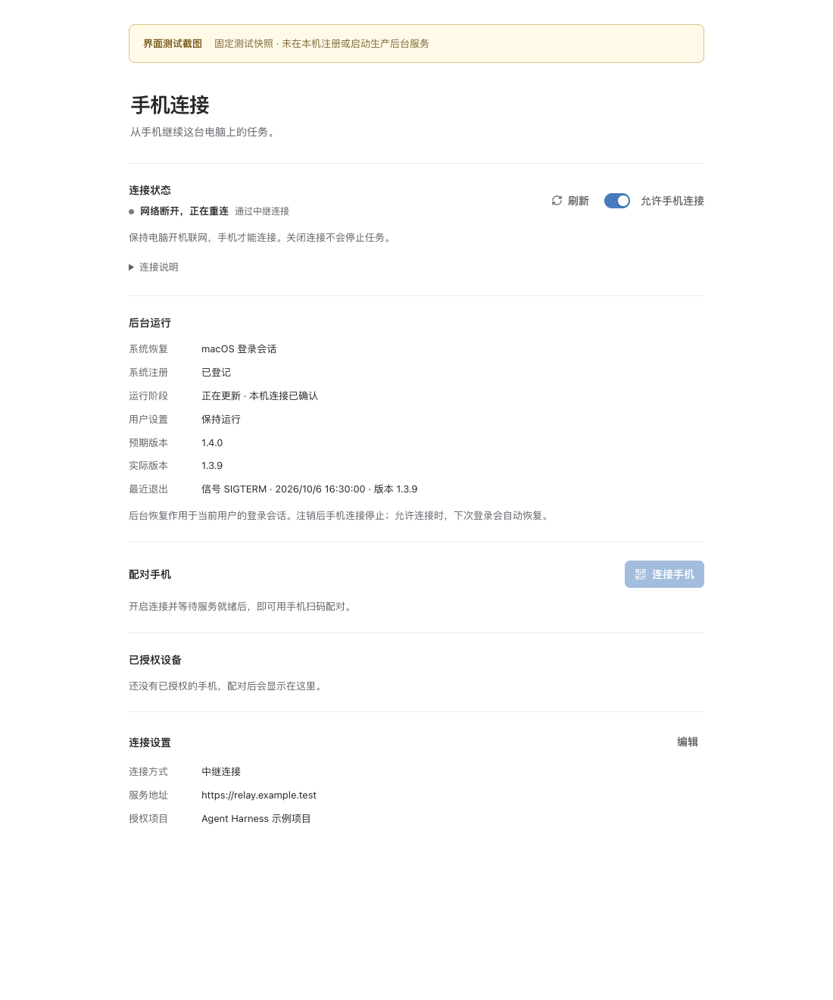

# Pico 六项架构优化实施记录

基线：`08de7cd1`，保留开始时已有的统一接入层及全部未提交修改。Desktop IPC、本地 socket、手机 HTTPS/WSS 直连与 Relay 链路保持原结构。本轮没有接入新的第三方渠道。

## 功能对照

| 项目                     | 实施结果                                                                                                                   | 验收重点                                                                                                            |
| ------------------------ | -------------------------------------------------------------------------------------------------------------------------- | ------------------------------------------------------------------------------------------------------------------- |
| Provider 关闭屏障        | 幂等关闭等待启动恢复、监听尾任务、Provider 队列；Desktop 拒绝新请求并排空已接收请求                                        | 阻塞凭证恢复时关闭不完成；释放后恢复完成；关闭宽限到期要求进程终止且 ownership 不释放                               |
| Desktop 发送恢复         | 版本化持久 pending-send，按 Pico home 与来源隔离，保存完整参数、原键与草稿；普通会话、新任务、侧聊、研究转实施接入         | 存储失败不发送；重建 Renderer 后显式恢复；未知结果冻结；迟到确认不清新记录、不抢回工作区或路由                      |
| daemon 配置补丁          | MCP/Provider 的 public-patch、秘密 keep/set/remove、CAS 与原子写入由 daemon 执行；Gateway 不再读取原配置合并秘密           | 原 patch 幂等指纹；先检查已提交结果再做 CAS；URL 与凭证归属保护；旧 Host 隐藏编辑能力                               |
| 本地等待期限             | ping 5 秒，固定短读取名单 30 秒，其余 125 秒；首次连接后开始计时，真实断连使用剩余预算                                     | 健康连接超时为 `RUNTIME_REQUEST_TIMEOUT`、不可自动重试、结果未知；不重启、不重发，迟到响应正常对账                  |
| Desktop 退出后的网关恢复 | 用户 LaunchAgent / 当前用户最低权限计划任务；私有 manifest、desiredRunning、锁、generation、5 分钟维护状态、精简冷启动环境 | 主动停止、启动中的停止与维护、快速意图变化、路径登记、PICO_HOME/PATH、开发模式隔离；状态页区分本机 control 与 Relay |
| 性能测量与条件优化       | 提供有界准入、恢复、持锁和授权指标；Provider 未触发门槛，保留串行锁；Run 查询触发门槛，增加本地 `run.get`                  | 新旧授权判断、查不到/跨项目/会话不匹配、点查失败不绕过授权；点查响应最多一个 Run                                    |

`session-send-replay-v1`、`config-secret-patch-v1`、`run-point-lookup-v1` 均以 Host 实际能力发布。手机公开 RPC 未增加 `run.get`，手机请求不能传入 `replayOnly`、`inputMode` 或 Runtime 内部秘密字段。缺能力提示升级，不进行普通重发或 Gateway 秘密读取降级。

## 性能基准

每批预热 20 次，测量 200 次，共 5 批。基准为本机确定性执行器与真实存储，不使用远程模型。机器负载和存储速度会影响数值。

### Provider 准入

主测 `run.start`，每批独立真实 fixture，每 20 次交错一次 Provider 配置修改；另有 `session.send` 集成回归确认锁持有至 Run 注册与幂等提交完成。

| 工作区并发 | 准入 p95 的批次中位数 | 队列 p95 的批次中位数 | 队列时间占比 |
| ---------- | --------------------: | --------------------: | -----------: |
| 1          |               29.34ms |                  ≤1ms |      0.0083% |
| 2          |               52.74ms |                  28ms |       33.77% |
| 4          |              101.74ms |                  77ms |       60.58% |

两工作区未满足队列 p95 >100ms，因此没有实施共享准入锁，也没有宣称锁改动达到 50% 提升或 10% 回退目标。队列 p95 来自 1ms 分辨率的有界直方图。

原始结果：[provider-admission.json](./architecture-six/provider-admission.json)。

### Run 授权

真实 SQLite、真实 Runtime Host framing 和 LocalRuntimeClient，覆盖存在、缺失、跨工作区、会话不匹配。仅 `session.get` 的会话身份采用固定 fixture，Run 读取、传输与 Gateway 授权实际执行。旧路径由能力缺失强制选择列表，新路径按能力选择点查。

| 历史 Run | 列表路径 p95 中位数（存在） | 点查路径 p95 中位数（存在） | 点查响应帧 |
| -------- | --------------------------: | --------------------------: | ---------: |
| 100      |                      8.46ms |                      8.05ms |       393B |
| 1,000    |                     13.13ms |                      7.74ms |       393B |
| 10,000   |         33.33ms，超预算拒绝 |                7.61ms，成功 |       393B |

10,000 条的完整列表编码约 2,835,590B，在现有 960KiB bridge 预算下被拒绝；该字节数复用已有预算编码观测，不是已发送的网络帧。旧路径的 33.33ms 是失败响应耗时，不能当作成功查询延迟。新路径恢复了此规模下的有效授权，存在/缺失/会话不匹配的响应耗时约下降 76–77%；跨工作区的独立小列表原本不随主项目历史增长，耗时没有显著改善。

原始结果：[run-list.json](./architecture-six/run-list.json)、[run-point.json](./architecture-six/run-point.json)。

## 验证记录

隔离集成后的 21 个受影响集成测试文件全部通过：62 项通过、0 失败、0 跳过。覆盖 Provider 关闭、配置 patch 与 CAS、发送冻结与恢复、Renderer 重建和迟到确认、请求等待预算、Host 关闭与回执、网关/Relay/统一接入、后台状态与启动停止竞态、Run 点查。

已通过：相关 Protocol、Runtime Host、Pico Host、Remote Gateway/Client 及 CLI 的 TypeScript 构建，`desktop:typecheck`、`mobile:typecheck`、`check:mobile-boundaries`，主代理新增四个测试文件的严格类型检查，以及 `check:architecture`、受影响文件的 ESLint / 格式 / Git 空白检查。最后一次将重连 deadline 收敛到既有公共原语后，重新构建 Pico Host，并复查受影响的 10 项超时、点查与真实 Host 断连测试，全部通过。没有运行全量测试或真实模型行为评估；本轮改动由确定性集成路径验收。

`npm run desktop:package` 在最终代码上通过，macOS arm64 内测产物同时包含 Desktop、daemon、Gateway 和 supervisor；Forge 的原生依赖及打包后入口校验通过。产物为开发内测包，发行签名、公证和安装升级验收未运行。

本机产物：[Pico macOS arm64 内测包](/Users/anxuan/geektime-downloader/从0开始构建AgentHarness/pico-harness/apps/desktop/out/architecture-six-20261006/Pico-macOS-arm64.zip)。

交付时将 76 个本次变更文件逐字节回写到原项目，校验原有 14 个未提交文件的基线并保留其内容。回写后再次通过 `desktop:typecheck`（包含相关包重新构建）、`mobile:typecheck`、`check:architecture`、`check:mobile-boundaries` 与 Git 空白检查。按用户后续要求整理发布提交，范围为六项整改和其依赖的统一 Runtime 接入层。旧菜单、媒体计划及排版验收记录保留在原工作区，未纳入本次提交。

性能测试另行显式启用，不加入普通集成测试的机器性能通过条件。基准入口为 `tests/integration/desktop/desktop-provider-admission-benchmark.test.ts` 和 `tests/integration/remote/run-authorization-benchmark.test.ts`；后者用 `PICO_RUN_ARCHITECTURE_BENCHMARK=1`、`PICO_BENCHMARK_PATH=list|point` 选择路径。

## 后台状态界面

下图来自实际 React 页面及 CSS，以固定测试快照渲染。图内已标明界面测试截图；它不表示生产电脑已经登记后台服务。

## 平台边界

| 验收项目                           | 结果   | 证据或边界                                                                                     |
| ---------------------------------- | ------ | ---------------------------------------------------------------------------------------------- |
| macOS arm64 最终打包               | 通过   | Electron 43.5.0 / Node 24.19.0；同包 Desktop、Host、Gateway                                    |
| 打包 `ELECTRON_RUN_AS_NODE`        | 通过   | 真正执行打包的 Pico 可执行文件，未使用系统 Node 代替                                           |
| 中文及空格 PATH / 非默认 PICO_HOME | 通过   | 打包 Node 实际运行工具探针；真实 daemon 继承环境核验                                           |
| Gateway → daemon 后台冷启动        | 通过   | 独立空存储目录，从 LaunchAgent bootstrap 到认证 control 和 TLS 就绪约 1.65 秒                  |
| 桌面未运行时 Gateway 崩溃恢复      | 通过   | 真正的用户 LaunchAgent；SIGKILL 后新 PID 的认证 control / TLS 在 14.618 秒恢复，满足 30 秒目标 |
| 隔离资源清理                       | 通过   | 唯一测试任务、已核实归属的进程、临时目录及对应 rootId 缓存均已清理；未使用生产任务标签         |
| 真实桌面 UI 的退出操作             | 未运行 | 自动化覆盖退出时运行意图保持；本机原生恢复验收始终不启动 Desktop UI                            |
| macOS 注销后登录、安装升级、卸载   | 未运行 | 未中断用户登录，未替换已安装应用，没有可用升级安装包                                           |
| Windows 打包与 90 秒恢复           | 未运行 | 当前没有 Windows 实机环境；仅确定性的任务定义和状态机集成测试通过                              |
| 发行签名、公证、真实手机公网重连   | 未运行 | 未签发发行包，也未进行公网手机网络切换；已有 Relay 集成链路通过                                |

原生验收使用最终打包文件、本机 launchctl、独立 TLS CA 与独立 Runtime 存储，无模型或生产配置。认证 control 与 TLS 验证均实际执行，Relay 在线并未参与这项本地恢复计时。后台状态截图是界面快照，并非该原生验收的运行状态截图。原生摘要保存在 [macos-acceptance.json](./architecture-six/macos-acceptance.json)。

生产后台服务不随代码实现自动启用。注销或关机期间不承诺运行，重新登录恢复取决于用户的持久运行意图。

自动审批拒绝了子任务按通配符广泛清理临时测试目录，原因是未逐项核实目录归属。已保留目录，不影响代码与验证，没有尝试扩大删除范围。
